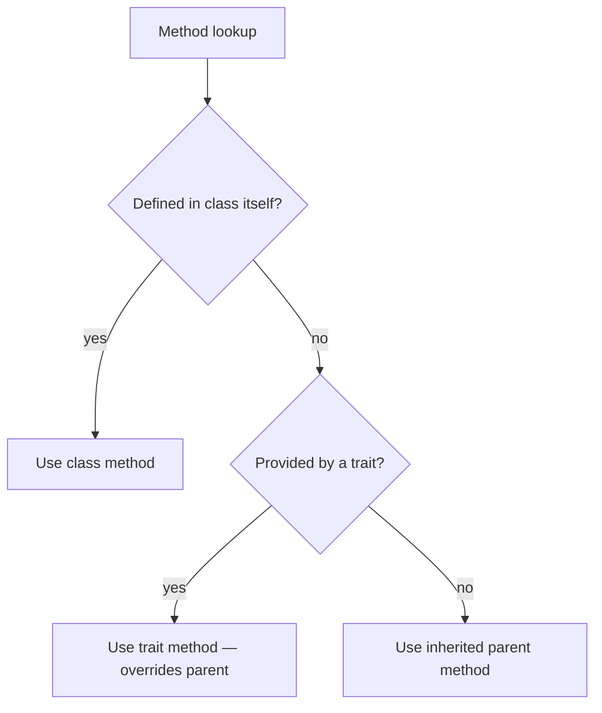

# Traits

!!! tip "In a nutshell"
    Traits copy methods into a class at compile time for horizontal reuse — but
    they are **not types**, so you cannot type-hint against one. Precedence to
    memorise: class > trait > inherited parent.

!!! example "Real-world analogy"
    A trait is like a rubber stamp of ready-made methods pressed onto each class: the
    ink is physically copied onto the page at compile time, exactly as if you had
    written it there by hand — which is why a stamp is not a "thing" you can point to
    as a type. If the page already carries the class's own handwriting for a method,
    that handwriting wins over the stamp, and the stamp in turn wins over anything
    inherited from a parent template.

!!! abstract "Learning objectives"
    By the end of this chapter you can:

    - [ ] Use traits for horizontal code reuse and explain the precedence rules.
    - [ ] Resolve method conflicts with `insteadof` and `as`.
    - [ ] Use abstract and static trait members correctly.

    **Syllabus:** `PHP → Traits` ·
    **Level:** Advanced / Expert ·
    **Est. time:** 25 min ·
    **Prerequisites:** [OOP](oop.md)

    **Examen Symfony 8 :** OUI

---

## Pour les nuls

### L'idée en une phrase
Un trait, c'est un tampon encreur : ses méthodes sont recopiées physiquement dans la classe qui l'utilise, comme si tu les avais écrites toi-même à la main.

### Imagine dans la vraie vie
Un tampon "SIGNÉ ET APPROUVÉ" apposé sur une page en imprime le texte à l'encre, directement sur cette page — le tampon lui-même n'est pas "un document" que tu pourrais ranger dans un dossier à part. Si la page a déjà été écrite à la main sur ce point précis, l'écriture manuscrite l'emporte sur le tampon.

### Dans Symfony
Les traits servent à partager du comportement entre plusieurs classes sans passer par l'héritage (par exemple un trait de logging réutilisé dans plusieurs services). Comme un trait n'est pas un type, on ne peut jamais écrire `instanceof MonTrait` ni type-hinter dessus.

### Exemple simple
```php
trait Horodatable {
    public function estimee(): \DateTimeImmutable { return new \DateTimeImmutable(); }
}
class Commande { use Horodatable; }

(new Commande())->estimee(); // méthode "copiée" depuis le trait
```

### Comment le mémoriser 🧠
Ordre de priorité, du plus fort au plus faible : **classe > trait > parent hérité**. La classe elle-même a toujours le dernier mot sur le tampon.

## Theory

A **trait** is a mechanism for **horizontal** code reuse: a bundle of methods
(and properties/constants) copied into a class at compile time, as if you had
written them there. Traits sidestep single inheritance — a class can `use` many
traits — but they are **not types**: you cannot type-hint against a trait.

| Aspect | Trait |
|---|---|
| Instantiable | No |
| Is a type? | No (cannot type-hint) |
| Multiple per class? | Yes |
| Can hold state? | Yes (properties) |
| Static members? | Yes |
| Abstract methods? | Yes (forces the user class to implement) |

!!! question "Predict first"
    A class, its parent, and a `use`-d trait all define `run()`. Which one wins?

??? note "Reveal"
    The class's own `run()`. Precedence is **class > trait > inherited parent** —
    a trait method overrides the parent's, but the class's own method overrides
    the trait's.

## Deep Dive — precedence & conflict resolution

### Precedence order

When the same method name exists in several places, PHP resolves in this order:

1. The **current class's own** method wins over any trait method.
2. A **trait** method wins over an **inherited** (parent class) method.
3. Two traits with the same method name **collide** — a fatal error unless you
   resolve it explicitly.



### Resolving conflicts: `insteadof` and `as`

`insteadof` picks which trait's method to keep; `as` creates an alias (and can
also change visibility).

```php
<?php
declare(strict_types=1);

trait FileLogger    { public function log(string $m): void { /* file */ } }
trait SyslogLogger  { public function log(string $m): void { /* syslog */ } }

final class Service
{
    use FileLogger, SyslogLogger {
        FileLogger::log insteadof SyslogLogger;   // resolve the clash
        SyslogLogger::log as logToSyslog;         // keep the other, renamed
    }
}
```

`as` can also change visibility without renaming:
`FileLogger::log as protected;`.

### Abstract & static trait members

- **Abstract** trait methods impose a contract on the using class — it must
  implement them (like an interface's methods, but copied in).
- **Static** trait properties/methods belong to **each using class separately**
  — a static property is *not* shared across all classes that use the trait.

```php
<?php
declare(strict_types=1);

trait Counter
{
    private static int $count = 0;              // per-using-class

    abstract protected function label(): string; // must be provided

    public static function tick(): int
    {
        return ++self::$count;
    }
}
```

### `use` inside a class vs a namespace `use`

`use TraitName;` **inside a class body** imports a trait. `use Some\Class;` at
the **top of a file** is a namespace import. Same keyword, different context —
a classic exam distractor.

```php
namespace App\Service;

use App\Logging\LoggerTrait;   // top of file: namespace import (alias)

final class Mailer
{
    use LoggerTrait;           // inside the class body: trait composition
}
```

!!! note "Source reference"
    Symfony ships many traits, e.g. `Symfony\Component\Cache\Traits\` adapters and
    `Symfony\Bundle\FrameworkBundle\Kernel\MicroKernelTrait` —
    [symfony/symfony `8.0`](https://github.com/symfony/symfony/blob/8.0/src/Symfony/Bundle/FrameworkBundle/Kernel/MicroKernelTrait.php).

## Configuration & code

=== "PHP Attributes"

    ```php
    <?php
    declare(strict_types=1);

    trait TimestampableTrait
    {
        private ?\DateTimeImmutable $updatedAt = null;

        public function touch(): void
        {
            $this->updatedAt = new \DateTimeImmutable();
        }
    }

    final class Article
    {
        use TimestampableTrait;
    }
    ```

=== "Console"

    ```console
    $ php -r 'trait T{public $x=1;} class A{use T;} $a=new A(); var_dump($a->x);'
    int(1)
    ```

## Best practices & anti-patterns

| ✅ Do | ❌ Avoid |
|---|---|
| Small, focused traits | "Kitchen-sink" mega-traits |
| Pair a trait with an interface (the type) | Type-hinting against a trait (impossible) |
| Resolve conflicts explicitly | Ignoring collisions (fatal) |
| Abstract trait methods for contracts | Hidden required methods |

## When (not) to use it / alternatives

- Use a **trait** for stateless-ish behaviour shared by unrelated classes
  (timestamps, logging helpers).
- Prefer **composition** (inject a collaborator) when the behaviour has its own
  lifecycle or dependencies — traits cannot be mocked or swapped at runtime.
- Pair a trait with an **interface** so callers can type-hint the contract.

!!! danger "Certification traps"
    - Precedence: **class > trait > inherited parent**.
    - Two traits with the same method **collide** — you must use `insteadof`/`as`.
    - A `static` trait property is **separate per using class**, not shared.
    - Traits are **not types** — you cannot `instanceof` or type-hint a trait.
    - `as` can change **visibility** as well as create an alias.

!!! warning "Common mistakes"
    - Expecting a trait method to override the class's own method (it does not).
    - Confusing the class-body `use TraitName;` with the file-level namespace `use`.

## Key takeaways

- Traits = compile-time horizontal reuse; not types.
- Precedence: class > trait > parent.
- Resolve trait clashes with `insteadof` (pick one) and `as` (alias/visibility).
- Static trait members are per-using-class, not shared.

## Last-minute revision

!!! tip "Cheat sheet"
    - `use A, B { A::m insteadof B; B::m as bMethod; }`.
    - `as protected` / `as public` changes visibility.
    - Cannot type-hint a trait; pair it with an interface.
    - Abstract trait methods force the using class to implement them.

## Connections

- **Depends on:** [OOP](oop.md) — traits copy members into the class's object model at compile time.
- **Reused in:** [Abstract Classes](abstract-classes.md) — abstract trait methods impose a contract like abstract class methods.
- **Confused with:** [Interfaces](interfaces.md) — a trait is *not* a type (no type-hint); pair it with an interface for the contract.

## Continue your learning

1. **[Guided exercises](traits-exercises.md)** — compose, collide, and resolve conflicts with `insteadof` and `as` until precedence is reflex.
2. **[Topic exam](traits-exam.md)** — every certification question for this topic, answers hidden.
3. **[Flashcards](traits-flashcards.md)** — active recall on precedence, conflict resolution, static members and abstract requirements.

## Official References
- [PHP: Traits](https://www.php.net/manual/en/language.oop5.traits.php)
- [PHP: Trait conflict resolution](https://www.php.net/manual/en/language.oop5.traits.php#language.oop5.traits.conflict)
- [Symfony source — MicroKernelTrait](https://github.com/symfony/symfony/blob/8.0/src/Symfony/Bundle/FrameworkBundle/Kernel/MicroKernelTrait.php)

## Video references

!!! tip "Watch & learn"
    These are official, continuously-updated video channels — search them for
    "PHP & web security" to reinforce this chapter. We link stable channels rather than
    individual videos so the references never rot.

    - [SymfonyCasts screencasts](https://symfonycasts.com/tracks/symfony) — scripted, code-along tutorials.
    - [Symfony official YouTube](https://www.youtube.com/@SymfonyOfficial) — SymfonyCon conference talks & keynotes.
    - [Official docs for this topic](https://symfony.com/doc/8.0/index.html) — some Symfony doc pages embed a screencast.

## Confidence check

I'm ready when I can:

- [ ] explain **why** traits exist (horizontal reuse past single inheritance)
- [ ] resolve conflicts with `insteadof`/`as` and change visibility in Symfony 8
- [ ] debug a fatal error from two traits declaring the same method
- [ ] spot the trick: type-hinting a trait, or a "shared" static trait property
- [ ] explain the class > trait > parent precedence order

---

<small>Related: [OOP](oop.md) · [Abstract Classes](abstract-classes.md) · [Interfaces](interfaces.md)</small>
