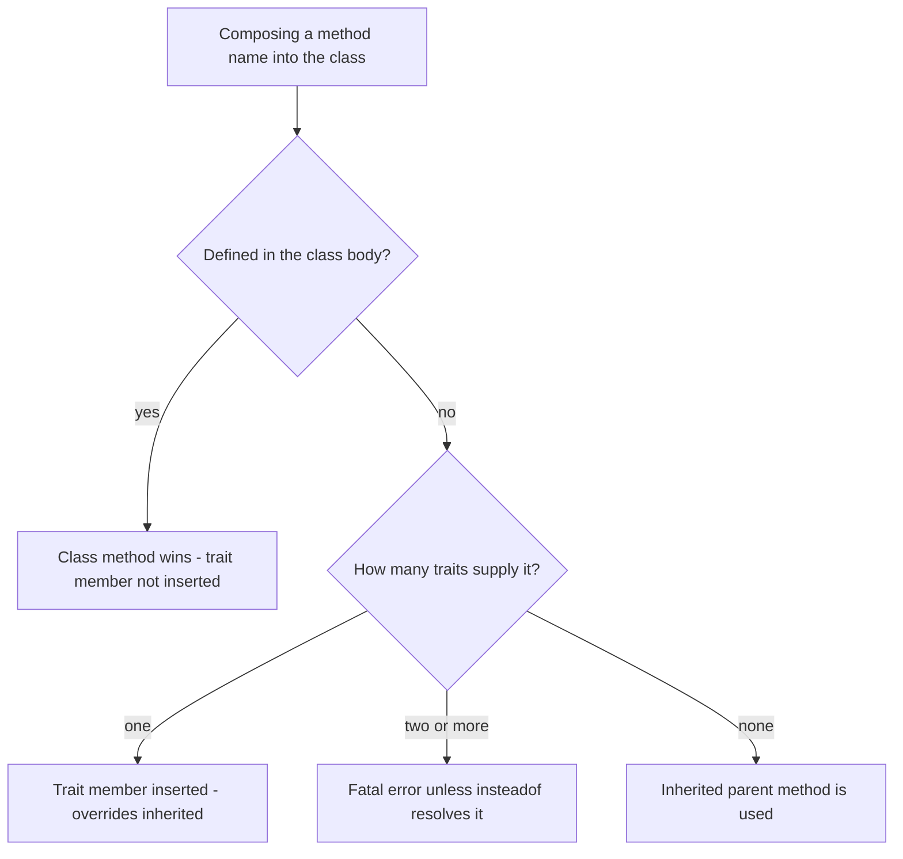
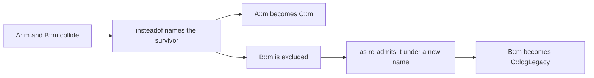

# Traits

!!! tip "In a nutshell"
    A trait is **copied into** each using class at compile time, which gives horizontal reuse
    past single inheritance — but leaves no runtime trace, so a trait is **not a type**.
    Precedence to memorise: **class > trait > inherited parent**. Two traits offering the same
    method name is a fatal error until `insteadof` picks a survivor and `as` re-admits the
    other under a new name or a new visibility.

!!! example "Real-world analogy"
    A trait is a rubber stamp of ready-made methods pressed onto each class: the ink is
    physically copied onto the page at compile time, exactly as if you had written it there by
    hand — which is why a stamp is not a "thing" you can point to as a type, and why two
    stamped pages never share an eraser mark. If the page already carries the class's own
    handwriting for a method, that handwriting wins over the stamp, and the stamp in turn wins
    over anything inherited from a parent template. Press two stamps whose ink lands on the
    same line and you get an unreadable blot: PHP refuses to guess, and stops.

!!! abstract "Learning objectives"
    By the end of this chapter you can:

    - [ ] Use traits for horizontal reuse and state the precedence rules without hesitating.
    - [ ] Resolve method conflicts with `insteadof`, and alias or re-scope with `as`.
    - [ ] Use abstract, static, property and constant trait members with their exact version rules.
    - [ ] Predict what `__CLASS__`, `__TRAIT__`, `__METHOD__`, `self` and `static` return inside a trait.
    - [ ] Explain how and why Symfony 8.0 pairs traits with interfaces.

    **Syllabus:** `PHP → Traits` ·
    **Level:** Advanced / Expert ·
    **Est. time:** 45 min ·
    **Prerequisites:** [OOP](oop.md)

    **Examen Symfony 8 :** OUI

---

## Prerequisites

You should be comfortable with classes, visibility, `static` and late static binding from
[OOP](oop.md), and know what an interface guarantees from [Interfaces](interfaces.md).
Everything here targets **PHP 8.4**, the minimum for Symfony 8 — which matters unusually much
on this topic, because four separate rules changed in 8.0, 8.1, 8.2 and 8.3, and every one of
them is prime distractor material.

## The problem we are solving

A class may `extends` exactly one parent. That is a hard limit, and it collides with reality as
soon as two unrelated classes need the same behaviour.

Suppose `Invoice` and `Comment` both need an audit log. They share no ancestor and never will:
one is a billing document, the other a piece of user content. You have three bad options and
one good one.

- Push `record()` into a common base class — you invent an artificial `AbstractLoggableThing`
  parent, and you have spent your single inheritance slot on a side concern.
- Copy the method into both classes — now there are two copies to keep in sync.
- Put it in an interface — an interface has no bodies, so every class still writes the code.

What you actually want is to write the implementation **once** and have it *appear* in both
classes as if you had typed it there. That is precisely what a trait does:

```php
trait Loggable
{
    /** @var list<string> */
    private array $log = [];

    public function record(string $line): void { $this->log[] = $line; }
}

final class Invoice { use Loggable; }
final class Comment { use Loggable; }
```

The manual calls this **horizontal composition**: "the application of class members without
requiring inheritance." Keep that phrase in mind — every rule in this chapter is a consequence
of *copying members in* rather than *linking to a parent*.

!!! info "PHP 8.4 reference"
    https://www.php.net/manual/en/language.oop5.traits.php

## 🧠 Pour les nuls

**C'est quoi ?** Un trait est un **bloc de code réutilisable** (méthodes, propriétés,
propriétés statiques, et depuis PHP 8.2 des constantes) que l'on **recopie** dans une classe
avec le mot-clé `use` écrit *à l'intérieur du corps de la classe*. Ce n'est ni une classe, ni
une interface : c'est un modèle recopié à la compilation.

**Pourquoi ça existe ?** Parce qu'une classe PHP ne peut hériter que d'**un seul** parent.
Quand deux classes sans aucun lien de parenté ont besoin exactement du même code, l'héritage ne
peut pas aider. Le trait contourne cette limite sans réintroduire le véritable héritage
multiple et ses ambiguïtés.

**🏠 Analogie de la vraie vie :** Le **tampon encreur**. Un tampon « SIGNÉ ET APPROUVÉ » imprime
son texte à l'encre directement sur la page ; une fois tamponnée, la page *contient* le texte —
le tampon, lui, ne se range pas dans le dossier, ce n'est pas un document. Deux pages
tamponnées avec le même tampon sont indépendantes : gribouiller sur l'une ne change rien à
l'autre. Et si la page portait déjà une mention manuscrite sur cette ligne, c'est l'écriture à
la main qui fait foi, pas le tampon.

**Symfony dans la vraie vie :** Le tampon → le trait (`MicroKernelTrait`) / La page tamponnée →
ta classe (`class Kernel extends BaseKernel { use MicroKernelTrait; }`) / Le contrat que le
framework vérifie → l'**interface**, jamais le trait / Deux pages tamponnées indépendantes →
deux classes qui utilisent le même trait sans rien partager à l'exécution.

**💻 Exemple extrêmement simple :**
```php
trait Horodatable
{
    private ?\DateTimeImmutable $modifieLe = null;

    public function toucher(): void { $this->modifieLe = new \DateTimeImmutable(); }
}

final class Commande { use Horodatable; }

$c = new Commande();
$c->toucher();          // méthode recopiée depuis le trait
```
La ligne `use Horodatable;` est écrite **dans le corps de la classe** — c'est ça, la composition
de trait. Le même mot-clé écrit en haut du fichier serait un import de namespace, ce qui n'a
rien à voir.

**🔍 Que se passe-t-il réellement ?**
1. PHP lit la déclaration de `Commande` et voit `use Horodatable;`.
2. Il récupère les membres du trait (méthodes, propriétés, constantes).
3. Il applique la priorité : si la classe définit déjà `toucher()`, le membre du trait n'est
   **pas** inséré du tout.
4. Il détecte les collisions : deux traits qui apportent le même nom → erreur fatale, sauf
   résolution explicite par `insteadof`.
5. Il vérifie la compatibilité des propriétés et des constantes redéclarées.
6. Les membres restants sont **copiés** dans la classe. À partir de là, le trait a disparu : la
   Reflection désigne `Commande` comme classe déclarante de ces méthodes.
7. À l'exécution, il ne reste aucune indirection — donc aucun coût.

**⚠️ Erreur fréquente :** croire qu'un trait est un type, et écrire
`function f(Horodatable $x)` ou `$obj instanceof Horodatable`. Le fichier se compile, mais
`instanceof` répond **toujours** `false`, et l'appel typé lève un `TypeError`. Dès qu'un type
est nécessaire, il faut une **interface** que la classe implémente — le trait ne fournit que le
corps.

**🧠 Comment le mémoriser ?** *« Un tampon, pas un passeport. »* L'encre est bel et bien copiée
(le code appartient à la classe, les statiques sont propres à chaque classe), mais un tampon ne
prouve aucune identité : pas de type, pas d'`instanceof`, pas de `new`. Et pour la priorité :
**classe > trait > parent**.

## Build the mental model

Two sentences carry the whole chapter.

**One: composition happens at compile time, and it is a copy.** When PHP declares
`class Invoice { use Loggable; }` it takes the trait's members and writes them into `Invoice`.
Afterwards there is no link back: `ReflectionMethod::getDeclaringClass()` on the copied method
answers `Invoice`, not `Loggable`. From this single fact follow *all* of: `self` and `parent`
resolve against `Invoice`; a static property becomes `Invoice`'s own static; `instanceof` knows
nothing about the trait; and method dispatch costs nothing extra.

**Two: the copy is *conditional*.** A member is inserted only if the class did not already
provide it, and only if no other trait is competing for the same name. Those two conditions are
the precedence rule and the collision rule — the two things the exam actually tests.



Read the diagram top-down, as the compiler does. The first question is always "did the class say
it itself?" — and a `yes` there ends the process, which is why a class that defines the method
silences even a collision between two traits. Only when the class stayed silent does the number
of competing traits matter, and only then can the fatal error fire. The bottom-right branch is
the ordinary case where nothing is copied and normal inheritance applies.

!!! info "Official PHP 8.4 reference"
    https://www.php.net/manual/en/language.oop5.traits.php#language.oop5.traits.precedence

## Core concepts

A trait groups functionality "in a fine-grained and consistent way". It cannot be instantiated,
and it is an addition to inheritance rather than a replacement for it.

| Aspect | Trait |
|---|---|
| Instantiable | No |
| Is a type? | No — no `instanceof`, no usable type declaration |
| Multiple per class? | Yes — `use A, B;` or several `use` statements |
| Can a trait use a trait? | Yes |
| Instance properties | Yes |
| Static properties & methods | Yes |
| Constants | Yes, **since PHP 8.2** |
| Abstract methods | Yes — public, protected **and private since 8.0** |
| Constructor | Yes (copied in like any other method) |
| `implements` / `extends` | **No** — both are parse errors on a trait |

The last row is worth trying once: `trait T implements I {}` fails with
`Parse error: syntax error, unexpected token "implements"`. A trait cannot sign a contract; only
the class that uses it can.

!!! question "Predict first"
    A class, its parent, and a `use`-d trait all define `run()`. Which one wins?

??? note "Reveal"
    The class's own `run()`. Precedence is **class > trait > inherited parent** — a trait method
    overrides the parent's, but the class's own method overrides the trait's.

## Learn by doing

Build one composition and change one thing at a time. Each step is runnable.

**Step 1 — one trait, one class.** The plain case: members appear as if hand-written.

```php
<?php
declare(strict_types=1);

trait Loggable
{
    /** @var list<string> */
    private array $log = [];

    public function record(string $line): void { $this->log[] = $line; }

    /** @return list<string> */
    public function history(): array { return $this->log; }
}

final class Invoice { use Loggable; }

$i = new Invoice();
$i->record('issued');
print_r($i->history());   // ['issued']
```

**Step 2 — add a parent that already has the method.** Give `Invoice` a base class declaring
`record()`: the trait's version wins, because a trait member overrides an inherited one.

**Step 3 — add the method to the class itself.** Now `Invoice::record()` wins, and the trait's
version is never inserted. Two steps, the two halves of *class > trait > parent*.

**Step 4 — add a second trait with the same method, and watch it break.**

```
Fatal error: Trait method SyslogLogger::log has not been applied as Mailer::log,
because of collision with FileLogger::log
```

Note *when* it appears: while the class is being **declared**. No object is created, no request
reaches the method. A trait collision takes the whole application down at autoload time, exactly
like an interface variance error.

**Step 5 — resolve it, keeping both implementations reachable.**

```php
use FileLogger, SyslogLogger {
    FileLogger::log insteadof SyslogLogger;   // choose the survivor
    SyslogLogger::log as logToSyslog;         // re-admit the other, renamed
}
```

**Step 6 — undo step 5, but declare `log()` on the class.** The fatal disappears, because
precedence is evaluated first and no trait member is ever inserted. That asymmetry surprises
most people; Step 4 and Step 6 together are what make the rule stick.

Work all six through hands-on in the [guided exercises](traits-exercises.md).

## How Symfony handles it

Symfony uses traits exactly where the definition fits: shared *implementation* for classes that
cannot share a parent — and it always pairs them with an interface when a type is needed.

`MicroKernelTrait` is the canonical case. Your `Kernel` already `extends` Symfony's base
`Kernel`, so the inheritance slot is spent; the trait adds `configureContainer()`,
`configureRoutes()`, `registerBundles()` and the cache/build/log directory helpers on top.

```php
class Kernel extends BaseKernel
{
    use MicroKernelTrait;
}
```

!!! info "Official Symfony 8.0 reference"
    https://symfony.com/doc/8.0/configuration/micro_kernel_trait.html

!!! note "Symfony 8.0 source reference"
    https://github.com/symfony/symfony/blob/8.0/src/Symfony/Bundle/FrameworkBundle/Kernel/MicroKernelTrait.php

The second case shows the trait/interface pairing explicitly.
`ServiceMethodsSubscriberTrait` implements `ServiceSubscriberInterface` by reflecting over the
class's own `#[SubscribedService]` methods. The container matches on the **interface**; the trait
only supplies the body. Its docblock states the convention that matters here: service ids are
available as `ClassName::methodName`.

That convention produces the sharpest trait trap in the Symfony codebase. Symfony's
documentation warns that when you factor a subscriber method into your own helper trait, the
service id "cannot be `__METHOD__` as this will include the trait name, not the class name" —
you must write `__CLASS__.'::'.__FUNCTION__` instead:

```php
trait LoggerAware
{
    #[SubscribedService]
    private function logger(): LoggerInterface
    {
        return $this->container->get(__CLASS__.'::'.__FUNCTION__);
    }
}
```

The next section proves why: inside a trait, `__CLASS__` names the using class while
`__METHOD__` names the trait.

!!! info "Official Symfony 8.0 reference"
    https://symfony.com/doc/8.0/service_container/service_subscribers_locators.html#service-subscribers-service-subscriber-trait

!!! note "Symfony 8.0 source reference"
    https://github.com/symfony/symfony/blob/8.0/src/Symfony/Contracts/Service/ServiceMethodsSubscriberTrait.php

Symfony also groups reusable infrastructure behaviour in dedicated `Traits\` namespaces — the
Cache component's `RedisTrait`, shared by every Redis-backed adapter, is a good example of a
large trait used by classes with different parents.

!!! note "Symfony 8.0 source reference"
    https://github.com/symfony/symfony/blob/8.0/src/Symfony/Component/Cache/Traits/RedisTrait.php

## How it works internally

Composition runs when the class is **declared** — at compile time for a plain file, at autoload
time in a Symfony app. The engine collects the trait's members, applies precedence, detects
collisions, checks property and constant compatibility, then writes the survivors into the
class's own tables.

Three consequences, each examinable:

- **No runtime indirection.** After composition the method belongs to the class.
  `(new ReflectionClass(Invoice::class))->getMethods()` reports `Invoice` as the declaring class
  of every trait method, and dispatch costs the same as a hand-written method.
- **Failures are load-time fatals.** Collisions, incompatible properties, unimplemented abstract
  members and bad `insteadof` targets all fire while the class is being built. You cannot
  `try`/`catch` past them.
- **Identity splits in two.** Some constructs resolve against the **destination** class, others
  record the **origin** trait. This is the most confusing part of traits, so here is the full
  picture, for a trait `App\Ident` used by `App\Base`, called on `App\Child extends App\Base`:

| Construct | Resolves to | Value here |
|---|---|---|
| `__CLASS__` | the using class | `App\Base` |
| `self::class` | the class where `use` appears | `App\Base` |
| `parent::` | that class's parent | `App\Base`'s parent |
| `static::class` | the runtime class (late static binding) | `App\Child` |
| `__TRAIT__` | the **declaring** trait | `App\Ident` |
| `__METHOD__` | the declaring scope | `App\Ident::who` |
| `__FUNCTION__` | the method name only | `who` |

Sort them into two buckets — **destination** (`__CLASS__`, `self`, `parent`, `static`) and
**origin** (`__TRAIT__`, `__METHOD__`) — and every question of this shape becomes mechanical.
`__METHOD__` sitting in the origin bucket is the fact behind Symfony's helper-trait warning
above. Note too that `__TRAIT__` names the trait that *declared* the method, not an outer trait
that merely re-exported it.

!!! info "Official PHP 8.4 reference"
    https://www.php.net/manual/en/language.constants.magic.php

## All supported cases and variations

The manual documents nine trait sections beyond the basic example: precedence, multiple traits,
conflict resolution, changing method visibility, traits composed from traits, abstract members,
static members, properties, constants and final methods. Each is covered below, in that order,
so the list can be checked against the source rather than taken on trust.

### Multiple traits

`use A, B;` on one line, or several `use` statements in the class body. Both are equivalent.

### Conflict resolution: `insteadof` and `as`

"If two Traits insert a method with the same name, a fatal error is produced, if the conflict is
not explicitly resolved." `insteadof` chooses **exactly one** of the conflicting methods; since
that only *excludes*, `as` exists to add an alias for one of them.

```php
<?php
declare(strict_types=1);

trait FileLogger   { public function log(string $m): string { return "file: $m"; } }
trait SyslogLogger { public function log(string $m): string { return "syslog: $m"; } }

final class Mailer
{
    use FileLogger, SyslogLogger {
        FileLogger::log insteadof SyslogLogger;
        SyslogLogger::log as logToSyslog;
    }
}
```

The survivor goes on the **left** of `insteadof`, the excluded trait(s) on the right — and
*every* competitor must be listed. With three colliding traits it is `A::m insteadof B, D;`;
naming only `B` leaves the `D` collision unresolved and still fatals.



The diagram makes the division of labour explicit: `insteadof` only ever *removes* candidates,
so on its own it would lose the excluded implementation entirely. `as` is what brings it back,
under a name that no longer clashes. Neither operator modifies the trait itself — both only
affect what the exhibiting class ends up holding.

!!! info "Official PHP 8.4 reference"
    https://www.php.net/manual/en/language.oop5.traits.php#language.oop5.traits.conflict

### Changing method visibility with `as`

`as` "can also adjust the visibility of the method in the exhibiting class", and the alias name
is optional. That gives two distinct behaviours:

```php
// Visibility changed in place, name kept — sayHello is now protected.
class MyClass1 { use HelloWorld { sayHello as protected; } }

// An extra private method is added; sayHello stays public.
class MyClass2 { use HelloWorld { sayHello as private myPrivateHello; } }
```

`as` is **additive**: the manual notes it "does not rename the method and it does not affect any
other method either". Only the name-less form actually re-scopes the original.

!!! info "Official PHP 8.4 reference"
    https://www.php.net/manual/en/language.oop5.traits.php#language.oop5.traits.visibility

### Traits composed from traits

"Just as classes can make use of traits, so can other traits." Members flow transitively, and
abstract requirements propagate all the way to the final class.

```php
<?php
declare(strict_types=1);

trait Hello { public function sayHello(): string { return 'Hello '; } }
trait World { public function sayWorld(): string { return 'World!'; } }

trait HelloWorld { use Hello, World; }

final class Greeter { use HelloWorld; }

echo (new Greeter())->sayHello(), (new Greeter())->sayWorld();
```

One constraint follows: a class may only qualify traits **it listed itself**. Writing
`Hello::sayHello as final;` inside `Greeter` fails with
`Required Trait Hello wasn't added to Greeter`. Use `HelloWorld::sayHello as final;`, or the
unqualified `sayHello as final;`.

!!! info "Official PHP 8.4 reference"
    https://www.php.net/manual/en/language.oop5.traits.php#language.oop5.traits.composition

### Abstract trait members

Abstract methods "impose requirements upon the exhibiting class". Public, protected and private
are all supported; **prior to PHP 8.0.0 only public and protected were**. Also as of 8.0.0 the
concrete implementation must follow the signature-compatibility rules — previously it could
differ.

```php
<?php
declare(strict_types=1);

trait Hello
{
    public function sayHelloWorld(): string { return 'Hello'.$this->getWorld(); }

    abstract public function getWorld(): string;
}

final class MyHelloWorld
{
    use Hello;

    public function getWorld(): string { return ' World'; }
}
```

Omit `getWorld()` and the class fails to load with `Class MyHelloWorld contains 1 abstract method
and must therefore be declared abstract or implement the remaining methods`. Give it an
incompatible signature and you get `Declaration of MyHelloWorld::getWorld(): int must be
compatible with Hello::getWorld(): string`.

!!! info "Official PHP 8.4 reference"
    https://www.php.net/manual/en/language.oop5.traits.php#language.oop5.traits.abstract

### Static trait members

"Traits can define static variables, static methods and static properties." Because members are
copied per class, a static property becomes a **separate** static of each using class.

```php
<?php
declare(strict_types=1);

trait Counter
{
    private static int $count = 0;

    abstract protected function label(): string;

    public static function tick(): int { return ++static::$count; }
}

final class Downloads
{
    use Counter;

    protected function label(): string { return 'downloads'; }
}
```

Two version rules attach to this section:

- **Since PHP 8.1.0**, calling a static method or accessing a static property **directly on the
  trait** is deprecated: `Calling static trait method T::m is deprecated, it should only be
  called on a class using the trait`. It still works — deprecated is not removed.
- **Since PHP 8.3.0**, when a child class re-uses a trait carrying a static property, that
  property is **distinct** from the parent's. Before 8.3 it was shared across the whole
  inheritance hierarchy. A subclass that does *not* repeat the `use` simply inherits the
  parent's static, in every version.

!!! info "Official PHP 8.4 reference"
    https://www.php.net/manual/en/language.oop5.traits.php#language.oop5.traits.static

### Properties

Traits may declare properties. If the class — or another trait — declares one of the same name,
it must be **compatible**: same visibility, same type, same `readonly` modifier **and the same
initial value**. Otherwise the composition fatals.

```php
<?php
declare(strict_types=1);

trait PropertiesTrait
{
    public $same = true;
    public $different1 = false;
}

final class PropertiesExample
{
    use PropertiesTrait;

    public $same = true;   // OK: identical on every axis
}
```

Add `public $different1 = true;` and PHP reports `PropertiesExample and PropertiesTrait define
the same property ($different1) ... the definition differs and is considered incompatible`. The
initial value is the axis people overlook.

!!! info "Official PHP 8.4 reference"
    https://www.php.net/manual/en/language.oop5.traits.php#language.oop5.traits.properties

### Constants

"Traits can, as of PHP 8.2.0, also define constants", and they may be `final`. The compatibility
rule mirrors properties but on three axes — same visibility, same initial value, same finality.

```php
<?php
declare(strict_types=1);

trait ConstantsTrait
{
    public const int FLAG_MUTABLE = 1;
    final public const int FLAG_IMMUTABLE = 5;
}

final class ConstantsExample { use ConstantsTrait; }

echo ConstantsExample::FLAG_MUTABLE;   // 1
```

!!! info "Official PHP 8.4 reference"
    https://www.php.net/manual/en/language.oop5.traits.php#language.oop5.traits.constants

### Final methods

"As of PHP 8.3.0, the `final` modifier can be applied using the `as` operator to methods imported
from traits." It blocks **child classes** from overriding — but "the class that uses the trait
can still override the method", by ordinary precedence.

```php
final class Report
{
    use CommonTrait {
        CommonTrait::method as final;
    }
}
```

!!! info "Official PHP 8.4 reference"
    https://www.php.net/manual/en/language.oop5.traits.php#language.oop5.traits.final-methods

## Configuration & code

=== "PHP Attributes"

    ```php
    <?php
    declare(strict_types=1);

    namespace App\Entity;

    interface Timestampable
    {
        public function touch(): void;
    }

    trait TimestampableTrait
    {
        private ?\DateTimeImmutable $updatedAt = null;

        public function touch(): void
        {
            $this->updatedAt = new \DateTimeImmutable();
        }

        public function updatedAt(): ?\DateTimeImmutable
        {
            return $this->updatedAt;
        }
    }

    // The interface carries the type; the trait carries the implementation.
    final class Article implements Timestampable
    {
        use TimestampableTrait;
    }
    ```

=== "Console"

    ```console
    $ php -r 'trait T{public $x=1;} class A{use T;} $a=new A(); var_dump($a->x);'
    int(1)

    $ php -r 'trait T{} class A{use T;} print_r(class_uses(new A()));'
    Array
    (
        [T] => T
    )
    ```

The `implements Timestampable` sits on the **class**, not on the trait — that is the pattern to
internalise. A trait cannot `implements`; the class does it, and autowiring or any type
declaration then has something real to bind to.

## Execution flow

What PHP does, in order, when it declares a class containing `use SomeTrait;`:

1. The trait is resolved, and autoloaded if necessary.
2. Any traits *that trait* uses are composed into it first, recursively.
3. **Precedence** is applied: a member the class declares in its own body blocks the
   corresponding trait member from being inserted at all.
4. **Collisions** among the remaining trait members are detected; `insteadof` clauses exclude the
   losers, and an unresolved duplicate name is a fatal error here.
5. `as` clauses are applied — aliases created, visibilities adjusted, `final` marked (8.3+). An
   alias naming a method that does not exist is a fatal error at this step.
6. **Compatibility** of redeclared properties and constants is verified.
7. Surviving members are copied into the class's own method, property and constant tables.
8. **Abstract** members left unimplemented make the class invalid, unless it is itself abstract.
9. The class is registered. From here on the trait plays no runtime role whatsoever.

Everything from step 1 to step 8 happens before a single line of your code runs, which is why
every trait mistake is a load-time fatal rather than a catchable exception.

## Default behavior

- A trait method is inserted **only** if the class does not define that name itself.
- An inserted trait method **overrides** the inherited parent's version.
- Without `insteadof`, two traits offering the same method name is a fatal error.
- `as` **adds**; it never removes. The original name and visibility survive — unless the alias
  name is omitted, in which case the visibility is changed in place.
- A static property becomes a distinct static of each using class.
- Trait members keep their declared visibility; nothing is implicitly made public.
- `instanceof` against a trait is `false`, not an error.
- `class_uses()` autoloads by default (its second parameter defaults to `true`) and returns only
  the traits named in that class's own `use` statements.

## Edge cases

- **Two colliding traits plus a class method.** No fatal error: precedence runs first, so neither
  trait member is inserted and there is nothing left to collide. Delete the class's method later
  and a load-time fatal appears, pointing at traits nobody touched.
- **Aliasing a method that does not exist.** `T::nope as x;` gives
  `An alias was defined for T::nope but this method does not exist`.
- **`insteadof` naming an unlisted trait.** `Required Trait B wasn't added to C`. The same error
  appears when you qualify a method with a trait reached only *through* a composed trait.
- **Partial `insteadof` with three traits.** Excluding one competitor leaves the others
  colliding; the error simply names the next pair.
- **A trait with a constructor.** Perfectly legal, promoted parameters included — the constructor
  is copied in like any other method, subject to the same precedence rule.
- **`readonly` in the compatibility check.** A `readonly` property in the class cannot satisfy a
  non-`readonly` trait property of the same name; the modifier is one of the compared axes.
- **`class_uses()` on a subclass.** Returns an empty array when only the parent used the trait —
  it "does not include any traits used by a parent class".
- **Static access on the trait itself.** `T::m()` and `T::$p` still work in 8.4, but have been
  deprecated since 8.1.

## Common confusions

| These look alike | The distinction |
|---|---|
| `use` at file top vs in a class body | Namespace import vs trait composition. Same keyword, unrelated jobs. |
| `insteadof` vs `as` | `insteadof` **excludes** a competitor; `as` **adds** an alias or re-scopes. |
| `as protected;` vs `as protected x;` | Without a name: visibility changed in place. With a name: a new method added, original untouched. |
| Trait vs interface | The trait is the body with no type; the interface is the type with no body. Pair them. |
| Trait vs abstract class | A class uses **many** traits but `extends` **one** parent — and only the parent gives a type. |
| `__CLASS__` vs `__METHOD__` in a trait | `__CLASS__` = the using class. `__METHOD__` = `Trait::method`. |
| `self::class` vs `static::class` in a trait | `self` = where `use` appears. `static` = the runtime class. |
| Static shared or not | Unrelated classes: never shared. In a hierarchy: distinct only if the child repeats `use` (8.3+). |
| 8.2 vs 8.3 changes | 8.2 = trait **constants**. 8.3 = static-property scoping **and** `as final`. |

## Best practices & anti-patterns

| ✅ Do | ❌ Avoid |
|---|---|
| Small, single-purpose traits | "Kitchen-sink" mega-traits that pull in half a domain |
| Pair a trait with an interface for the type | Trying to type-hint or `instanceof` the trait |
| Declare `abstract` members for what the trait needs | Silently assuming `$this->someMethod()` exists |
| Resolve collisions explicitly and deliberately | Adding a class method just to make a fatal go away |
| Inject a collaborator when behaviour has dependencies | Traits that need services, config or a lifecycle |
| Keep trait state `private` and minimal | Public trait properties every using class re-exposes |

Choose a **trait** when unrelated classes need the *same implementation* and inheritance is
already spent. Choose **composition** — an injected collaborator — when the behaviour has its own
dependencies or lifecycle, because a trait cannot be mocked, decorated or swapped at runtime.
Choose an **interface** whenever a caller needs to name the capability in a type declaration.

## Certification traps

!!! danger "Certification traps"
    - Precedence is **class > trait > inherited parent**. The reversal ("the trait wins") is the
      most common wrong answer on this topic.
    - Two traits, same method, no resolution → **fatal error at class declaration**, never a
      first-wins or last-wins rule. But it vanishes if the class defines the method itself.
    - `insteadof` must list **every** competing trait: `A::m insteadof B, D;`.
    - `as` **adds**. Only the name-less form (`m as protected;`) changes visibility in place.
    - A `static` trait property is separate per using class. Within a hierarchy it is distinct
      only since **8.3**, and only if the child repeats the `use`.
    - Traits are **not types**. `instanceof` returns `false` silently; a trait type declaration
      parses but always raises a `TypeError` at call time.
    - Inside a trait, `__METHOD__` is `Trait::method` while `__CLASS__` is the using class.
    - Version pins: abstract **private** methods and signature compatibility → **8.0**;
      static-on-trait deprecation → **8.1**; **constants** → **8.2**; static-property scoping and
      `as final` → **8.3**.

## Common mistakes

!!! warning "Common mistakes"
    - Expecting a trait method to override the exhibiting class's own method. It never does.
    - Confusing the class-body `use TraitName;` with the file-level namespace `use`.
    - Building a service id from `__METHOD__` inside a helper trait — you get the trait's name.
    - Redeclaring a trait property with a different **initial value** and expecting an override;
      it is a fatal error, not an override.
    - Assuming `class_uses()` walks parents or nested traits. It walks neither.
    - Reaching for a trait when the real need is a type — that is an interface's job.
    - Putting service dependencies in a trait, then discovering it cannot be mocked in a test.

## Debugging and troubleshooting

Read the fatal literally — PHP's trait errors are unusually explicit about who lost:

```
Trait method B::m has not been applied as C::m, because of collision with A::m
```

The trait named **first** is the one that was rejected; the one after "collision with" is the
current holder. Fix it with `A::m insteadof B;` — or `B::m insteadof A;` if you wanted the other
one.

Other messages and what they mean:

| Message | Cause |
|---|---|
| `Required Trait B wasn't added to C` | `insteadof`/`as` names a trait `C` did not list itself |
| `An alias was defined for T::nope but this method does not exist` | Typo, or the trait method was renamed |
| `... define the same property ($x) ... considered incompatible` | Visibility, type, `readonly` or initial value differ |
| `Class C contains 1 abstract method ...` | An abstract trait member was never implemented |
| `Declaration of C::w(): int must be compatible with T::w(): string` | Implementation violates the abstract signature (8.0+) |
| `Cannot override final method A::m()` | A child overrides a method imported with `as final` (8.3+) |

Introspection tools, in increasing order of detail:

- `class_uses($objOrClass)` — the traits this class listed itself. Merge with `class_parents()`
  to cover the hierarchy, and recurse to cover composed traits.
- `trait_exists()` and `get_declared_traits()` — availability checks.
- `(new ReflectionClass($c))->getTraitNames()` — the same list, via Reflection.
- `(new ReflectionClass($c))->getTraitAliases()` — `['alias' => 'Trait::method']`, the only way to
  recover which `as` clauses were applied.
- `ReflectionMethod::getDeclaringClass()` — reports the **using class**, which is the quickest
  demonstration that composition is a compile-time copy.

!!! info "Official PHP 8.4 reference"
    https://www.php.net/manual/en/function.class-uses.php

## Performance and security considerations

Traits are free at runtime. Composition happens once, when the class is declared, and the
resulting methods are indistinguishable from hand-written ones — no delegation, no extra frame,
no lookup. With OPcache the composed class is cached like any other, so even the compile-time
cost is paid once per deployment. Any argument for or against traits is therefore about design,
never about speed.

The security angle is indirect but real, and it is about **state**. A trait's properties become
real properties of every using class, so a public trait property is an attack surface replicated
across every class that uses it — and a trait cannot be reviewed in isolation, because its effect
depends on where it lands. Keep trait state `private`, and prefer `abstract` declarations over
silent `$this->` assumptions so the requirement is enforced at load time rather than discovered
at runtime. When a trait mediates access control or output escaping, put the contract in an
interface so the check can be type-enforced — see
[Web security fundamentals](web-security.md).

## Key takeaways

- Traits are **compile-time horizontal reuse**: members are copied into the class, leaving no
  runtime trace — and are therefore **not types**.
- Precedence is **class > trait > inherited parent**, and it is evaluated *before* collisions.
- Two traits offering one name is a **fatal error**; `insteadof` picks the survivor (listing every
  competitor) and `as` re-admits or re-scopes.
- `as` is additive: only `m as protected;` without a new name changes visibility in place.
- Static trait properties are **per using class**; within a hierarchy they are distinct only since
  8.3, and only if the child repeats `use`.
- Version pins: abstract private + signature compatibility (8.0), static-on-trait deprecation
  (8.1), constants (8.2), static scoping and `as final` (8.3).

## Expert takeaways

- Every trait rule is a corollary of "members are copied at compile time". Derive rather than
  memorise: copying explains `self`, `parent`, per-class statics, `getDeclaringClass()`, the
  absence of a type, and the zero runtime cost — all at once.
- Precedence is evaluated **before** collision detection. That ordering is why a class defining
  the method makes an otherwise-fatal two-trait clash compile silently, and why deleting that
  method later resurrects the fatal in code nobody edited.
- Identity constructs split into a destination bucket (`__CLASS__`, `self`, `parent`, `static`)
  and an origin bucket (`__TRAIT__`, `__METHOD__`). Symfony documents the consequence directly in
  its service-subscriber guide.
- A trait can only be qualified by the class that listed it. Composed traits are transitive for
  *members*, but not for `insteadof`/`as` targets, nor for `class_uses()`.
- The 8.3 static-property change is scoped narrowly: it applies only when a **child class repeats
  the `use`**. Everything else about static trait state is unchanged.

## Last-minute revision

!!! tip "Cheat sheet"
    - Precedence: **class > trait > parent** — evaluated *before* collision detection.
    - `use A, B { A::m insteadof B, D; B::m as protected mLegacy; }`.
    - `m as protected;` → re-scopes in place. `m as protected x;` → adds `x`, original intact.
    - `m as final;` (8.3) → blocks **children**, not the using class.
    - Static trait property = per using class; a child needs its own `use` for a distinct copy (8.3).
    - Constants in traits since **8.2**; property/constant redeclaration must be *identical*.
    - `__CLASS__` = using class · `__TRAIT__` / `__METHOD__` = the trait.
    - `instanceof Trait` → `false`, silently. No type-hint, no `new`, no `implements`.
    - `class_uses()` = this class's own `use` statements only.

## Connections

- **Depends on:** [OOP](oop.md) — traits copy members into the class's object model at compile time.
- **Reused in:** [Abstract Classes](abstract-classes.md) — abstract trait methods impose a contract like abstract class methods, but without consuming the inheritance slot.
- **Confused with:** [Interfaces](interfaces.md) — a trait is *not* a type; pair it with an interface so callers have something to type-hint.

## Continue your learning

1. **[Guided exercises](traits-exercises.md)** — compose, collide, resolve with `insteadof`/`as`, then meet the magic-constant trap.
2. **[Topic exam](traits-exam.md)** — every certification question for this topic, answers hidden.
3. **[Flashcards](traits-flashcards.md)** — active recall on precedence, conflict resolution, statics and the version pins.

## Official References

- [PHP: Traits](https://www.php.net/manual/en/language.oop5.traits.php)
- [PHP: Trait precedence](https://www.php.net/manual/en/language.oop5.traits.php#language.oop5.traits.precedence)
- [PHP: Trait conflict resolution](https://www.php.net/manual/en/language.oop5.traits.php#language.oop5.traits.conflict)
- [PHP: Changing method visibility](https://www.php.net/manual/en/language.oop5.traits.php#language.oop5.traits.visibility)
- [PHP: Traits composed from traits](https://www.php.net/manual/en/language.oop5.traits.php#language.oop5.traits.composition)
- [PHP: Abstract trait members](https://www.php.net/manual/en/language.oop5.traits.php#language.oop5.traits.abstract)
- [PHP: Static trait members](https://www.php.net/manual/en/language.oop5.traits.php#language.oop5.traits.static)
- [PHP: Trait properties](https://www.php.net/manual/en/language.oop5.traits.php#language.oop5.traits.properties)
- [PHP: Trait constants](https://www.php.net/manual/en/language.oop5.traits.php#language.oop5.traits.constants)
- [PHP: Final trait methods](https://www.php.net/manual/en/language.oop5.traits.php#language.oop5.traits.final-methods)
- [PHP: Magic constants](https://www.php.net/manual/en/language.constants.magic.php)
- [PHP: class_uses()](https://www.php.net/manual/en/function.class-uses.php)
- [Symfony 8.0 — Building your own Framework with the MicroKernelTrait](https://symfony.com/doc/8.0/configuration/micro_kernel_trait.html)
- [Symfony 8.0 — Service Subscriber Trait](https://symfony.com/doc/8.0/service_container/service_subscribers_locators.html#service-subscribers-service-subscriber-trait)
- [Symfony source — MicroKernelTrait](https://github.com/symfony/symfony/blob/8.0/src/Symfony/Bundle/FrameworkBundle/Kernel/MicroKernelTrait.php)
- [Symfony source — ServiceMethodsSubscriberTrait](https://github.com/symfony/symfony/blob/8.0/src/Symfony/Contracts/Service/ServiceMethodsSubscriberTrait.php)
- [Symfony source — Cache RedisTrait](https://github.com/symfony/symfony/blob/8.0/src/Symfony/Component/Cache/Traits/RedisTrait.php)

## Video references

!!! tip "Watch & learn"
    These are official, continuously-updated video channels — search them for
    "PHP traits" to reinforce this chapter. We link stable channels rather than
    individual videos so the references never rot.

    - [SymfonyCasts screencasts](https://symfonycasts.com/tracks/symfony) — scripted, code-along tutorials.
    - [Symfony official YouTube](https://www.youtube.com/@SymfonyOfficial) — SymfonyCon conference talks & keynotes.
    - [Official docs for this topic](https://symfony.com/doc/8.0/index.html) — some Symfony doc pages embed a screencast.

## Confidence check

I'm ready when I can:

- [ ] explain **why** traits exist (horizontal reuse past single inheritance)
- [ ] resolve a three-way collision with `insteadof` and re-admit a loser with `as`
- [ ] debug a fatal from two traits declaring the same method — and explain why a class method silences it
- [ ] state what `__CLASS__`, `__TRAIT__`, `__METHOD__`, `self` and `static` return inside a trait
- [ ] say what changed for traits in PHP 8.0, 8.1, 8.2 and 8.3
- [ ] explain why Symfony pairs `ServiceMethodsSubscriberTrait` with an interface

---

<small>Related: [OOP](oop.md) · [Abstract Classes](abstract-classes.md) · [Interfaces](interfaces.md)</small>
