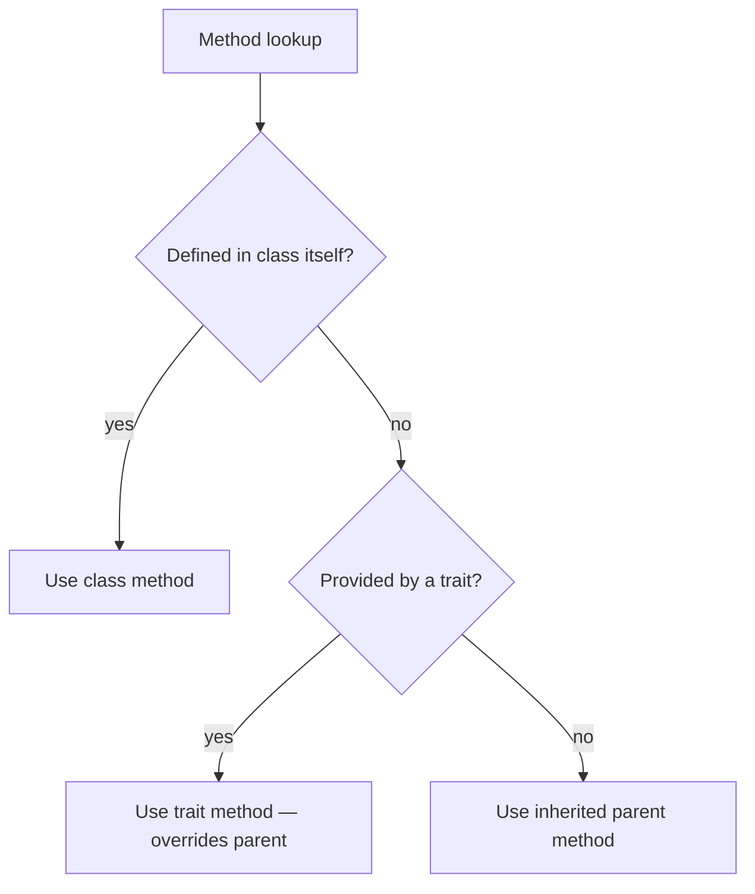

# Traits

!!! tip "In a nutshell"
    Traits copy methods into a class at compile time for horizontal reuse — but
    they are **not types**, so you cannot type-hint against one. Precedence to
    memorise: class > trait > inherited parent.

!!! example "Real-world analogy"
    A trait is like a rubber stamp of ready-made methods pressed onto each class: the
    ink is physically copied onto the page at compile time, exactly as if you had
    written it there by hand — which is why a stamp is not a "thing" you can point to
    as a type. If the page already carries the class's own handwriting for a method,
    that handwriting wins over the stamp, and the stamp in turn wins over anything
    inherited from a parent template.

!!! abstract "Learning objectives"
    By the end of this chapter you can:

    - [ ] Use traits for horizontal code reuse and explain the precedence rules.
    - [ ] Resolve method conflicts with `insteadof` and `as`.
    - [ ] Use abstract and static trait members correctly.

    **Syllabus:** `PHP → Traits` ·
    **Level:** Advanced / Expert ·
    **Est. time:** 25 min ·
    **Prerequisites:** [OOP](oop.md)

---

## Theory

A **trait** is a mechanism for **horizontal** code reuse: a bundle of methods
(and properties/constants) copied into a class at compile time, as if you had
written them there. Traits sidestep single inheritance — a class can `use` many
traits — but they are **not types**: you cannot type-hint against a trait.

| Aspect | Trait |
|---|---|
| Instantiable | No |
| Is a type? | No (cannot type-hint) |
| Multiple per class? | Yes |
| Can hold state? | Yes (properties) |
| Static members? | Yes |
| Abstract methods? | Yes (forces the user class to implement) |

!!! question "Predict first"
    A class, its parent, and a `use`-d trait all define `run()`. Which one wins?

??? note "Reveal"
    The class's own `run()`. Precedence is **class > trait > inherited parent** —
    a trait method overrides the parent's, but the class's own method overrides
    the trait's.

## Deep Dive — precedence & conflict resolution

### Precedence order

When the same method name exists in several places, PHP resolves in this order:

1. The **current class's own** method wins over any trait method.
2. A **trait** method wins over an **inherited** (parent class) method.
3. Two traits with the same method name **collide** — a fatal error unless you
   resolve it explicitly.



### Resolving conflicts: `insteadof` and `as`

`insteadof` picks which trait's method to keep; `as` creates an alias (and can
also change visibility).

```php
<?php
declare(strict_types=1);

trait FileLogger    { public function log(string $m): void { /* file */ } }
trait SyslogLogger  { public function log(string $m): void { /* syslog */ } }

final class Service
{
    use FileLogger, SyslogLogger {
        FileLogger::log insteadof SyslogLogger;   // resolve the clash
        SyslogLogger::log as logToSyslog;         // keep the other, renamed
    }
}
```

`as` can also change visibility without renaming:
`FileLogger::log as protected;`.

### Abstract & static trait members

- **Abstract** trait methods impose a contract on the using class — it must
  implement them (like an interface's methods, but copied in).
- **Static** trait properties/methods belong to **each using class separately**
  — a static property is *not* shared across all classes that use the trait.

```php
<?php
declare(strict_types=1);

trait Counter
{
    private static int $count = 0;              // per-using-class

    abstract protected function label(): string; // must be provided

    public static function tick(): int
    {
        return ++self::$count;
    }
}
```

### `use` inside a class vs a namespace `use`

`use TraitName;` **inside a class body** imports a trait. `use Some\Class;` at
the **top of a file** is a namespace import. Same keyword, different context —
a classic exam distractor.

!!! note "Source reference"
    Symfony ships many traits, e.g. `Symfony\Component\Cache\Traits\` adapters and
    `Symfony\Bundle\FrameworkBundle\Kernel\MicroKernelTrait` —
    [symfony/symfony `8.0`](https://github.com/symfony/symfony/blob/8.0/src/Symfony/Bundle/FrameworkBundle/Kernel/MicroKernelTrait.php).

## Configuration & code

=== "PHP Attributes"

    ```php
    <?php
    declare(strict_types=1);

    trait TimestampableTrait
    {
        private ?\DateTimeImmutable $updatedAt = null;

        public function touch(): void
        {
            $this->updatedAt = new \DateTimeImmutable();
        }
    }

    final class Article
    {
        use TimestampableTrait;
    }
    ```

=== "Console"

    ```console
    $ php -r 'trait T{public $x=1;} class A{use T;} $a=new A(); var_dump($a->x);'
    int(1)
    ```

## Best practices & anti-patterns

| ✅ Do | ❌ Avoid |
|---|---|
| Small, focused traits | "Kitchen-sink" mega-traits |
| Pair a trait with an interface (the type) | Type-hinting against a trait (impossible) |
| Resolve conflicts explicitly | Ignoring collisions (fatal) |
| Abstract trait methods for contracts | Hidden required methods |

## When (not) to use it / alternatives

- Use a **trait** for stateless-ish behaviour shared by unrelated classes
  (timestamps, logging helpers).
- Prefer **composition** (inject a collaborator) when the behaviour has its own
  lifecycle or dependencies — traits cannot be mocked or swapped at runtime.
- Pair a trait with an **interface** so callers can type-hint the contract.

!!! danger "Certification traps"
    - Precedence: **class > trait > inherited parent**.
    - Two traits with the same method **collide** — you must use `insteadof`/`as`.
    - A `static` trait property is **separate per using class**, not shared.
    - Traits are **not types** — you cannot `instanceof` or type-hint a trait.
    - `as` can change **visibility** as well as create an alias.

!!! warning "Common mistakes"
    - Expecting a trait method to override the class's own method (it does not).
    - Confusing the class-body `use TraitName;` with the file-level namespace `use`.

## Exercises

1. **(Advanced)** Two traits both define `init()`. Keep trait A's version and
   expose trait B's as `initLegacy()`.
2. **(Expert)** Show that a static counter in a trait is not shared between two
   classes that use it.

??? success "Solutions"

    **1.**
    ```php
    <?php
    declare(strict_types=1);

    trait A { public function init(): string { return 'A'; } }
    trait B { public function init(): string { return 'B'; } }

    final class C
    {
        use A, B {
            A::init insteadof B;
            B::init as initLegacy;
        }
    }
    ```

    **2.** Each using class gets its own copy of `self::$count`; calling
    `X::tick()` does not affect `Y::tick()` because static trait state is per
    class, not global to the trait.

## Certification questions

??? question "Q1. A class, its parent, and a used trait all define `run()`. Which wins?"
    - [x] A. The class's own `run()` ✅
    - [ ] B. The trait's `run()`
    - [ ] C. The parent's `run()`
    - [ ] D. Fatal error

    **Why:** Precedence is class > trait > inherited. **Ref:** [Traits](https://www.php.net/manual/en/language.oop5.traits.php).

??? question "Q2. Two used traits define the same method with no resolution. Result?"
    - [x] A. Fatal error ✅
    - [ ] B. The first trait wins
    - [ ] C. The last trait wins
    - [ ] D. Both run in order

    **Why:** Unresolved trait conflicts are fatal; use `insteadof`/`as`.
    **Ref:** [Conflict resolution](https://www.php.net/manual/en/language.oop5.traits.php#language.oop5.traits.conflict).

??? question "Q3. `SyslogLogger::log as protected logToSyslog;` does what?"
    - [x] A. Aliases the method to `logToSyslog` with `protected` visibility ✅
    - [ ] B. Deletes the method
    - [ ] C. Makes it abstract
    - [ ] D. Makes it static

    **Why:** `as` can both rename and change visibility. **Ref:** [Traits](https://www.php.net/manual/en/language.oop5.traits.php).

??? question "Q4. A `static` property in a trait used by classes X and Y is…"
    - [x] A. Separate per class (X and Y have independent copies) ✅
    - [ ] B. Shared across X and Y
    - [ ] C. Illegal
    - [ ] D. Read-only

    **Why:** Static trait state is bound to each using class independently.
    **Ref:** [Traits: static properties](https://www.php.net/manual/en/language.oop5.traits.php#language.oop5.traits.static).

## Key takeaways

- Traits = compile-time horizontal reuse; not types.
- Precedence: class > trait > parent.
- Resolve trait clashes with `insteadof` (pick one) and `as` (alias/visibility).
- Static trait members are per-using-class, not shared.

## Last-minute revision

!!! tip "Cheat sheet"
    - `use A, B { A::m insteadof B; B::m as bMethod; }`.
    - `as protected` / `as public` changes visibility.
    - Cannot type-hint a trait; pair it with an interface.
    - Abstract trait methods force the using class to implement them.

## Connections

- **Depends on:** [OOP](oop.md) — traits copy members into the class's object model at compile time.
- **Reused in:** [Abstract Classes](abstract-classes.md) — abstract trait methods impose a contract like abstract class methods.
- **Confused with:** [Interfaces](interfaces.md) — a trait is *not* a type (no type-hint); pair it with an interface for the contract.

## Official References
- [PHP: Traits](https://www.php.net/manual/en/language.oop5.traits.php)
- [PHP: Trait conflict resolution](https://www.php.net/manual/en/language.oop5.traits.php#language.oop5.traits.conflict)
- [Symfony source — MicroKernelTrait](https://github.com/symfony/symfony/blob/8.0/src/Symfony/Bundle/FrameworkBundle/Kernel/MicroKernelTrait.php)

## Confidence check

I'm ready when I can:

- [ ] explain **why** traits exist (horizontal reuse past single inheritance)
- [ ] resolve conflicts with `insteadof`/`as` and change visibility in Symfony 8
- [ ] debug a fatal error from two traits declaring the same method
- [ ] spot the trick: type-hinting a trait, or a "shared" static trait property
- [ ] explain the class > trait > parent precedence order

---

<small>Related: [OOP](oop.md) · [Abstract Classes](abstract-classes.md) · [Interfaces](interfaces.md)</small>
