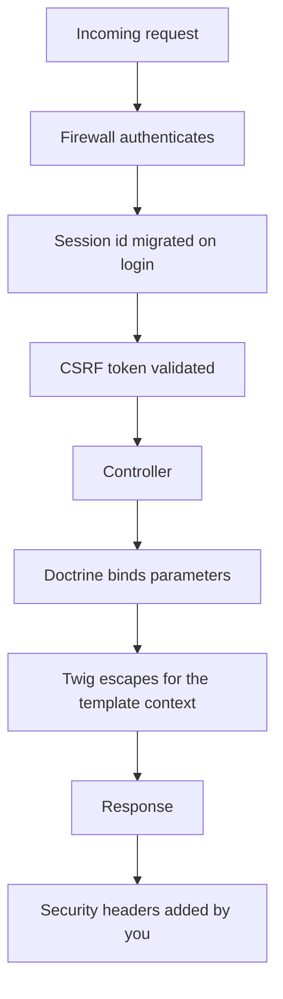
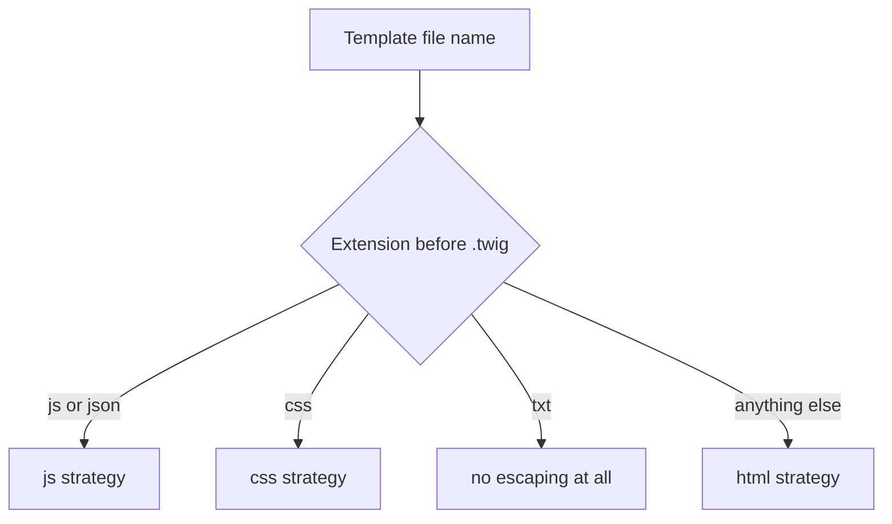
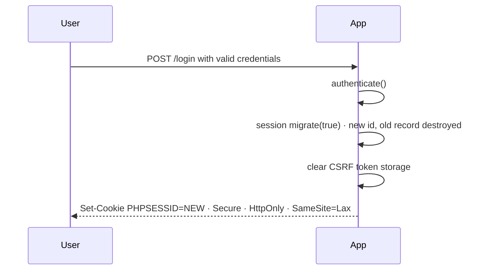

# Web Security Fundamentals

!!! tip "In a nutshell"
    Every Symfony security feature defends one concrete web threat — learn the pairing
    (XSS→contextual escaping, CSRF→token plus `SameSite`, SQLi→bound parameters,
    fixation→session migration on login). Symfony turns four of those on by default and
    **none** of the security headers, so knowing which half is automatic is half the topic.
    Store passwords only with `password_hash()`, never a fast hash, never reversibly.

!!! example "Real-world analogy"
    Securing a web app is like securing a house, where each defence counters one specific
    intrusion. You never repeat verbatim what a stranger shouts through the mailbox (XSS to
    contextual escaping), you check the ID of anyone claiming to act on your behalf (CSRF to
    token plus `SameSite`), and you fit tamper-proof locks rather than trusting whoever
    rattles the door (SQL injection to bound parameters). When a resident is promoted to
    key-holder you re-key the lock rather than trusting the old key (session migration on
    login). And you store the key not as the raw key itself but as a one-way imprint
    (`password_hash`), so a burglar who photographs your records still cannot cut a copy.

!!! abstract "Learning objectives"
    By the end of this chapter you can:

    - [ ] Describe XSS (reflected, stored, DOM-based), CSRF, SQL injection, session fixation
          and hijacking, clickjacking, open redirects, mass assignment, timing attacks and
          file-upload risks.
    - [ ] Map each threat to the Symfony 8.0 feature that mitigates it, and state whether
          that feature is on by default.
    - [ ] Choose the correct Twig escaping strategy for a given output context.
    - [ ] Configure session cookie flags, HTTPS enforcement, security headers and password
          hashing, including migration and rehashing.

    **Syllabus:** `PHP & Web Security → Web Security Fundamentals` ·
    **Level:** Advanced / Expert ·
    **Est. time:** 70 min ·
    **Prerequisites:** [Exceptions](exceptions.md)

!!! quote "Certification scope: partial"
    This chapter is **not** a separately named entry in the nine official PHP items (see
    [PHP & Web Security](index.md)), but the mechanisms it introduces — CSRF tokens,
    password hashing, session handling — overlap subjects that *are* directly examined in
    the Security domain. Treat it as the bridge: see
    [CSRF Protection](../forms/csrf.md) and
    [Password Hashers](../security/password-hashers.md) for the configuration-level
    treatment.

---

## Prerequisites

You will get the most out of this chapter if you can already:

- read a Twig template and predict what it prints — see [Templates](../twig/index.md);
- explain what a `Request` and a `Response` are in HTTP terms, including headers and
  cookies — see [HTTP](../http/index.md);
- describe how a session is identified by a cookie and stored server-side;
- write a PDO or Doctrine query and pass values to it;
- handle errors deliberately rather than letting stack traces reach the browser — see
  [Exceptions](exceptions.md).

If a stack trace with database credentials is rendered to an anonymous visitor, none of the
defences below matter. Controlled error handling is the floor this chapter builds on.

## The problem we are solving

A web application is a program whose input is written by strangers and whose output is
executed by someone else's computer. Every threat in this chapter is one instance of the
same shape:

**A string crosses a boundary between two languages, and the receiving language interprets
part of it as instructions instead of data.**

- A comment crosses into HTML → the browser reads `<script>` as an instruction. That is XSS.
- An e-mail address crosses into SQL → the database reads `' OR 1=1 --` as syntax. That is
  SQL injection.
- A cookie crosses back into your app attached to a request the user never intended → the
  application reads it as consent. That is CSRF.
- A file name crosses into the filesystem → the web server reads `.php` as an instruction to
  execute. That is an upload vulnerability.

Once you see the shape, the defence is always the same idea in different clothing: **make
the boundary explicit, and encode or bind the data so the receiver can only read it as
data.**

The second half of the problem is authority. Sessions, passwords and redirects are not about
injection at all — they are about proving *who* is asking and making sure a stolen or
planted credential stops working. Symfony automates a surprising amount of both halves, and
leaves a specific, memorable list unautomated.

## 🧠 Pour les nuls

### Ce que c'est

La sécurité web, c'est l'ensemble des protections qui empêchent un visiteur malveillant de
détourner ton application. Chaque attaque a un nom précis (XSS, CSRF, injection SQL,
fixation de session…) et chaque nom correspond à **une** défense précise. Ce chapitre est la
table de correspondance entre les deux.

### Pourquoi ça existe

Parce qu'une application web reçoit des données écrites par des inconnus et les recrache
ailleurs : dans une page HTML, dans une requête SQL, dans un nom de fichier. Si le
destinataire confond « donnée » et « instruction », l'inconnu prend le contrôle. Les
protections existent pour rendre cette frontière explicite.

### L'analogie de la vie réelle

Imagine un standardiste qui répète au micro tout ce que les gens lui disent au téléphone. Un
plaisantin appelle et dicte : « Bonjour, et maintenant tout le monde sort du bâtiment ». Si
le standardiste répète mot pour mot, le bâtiment se vide. La solution n'est pas de censurer
l'appelant : c'est d'annoncer clairement « un appelant a dit : … », pour que personne ne
confonde son message avec une consigne officielle. L'échappement HTML fait exactement ça.

### Comment Symfony s'en sert

Symfony active quatre défenses sans aucune configuration : Twig échappe automatiquement
chaque variable affichée, le composant Form ajoute et vérifie un jeton CSRF, Doctrine passe
les valeurs en paramètres liés, et le pare-feu régénère l'identifiant de session à la
connexion. En revanche Symfony n'envoie **aucun** en-tête de sécurité (CSP, HSTS,
`X-Frame-Options`) : ça, c'est ton travail.

### L'exemple minimal

```twig
{# la variable est échappée : aucun <script> n'est exécuté #}
<p>{{ commentaire }}</p>

{# opt-out explicite : à réserver au HTML que TU as produit et nettoyé #}
<p>{{ htmlDeConfiance|raw }}</p>
```

### Ce qui se passe à l'intérieur

Au moment de compiler le template, Twig regarde son **nom de fichier**. Un fichier
`.html.twig` est compilé avec la stratégie `html`, un `.js.twig` avec `js`, un `.txt.twig`
avec… aucune stratégie du tout. La décision est prise une fois, à la compilation, pour tout
le fichier — Twig ne lit jamais ton HTML et ne sait pas qu'un `{{ }}` se trouve dans un
`<script>`.

### L'erreur classique du débutant

Croire que `|raw` « nettoie » la valeur. `|raw` ne nettoie rien du tout : il **désactive**
l'échappement. Appliqué à une donnée venant d'un formulaire, il rouvre la faille XSS en une
seule ligne. La deuxième erreur la plus fréquente : croire qu'échapper les données au moment
de les enregistrer en base remplace l'échappement à l'affichage — non, car la bonne
transformation dépend de la destination, qu'on ne connaît pas encore à l'enregistrement.

### Le moyen mnémotechnique

Une phrase pour tout retenir : **« échapper à la sortie, lier dans la requête, régénérer à
la connexion, hacher le mot de passe — et poser les en-têtes soi-même. »** Les quatre
premiers sont automatiques dans Symfony, le cinquième ne l'est jamais.

## Build the mental model

Picture a single request travelling through your application and back. Each defence occupies
one specific station on that journey, and each station protects against exactly one class of
attack.



Read it as a checklist rather than a picture. The first three stations are the framework's
job and happen before your code runs; the middle two are the framework's job and happen
because you used its abstractions; the last one has no framework default at all and is the
station people forget.

Two orthogonal questions unlock almost every exam item on this topic:

1. **Which boundary is being crossed?** That names the attack.
2. **Who is responsible for the defence — the framework, the abstraction I chose, or me?**
   That names the mistake.

| Threat | Boundary crossed | Symfony defence | On by default? |
|---|---|---|---|
| XSS | data → HTML/JS/CSS/URL | Twig contextual escaping | Yes |
| CSRF | attacker's page → your endpoint | CSRF token, `SameSite` | Yes, for Form-component forms |
| SQL injection | data → SQL | Prepared statements / `setParameter()` | Yes, via Doctrine/DBAL |
| Session fixation | attacker's id → your session | Id migration on authentication | Yes (`MIGRATE`) |
| Session hijacking | cookie → attacker | `HttpOnly`, `Secure`, HTTPS | Partly (`httponly` yes, `secure` no default) |
| Clickjacking | your page → attacker's frame | CSP `frame-ancestors`, `X-Frame-Options` | No |
| Open redirect | untrusted URL → `Location` | Allow-list or route-name indirection | No |
| Mass assignment | extra field → entity | `allow_extra_fields: false` | Yes |
| Timing attack | comparison duration → secret | `hash_equals()`, `password_verify()` | Only inside Symfony's own code |
| Upload abuse | file name → filesystem | `guessExtension()`, `File` constraint | No |

!!! info "Official Symfony 8.0 reference"
    https://symfony.com/doc/8.0/security.html

## Core concepts

### Cross-site scripting (XSS)

Attacker-controlled data is delivered to a browser in a position where it is parsed as code.
Three variants, distinguished by where the payload lives:

- **Reflected** — the payload is in the request and is echoed back in that same response
  (a search term rendered on the results page).
- **Stored** — the payload is persisted and served to every later visitor (a comment, a
  display name, an uploaded file name).
- **DOM-based** — the payload never needs to reach the server. Client-side JavaScript reads
  it from `location.hash`, `document.referrer` or `postMessage` and writes it into a
  dangerous sink such as `innerHTML`.

The fix for the first two is **context-aware output encoding**, applied at the moment of
output. The fix for the third is entirely client-side: server escaping cannot help, because
the server never sees the payload.

The Symfony documentation shows the canonical example: a user whose "name" is a `<script>`
block that ships `document.cookie` to a remote host. With autoescaping, `Hello {{ name }}`
renders `&lt;script&gt;alert(&#39;hello!&#39;)&lt;/script&gt;` — visible text, inert markup.

!!! info "Official Symfony 8.0 reference"
    https://symfony.com/doc/8.0/templates.html#output-escaping

### Cross-site request forgery (CSRF)

The attacker's page causes the victim's browser to issue a state-changing request to your
application. The Symfony documentation spells out the mechanics: a hidden form that
auto-submits to `https://example.com/settings/update-email` while the victim is logged in,
"effectively taking over your account without you even being aware of it".

The attack "is based on the trust that a web application has in a user's browser (e.g. on
session cookies)". The attacker can make the browser *send* the request with its cookies
attached; they cannot *read* your pages to discover a secret. That asymmetry is exactly what
an anti-CSRF token exploits.

!!! info "Official Symfony 8.0 reference"
    https://symfony.com/doc/8.0/security/csrf.html

### SQL injection

Concatenating input into SQL lets the attacker write *syntax*, not just supply data.
`nobody' OR is_admin = 1 --` closes the string literal your code opened, adds a boolean term
and comments out the trailing quote. The fix is not escaping the quote; it is never letting
the value reach the parser as text. A prepared statement sends the SQL to be parsed first,
so the parse tree is fixed before any value is attached.

!!! info "PHP 8.4 reference"
    https://www.php.net/manual/en/pdo.prepare.php

### Session fixation and hijacking

Two attacks with the same symptom and opposite mechanics.

**Fixation:** the attacker makes the victim use a session id the attacker already knows,
*before* the victim logs in. Then the attacker's browser, holding the same id, is suddenly
authenticated. The reference states the condition plainly: "Applications that don't assign
new session IDs when authenticating users are vulnerable to this attack."

**Hijacking:** the attacker obtains an id the victim already holds, *after* login — by
reading `document.cookie` through an XSS, or by observing plain-HTTP traffic. The
countermeasures are to make the cookie unreadable to scripts (`HttpOnly`) and unsniffable in
transit (`Secure` plus HTTPS).

!!! info "Official Symfony 8.0 reference"
    https://symfony.com/doc/8.0/reference/configuration/security.html#session-fixation-strategy

### Clickjacking

Your page is loaded in a transparent frame positioned over bait UI, so the victim's clicks
land on your controls while they believe they are clicking something else. The defence is to
forbid framing: `Content-Security-Policy: frame-ancestors 'none'`, with `X-Frame-Options` as
a fallback for browsers that predate CSP.

### Password storage

Passwords are the one secret you must be able to check without being able to read. That
rules out plaintext and reversible encryption, and the need to resist offline brute force
rules out fast hashes such as MD5 and SHA-1. What remains is a **slow, salted, adaptive**
hash: bcrypt or Argon2, via `password_hash()`.

!!! info "PHP 8.4 reference"
    https://www.php.net/manual/en/function.password-hash.php

## Learn by doing

Take one small feature and walk it through the whole chapter: a public page that lists
comments and lets a logged-in user post one.

**Step 1 — render a comment.** The template is `comment/list.html.twig`:

```twig
<article>
    <h3>{{ comment.author }}</h3>
    <p>{{ comment.body }}</p>
</article>
```

Nothing to configure. Because the file ends in `.html.twig`, Twig compiled it with the
`html` strategy, and both values are escaped. A body of `<script>alert(1)</script>` is
displayed as literal text.

**Step 2 — break it deliberately.** Change one line to `{{ comment.body|raw }}` and reload.
The alert fires. That is the whole XSS lesson in one keystroke: `raw` does not sanitise, it
switches escaping off.

**Step 3 — move the value into JavaScript.** Suppose the page needs the author's name in a
tooltip handler:

```twig
{# wrong: two nested contexts, only the outer one is escaped #}
<div onmouseover="showTip('{{ comment.author }}')">…</div>

{# right: escape for the inner language #}
<div onmouseover="showTip('{{ comment.author|e('js') }}')">…</div>

{# better: stop nesting contexts altogether #}
<div data-tip="{{ comment.author }}" data-controller="tip">…</div>
```

The middle line works; the last line is what you should actually ship, because it has one
context instead of two.

**Step 4 — post a comment.** Build the form with the Form component and there is nothing to
do: "Symfony Forms include CSRF tokens by default and Symfony also checks them automatically
for you." A hidden `_token` field appears in the rendered HTML.

**Step 5 — query for the comments.**

```php
<?php
declare(strict_types=1);

namespace App\Repository;

use Doctrine\Bundle\DoctrineBundle\Repository\ServiceEntityRepository;

final class CommentRepository extends ServiceEntityRepository
{
    /** @return list<object> */
    public function findApprovedFor(int $postId): array
    {
        return $this->createQueryBuilder('c')
            ->where('c.post = :post')
            ->andWhere('c.approved = true')
            ->setParameter('post', $postId)
            ->orderBy('c.createdAt', 'DESC')
            ->getQuery()
            ->getResult();
    }
}
```

The placeholder plus `setParameter()` is the safe form. Writing
`->where("c.post = ".$postId)` would be an injection even though this is DQL, because DQL is
parsed as a string before it is compiled to SQL.

**Step 6 — log in.** Nothing to configure: the firewall's default
`session_fixation_strategy` is `MIGRATE`, so the session id changes at authentication and
the pre-login record is destroyed.

**Step 7 — the part nobody automates.** Add the response headers yourself. See
[Configuration & code](#configuration-code) below.

!!! info "Official Symfony 8.0 reference"
    https://symfony.com/doc/8.0/doctrine.html#doctrine-queries

## How Symfony handles it

### Twig autoescaping

TwigBundle configures Twig's `autoescape` option with the `'name'` strategy. The
documentation describes the effect: "The escaping strategy applied by default to the
template… is determined during compilation time based on the filename of the template. This
means for example that the contents of a `*.html.twig` template are escaped for HTML and the
contents of `*.js.twig` are escaped for JavaScript."



Two consequences follow, and both are examinable. The decision is **per template, at compile
time**, so Twig never notices that a particular `{{ }}` sits inside a `<script>` or an event
handler. And `.txt.twig` templates are compiled with **no escaper**, which is a genuine
blind spot when a plain-text template is later reused in an HTML context.

!!! info "Official Symfony 8.0 reference"
    https://symfony.com/doc/8.0/reference/configuration/twig.html#config-twig-autoescape

### CSRF tokens

Two mechanisms share one API.

**Stateful (the default).** The secret lives in the session's token storage. "By default,
the tokens used for CSRF protection are stored in the session. That's why a session is
started automatically as soon as you render a form with CSRF protection." That is convenient
and it is also why a page containing a protected form cannot be cached as a whole.

**Stateless.** Token IDs listed under `framework.csrf_protection.stateless_token_ids` skip
the session entirely. "When validating a stateless CSRF token, Symfony checks the `Origin`
and `Referer` headers of the incoming HTTP request. If either header matches the
application's target origin (i.e. its domain), the token is considered valid." An optional
cookie/header "double-submit" adds defence in depth when JavaScript is available. Stateless
tokens are enabled by default in Flex applications for the `submit`, `authenticate` and
`logout` IDs.

!!! info "Official Symfony 8.0 reference"
    https://symfony.com/doc/8.0/security/csrf.html#csrf-stateless-tokens

### Session migration on login

The firewall's `session_fixation_strategy` defaults to
`SessionAuthenticationStrategy::MIGRATE`.



The diagram's second-to-last step is the one people miss: the `MIGRATE` strategy also clears
the CSRF token storage, so tokens minted before authentication cannot be replayed after it.

!!! note "Symfony 8.0 source reference"
    https://github.com/symfony/symfony/blob/8.0/src/Symfony/Component/Security/Http/Session/SessionAuthenticationStrategy.php

### Password hashing

You configure an algorithm per user class under `security.password_hashers` and Symfony
builds the hasher. The `'auto'` algorithm "automatically selects the best available hasher
(currently Bcrypt)" and combines that with password migration, "so you can always secure
passwords in the safest way possible (even when new algorithms are introduced in future PHP
releases)".

!!! info "Official Symfony 8.0 reference"
    https://symfony.com/doc/8.0/security/passwords.html

## How it works internally

### What `getToken()` actually returns

`CsrfTokenManager::getToken()` does not return the stored secret. It returns the secret
XOR-masked with 32 fresh random bytes, formatted as three dot-separated segments —
`prefix.key.maskedValue` — where the prefix is a random-length slice of an `xxh128` hash of
the key. `isTokenValid()` reverses the mask and compares with `hash_equals()`:

```php
public function isTokenValid(CsrfToken $token): bool
{
    $namespacedId = $this->getNamespace().$token->getId();
    if (!$this->storage->hasToken($namespacedId)) {
        return false;
    }

    return hash_equals(
        $this->storage->getToken($namespacedId),
        $this->derandomize($token->getValue()),
    );
}
```

The documentation gives the reason: BREACH and CRIME "are security exploits against HTTPS
when using HTTP compression. Attackers can leverage information leaked by compression to
recover targeted parts of the plaintext. To mitigate these attacks… a random mask is
prepended to the token and used to scramble it." A secret that is byte-identical in every
response compresses identically and leaks; a freshly masked one does not.

Practical consequence: the rendered token differs on every render while the stored secret
does not, so two forms rendered in the same session both validate.

!!! note "Symfony 8.0 source reference"
    https://github.com/symfony/symfony/blob/8.0/src/Symfony/Component/Security/Csrf/CsrfTokenManager.php

### What `migrate()` really calls

`Session::invalidate()` is `clear()` followed by `migrate(true, $lifetime)`, and
`Session::migrate()` forwards to `NativeSessionStorage::regenerate()`, which ends in
`session_regenerate_id($destroy)`. The `$destroy` argument decides whether the *old*
server-side record is deleted or left behind — a new id with a surviving old record leaves
the fixation window half-open.

`NativeSessionStorage` also hardens PHP's own defaults. Its constructor merges
`'use_strict_mode' => 1` into the options and `setOptions()` applies each recognised key with
`ini_set('session.'.$key, $value)`. PHP itself defaults `session.use_strict_mode` to `0`.

!!! note "Symfony 8.0 source reference"
    https://github.com/symfony/symfony/blob/8.0/src/Symfony/Component/HttpFoundation/Session/Storage/NativeSessionStorage.php

### What `'auto'` builds

`PasswordHasherFactory` does not create a single hasher for `'auto'`. It builds a
`MigratingPasswordHasher` over the chain `['native', 'sodium', 'pbkdf2']` — or
`['native', 'pbkdf2']` when libsodium is unavailable — and `MigratingPasswordHasher::hash()`
delegates to the **first** hasher only. `NativePasswordHasher`'s algorithm property is
initialised to `PASSWORD_BCRYPT` with a default cost of `13`.

So `'auto'` writes bcrypt hashes today, and verifies sodium and PBKDF2 hashes so that legacy
records keep working while they are migrated. `MigratingPasswordHasher::verify()` tries the
best hasher first and only falls back to the others when `needsRehash()` says the stored
hash is out of date.

!!! note "Symfony 8.0 source reference"
    https://github.com/symfony/symfony/tree/8.0/src/Symfony/Component/PasswordHasher/Hasher/PasswordHasherFactory.php

### The bcrypt 72-byte guard

bcrypt truncates its input at 72 bytes. `NativePasswordHasher` compensates:

```php
if (\PASSWORD_BCRYPT === $this->algorithm
    && (72 < \strlen($plainPassword)
        || str_contains($plainPassword, "\0"))) {
    $plainPassword = base64_encode(hash('sha512', $plainPassword, true));
}
```

`verify()` applies the same transformation, so long passphrases keep every byte of entropy
and old hashes keep verifying. A separate guard rejects anything longer than
`PasswordHasherInterface::MAX_PASSWORD_LENGTH` (4096 bytes) — a denial-of-service protection
against multi-megabyte "passwords", not a bcrypt concern.

!!! note "Symfony 8.0 source reference"
    https://github.com/symfony/symfony/tree/8.0/src/Symfony/Component/PasswordHasher/Hasher/NativePasswordHasher.php

## All supported cases and variations

### Twig escaping strategies

The documented list for HTML documents, complete:

| Strategy | Documented context |
|---|---|
| `html` | HTML body, or attribute values **inside quotes** |
| `js` | JavaScript or JSON strings, via backslash escape sequences |
| `css` | Any string inserted into CSS; escapes everything except alphanumerics |
| `url` | A URI **subcomponent** — never a whole URI |
| `html_attr` | An attribute **name**, or an attribute value **without quotes** |
| `html_attr_relaxed` | As `html_attr`, but leaves `@`, `:`, `[`, `]` alone |

Two documented nuances. `html_attr` "can also be used for escaping a dynamic HTML attribute
value if it is not quoted, but this is less performant" — the recommendation is to quote the
attribute and use `html`. And automatic escaping does not double-escape when the filter's
strategy matches the template's, *unless* you pass the strategy as a variable, in which case
you must add `|raw`.

!!! info "Twig 3.x reference"
    https://twig.symfony.com/doc/3.x/filters/escape.html

### Session fixation strategies

| Value | Effect |
|---|---|
| `NONE` | Session untouched — documented as "not recommended" |
| `MIGRATE` (default) | New id, attributes kept, old record destroyed, CSRF storage cleared |
| `INVALIDATE` | New id, all attributes lost |

### CSRF token sources for `#[IsCsrfTokenValid]`

The attribute's `tokenSource` is a bitfield combining:

- `IsCsrfTokenValid::SOURCE_PAYLOAD` (default) — POST body or JSON payload;
- `IsCsrfTokenValid::SOURCE_QUERY` — the query string;
- `IsCsrfTokenValid::SOURCE_HEADER` — a request header.

"The token is checked against each selected source, and validation fails if none match."
The `methods` parameter restricts *when* the check runs — and if the request uses a method
not listed, "the attribute is ignored for that request, and no CSRF validation occurs".

!!! info "Official Symfony 8.0 reference"
    https://symfony.com/doc/8.0/security/csrf.html#csrf-controller-attributes

### Password hashers

The documented supported algorithms are `auto`, `bcrypt`, `sodium` and `PBKDF2`, plus custom
hashers.

| Hasher | Notes |
|---|---|
| `auto` | Best available (currently bcrypt); hash length may change, allocate `varchar(255)` |
| `bcrypt` | 60-character hashes, `cost` 4–31 (default 13 in Symfony), salt embedded |
| `sodium` | Argon2 via libsodium, 96-character hashes, salt embedded |
| `PBKDF2` | "No longer recommended since PHP added support for Sodium and BCrypt" |

Each cost increment "doubles the time it takes to hash a password". You can change the cost
at any time: new passwords use the new cost, existing ones are still validated with the cost
recorded inside their hash.

!!! info "Official Symfony 8.0 reference"
    https://symfony.com/doc/8.0/security/passwords.html#passwordhasher-supported-algorithms

### `SameSite` values

| Value | Behaviour |
|---|---|
| `null` | Fall back to `php.ini`'s `session.cookie_samesite` |
| `'none'` | Send the cookie on cross-site requests (requires `Secure`) |
| `'lax'` (default) | Send it cross-site only when "the user consciously made the request (by clicking a link or submitting a form with the `GET` method)" |
| `'strict'` | Never send it when the request did not originate from the same domain |

## Configuration & code

=== "YAML — session and CSRF"

    ```yaml
    # config/packages/framework.yaml
    framework:
        session:
            cookie_secure: auto      # true on HTTPS, false on HTTP
            cookie_httponly: true    # invisible to JavaScript (default)
            cookie_samesite: lax     # default
        csrf_protection:
            stateless_token_ids: ['submit', 'authenticate', 'logout']
    ```

=== "YAML — passwords and HTTPS"

    ```yaml
    # config/packages/security.yaml
    security:
        password_hashers:
            App\Entity\User: 'auto'

        firewalls:
            main:
                # MIGRATE is the default; shown here for clarity
                session_fixation_strategy: migrate

        access_control:
            - { path: ^/account, roles: ROLE_USER, requires_channel: https }
    ```

=== "PHP — security headers listener"

    ```php
    <?php
    declare(strict_types=1);

    namespace App\EventListener;

    use Symfony\Component\EventDispatcher\Attribute\AsEventListener;
    use Symfony\Component\HttpKernel\Event\ResponseEvent;
    use Symfony\Component\HttpKernel\KernelEvents;

    #[AsEventListener(event: KernelEvents::RESPONSE)]
    final class SecurityHeadersListener
    {
        public function __invoke(ResponseEvent $event): void
        {
            if (!$event->isMainRequest()) {
                return;
            }

            $headers = $event->getResponse()->headers;
            $headers->set('X-Frame-Options', 'DENY');
            $headers->set('X-Content-Type-Options', 'nosniff');
            $headers->set('Referrer-Policy', 'strict-origin-when-cross-origin');
            $headers->set('Permissions-Policy', 'geolocation=(), camera=()');
            $headers->set(
                'Content-Security-Policy',
                "default-src 'self'; frame-ancestors 'none'",
            );

            if ($event->getRequest()->isSecure()) {
                $headers->set(
                    'Strict-Transport-Security',
                    'max-age=31536000; includeSubDomains',
                );
            }
        }
    }
    ```

=== "PHP — manual CSRF for a hand-written form"

    ```php
    <?php
    declare(strict_types=1);

    namespace App\Controller;

    use Symfony\Bundle\FrameworkBundle\Controller\AbstractController;
    use Symfony\Component\HttpFoundation\Request;
    use Symfony\Component\HttpFoundation\Response;
    use Symfony\Component\Security\Http\Attribute\IsCsrfTokenValid;

    final class PostController extends AbstractController
    {
        #[IsCsrfTokenValid('delete-item', tokenKey: 'token')]
        public function delete(Request $request): Response
        {
            // The attribute already rejected an invalid token.
            return $this->redirectToRoute('post_index');
        }
    }
    ```

The template side of that last example uses the `csrf_token()` Twig function:

```twig
<form action="{{ url('post_delete', { id: post.id }) }}" method="post">
    <input type="hidden" name="token" value="{{ csrf_token('delete-item') }}">
    <button type="submit">Delete</button>
</form>
```

!!! info "Official Symfony 8.0 reference"
    https://symfony.com/doc/8.0/security/csrf.html#csrf-protection-in-html-forms

## Execution flow

For an authenticated `POST` that renders a page, the security-relevant steps happen in this
order:

1. **Firewall** — the request is matched to a firewall and the token is restored from the
   session (or the request is authenticated).
2. **Session migration** — on a *successful authentication only*,
   `SessionAuthenticationStrategy::onAuthentication()` runs `migrate(true)` and clears the
   CSRF token storage.
3. **Access control** — `access_control` entries are evaluated in order; the first match
   wins, and `requires_channel: https` redirects a plain-HTTP request before the controller
   runs.
4. **Controller resolution** — `#[IsCsrfTokenValid]`, if present and if the request method
   is in scope, validates the token before the action executes.
5. **Form handling** — `$form->handleRequest()` validates the `_token` field and records
   "This form should not contain extra fields." for any undeclared submitted field.
6. **Persistence** — Doctrine compiles DQL to SQL and executes it as a prepared statement
   with the bound values.
7. **Rendering** — Twig writes each `{{ }}` through the strategy chosen at compile time from
   the template's file name.
8. **Response** — your `kernel.response` listener adds the security headers; the session
   cookie is written with its configured flags.

The order matters for one recurring question: session migration happens at authentication,
not on every request, which is why a long-lived session keeps one id until logout.

## Default behavior

With no security configuration beyond a firewall, a Symfony 8.0 application already:

- escapes every `{{ }}` in `.html.twig` templates with the `html` strategy;
- adds and verifies a `_token` field on every Form-component form;
- executes Doctrine queries as prepared statements with bound values;
- migrates the session id on authentication (`MIGRATE`) and destroys the old record;
- clears the CSRF token storage at that same moment;
- sets `cookie_httponly: true` and `cookie_samesite: 'lax'` on the session cookie;
- runs PHP with `session.use_strict_mode = 1`, overriding PHP's own default of `0`;
- rejects submitted fields the form does not declare (`allow_extra_fields: false`);
- invalidates the session on logout (`invalidate_session` defaults to `true`);
- stores session files under `%kernel.cache_dir%/sessions`.

And it does **not**:

- send any security header — no CSP, HSTS, `X-Frame-Options`, `nosniff`, `Referrer-Policy`
  or `Permissions-Policy`;
- force HTTPS anywhere (`requires_channel` is opt-in);
- set `cookie_secure` — the option has no documented default and falls back to `php.ini`;
- validate the target of a redirect you build yourself;
- move uploaded files out of the web root, or rename them.

!!! info "Official Symfony 8.0 reference"
    https://symfony.com/doc/8.0/reference/configuration/framework.html#config-framework-session

## Edge cases

**`.txt.twig` templates have no escaper at all.** `FileExtensionEscapingStrategy::guess()`
returns `false` for `txt`. A plain-text mail template that is later reused as an HTML
fragment is a stored-XSS vector with no visible cause.

**Escaping with a variable strategy double-escapes.** Twig avoids double-escaping when the
filter's strategy matches the template's, "but that does not work when using a variable as
the escaping strategy". The documented workaround is `{{ var|escape(strategy)|raw }}`.

**bcrypt ignores bytes 73 and beyond.** Two passphrases that share their first 72 bytes
verify against the same hash. Symfony pre-hashes with sha512 to avoid it; raw
`password_hash()` calls do not.

**`password_hash()` ignores an explicit salt.** The `salt` option is deprecated and "as of
PHP 8.0.0, an explicitly given salt is ignored". Legacy code that passes one is inert, not
merely redundant.

**`session.use_strict_mode` can be neutralised by a custom save handler.** The PHP manual
warns that if a handler registered via `session_set_save_handler()` "does not implement
`SessionUpdateTimestampHandlerInterface::validateId`… strict session ID mode is effectively
disabled, regardless of the value of this directive" — and notes that `SessionHandler` itself
does not implement it.

**`#[IsCsrfTokenValid]` with `methods` silently skips.** A request whose method is not
listed is not rejected; the attribute is simply ignored.

**Stateless CSRF depends on knowing your own origin.** Behind a misconfigured reverse proxy,
the `Origin`/`Referer` comparison is made against the wrong host. Configure
`trusted_proxies`.

**A protocol-relative path looks local.** `//evil.example` starts with `/` and is a
different host. So does `/\evil.example` in browsers that normalise the backslash.

!!! info "PHP 8.4 reference"
    https://www.php.net/manual/en/session.configuration.php#ini.session.use-strict-mode

## Common confusions

| Confusion | Reality |
|---|---|
| `\|raw` sanitises the value | It *disables* escaping. No filtering happens at all |
| Escaping on input replaces escaping on output | The right transformation depends on the destination, unknown at write time |
| Validation replaces escaping | Validation decides whether a value is acceptable; escaping decides how it is represented |
| `HttpOnly` forces HTTPS | `Secure` forces HTTPS; `HttpOnly` hides the cookie from JavaScript |
| `SameSite` replaces CSRF tokens | `lax` still sends cookies on cross-site top-level `GET` navigations |
| DQL is immune to injection | Only when values are bound; concatenated DQL is injectable |
| CSRF tokens authenticate the user | They prove the request came from your own page, nothing more |
| `'auto'` means Argon2id | In Symfony 8.0 it writes bcrypt; sodium is in the chain for verification |
| A changing rendered CSRF token is a bug | It is the BREACH/CRIME mask; the stored secret is stable |
| `X-Frame-Options: ALLOW-FROM` allow-lists a parent | It is obsolete and does not work in modern browsers |

## Best practices & anti-patterns

| ✅ Do | ❌ Avoid |
|---|---|
| Escape at output, in the destination's context | `\|raw` on anything a user can influence |
| Bind every value; allow-list identifiers | Concatenating into SQL or DQL |
| Keep state changes out of `GET` | State-changing `GET` endpoints "protected" by `SameSite` |
| Let the Form component handle CSRF | Home-made hidden fields or `Referer` checks |
| `password_hash()` / Symfony hashers | MD5, SHA-1, static salts, reversible encryption |
| Implement `PasswordUpgraderInterface` | `migrate_from` with nowhere to store the new hash |
| Store uploads outside the web root, rename them | Trusting `getClientOriginalName()` |
| Redirect to a route name you control | `redirect($request->query->get('next'))` |
| `hash_equals($known, $userSupplied)` | `===` on tokens, signatures or MACs |
| Send security headers from one listener | Scattering `$response->headers->set()` across controllers |
| Start CSP in report-only mode | Enforcing a first-draft CSP in production |

## Certification traps

!!! danger "Certification traps"
    - **The escaping strategy is per template, chosen at compile time from the file name.**
      It is not per element, and `.txt.twig` gets no escaper at all.
    - **HTML escaping is not enough inside a `<script>`, an event handler, a URL or a CSS
      property.** Nested contexts need the innermost language's escaper — and an HTML
      attribute is decoded *before* the JavaScript parser runs.
    - **`session_fixation_strategy` defaults to `MIGRATE`**, which calls `migrate(true)` and
      clears the CSRF token storage. `NONE` is documented as not recommended.
    - **`cookie_httponly` defaults to `true` and `cookie_samesite` to `'lax'`, but
      `cookie_secure` has no default.** It falls back to `php.ini`.
    - **`session.use_strict_mode` is `0` in PHP and `1` in Symfony**, because
      `NativeSessionStorage` sets it.
    - **`'auto'` selects "the best available hasher (currently Bcrypt)"**, not Argon2id, and
      builds a `MigratingPasswordHasher` chain.
    - **`password_hash()` embeds the salt** and ignores an explicit one since PHP 8.0.
    - **CSRF tokens protect state-changing requests.** They are not authentication, and
      OWASP requires them precisely because such operations "must not use `GET` requests".
    - **`#[IsCsrfTokenValid]` with `methods` is ignored** for other methods — it does not
      reject them.
    - **`X-Frame-Options` cannot allow-list a parent origin**; only CSP `frame-ancestors`
      can, and CSP "obsoletes X-Frame-Options for supporting browsers".
    - **HSTS cannot protect the first request**, only subsequent ones — hence preloading.
    - **`hash_equals()` takes the secret first and the user-supplied value second.**

## Common mistakes

!!! warning "Common mistakes"
    - Comparing a token, signature or hash with `===` instead of `hash_equals()`, leaking
      the position of the first differing byte through timing.
    - Rolling your own `if ($stored === hash('sha256', $input))` password check, which
      rebuilds both the fast-hash problem and the timing problem in one line.
    - Configuring `migrate_from` but never implementing `PasswordUpgraderInterface`, so the
      rehash is computed on every login and discarded. The migration never completes and
      nothing warns you.
    - Setting `allow_extra_fields: true` to silence "This form should not contain extra
      fields" instead of adding the field the form actually needs.
    - Serving uploads from inside the web root under their original name.
    - Reading a redirect target from the query string and passing it straight to
      `redirect()`.
    - Sending `Strict-Transport-Security` on plain-HTTP development responses, pinning your
      own machine to HTTPS it cannot serve.
    - Assuming `Request::isSecure()` is accurate behind a TLS-terminating proxy without
      `trusted_proxies` — which also silently disables `cookie_secure: auto`.
    - Treating `Referer` as a CSRF defence: it is frequently absent, so the check has to
      accept the empty case and is trivially bypassed.

## Debugging and troubleshooting

**"My HTML is being displayed as text."** Autoescaping is doing its job. Decide whether the
value is genuinely trusted markup you produced, and only then use `|raw` — or, better, run
it through an HTML sanitiser first.

**"An `<script>` payload executes."** Grep the template for `|raw`, then check the file
extension: a `.txt.twig` rendered into an HTML page has no escaper. Then check for nested
contexts — a value inside `onclick="…"` or `<script>`.

**"Invalid CSRF token."** Work through the list in order: is the session still alive (a
cleared session drops the stored secret)? Did the user authenticate between rendering and
submitting (the `MIGRATE` strategy clears the token storage)? Does the token ID in the
template match the one in the check? Is the form cached by an HTTP cache while its token is
not? The last case is what `stateless_token_ids` exists for.

**"The token changes on every reload."** Expected. That is the BREACH/CRIME mask, not a
regenerated secret.

**"The user is logged out immediately after logging in."** Look for code that calls
`session_regenerate_id()` or `Session::migrate()` after the firewall has already migrated,
or for two firewalls whose `invalidate_session` interaction logs the user out of the other.

**"The session cookie has no `Secure` flag in production."** `cookie_secure: auto` resolves
from `Request::isSecure()`. Behind a proxy that terminates TLS, that is `false` until
`trusted_proxies` is configured.

**Inspect what is actually sent.** `curl -sI https://example.com/` shows the response headers
and `Set-Cookie` attributes without a browser in the way; the profiler's Request panel shows
the same data for a request Symfony handled.

!!! info "Official Symfony 8.0 reference"
    https://symfony.com/doc/8.0/deployment/proxies.html

## Performance and security considerations

**Escaping is compiled, not interpreted.** The strategy is resolved when the template is
compiled to PHP, so autoescaping costs one function call per printed value at runtime and
nothing at all in strategy selection. There is no performance argument for switching it off.

**Password hashing is deliberately expensive.** Each bcrypt cost increment doubles the time,
which is the point. The documented mitigation for test suites is to lower the cost in the
`test` environment — `cost: 4`, `time_cost: 3`, `memory_cost: 10` are the documented minimum
values — never to weaken production.

**Stateful CSRF forces a session.** Rendering a protected form starts a session, which makes
the response uncacheable for shared caches. The documented options are an uncached ESI
fragment, loading the form over AJAX, or — "the most effective way" — stateless CSRF tokens.

**Session storage is a scaling decision.** The default file handler serialises access per
session and does not share across nodes. `handler_id` accepts a DSN (`redis`, `memcached`,
PDO drivers and more) when you need a shared store.

**Security headers are free.** They are a few hundred bytes per response and no server-side
work. CSP is the exception in complexity, not in cost: start in report-only mode, because a
first-draft policy will break inline scripts and third-party widgets.

**`hash_equals()` is not slower in any way that matters.** It compares the full length every
time, which is a fixed, tiny cost for a property you cannot get any other way.

!!! info "Official Symfony 8.0 reference"
    https://symfony.com/doc/8.0/security/csrf.html

## Key takeaways

- Every threat is one boundary crossing where data is read as instructions; every defence
  makes that boundary explicit.
- Escape at **output**, in the **destination's** context. Twig picks the strategy per
  template from the file name, at compile time.
- `|raw` disables escaping and sanitises nothing.
- Bind every value in SQL and DQL; allow-list identifiers, which cannot be bound.
- CSRF tokens prove the request came from your page. `SameSite=Lax` narrows the window but
  still allows cross-site top-level `GET`.
- Session id migration on login defeats fixation; `HttpOnly` + `Secure` + HTTPS defeat
  hijacking.
- Store passwords with `password_hash()` or a Symfony hasher; verify with a verify function,
  never with `===`.
- Symfony ships escaping, CSRF, bound parameters and session migration on by default — and
  no security headers, no HTTPS enforcement, no redirect validation.

## Expert takeaways

- `CsrfTokenManager::getToken()` returns the stored secret XOR-masked with fresh random
  bytes on every call; validation de-randomises and uses `hash_equals()`. The mask defeats
  BREACH and CRIME.
- `SessionAuthenticationStrategy::MIGRATE` calls `migrate(true)` — destroying the old
  record — and clears the CSRF token storage.
- `Session::invalidate()` is exactly `clear()` + `migrate(true)`.
- `NativeSessionStorage` forces `session.use_strict_mode = 1`, overriding PHP's default
  of `0`; a custom save handler without `validateId()` neutralises it anyway.
- `'auto'` is a `MigratingPasswordHasher` over `['native', 'sodium', 'pbkdf2']`; only the
  first hasher ever writes.
- `NativePasswordHasher` pre-hashes with sha512 above 72 bytes to defeat bcrypt truncation,
  and rejects inputs above 4096 bytes.
- PHP 8.4 raised the default bcrypt cost from 10 to 12; Symfony's own default is 13.
- Stateless CSRF validates `Origin`/`Referer` first; the cookie/header double-submit is an
  optional, JavaScript-dependent hardening layer that becomes mandatory once it has been
  observed to work in a session.
- `FileExtensionEscapingStrategy::guess()` returns `false` — no escaping — for `.txt.twig`.

## Last-minute revision

!!! tip "Cheat sheet"
    - XSS→contextual escaping · CSRF→token + `SameSite` · SQLi→bound parameters.
    - Fixation→`migrate(true)` on login · Hijack→`HttpOnly` + `Secure` + HTTPS.
    - Clickjacking→CSP `frame-ancestors` (preferred) or `X-Frame-Options`.
    - Twig strategy from the file name, at compile time: `js`/`json`→`js`, `css`→`css`,
      `txt`→**none**, else `html`.
    - Defaults: `session_fixation_strategy: MIGRATE`, `cookie_httponly: true`,
      `cookie_samesite: lax`, `cookie_secure` **none**, `use_strict_mode: 1`,
      `allow_extra_fields: false`.
    - Passwords: `'auto'` = bcrypt today, cost 13; bcrypt truncates at 72 bytes; PHP 8.4
      default cost 12; salt embedded and an explicit one ignored.
    - Rehash on successful login → `PasswordUpgraderInterface::upgradePassword()`.
    - `hash_equals($known, $userSupplied)` — secret first.
    - Symfony sends **no** security headers. That is always your listener.

## Connections

- **Depends on:** [Exceptions](exceptions.md) — controlled error handling stops internals
  leaking to attackers, which is the precondition for everything here.
- **Reused in:** [Security stage](../security/index.md),
  [CSRF Protection](../forms/csrf.md) and
  [Password Hashers](../security/password-hashers.md) — where these threats get their full
  Symfony configuration treatment.
- **Pairs with:** [HTTP](../http/index.md) — cookies, headers and redirects are HTTP
  mechanics before they are security controls.
- **Confused with:** [authentication](../security/authentication.md) — a CSRF token proves
  a request came from your page; it never identifies the user.

## Continue your learning

1. **[Guided exercises](web-security-exercises.md)** — watch an escaper miss a character,
   bypass a login with one quote, and build the outbound defences.
2. **[Topic exam](web-security-exam.md)** — every certification question for this topic,
   answers hidden.
3. **[Flashcards](web-security-flashcards.md)** — active recall on the threat/defence map,
   the defaults and the traps.

## Official References

- [Symfony — Security](https://symfony.com/doc/8.0/security.html)
- [Symfony — CSRF protection](https://symfony.com/doc/8.0/security/csrf.html)
- [Symfony — Output escaping and XSS](https://symfony.com/doc/8.0/templates.html#output-escaping)
- [Symfony — Password hashing and verification](https://symfony.com/doc/8.0/security/passwords.html)
- [Symfony — Session configuration reference](https://symfony.com/doc/8.0/reference/configuration/framework.html#config-framework-session)
- [Symfony — `session_fixation_strategy`](https://symfony.com/doc/8.0/reference/configuration/security.html#session-fixation-strategy)
- [Symfony — Forcing a channel (http, https)](https://symfony.com/doc/8.0/security/access_control.html#forcing-a-channel-http-https)
- [Symfony — Uploading files](https://symfony.com/doc/8.0/controller/upload_file.html)
- [Symfony — `File` constraint](https://symfony.com/doc/8.0/reference/constraints/File.html#reference-constraints-file-mime-types)
- [Twig — the `escape` filter](https://twig.symfony.com/doc/3.x/filters/escape.html)
- [PHP — `password_hash()`](https://www.php.net/manual/en/function.password-hash.php)
- [PHP — `hash_equals()`](https://www.php.net/manual/en/function.hash-equals.php)
- [PHP — session configuration](https://www.php.net/manual/en/session.configuration.php)
- [OWASP Cheat Sheet Series](https://cheatsheetseries.owasp.org/)
- [Symfony source — PasswordHasher component](https://github.com/symfony/symfony/tree/8.0/src/Symfony/Component/PasswordHasher)
- [Symfony source — `CsrfTokenManager`](https://github.com/symfony/symfony/blob/8.0/src/Symfony/Component/Security/Csrf/CsrfTokenManager.php)

## Video references

!!! tip "Watch & learn"
    These are official, continuously-updated video channels — search them for
    "PHP & web security" to reinforce this chapter. We link stable channels rather than
    individual videos so the references never rot.

    - [SymfonyCasts screencasts](https://symfonycasts.com/tracks/symfony) — scripted, code-along tutorials.
    - [Symfony official YouTube](https://www.youtube.com/@SymfonyOfficial) — SymfonyCon conference talks & keynotes.
    - [Official docs for this topic](https://symfony.com/doc/8.0/templates.html#output-escaping) — some Symfony doc pages embed a screencast.

## Confidence check

I'm ready when I can:

- [ ] name the boundary each threat crosses and the defence that makes it explicit
- [ ] state which four defences Symfony enables by default and which five it never does
- [ ] pick the correct Twig escaping strategy for a body, an attribute, a script and a URL
- [ ] explain why an HTML-escaped value inside `onclick="…"` is still exploitable
- [ ] recite the session defaults: `MIGRATE`, `httponly: true`, `samesite: lax`,
      `secure` unset, `use_strict_mode: 1`
- [ ] explain what `'auto'` builds, what it hashes with, and how a rehash reaches the database
- [ ] justify why the rendered CSRF token changes on every render
- [ ] write a redirect guard that rejects `//evil.example` and `/\evil.example`

---

<small>Related: [Security stage](../security/index.md) · [CSRF Protection](../forms/csrf.md) · [Exceptions](exceptions.md)</small>
