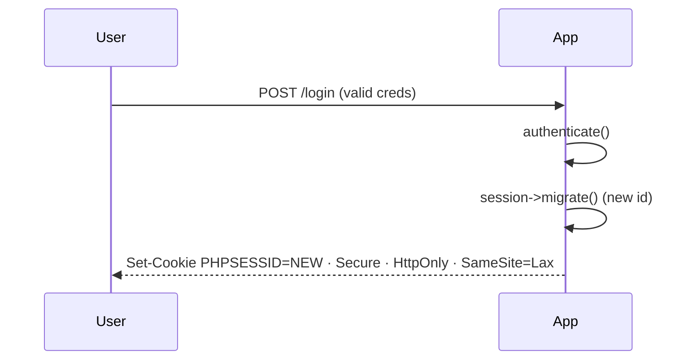

# Web Security Fundamentals

!!! tip "In a nutshell"
    Every Symfony security feature defends one concrete web threat — learn the
    pairing (XSS→Twig escaping, CSRF→token+SameSite, SQLi→prepared statements).
    Store passwords only with `password_hash()` (bcrypt/argon2id), never plain hashes.

!!! example "Real-world analogy"
    Securing a web app is like securing a house, where each defence counters one
    specific intrusion. You never repeat verbatim what a stranger shouts through the
    mailbox (XSS to Twig escaping), you check the ID of anyone claiming to act on your
    behalf (CSRF to token plus SameSite), and you fit tamper-proof locks rather than
    trusting whoever rattles the door (SQL injection to prepared statements). And you
    store the key not as the raw key itself but as a one-way imprint (`password_hash`),
    so a burglar who photographs your records still cannot reconstruct it.

!!! abstract "Learning objectives"
    By the end of this chapter you can:

    - [ ] Describe XSS, CSRF, SQL injection, session fixation and clickjacking.
    - [ ] Map each threat to the Symfony feature that mitigates it.
    - [ ] Configure security headers, HTTPS/HSTS and correct password storage.

    **Syllabus:** `Web Security → Fundamentals` ·
    **Level:** Advanced / Expert ·
    **Est. time:** 40 min ·
    **Prerequisites:** [Exceptions](exceptions.md)

!!! quote "🎯 Examen Symfony 8 : PARTIEL"
    Ce chapitre n'est **pas** un sous-sujet nommé individuellement dans la
    liste officielle des 9 items PHP (voir [PHP & Web Security](index.md)),
    mais les mécanismes qu'il introduit (CSRF, mots de passe) recoupent des
    sujets **directement examinés** dans le domaine Security — voir
    [CSRF](../forms/csrf.md) et [Password Hashers](../security/password-hashers.md).

---

## Pour les nuls

### L'idée en une phrase
Chaque protection Symfony existe pour contrer une attaque précise et nommée — comprendre l'attaque rend la défense évidente.

### Imagine dans la vraie vie
Sécuriser un site web ressemble à sécuriser une maison : on ne répète jamais mot pour mot ce qu'un inconnu crie par la boîte aux lettres (XSS → échappement Twig), on vérifie l'identité de qui prétend agir en ton nom (CSRF → jeton + SameSite), et on installe des serrures inviolables plutôt que de faire confiance à qui secoue la porte (injection SQL → requêtes préparées).

### Dans Symfony
Twig échappe automatiquement toute variable affichée (protection XSS par défaut), le composant Form ajoute un jeton CSRF caché à chaque formulaire, et le Validator + l'ORM utilisent systématiquement des requêtes préparées — la plupart des défenses sont actives **sans configuration supplémentaire**.

### Exemple simple
```twig
{{ commentaire }} {# échappé automatiquement par Twig : pas de <script> exécuté #}
```

### Comment le mémoriser 🧠
Associe chaque sigle à son remède en une paire : **XSS → échappement**, **CSRF → jeton**, **SQLi → requêtes préparées**, **mots de passe → `password_hash()`** (jamais en clair, jamais un simple hash MD5).

## Theory

Every Symfony security feature exists to defend a concrete web threat. Knowing
the **attack** makes the **defence** obvious. This chapter is the threat model
the rest of the platform builds on; deep configuration lives in the
[Security stage](../security/index.md) and [CSRF chapter](../forms/csrf.md).

| Threat | One-line definition | Symfony defence |
|---|---|---|
| XSS | Inject script into a page | Twig auto-escaping |
| CSRF | Forged request from a logged-in user | CSRF tokens / SameSite |
| SQL injection | Inject SQL via input | Parameterised queries |
| Session fixation | Force a known session id | Session id regeneration |
| Session hijacking | Steal a session cookie | `Secure`/`HttpOnly`, HTTPS |
| Clickjacking | Frame the site invisibly | `X-Frame-Options`/CSP |

!!! question "Predict first"
    A comment `<script>alert(1)</script>` is rendered with `{{ comment }}` in Twig.
    Does the alert fire?

??? note "Reveal"
    No. Twig auto-escapes it to `&lt;script&gt;…`, shown as literal text. Only
    `{{ comment|raw }}` would reintroduce the XSS — so reserve `|raw` for content
    you generated and sanitised.

## Deep Dive — threats and mitigations

### XSS (Cross-Site Scripting)

Attacker-controlled data is rendered as HTML/JS. **Reflected** (from the
request), **stored** (from the database) and **DOM-based** variants exist. The
fix is **context-aware output encoding**. Twig auto-escapes for HTML by default;
`|raw` disables it (use only on trusted, already-safe content). Set the correct
escaping context (`html`, `js`, `url`) — HTML-escaping is **not** enough inside a
`<script>` or URL.

```twig
{# safe: auto-escaped #}
<p>{{ comment }}</p>
{# dangerous: only when the value is truly trusted #}
<p>{{ trustedHtml|raw }}</p>
```

### CSRF (Cross-Site Request Forgery)

A malicious site triggers a state-changing request using the victim's cookies.
Defences: an unpredictable **CSRF token** validated server-side (Symfony Forms
add one automatically) and cookies with **`SameSite=Lax/Strict`**. Safe,
idempotent GET requests should never change state — that alone removes a large
attack surface. See [CSRF Protection](../forms/csrf.md).

### SQL injection

Concatenating input into SQL lets attackers alter the query. The fix is
**prepared statements / parameter binding** — never string interpolation. Symfony
apps use PDO/DBAL with bound parameters, so input is sent separately from the
query text and can never change its structure.

```php
<?php
declare(strict_types=1);

// Parameterised — input can never alter the query structure.
$stmt = $pdo->prepare('SELECT * FROM users WHERE email = :email');
$stmt->execute(['email' => $email]);
```

### Session fixation & hijacking

**Fixation:** the attacker sets a victim's session id before login, then reuses
it. Defence: **regenerate the session id on privilege change** (login) — Symfony
does this automatically on authentication. **Hijacking:** stealing the cookie;
mitigated by `Secure` (HTTPS only), `HttpOnly` (no JS access) and `SameSite`.

```php
// Defeat fixation: new session id on login (Symfony does this for you)
$request->getSession()->migrate();

// Mitigate hijacking with cookie flags:
session_set_cookie_params([
    'secure'   => true,   // Secure: sent over HTTPS only
    'httponly' => true,   // HttpOnly: invisible to JavaScript
    'samesite' => 'Lax',  // SameSite: withheld on cross-site requests
]);
```



### Clickjacking

The site is loaded in an invisible `<iframe>` over bait UI. Defence:
`X-Frame-Options: DENY` or a Content-Security-Policy `frame-ancestors 'none'`.

```php
// Either response header blocks framing:
$response->headers->set('X-Frame-Options', 'DENY');
$response->headers->set('Content-Security-Policy', "frame-ancestors 'none'");
```

### HTTPS, HSTS & security headers

Serve everything over TLS. **HSTS** (`Strict-Transport-Security`) tells browsers
to refuse plain HTTP for a period. Core response headers:

| Header | Purpose |
|---|---|
| `Strict-Transport-Security` | Force HTTPS (HSTS) |
| `Content-Security-Policy` | Restrict script/style/frame sources |
| `X-Content-Type-Options: nosniff` | Stop MIME sniffing |
| `X-Frame-Options: DENY` | Anti-clickjacking |
| `Referrer-Policy` | Limit referer leakage |

```php
$h = $response->headers;
$h->set('Strict-Transport-Security', 'max-age=31536000; includeSubDomains');
$h->set('Content-Security-Policy', "default-src 'self'");
$h->set('X-Content-Type-Options', 'nosniff');
$h->set('X-Frame-Options', 'DENY');
$h->set('Referrer-Policy', 'same-origin');
```

### Password storage

Never store plaintext or fast hashes (MD5/SHA1). Use a **slow, salted, adaptive**
algorithm — `password_hash()` with `PASSWORD_BCRYPT` or `PASSWORD_ARGON2ID`.
Symfony's `'auto'` password hasher picks the best available and supports rehash
on cost changes. Verify with `password_verify()` (constant-time).

```php
<?php
declare(strict_types=1);

$hash = password_hash($plain, PASSWORD_ARGON2ID);
$ok   = password_verify($plain, $hash);           // constant-time compare
```

!!! note "Source reference"
    Symfony's `Symfony\Component\PasswordHasher\Hasher\SodiumPasswordHasher` and
    the CSRF `HttpFoundation` cookie flags implement these defences —
    [symfony/symfony `8.0`](https://github.com/symfony/symfony/blob/8.0/src/Symfony/Component/PasswordHasher).

## Configuration & code

=== "YAML"

    ```yaml
    # config/packages/framework.yaml
    framework:
        session:
            cookie_secure: auto      # Secure when on HTTPS
            cookie_httponly: true    # no JS access
            cookie_samesite: lax     # CSRF mitigation
    ```

=== "PHP (headers)"

    ```php
    <?php
    declare(strict_types=1);

    use Symfony\Component\HttpFoundation\Response;

    $response = new Response('OK');
    $response->headers->set('X-Frame-Options', 'DENY');
    $response->headers->set('X-Content-Type-Options', 'nosniff');
    ```

## Best practices & anti-patterns

| ✅ Do | ❌ Avoid |
|---|---|
| Escape output in the right context | `|raw` on user input |
| Bound/prepared queries | String-built SQL |
| `password_hash` (bcrypt/argon2id) | MD5/SHA1/plaintext |
| `SameSite` + CSRF tokens | State-changing GET requests |

## When (not) to use it / alternatives

- Disable Twig escaping (`|raw`) only for content you generated and sanitised.
- Relax `SameSite` to `None` only for genuine cross-site flows, and then always
  with `Secure`.
- CSP is powerful but easy to break; start in report-only mode before enforcing.

!!! danger "Certification traps"
    - HTML-escaping does **not** protect a value placed inside a `<script>` or a
      URL — use the correct escaping context.
    - CSRF tokens protect **state-changing** requests; they are not an
      authentication mechanism.
    - Session id must be **regenerated on login** to stop fixation (Symfony does
      this automatically).
    - `HttpOnly` blocks JS cookie access (anti-XSS-theft); `Secure` forces HTTPS
      — they solve different problems.
    - `password_hash()` embeds the salt in the output — do not add your own.

!!! warning "Common mistakes"
    - Using `==` to compare hashes (timing attack) instead of `password_verify`/`hash_equals`.
    - Trusting `Referer`/hidden fields as CSRF protection without a real token.

## Exercises

1. **(Advanced)** Given `"<script>alert(1)</script>"` rendered via `{{ x }}` in
   Twig, what is output, and why is it safe?
2. **(Expert)** Rewrite a vulnerable `"... WHERE id = $id"` query safely.

??? success "Solutions"

    **1.** Twig auto-escapes to `&lt;script&gt;alert(1)&lt;/script&gt;`, which the
    browser renders as literal text — the script never executes. Only `|raw`
    would reintroduce the vulnerability.

    **2.**
    ```php
    <?php
    $stmt = $pdo->prepare('SELECT * FROM item WHERE id = :id');
    $stmt->execute(['id' => $id]);   // structure fixed; input bound separately
    ```

## Certification questions

*Question d'entraînement inspirée du syllabus — jamais une question officielle de l'examen.*

??? question "Q1. Twig's default protection against XSS is…"
    - [x] A. Context auto-escaping of variables ✅
    - [ ] B. Stripping all HTML tags
    - [ ] C. A CSP header
    - [ ] D. Encrypting output

    **Why:** Twig HTML-escapes output by default; `|raw` opts out.
    **Ref:** [Twig escaping](https://symfony.com/doc/8.0/templates.html#output-escaping).

??? question "Q2. Which best prevents SQL injection?"
    - [x] A. Prepared statements with bound parameters ✅
    - [ ] B. Escaping quotes with `addslashes`
    - [ ] C. A WAF only
    - [ ] D. HTML-escaping input

    **Why:** Binding sends data separately from SQL, so input cannot alter query
    structure. **Ref:** [OWASP SQLi](https://cheatsheetseries.owasp.org/cheatsheets/SQL_Injection_Prevention_Cheat_Sheet.html).

??? question "Q3. Session fixation is mitigated primarily by…"
    - [x] A. Regenerating the session id on login ✅
    - [ ] B. Longer session ids
    - [ ] C. Deleting cookies on logout only
    - [ ] D. Base64-encoding the id

    **Why:** A new id at authentication invalidates any attacker-planted id.
    **Ref:** [OWASP session management](https://cheatsheetseries.owasp.org/cheatsheets/Session_Management_Cheat_Sheet.html).

??? question "Q4. Which header defends against clickjacking?"
    - [x] A. `X-Frame-Options: DENY` (or CSP `frame-ancestors`) ✅
    - [ ] B. `X-Content-Type-Options`
    - [ ] C. `Referrer-Policy`
    - [ ] D. `Accept-Language`

    **Why:** It forbids the page being framed. **Ref:** [OWASP clickjacking](https://cheatsheetseries.owasp.org/cheatsheets/Clickjacking_Defense_Cheat_Sheet.html).

??? question "Q5. The correct way to store passwords is…"
    - [x] A. `password_hash()` with bcrypt/argon2id ✅
    - [ ] B. SHA-256 with a static salt
    - [ ] C. MD5
    - [ ] D. Reversible encryption

    **Why:** Adaptive, salted hashing resists brute-force; the salt is embedded.
    **Ref:** [password_hash](https://www.php.net/manual/en/function.password-hash.php).

## Key takeaways

- Each threat maps to one Symfony defence — learn the pairing.
- Escape output **in context**; bind SQL parameters; regenerate sessions on login.
- Cookies: `Secure` + `HttpOnly` + `SameSite`; add HSTS + CSP + `nosniff`.
- Store passwords with `password_hash` (bcrypt/argon2id), verify constant-time.

## Last-minute revision

!!! tip "Cheat sheet"
    - XSS→Twig escaping · CSRF→token+SameSite · SQLi→prepared statements.
    - Fixation→session migrate on login · Hijack→Secure/HttpOnly/HTTPS.
    - Clickjacking→`X-Frame-Options`/CSP `frame-ancestors`.
    - Passwords→`PASSWORD_ARGON2ID`/`BCRYPT`; verify with `password_verify`.

## Connections

- **Depends on:** [Exceptions](exceptions.md) — controlled error handling avoids leaking internals to attackers.
- **Reused in:** [Security stage](../security/index.md) & [CSRF Protection](../forms/csrf.md) — where these threats get concrete Symfony configuration.
- **Confused with:** [authentication](../security/authentication.md) — CSRF tokens protect state-changing requests, they do not identify the user.

## Official References
- [Symfony — Security](https://symfony.com/doc/8.0/security.html)
- [Symfony — CSRF](https://symfony.com/doc/8.0/security/csrf.html)
- [OWASP Cheat Sheet Series](https://cheatsheetseries.owasp.org/)
- [PHP — password_hash](https://www.php.net/manual/en/function.password-hash.php)
- [Symfony source — PasswordHasher](https://github.com/symfony/symfony/blob/8.0/src/Symfony/Component/PasswordHasher)

## Video references

!!! tip "Watch & learn"
    These are official, continuously-updated video channels — search them for
    "PHP & web security" to reinforce this chapter. We link stable channels rather than
    individual videos so the references never rot.

    - [SymfonyCasts screencasts](https://symfonycasts.com/tracks/symfony) — scripted, code-along tutorials.
    - [Symfony official YouTube](https://www.youtube.com/@SymfonyOfficial) — SymfonyCon conference talks & keynotes.
    - [Official docs for this topic](https://symfony.com/doc/8.0/templates.html#output-escaping) — some Symfony doc pages embed a screencast.

## Confidence check

I'm ready when I can:

- [ ] explain **why** each threat exists and the Symfony defence it maps to
- [ ] configure session cookie flags, security headers and `password_hash` in Symfony 8
- [ ] debug an XSS caused by `|raw` or a wrong escaping context
- [ ] spot the trick: HTML-escaping a value placed inside `<script>` or a URL
- [ ] explain how session-id regeneration on login stops fixation

---

<small>Related: [Security stage](../security/index.md) · [CSRF Protection](../forms/csrf.md) · [Exceptions](exceptions.md)</small>
