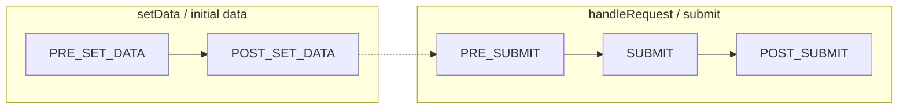
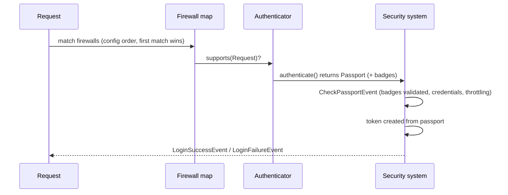
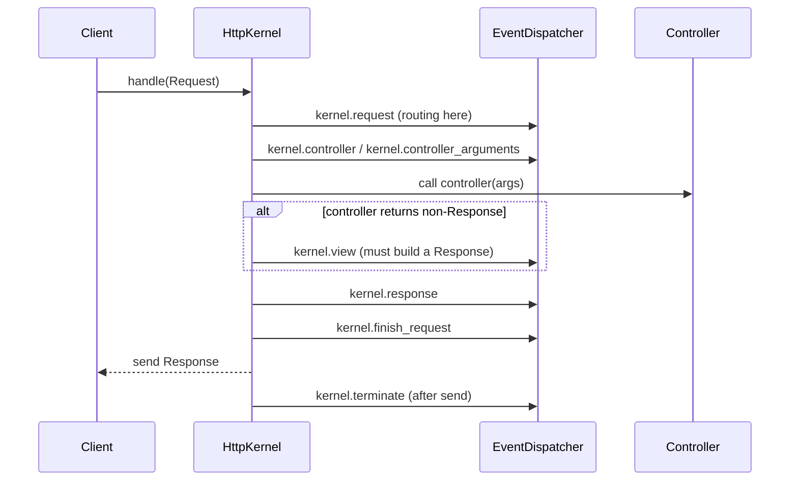

# Le Codex de l'ordre d'exécution

Les examens de niveau Expert sont obsédés par le **« qu'est-ce qui s'exécute en
premier ? »**. Cette page rassemble toutes les séquences ordonnées de Symfony en un
seul endroit à travailler : events du kernel, priorités des listeners, cycles de vie
form/console/security, phases des compiler passes, chaînes de resolvers, ordre du
routing et du caching.

!!! tip "How to drill this page"
    Masquez la colonne de gauche de chaque tableau et récitez la séquence à voix
    haute, dans l'ordre. Puis lisez seulement les lignes **memory anchor** de haut
    en bas comme échauffement de 60 secondes. Au moindre doute, vérifiez en direct
    avec `debug:event-dispatcher`, `debug:router` ou `debug:container` — ces outils
    montrent l'ordre *effectif*.

## 🧠 Pour les nuls

**C'est quoi ?** Un recueil de **tous les ordres d'exécution** de Symfony rassemblés au même endroit : quel événement se déclenche avant quel autre, dans quel ordre les listeners s'exécutent, dans quel ordre passe une requête dans le firewall, etc.

**Pourquoi ça existe ?** Ces séquences sont dispersées dans des dizaines de chapitres différents. Les regrouper en un seul endroit permet de les réviser toutes ensemble juste avant l'examen, qui adore poser des questions du type "que se passe-t-il en premier ?".

**🏠 Analogie de la vraie vie :** C'est la **fiche de procédure d'un pompier** : au lieu de relire tout le manuel, on a la liste ordonnée exacte des étapes ("1. sécuriser, 2. évaluer, 3. agir") affichée sur un seul panneau.

**Symfony dans la vraie vie :** Chaque tableau → une séquence Symfony précise (ex. les événements du kernel) / La colonne "Fires when" → le déclencheur exact de chaque étape / Le "memory anchor" → une phrase-mnémonique pour retenir l'ordre sans réfléchir.

**⚠️ Erreur fréquente :** Mémoriser un ordre "à peu près" (par exemple confondre `kernel.response` et `kernel.terminate`) — l'examen pose justement des questions qui piègent sur l'ordre exact, pas sur l'existence de l'événement.

**🧠 Comment le mémoriser :** *« Un ordre approximatif est un ordre faux »* — utilise les mnémoniques fournis (comme "ReCoCA-View, Respond, Finish, Terminate") plutôt que d'essayer de retenir la liste brute.

## 1. Kernel request events

| # | Event | Se déclenche quand | Sub-requests aussi ? |
|---|---|---|---|
| 1 | `kernel.request` | Avant le routing/la résolution du controller (le routing lui-même s'exécute dans un listener ici) | Oui |
| 2 | `kernel.controller` | Controller résolu, il peut être remplacé | Oui |
| 3 | `kernel.controller_arguments` | Arguments résolus, ils peuvent être modifiés | Oui |
| 4 | `kernel.view` | **Seulement si** le controller a retourné autre chose qu'une *`Response`* | Oui |
| 5 | `kernel.response` | Une `Response` existe, dernière chance de la modifier | Oui |
| 6 | `kernel.finish_request` | Traitement de la request terminé (restaure le contexte de request après une sub-request) | Oui |
| 7 | `kernel.terminate` | **Après** l'envoi de la response | **Main request uniquement** |
| * | `kernel.exception` | Toute exception non attrapée — sa `Response` de remplacement passe quand même par `kernel.response` | Oui |

**Memory anchor:** *"ReCoCA-View, Respond, Finish, Terminate"* — et `exception`
est un joker qui peut s'intercaler n'importe où, puis rejoint le flux à `response`.

!!! danger "Trap"
    Deux classiques : (1) `kernel.view` est **sauté** quand le controller retourne
    déjà une `Response` ; (2) `kernel.terminate` ne se déclenche que pour la request
    **principale** et seulement **après** que le client a reçu la response — tous
    les autres events se déclenchent aussi pour les sub-requests (p. ex. `forward()`,
    fragments).

**Ref:** [https://symfony.com/doc/8.0/reference/events.html](https://symfony.com/doc/8.0/reference/events.html)

## 2. Listener priority rules

1. **Une priorité plus haute s'exécute plus tôt** (p. ex. `255` avant `0` avant `-255`).
2. **La priorité par défaut est `0`** quand aucune n'est donnée.
3. **Même priorité → ordre d'enregistrement** (l'ordre dans lequel les services ont
   été enregistrés).
4. Les internes du framework utilisent délibérément des priorités extrêmes : le
   routing écoute `kernel.request` très tôt (priorité haute) ; les listeners tardifs
   de `kernel.response` (profiling) utilisent des priorités très **négatives** pour
   voir la response finale.
5. Ne mémorisez jamais des nombres fragiles — inspectez la chaîne réelle :
   `php bin/console debug:event-dispatcher kernel.response`.

**Memory anchor:** *Big number goes first; zero is the default; ties break by
registration order.*

!!! danger "Trap"
    Sur `kernel.response`, « s'exécuter en dernier » signifie la priorité **la plus
    négative** — un listener à `-1000` voit les modifications faites par un listener
    à `0`. Les questions adorent inverser cela (« une priorité plus haute s'exécute
    plus tard » — faux).

**Ref:** [https://symfony.com/doc/8.0/event_dispatcher.html](https://symfony.com/doc/8.0/event_dispatcher.html)

## 3. Form event order

| # | Event | Données manipulables |
|---|---|---|
| 1 | `FormEvents::PRE_SET_DATA` | Données du modèle avant qu'elles ne remplissent le form — modifiez des champs selon les données initiales |
| 2 | `FormEvents::POST_SET_DATA` | Form rempli — vue en lecture seule de ce qui a été défini |
| 3 | `FormEvents::PRE_SUBMIT` | **Données brutes de la request** (tableaux/chaînes) — le seul endroit pour changer ce qui a été soumis |
| 4 | `FormEvents::SUBMIT` | **Données normalisées** — modifiez-les avant leur mapping vers le modèle |
| 5 | `FormEvents::POST_SUBMIT` | Objet final mappé — lecture/inspection ; trop tard pour changer les données du modèle |

Nuance parent/enfant : à la soumission, **les forms enfants achèvent leur propre
cycle de submit entre le `PRE_SUBMIT` et le `SUBMIT` du parent** — le
`SUBMIT`/`POST_SUBMIT` d'un parent voit déjà des enfants entièrement soumis.

**Memory anchor:** *Set twice, submit thrice — raw at PRE_SUBMIT, norm at
SUBMIT, done at POST_SUBMIT.*

!!! danger "Trap"
    « Quel event permet de modifier les données *soumises* ? » — `PRE_SUBMIT`
    (brutes), pas `POST_SET_DATA`. Et `POST_SUBMIT` sert à *lire* l'objet final
    (ou ajuster la vue), pas à changer les données du modèle.

**Ref:** [https://symfony.com/doc/8.0/form/events.html](https://symfony.com/doc/8.0/form/events.html)

## 4. Console event order

| # | Event | Quand |
|---|---|---|
| 1 | `ConsoleEvents::COMMAND` (`console.command`) | Avant l'exécution de la commande — peut désactiver/sauter la commande |
| 2 | `ConsoleEvents::SIGNAL` (`console.signal`) | Seulement si le processus reçoit un signal géré |
| 3 | `ConsoleEvents::ERROR` (`console.error`) | **Seulement en cas d'échec** (throwable non attrapé) — peut changer le code de sortie |
| 4 | `ConsoleEvents::TERMINATE` (`console.terminate`) | **Toujours, en dernier** — même après une erreur |

**Memory anchor:** *Command, maybe Signal, Error only if it hurts, Terminate
always.*

!!! danger "Trap"
    `console.terminate` se déclenche **même quand `console.error` s'est déclenché** —
    « terminate est sauté en cas d'erreur » est faux. C'est le jumeau console de
    `kernel.terminate`.

**Ref:** [https://symfony.com/doc/8.0/components/console/events.html](https://symfony.com/doc/8.0/components/console/events.html)

## 5. Security request cycle order

1. **Correspondance des firewalls** — les firewalls sont testés dans l'ordre où ils
   apparaissent dans `security.yaml` ; le **premier firewall correspondant gagne**
   et est le seul utilisé.
2. Chaque **authenticator** du firewall est interrogé via `supports()`.
3. Le `authenticate()` de l'authenticator qui a répondu retourne un **`Passport`**
   avec des badges.
4. **`CheckPassportEvent`** — les badges sont validés ici (vérification du mot de
   passe, token CSRF, user checker, login throttling).
5. Un **token** est créé à partir du passport et stocké.
6. **`LoginSuccessEvent`** (ou **`LoginFailureEvent`** si quelque chose a levé une
   exception plus haut).
7. Plus tard, à chaque request, les règles d'**`access_control`** sont vérifiées
   **de haut en bas ; la première règle correspondante gagne** — l'ordre compte,
   exactement comme pour les firewalls.

**Memory anchor:** *First firewall wins, first access_control rule wins —
security is a "first match" world.*

!!! danger "Trap"
    Un motif d'`access_control` large comme `^/` placé **en premier** masque toutes
    les règles en dessous. Placez les chemins spécifiques (p. ex. `^/admin/login`)
    **au-dessus** des généraux (`^/admin`).

**Ref:** [https://symfony.com/doc/8.0/security.html](https://symfony.com/doc/8.0/security.html)

## 6. Compiler pass phases

| # | Phase (`PassConfig::TYPE_*`) | Conceptuellement |
|---|---|---|
| 1 | Merge (`TYPE_BEFORE_OPTIMIZATION` est le type *enregistré* par défaut, mais la merge pass s'exécute en premier) | Les extensions des bundles chargent/fusionnent leur configuration |
| 2 | Before optimization | Vos passes custom typiques (type par défaut quand on appelle `addCompilerPass()`) |
| 3 | Optimization | Définitions résolues : définitions parent/enfant, autowiring, résolution des paramètres |
| 4 | Before removing | Dernière chance d'agir tant que les services inutilisés existent encore |
| 5 | Removing | Définitions inutilisées/private non référencées supprimées, alias résolus et éliminés |
| 6 | After removing | Nettoyage final sur le container élagué |

Au sein d'une même phase : **priorité la plus haute d'abord, puis ordre
d'enregistrement** — les deux mêmes règles que pour les event listeners.

**Memory anchor:** *Merge, Before-Opt (yours), Opt, Before-Removing, Removing,
After-Removing — "M-BO-O-BR-R-AR".*

!!! danger "Trap"
    Une pass qui doit voir **tous les services taggés** doit s'exécuter avant la
    phase removing ; une pass enregistrée trop tard peut trouver ses services déjà
    élagués. Aussi : les compiler passes s'enregistrent dans `build()` — **aucun
    attribut** n'existe pour en enregistrer une.

**Ref:** [https://symfony.com/doc/8.0/components/dependency_injection/compilation.html](https://symfony.com/doc/8.0/components/dependency_injection/compilation.html)

## 7. Argument/value resolver order

1. Les value resolvers forment une **chaîne ordonnée par priorité** (tag
   `controller.argument_value_resolver`) ; la priorité la plus haute est essayée en
   premier.
2. Pour chaque argument de controller, les resolvers sont essayés dans l'ordre —
   **le premier resolver qui supporte l'argument gagne** et fournit la valeur.
3. Le **resolver des attributs de request s'exécute avant le resolver de valeur par
   défaut** — un attribut de route bat la valeur par défaut du paramètre ; le
   resolver de valeur par défaut est un dernier recours en fin de chaîne.
4. Les resolvers custom fixent leur position via la `priority` du tag ; les nombres
   exacts des resolvers intégrés dépendent de la version — **retenez la règle,
   vérifiez la chaîne** avec
   `php bin/console debug:container debug.argument_resolver.inner --show-arguments`
   (ou en inspectant les services taggés).

**Memory anchor:** *A chain, not a vote: first supporting resolver wins;
defaults come last.*

!!! danger "Trap"
    Un resolver custom enregistré avec une **priorité trop haute peut masquer les
    resolvers intégrés** (p. ex. détourner des arguments que le resolver
    d'attributs de request aurait remplis). Gardez une logique `supports` très
    ciblée et une priorité modeste.

**Ref:** [https://symfony.com/doc/8.0/controller/value_resolver.html](https://symfony.com/doc/8.0/controller/value_resolver.html)

## 8. Routing match order

1. Les routes sont testées **dans l'ordre de déclaration** — la **première route
   correspondante gagne** ; les routes suivantes correspondant à la même URL ne sont
   jamais atteintes.
2. Pour les routes par attributs/importées, l'option **`priority`** (entier, `0` par
   défaut, le plus haut gagne) réordonne la correspondance sans déplacer les
   déclarations.
3. Règle pratique : **le spécifique avant le générique** — `/blog/list` doit être
   déclarée avant (ou avec une priorité supérieure à) `/blog/{slug}`, sinon `{slug}`
   avale `list`.
4. Vérifiez avec `php bin/console debug:router` (ordre d'affichage = ordre de
   correspondance) et `php bin/console router:match /some/path`.

**Memory anchor:** *Routing is a top-down waterfall — specific routes upstream,
wildcards downstream.*

!!! danger "Trap"
    « Symfony choisit la route *la plus spécifique* » — **faux**. Il choisit la
    *première* correspondance dans l'ordre ; la spécificité ne gagne que si vous
    l'ordonnez (ou la `priority`-sez) ainsi.

**Ref:** [https://symfony.com/doc/8.0/routing.html](https://symfony.com/doc/8.0/routing.html)

## 9. HttpKernel::handle() call sequence

1. `handle()` dispatche `kernel.request` — si un listener définit une `Response`,
   le kernel **saute directement à `kernel.response`** (le controller ne s'exécute
   jamais).
2. Sinon : résolution du controller (`kernel.controller`), résolution des arguments
   (`kernel.controller_arguments`), **appel du controller**.
3. Retour autre qu'une `Response` → `kernel.view` doit en produire une (ou le kernel
   lève une exception).
4. `kernel.response` → `kernel.finish_request` → response retournée/envoyée →
   `kernel.terminate`.
5. Tout throwable en chemin → `kernel.exception` le gère, et sa `Response` passe
   quand même par `kernel.response`.

**Memory anchor:** *A request-event early-exit skips the controller entirely —
that's how HttpCache-style shortcuts and security redirects work.*

**Ref:** [https://symfony.com/doc/8.0/components/http_kernel.html](https://symfony.com/doc/8.0/components/http_kernel.html)

## 10. Cache/response ordering nuggets

1. **`HttpCache` enveloppe le kernel applicatif** — sur un hit de cache frais, la
   response est servie **avant même que votre kernel applicatif ne s'exécute** : pas
   de routing, pas de controller, pas d'events du kernel pour cette request.
2. Avec ESI/fragments, **les responses embarquées contraignent la response
   principale** : la stratégie de cache calcule la fraîcheur résultante à partir de
   toutes les parties, donc **le fragment le moins cacheable plafonne la page
   entière** (un seul fragment private/à courte durée de vie tire la response
   principale vers le bas).
3. **`kernel.terminate` s'exécute après l'envoi de la response** — sous PHP-FPM,
   `fastcgi_finish_request()` envoie d'abord la response au client, donc un travail
   lourd à cet endroit ne retarde pas l'utilisateur (sur les autres SAPI la response
   est envoyée avant, mais le processus peut sembler encore occupé).

**Memory anchor:** *Cache before kernel, fragments cap the page, terminate
after the flush.*

!!! danger "Trap"
    « Le post-traitement lourd va dans un listener `kernel.response` » — non :
    `kernel.response` retarde le client ; `kernel.terminate` (ou Messenger)
    s'exécute après l'envoi de la response.

**Ref:** [https://symfony.com/doc/8.0/http_cache.html](https://symfony.com/doc/8.0/http_cache.html)

## Official References

- [Built-in Symfony events](https://symfony.com/doc/8.0/reference/events.html)
- [The EventDispatcher (priorities)](https://symfony.com/doc/8.0/event_dispatcher.html)
- [Form events](https://symfony.com/doc/8.0/form/events.html)
- [Console events](https://symfony.com/doc/8.0/components/console/events.html)
- [Security](https://symfony.com/doc/8.0/security.html)
- [Container compilation & compiler passes](https://symfony.com/doc/8.0/components/dependency_injection/compilation.html)
- [Controller value resolvers](https://symfony.com/doc/8.0/controller/value_resolver.html)
- [Routing](https://symfony.com/doc/8.0/routing.html)
- [The HttpKernel component](https://symfony.com/doc/8.0/components/http_kernel.html)
- [HTTP cache](https://symfony.com/doc/8.0/http_cache.html)

---

<small>Related: [Top Certification Traps](traps.md) · [Master Cheat Sheet](cheat-sheet.md) · [Revision Hub](index.md)</small>
