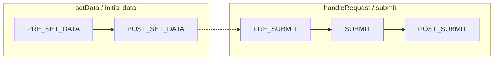
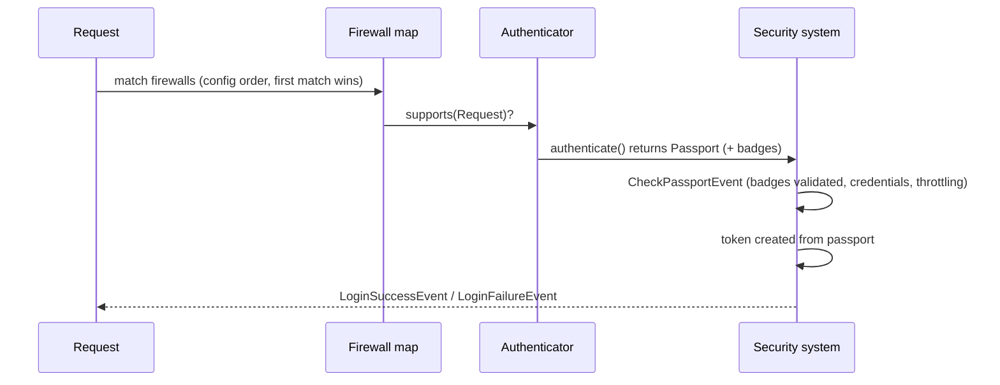
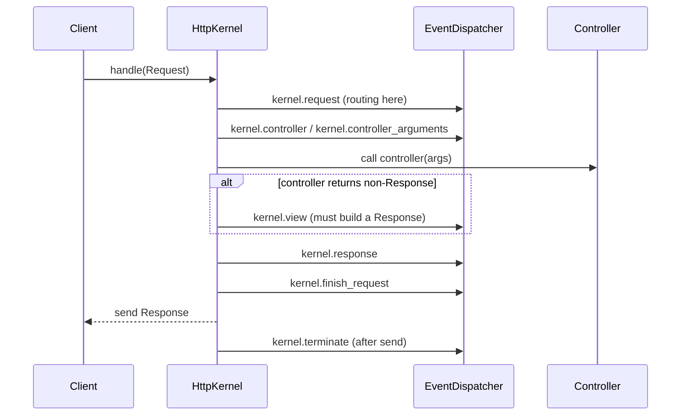

# The Execution-Order Codex

Expert exams are obsessed with **"what runs first?"**. This page gathers every
ordered sequence in Symfony in one drillable place: kernel events, listener
priorities, form/console/security lifecycles, compiler-pass phases, resolver
chains, routing and caching order.

!!! tip "How to drill this page"
    Cover each table's left column and recite the sequence out loud, in order.
    Then read only the **memory anchor** lines top-to-bottom as a 60-second
    warm-up. Anything you hesitate on, verify live with `debug:event-dispatcher`,
    `debug:router` or `debug:container` — the tools show the *effective* order.

## 1. Kernel request events

| # | Event | Fires when | Sub-requests too? |
|---|---|---|---|
| 1 | `kernel.request` | Before routing/controller resolution (routing itself runs in a listener here) | Yes |
| 2 | `kernel.controller` | Controller resolved, can be replaced | Yes |
| 3 | `kernel.controller_arguments` | Arguments resolved, can be modified | Yes |
| 4 | `kernel.view` | **Only if** the controller returned a *non-`Response`* | Yes |
| 5 | `kernel.response` | A `Response` exists, last chance to modify it | Yes |
| 6 | `kernel.finish_request` | Request handling finished (restores request context after a sub-request) | Yes |
| 7 | `kernel.terminate` | **After** the response has been sent | **Main request only** |
| * | `kernel.exception` | Any uncaught exception — its replacement `Response` still goes through `kernel.response` | Yes |

**Memory anchor:** *"ReCoCA-View, Respond, Finish, Terminate"* — and `exception`
is a wildcard that can cut in anywhere, then rejoins at `response`.

!!! danger "Trap"
    Two classics: (1) `kernel.view` is **skipped** when the controller already
    returns a `Response`; (2) `kernel.terminate` fires only for the **main**
    request and only **after** the client got the response — every other event
    also fires for sub-requests (e.g. `forward()`, fragments).

**Ref:** [https://symfony.com/doc/8.0/reference/events.html](https://symfony.com/doc/8.0/reference/events.html)

## 2. Listener priority rules

1. **Higher priority runs earlier** (e.g. `255` before `0` before `-255`).
2. **Default priority is `0`** when none is given.
3. **Same priority → registration order** (the order services were registered).
4. Framework internals deliberately use extreme priorities: routing listens to
   `kernel.request` very early (high priority); profiling/late `kernel.response`
   listeners use very **negative** priorities so they see the final response.
5. Never memorize fragile numbers — inspect the real chain:
   `php bin/console debug:event-dispatcher kernel.response`.

**Memory anchor:** *Big number goes first; zero is the default; ties break by
registration order.*

!!! danger "Trap"
    On `kernel.response`, "run last" means **most negative** priority — a
    listener at `-1000` sees changes made by one at `0`. Questions love
    inverting this ("higher priority runs later" — false).

**Ref:** [https://symfony.com/doc/8.0/event_dispatcher.html](https://symfony.com/doc/8.0/event_dispatcher.html)

## 3. Form event order

| # | Event | Data you can touch |
|---|---|---|
| 1 | `FormEvents::PRE_SET_DATA` | Model data before it populates the form — modify fields based on initial data |
| 2 | `FormEvents::POST_SET_DATA` | Form populated — read-only view of what was set |
| 3 | `FormEvents::PRE_SUBMIT` | **Raw request data** (arrays/strings) — the only place to change what was submitted |
| 4 | `FormEvents::SUBMIT` | **Normalized data** — change it before it's mapped back to the model |
| 5 | `FormEvents::POST_SUBMIT` | Final mapped object — read/inspect; too late to change the model data |

Parent/child nuance: on submit, **child forms complete their own submit cycle
between the parent's `PRE_SUBMIT` and `SUBMIT`** — a parent's `SUBMIT`/`POST_SUBMIT`
already sees fully-submitted children.

**Memory anchor:** *Set twice, submit thrice — raw at PRE_SUBMIT, norm at
SUBMIT, done at POST_SUBMIT.*

!!! danger "Trap"
    "Which event lets you alter the *submitted* data?" — `PRE_SUBMIT` (raw),
    not `POST_SET_DATA`. And `POST_SUBMIT` is for *reading* the final object
    (or tweaking the view), not for changing model data.

**Ref:** [https://symfony.com/doc/8.0/form/events.html](https://symfony.com/doc/8.0/form/events.html)

## 4. Console event order

| # | Event | When |
|---|---|---|
| 1 | `ConsoleEvents::COMMAND` (`console.command`) | Before the command runs — can disable/skip the command |
| 2 | `ConsoleEvents::SIGNAL` (`console.signal`) | Only if the process receives a handled signal |
| 3 | `ConsoleEvents::ERROR` (`console.error`) | **Only on failure** (uncaught throwable) — can change the exit code |
| 4 | `ConsoleEvents::TERMINATE` (`console.terminate`) | **Always, last** — even after an error |

**Memory anchor:** *Command, maybe Signal, Error only if it hurts, Terminate
always.*

!!! danger "Trap"
    `console.terminate` fires **even when `console.error` fired** — "terminate
    is skipped on error" is false. It's the console twin of `kernel.terminate`.

**Ref:** [https://symfony.com/doc/8.0/components/console/events.html](https://symfony.com/doc/8.0/components/console/events.html)

## 5. Security request cycle order

1. **Firewall matching** — firewalls are tested in the order they appear in
   `security.yaml`; the **first matching firewall wins** and is the only one used.
2. Each of the firewall's **authenticators** is asked `supports()`.
3. The supporting authenticator's `authenticate()` returns a **`Passport`** with badges.
4. **`CheckPassportEvent`** — badges are validated here (password check, CSRF
   token, user checker, login throttling).
5. A **token** is created from the passport and stored.
6. **`LoginSuccessEvent`** (or **`LoginFailureEvent`** if anything above threw).
7. Later, on each request, **`access_control`** rules are checked
   **top-to-bottom; the first matching rule wins** — order matters, exactly like
   firewalls.

**Memory anchor:** *First firewall wins, first access_control rule wins —
security is a "first match" world.*

!!! danger "Trap"
    A broad `access_control` pattern like `^/` placed **first** shadows every
    rule below it. Put specific paths (e.g. `^/admin/login`) **above** general
    ones (`^/admin`).

**Ref:** [https://symfony.com/doc/8.0/security.html](https://symfony.com/doc/8.0/security.html)

## 6. Compiler pass phases

| # | Phase (`PassConfig::TYPE_*`) | Conceptually |
|---|---|---|
| 1 | Merge (`TYPE_BEFORE_OPTIMIZATION` is *registered* by default, but the merge pass runs first) | Bundle extensions load/merge their configuration |
| 2 | Before optimization | Your typical custom passes (default type when calling `addCompilerPass()`) |
| 3 | Optimization | Definitions resolved: parent/child definitions, autowiring, parameter resolution |
| 4 | Before removing | Last chance to act while unused services still exist |
| 5 | Removing | Unused/private-unreferenced definitions removed, aliases resolved away |
| 6 | After removing | Final cleanup on the pruned container |

Within a single phase: **higher priority first, then registration order** —
the same two rules as event listeners.

**Memory anchor:** *Merge, Before-Opt (yours), Opt, Before-Removing, Removing,
After-Removing — "M-BO-O-BR-R-AR".*

!!! danger "Trap"
    A pass that needs to see **all tagged services** must run before the
    removing phase; a pass registered too late may find its services already
    pruned. Also: compiler passes are registered in `build()` — **no attribute**
    exists for registering one.

**Ref:** [https://symfony.com/doc/8.0/components/dependency_injection/compilation.html](https://symfony.com/doc/8.0/components/dependency_injection/compilation.html)

## 7. Argument/value resolver order

1. Value resolvers form a **priority-ordered chain** (tag
   `controller.argument_value_resolver`); higher priority is tried first.
2. For each controller argument, resolvers are tried in order — **the first
   resolver that supports the argument wins** and provides the value.
3. The **request-attributes resolver runs before the default-value resolver** —
   a route attribute beats the parameter's default value; the default-value
   resolver is a late fallback near the end of the chain.
4. Custom resolvers set their position via the tag's `priority`; exact built-in
   numbers are version-sensitive — **teach the rule, verify the chain** with
   `php bin/console debug:container debug.argument_resolver.inner --show-arguments`
   (or inspect the tagged services).

**Memory anchor:** *A chain, not a vote: first supporting resolver wins;
defaults come last.*

!!! danger "Trap"
    A custom resolver registered with a **too-high priority can shadow the
    built-ins** (e.g. hijacking arguments the request-attribute resolver would
    have filled). Scope your `supports` logic tightly and keep priority modest.

**Ref:** [https://symfony.com/doc/8.0/controller/value_resolver.html](https://symfony.com/doc/8.0/controller/value_resolver.html)

## 8. Routing match order

1. Routes are tested **in declaration order** — the **first matching route wins**;
   later routes matching the same URL are never reached.
2. For attribute/imported routes, the **`priority` option** (integer, default `0`,
   higher wins) reorders matching without moving declarations.
3. Rule of thumb: **specific before generic** — `/blog/list` must be declared
   before (or out-prioritize) `/blog/{slug}`, otherwise `{slug}` swallows `list`.
4. Verify with `php bin/console debug:router` (listing order = matching order)
   and `php bin/console router:match /some/path`.

**Memory anchor:** *Routing is a top-down waterfall — specific routes upstream,
wildcards downstream.*

!!! danger "Trap"
    "Symfony picks the *most specific* route" — **false**. It picks the *first*
    match in order; specificity only wins if you order (or `priority`) it that way.

**Ref:** [https://symfony.com/doc/8.0/routing.html](https://symfony.com/doc/8.0/routing.html)

## 9. HttpKernel::handle() call sequence

1. `handle()` dispatches `kernel.request` — if a listener sets a `Response`,
   the kernel **jumps straight to `kernel.response`** (controller never runs).
2. Otherwise: resolve controller (`kernel.controller`), resolve arguments
   (`kernel.controller_arguments`), **call the controller**.
3. Non-`Response` return → `kernel.view` must produce one (or the kernel throws).
4. `kernel.response` → `kernel.finish_request` → response returned/sent →
   `kernel.terminate`.
5. Any throwable along the way → `kernel.exception` handles it, and its
   `Response` still passes through `kernel.response`.

**Memory anchor:** *A request-event early-exit skips the controller entirely —
that's how HttpCache-style shortcuts and security redirects work.*

**Ref:** [https://symfony.com/doc/8.0/components/http_kernel.html](https://symfony.com/doc/8.0/components/http_kernel.html)

## 10. Cache/response ordering nuggets

1. **`HttpCache` wraps the application kernel** — on a fresh cache hit the
   response is served **before your app kernel ever runs**: no routing, no
   controller, no kernel events for that request.
2. With ESI/fragments, the **embedded responses constrain the master response**:
   the cache strategy computes the resulting freshness from all parts, so the
   **least cacheable fragment caps the whole page** (one private/short-lived
   fragment drags the master response down).
3. **`kernel.terminate` runs after the response is sent** — on PHP-FPM,
   `fastcgi_finish_request()` flushes the response to the client first, so heavy
   work there doesn't delay the user (on other SAPIs the response is sent
   before, but the process may still appear busy).

**Memory anchor:** *Cache before kernel, fragments cap the page, terminate
after the flush.*

!!! danger "Trap"
    "Heavy post-processing belongs in a `kernel.response` listener" — no:
    `kernel.response` delays the client; `kernel.terminate` (or Messenger)
    runs after the response is sent.

**Ref:** [https://symfony.com/doc/8.0/http_cache.html](https://symfony.com/doc/8.0/http_cache.html)

## Official References

- [Built-in Symfony events](https://symfony.com/doc/8.0/reference/events.html)
- [The EventDispatcher (priorities)](https://symfony.com/doc/8.0/event_dispatcher.html)
- [Form events](https://symfony.com/doc/8.0/form/events.html)
- [Console events](https://symfony.com/doc/8.0/components/console/events.html)
- [Security](https://symfony.com/doc/8.0/security.html)
- [Container compilation & compiler passes](https://symfony.com/doc/8.0/components/dependency_injection/compilation.html)
- [Controller value resolvers](https://symfony.com/doc/8.0/controller/value_resolver.html)
- [Routing](https://symfony.com/doc/8.0/routing.html)
- [The HttpKernel component](https://symfony.com/doc/8.0/components/http_kernel.html)
- [HTTP cache](https://symfony.com/doc/8.0/http_cache.html)

---

<small>Related: [Top Certification Traps](traps.md) · [Master Cheat Sheet](cheat-sheet.md) · [Revision Hub](index.md)</small>
