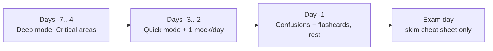

# Revision Hub — votre coach

Ceci est votre **coach de dernière ligne droite**, pas un tas de documents. Dites-lui
combien de temps vous avez ; il vous dit quoi ouvrir.

!!! abstract "Pick a mode (full guide: Revision Modes)"
    - :material-flash: **Quick (5–15 min) :** [Cheat Sheet](cheat-sheet.md) → [Flashcards](flashcards/index.md) → [Easily Confused](confusions.md)
    - :material-book-open-page-variant: **Deep (45–90 min) :** travaillez un [domaine](../roadmap.md) de bout en bout (Deep Dive + exercices)
    - :material-timer: **Exam (90 min) :** le [Mock Exam](mock-exam.md), chronométré, sans notes

    → **[Revision Modes](modes.md)** explique chaque mode en détail.

## Your toolkit

| Outil | À utiliser pour | Quand |
|---|---|---|
| **[Master Cheat Sheet](cheat-sheet.md)** | Rafraîchir les faits à plus fort rendement par domaine | Quick |
| **[Flashcards](flashcards/index.md)** | Rappel actif, 1 179 cartes à révéler d'un tap (+ CSV Anki) | Quick, quotidien |
| **[Chapter Exams](../exams/index.md)** | Examens par domaine (chaque sous-chapitre, du facile au difficile) issus de la banque de 1 179 questions | Deep |
| **[Revision Sheets](sheets/index.md)** | Fiche imprimable d'une page par domaine | Quick, derniers jours |
| **[Easily Confused](confusions.md)** | Éliminer les pièges de quasi-réussite que l'examen adore | Quick, matin de l'examen |
| **[Top Certification Traps](traps.md)** | Les distinctions subtiles, rassemblées par domaine | Quick/Deep |
| **[Memory Aids](memory-aids.md)** | Des moyens mnémotechniques pour les ordres à restituer par cœur | Quick |
| **[Study Planner](study-planner.md)** | Choisir un planning sur 8/4/1 semaine(s) | Planification |
| **[Mock Exams A/B/C](mock-exam.md)** | Trois épreuves de 75 Q / 90 min, pondérées comme l'examen | Exam |
| **[Practice Quiz Bank](quiz.md)** | Dérouler toute la banque avec certificationy-cli | Deep/Exam |

!!! tip "Priority order when time is short"
    Travaillez d'abord les domaines **Critical** : **Architecture, Dependency Injection,
    Security, Messenger**. Voir la [Roadmap](../roadmap.md).

## Jump to a topic-area recap

L'`index.md` de chaque domaine et ses chapitres portent un bloc **Last-minute revision** :

- [PHP & Web Security](../php-web-security/index.md) ·
  [HTTP](../http/index.md) ·
  [Symfony Architecture](../architecture/index.md) ·
  [Dependency Injection](../dependency-injection/index.md) ·
  [Controllers](../controllers/index.md) ·
  [Routing](../routing/index.md) ·
  [Templating (Twig)](../twig/index.md) ·
  [Data Validation](../validation/index.md) ·
  [Forms](../forms/index.md) ·
  [Security](../security/index.md) ·
  [HTTP Caching](../http-caching/index.md) ·
  [Console](../console/index.md) ·
  [Automated Tests](../testing/index.md) ·
  [Miscellaneous](../miscellaneous/index.md)

## Suggested final week

!!! warning "Stop learning new material ~3 days out"
    Dans la dernière ligne droite, faites tourner ces outils selon un rythme de
    répétition espacée qui s'élargit, et refaites les mocks. Aborder de nouveaux
    sujets tard ajoute du stress, pas des points.

---

<small>Related: [Revision Modes](modes.md) · [Master Cheat Sheet](cheat-sheet.md) · [Easily Confused](confusions.md) · [Mock Exam](mock-exam.md) · [Exam Guide](../exam-guide/index.md)</small>

## Official References

- [Certification syllabus](https://certification.symfony.com/exams/symfony.html)
- [Symfony documentation home](https://symfony.com/doc/8.0/)
