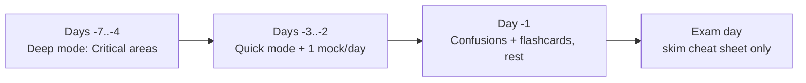

# Revision Hub — Your Coach

This is your **last-mile coach**, not a document dump. Tell it how much time you
have; it tells you what to open.

!!! abstract "Pick a mode (full guide: Revision Modes)"
    - :material-flash: **Quick (5–15 min):** [Cheat Sheet](cheat-sheet.md) → [Flashcards](flashcards/index.md) → [Easily Confused](confusions.md)
    - :material-book-open-page-variant: **Deep (45–90 min):** work a [topic area](../roadmap.md) end-to-end (Deep Dive + exercises)
    - :material-timer: **Exam (90 min):** the [Mock Exam](mock-exam.md), timed, no notes

    → **[Revision Modes](modes.md)** explains each in detail.

## Your toolkit

| Tool | Use it to | When |
|---|---|---|
| **[Master Cheat Sheet](cheat-sheet.md)** | Refresh highest-yield facts per area | Quick |
| **[Flashcards](flashcards/index.md)** | Active recall, 1,179 tap-to-reveal cards (+ Anki CSV) | Quick, daily |
| **[Chapter Exams](../exams/index.md)** | Per-area exams (every subchapter, easy→hard) from the 1,179-question bank | Deep |
| **[Revision Sheets](sheets/index.md)** | Printable one-pager per area | Quick, final days |
| **[Easily Confused](confusions.md)** | Kill the near-miss traps the exam loves | Quick, exam morning |
| **[Top Certification Traps](traps.md)** | The subtle distinctions, gathered per area | Quick/Deep |
| **[Memory Aids](memory-aids.md)** | Mnemonics for orderings you must recall cold | Quick |
| **[Study Planner](study-planner.md)** | Pick an 8/4/1-week schedule | Planning |
| **[Mock Exams A/B/C](mock-exam.md)** | Three 75 Q / 90 min papers, exam-weighted | Exam |
| **[Practice Quiz Bank](quiz.md)** | Run the full bank with certificationy-cli | Deep/Exam |

!!! tip "Priority order when time is short"
    Drill the **Critical** areas first: **Architecture, Dependency Injection,
    Security, Messenger**. See the [Roadmap](../roadmap.md).

## Jump to a topic-area recap

Each area's `index.md` and chapters carry a **Last-minute revision** block:

- [PHP & Web Security](../php-web-security/index.md) ·
  [HTTP](../http/index.md) ·
  [Symfony Architecture](../architecture/index.md) ·
  [Dependency Injection](../dependency-injection/index.md) ·
  [Controllers](../controllers/index.md) ·
  [Routing](../routing/index.md) ·
  [Templating (Twig)](../twig/index.md) ·
  [Data Validation](../validation/index.md) ·
  [Forms](../forms/index.md) ·
  [Security](../security/index.md) ·
  [HTTP Caching](../http-caching/index.md) ·
  [Console](../console/index.md) ·
  [Automated Tests](../testing/index.md) ·
  [Miscellaneous](../miscellaneous/index.md)

## Suggested final week

!!! warning "Stop learning new material ~3 days out"
    In the final stretch, cycle these tools on a widening spaced-repetition
    schedule and re-run mocks. New topics late add stress, not marks.

---

<small>Related: [Revision Modes](modes.md) · [Master Cheat Sheet](cheat-sheet.md) · [Easily Confused](confusions.md) · [Mock Exam](mock-exam.md) · [Exam Guide](../exam-guide/index.md)</small>

## Official References

- [Certification syllabus](https://certification.symfony.com/exams/symfony.html)
- [Symfony documentation home](https://symfony.com/doc/8.0/)
