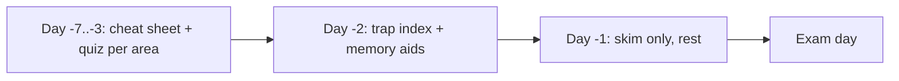

# Revision Hub

Your last-mile toolkit. When you have worked through the topic areas, this hub is
where you consolidate: glanceable cheat sheets, the cross-area trap index, memory
devices for the orderings you must recall, and the practice quiz bank.

!!! abstract "Use this in the final stretch"
    Stop reading new material a few days before the exam. Cycle through these four
    pages instead, on a widening spaced-repetition schedule, and re-run the quiz.

## The four pages

- **[Master Cheat Sheet](cheat-sheet.md)** — the highest-yield facts across all 14
  topic areas, condensed to fit on a phone screen. Links out to each area index.
- **[Top Certification Traps](traps.md)** — the subtle distinctions the exam loves,
  gathered from every area.
- **[Memory Aids](memory-aids.md)** — mnemonics for the orderings and enumerations
  you must recall cold (kernel events, status classes, cache directives, badges).
- **[Practice Quiz Bank](quiz.md)** — how to run the `quiz/` YAML bank with
  certificationy-cli, and how questions map to chapters.

## Topic-area cheat sheets

Each area's own `index.md` and its chapters carry a **Last-minute revision** block.
Jump straight to an area to refresh it:

- [PHP & Web Security](../php-web-security/index.md)
- [HTTP](../http/index.md)
- [Symfony Architecture](../architecture/index.md)
- [Dependency Injection](../dependency-injection/index.md)
- [Controllers](../controllers/index.md)
- [Routing](../routing/index.md)
- [Templating (Twig)](../twig/index.md)
- [Data Validation](../validation/index.md)
- [Forms](../forms/index.md)
- [Security](../security/index.md)
- [HTTP Caching](../http-caching/index.md)
- [Console](../console/index.md)
- [Automated Tests](../testing/index.md)
- [Miscellaneous](../miscellaneous/index.md)

## Suggested final-week plan

!!! tip "Priority order"
    If time is short, drill the **Critical** areas first: **Architecture,
    Dependency Injection, Security, Messenger**. See the [Roadmap](../roadmap.md).

---

<small>Related: [Master Cheat Sheet](cheat-sheet.md) · [Top Certification Traps](traps.md) · [Exam Guide](../exam-guide/index.md)</small>

## Official References

- [Certification syllabus](https://certification.symfony.com/exams/symfony.html)
- [Symfony documentation home](https://symfony.com/doc/current/)
