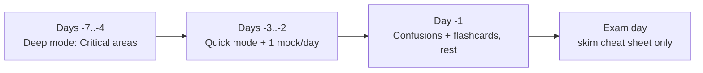

# Modes de révision

Choisissez le mode qui correspond au temps dont vous disposez maintenant. Même contenu, trois vitesses.
C'est votre coach qui vous dit *quoi ouvrir* — pas un mur de texte de plus.

!!! abstract "TL;DR"
    - **Quick (5–15 min) :** cheat sheet → flashcards → confusions.
    - **Deep (45–90 min) :** travaillez un domaine de bout en bout.
    - **Exam (90 min) :** mock exam chronométré, sans notes.

## :material-flash: Quick mode — commute / coffee break

Vous avez quelques minutes et votre téléphone. Objectif : **rafraîchir + s'auto-tester**, pas apprendre du nouveau.

1. Ouvrez la **[Master Cheat Sheet](cheat-sheet.md)** pour un domaine (tapez sur le lien du domaine).
2. Travaillez les **[Flashcards](flashcards/index.md)** de ce domaine — répondez dans votre tête, tapez pour révéler.
3. Parcourez les lignes d'**[Easily Confused](confusions.md)** pour ce domaine.

> **Why:** des rafales courtes, répétées, en rappel actif battent une longue relecture
> passive. C'est de la répétition espacée en doses de 10 minutes.

## :material-book-open-page-variant: Deep mode — a real study block

Vous avez 45–90 minutes de concentration. Objectif : **comprendre les rouages internes**, pas seulement les faits.

1. Lisez l'**index** du domaine (prérequis, difficulté, priorité).
2. Travaillez chaque micro-chapitre : Theory → **Deep Dive** → pièges → **faites les exercices**.
3. Terminez avec les flashcards du domaine et les **certification questions** du chapitre.

> **Why:** les questions de niveau Expert testent le *pourquoi/comment en interne*. Le Deep Dive
> + les exercices construisent le modèle mental qui vous permet de raisonner face à des
> formulations de questions inédites.

## :material-timer: Exam mode — simulate the real thing

Vous avez 90 minutes sans interruption. Objectif : **timing + endurance sous pression**.

1. Lancez le **[Mock Exam](mock-exam.md)**. Réglez un minuteur de 90 minutes.
2. **72 secondes/question.** Marquez les questions difficiles, avancez, revenez-y à la fin.
3. Ne révélez les corrigés qu'après. Notez chaque erreur → travaillez ces flashcards demain.

> **Why:** l'examen, c'est 75 Q en 90 min. Le manque de temps fait échouer plus de candidats
> que la méconnaissance de la matière. Entraînez le chrono, pas seulement le contenu.

## Suggested final week

!!! tip "If you only have one day"
    Passez en Quick mode sur les domaines **Critical** (Architecture, DI, Security, Messenger),
    faites **un** mock exam, puis travaillez chaque question ratée.

---

<small>Related: [Revision Hub](index.md) · [Cheat Sheet](cheat-sheet.md) · [Mock Exam](mock-exam.md) · [Exam Strategy](../exam-guide/strategy.md)</small>

## 🧠 Pour les nuls

**C'est quoi ?** Une page qui décrit **trois façons de réviser** (Quick, Deep, Exam), chacune adaptée à une durée disponible différente, avec pour chacune la liste précise des outils à utiliser et dans quel ordre.

**Pourquoi ça existe ?** Réviser "au hasard" gaspille du temps : ouvrir un mock exam de 90 minutes pendant une pause de 10 minutes, ou relire un chapitre entier la veille de l'examen, sont deux erreurs classiques que ce guide évite en associant clairement une durée à une méthode.

**🏠 Analogie de la vraie vie :** C'est un **plan d'entraînement sportif** qui propose trois séances différentes selon le temps disponible : un échauffement de 10 minutes, une séance complète d'une heure, ou une compétition chronométrée — jamais la même séance quel que soit le temps qu'on a.

**Symfony dans la vraie vie :** Mode Quick → fiche + flashcards + confusions, pour rafraîchir sans apprendre de nouveau / Mode Deep → un domaine entier travaillé en profondeur (théorie → Deep Dive → exercices) / Mode Exam → mock exam chronométré, conditions réelles.

**⚠️ Erreur fréquente :** Rester en permanence en mode Quick (facile et confortable) sans jamais passer en mode Deep — on a l'impression de progresser (on répète des faits déjà sus) sans construire de compréhension nouvelle.

**🧠 Comment le mémoriser :** *« Quick pour rafraîchir, Deep pour apprendre, Exam pour vérifier »* — les trois sont nécessaires, aucun ne remplace les deux autres.

## Official References

- [Certification syllabus](https://certification.symfony.com/exams/symfony.html)
- [Symfony documentation home](https://symfony.com/doc/8.0/)
