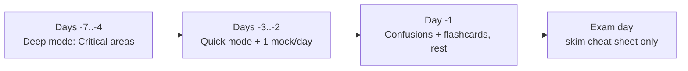

# Revision Modes

Pick the mode that matches the time you have right now. Same content, three speeds.
This is your coach telling you *what to open* — not another wall of text.

!!! abstract "TL;DR"
    - **Quick (5–15 min):** cheat sheet → flashcards → confusions.
    - **Deep (45–90 min):** work one topic area end-to-end.
    - **Exam (90 min):** timed mock exam, no notes.

## 🧠 Pour les nuls

**C'est quoi ?** Une page qui décrit **trois façons de réviser** (Quick, Deep, Exam), chacune adaptée à une durée disponible différente, avec pour chacune la liste précise des outils à utiliser et dans quel ordre.

**Pourquoi ça existe ?** Réviser "au hasard" gaspille du temps : ouvrir un mock exam de 90 minutes pendant une pause de 10 minutes, ou relire un chapitre entier la veille de l'examen, sont deux erreurs classiques que ce guide évite en associant clairement une durée à une méthode.

**🏠 Analogie de la vraie vie :** C'est un **plan d'entraînement sportif** qui propose trois séances différentes selon le temps disponible : un échauffement de 10 minutes, une séance complète d'une heure, ou une compétition chronométrée — jamais la même séance quel que soit le temps qu'on a.

**Symfony dans la vraie vie :** Mode Quick → fiche + flashcards + confusions, pour rafraîchir sans apprendre de nouveau / Mode Deep → un domaine entier travaillé en profondeur (théorie → Deep Dive → exercices) / Mode Exam → mock exam chronométré, conditions réelles.

**⚠️ Erreur fréquente :** Rester en permanence en mode Quick (facile et confortable) sans jamais passer en mode Deep — on a l'impression de progresser (on répète des faits déjà sus) sans construire de compréhension nouvelle.

**🧠 Comment le mémoriser :** *« Quick pour rafraîchir, Deep pour apprendre, Exam pour vérifier »* — les trois sont nécessaires, aucun ne remplace les deux autres.

## :material-flash: Quick mode — commute / coffee break

You have a few minutes and your phone. Goal: **refresh + self-test**, not learn new.

1. Open the **[Master Cheat Sheet](cheat-sheet.md)** for one area (tap the area link).
2. Drill that area's **[Flashcards](flashcards/index.md)** — answer in your head, tap to reveal.
3. Skim the **[Easily Confused](confusions.md)** rows for that area.

> **Why:** short, repeated, active-recall bursts beat long passive re-reading. This
> is spaced repetition in 10-minute doses.

## :material-book-open-page-variant: Deep mode — a real study block

You have 45–90 focused minutes. Goal: **understand internals**, not just facts.

1. Read the topic-area **index** (prerequisites, difficulty, priority).
2. Work each micro-chapter: Theory → **Deep Dive** → traps → **do the exercises**.
3. Finish with that area's flashcards and the chapter **certification questions**.

> **Why:** Expert-level questions test *why/how internally*. The Deep Dive + exercises
> build the model that lets you reason about unfamiliar question phrasings.

## :material-timer: Exam mode — simulate the real thing

You have 90 uninterrupted minutes. Goal: **timing + stamina under pressure**.

1. Start the **[Mock Exam](mock-exam.md)**. Set a 90-minute timer.
2. **72 seconds/question.** Flag the hard ones, keep moving, return at the end.
3. Only then reveal the answer keys. Log every miss → drill those flashcards tomorrow.

> **Why:** the exam is 75 Q in 90 min. Running out of time fails more candidates than
> not knowing the material. Practise the clock, not just the content.

## Suggested final week

!!! tip "If you only have one day"
    Quick-mode the **Critical** areas (Architecture, DI, Security, Messenger), do
    **one** mock exam, then drill every question you missed.

---

<small>Related: [Revision Hub](index.md) · [Cheat Sheet](cheat-sheet.md) · [Mock Exam](mock-exam.md) · [Exam Strategy](../exam-guide/strategy.md)</small>

## Official References

- [Certification syllabus](https://certification.symfony.com/exams/symfony.html)
- [Symfony documentation home](https://symfony.com/doc/8.0/)
