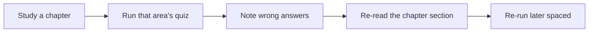

# Practice Quiz Bank

The platform ships a **machine-readable question bank** under `quiz/`, one YAML file
per topic area. It is compatible with
[certificationy-cli](https://github.com/certificationy/certificationy-cli), so you
can self-test in the terminal and repeat it as often as you like.

!!! abstract "What the quiz is (and isn't)"
    - **Is:** educational practice questions, mapped to chapters, with an
      `explanation` and a `documentation` link on every question.
    - **Isn't:** leaked or brain-dumped exam items. Questions teach the distinctions
      the exam tests; they are not the exam.

## Where the questions live

```text
quiz/
├── README.md            # schema + rules
├── php-web-security.yml
├── http.yml
├── architecture.yml
├── controllers.yml
├── routing.yml
├── twig.yml
├── forms.yml
├── validation.yml
├── dependency-injection.yml
├── security.yml
├── http-caching.yml
├── console.yml
├── testing.yml
└── miscellaneous.yml
```

Each file groups questions under its topic-area **category name**. Every chapter
contributes **3–6 questions**, so the bank grows in lock-step with the content.

## How questions map to chapters

- One `quiz/<area>.yml` per topic area (same stem as the `docs/<area>/` folder).
- Within a file, questions are authored **per chapter** and grouped under the area
  `name`. A question's `documentation` link points to the official docs page for the
  sub-topic it tests, mirroring the chapter's own references.
- Question types match the exam: **single choice** (one `correct: true`),
  **multiple choice** (several `correct: true`), and **true/false** (two answers).

## Run it locally

```console
$ composer global require certificationy/certificationy-cli
$ certificationy start
```

Point the CLI at this repository's `quiz/` directory via its configuration, then
answer interactively. Re-run it across study sessions to track which areas still
trip you up — this is your spaced-repetition self-test.

## The schema (certificationy-compatible)

```yaml
categories:
  - name: "Dependency Injection"
    questions:
      - question: "Which attribute registers a compiler pass? (choose one)"
        answers:
          - value: "None — register it in Kernel/bundle build()"
            correct: true
          - value: "#[CompilerPass]"
            correct: false
          - value: "#[AsCompilerPass]"
            correct: false
        explanation: >-
          Compiler passes are registered programmatically via
          ContainerBuilder::addCompilerPass(), typically in Kernel::build()
          or a bundle's build() method. There is no core attribute for this.
        # folded scalar keeps the single-line URL within 80 columns
        documentation: >-
          https://symfony.com/doc/8.0/service_container/compiler_passes.html
```

!!! info "Authoring rules (see `quiz/README.md`)"
    - `correct: true` on **one or more** answers (multiple choice supported).
    - **Every** question must have an `explanation` and a `documentation` URL.
    - True/false uses two answers (`"True"` / `"False"`).
    - **Symfony 8 / PHP 8.4 only** — no deprecated APIs in stems or options.
    - 3–6 questions per chapter, grouped under the area `name`.

## How to practise with it



1. Finish a chapter (or area), then run the matching quiz.
2. For every miss, **read the `explanation` and the linked docs** — the explanation
   is the lesson, not just the verdict.
3. Re-run the area a few days later; the goal is consistent correctness, not a single
   good run.

!!! tip "Final week"
    Run the **Critical** areas most often — Architecture, Dependency Injection,
    Security, and Messenger (in [Miscellaneous](../miscellaneous/index.md)). Pair the
    quiz with the [trap index](traps.md) and [memory aids](memory-aids.md).

---

<small>Related: [Revision Hub](index.md) · [Master Cheat Sheet](cheat-sheet.md) · [How to Use This Platform](../exam-guide/how-to-use.md)</small>

## Official References

- [Certification syllabus](https://certification.symfony.com/exams/symfony.html)
- [Symfony documentation home](https://symfony.com/doc/8.0/)
