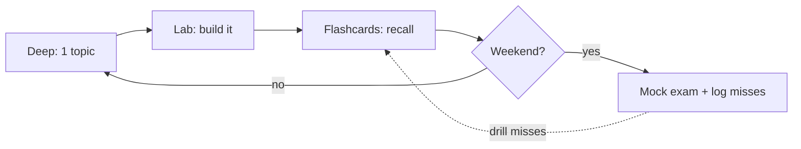

# Planificateur de révisions

Choisissez le plan qui correspond au temps qu'il vous reste. Chacun suit l'ordre
de dépendances de la [Roadmap](../roadmap.md) et place en tête les domaines **Critical**
(Architecture, Dependency Injection, Security, Messenger).

!!! abstract "Whichever plan you pick"
    - **Deep mode** pour le premier contact (théorie → Deep Dive → exercices → lab).
    - **Quick mode** au quotidien (flashcards + [Easily Confused](confusions.md)).
    - Un **[Mock Exam](mock-exam.md)** par week-end ; notez les erreurs et retravaillez-les.

## :material-calendar-week: 8 weeks (comfortable, ~1h/day)

| Semaine | Focus (Deep mode) | Quick mode quotidien |
|---|---|---|
| 1 | PHP & Web Security · HTTP | flashcards du domaine de la semaine |
| 2 | **Architecture** (kernel, events, BC) | + semaine précédente |
| 3 | **Dependency Injection** | + Architecture |
| 4 | Controllers · Routing | + DI |
| 5 | Twig · Validation | + Controllers/Routing |
| 6 | Forms · **Security** | + Validation |
| 7 | HTTP Caching · Console · Testing | + Security |
| 8 | **Miscellaneous (Messenger ★)** + révision | Mocks A/B/C, retravailler les erreurs |

## :material-calendar-range: 4 weeks (focused, ~2h/day)

| Semaine | Focus | Week-end |
|---|---|---|
| 1 | Fondations + **Architecture** + **DI** | Mock A |
| 2 | Controllers · Routing · Twig | Mock B |
| 3 | Validation · Forms · **Security** | retravailler le lab Security + les voters |
| 4 | Caching · Console · Testing · **Messenger** + Revision Hub | Mock C + erreurs |

## :material-calendar-today: 1 week (crunch, ~4h/day)

| Jour | Plan |
|---|---|
| 1 | Architecture + DI (Deep mode sur le cycle de vie de la request, le container, les compiler passes) |
| 2 | Security de bout en bout (firewall → authenticator → voters) + lab |
| 3 | Controllers · Routing · Twig (Quick mode + pièges) |
| 4 | Forms · Validation (data transformers, group sequence) |
| 5 | Messenger + Serializer/Cache + HTTP Caching |
| 6 | Console · Testing + **Mock A**, retravailler chaque erreur |
| 7 | [Easily Confused](confusions.md) + [Cheat Sheet](cheat-sheet.md) + **Mock B** ; repos |

## The daily loop (any plan)

!!! tip "Track your misses"
    Tenez une courte liste de chaque question ratée. Cette liste *est* votre plan de
    révision des derniers jours — ne retestez que celles-là jusqu'à ce qu'elles
    deviennent automatiques.

---

<small>Related: [Roadmap](../roadmap.md) · [Revision Modes](modes.md) · [Mock Exam](mock-exam.md)</small>

## Official References

- [Certification syllabus](https://certification.symfony.com/exams/symfony.html)
- [Symfony documentation home](https://symfony.com/doc/8.0/)
