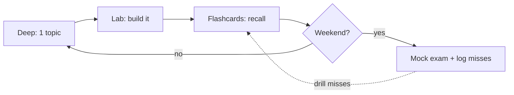

# Study Planner

Pick the plan that matches how long you have. Each is built from the
[Roadmap](../roadmap.md) dependency order and front-loads the **Critical** areas
(Architecture, Dependency Injection, Security, Messenger).

!!! abstract "Whichever plan you pick"
    - **Deep mode** for first contact (theory → Deep Dive → exercises → lab).
    - **Quick mode** daily (flashcards + [Easily Confused](confusions.md)).
    - One **[Mock Exam](mock-exam.md)** per weekend; log misses and drill them.

## :material-calendar-week: 8 weeks (comfortable, ~1h/day)

| Week | Focus (Deep mode) | Daily Quick mode |
|---|---|---|
| 1 | PHP & Web Security · HTTP | flashcards of the week's area |
| 2 | **Architecture** (kernel, events, BC) | + prior week |
| 3 | **Dependency Injection** | + Architecture |
| 4 | Controllers · Routing | + DI |
| 5 | Twig · Validation | + Controllers/Routing |
| 6 | Forms · **Security** | + Validation |
| 7 | HTTP Caching · Console · Testing | + Security |
| 8 | **Miscellaneous (Messenger ★)** + revision | Mock A/B/C, drill misses |

## :material-calendar-range: 4 weeks (focused, ~2h/day)

| Week | Focus | Weekend |
|---|---|---|
| 1 | Foundations + **Architecture** + **DI** | Mock A |
| 2 | Controllers · Routing · Twig | Mock B |
| 3 | Validation · Forms · **Security** | drill Security lab + voters |
| 4 | Caching · Console · Testing · **Messenger** + Revision Hub | Mock C + misses |

## :material-calendar-today: 1 week (crunch, ~4h/day)

| Day | Plan |
|---|---|
| 1 | Architecture + DI (Deep mode on request lifecycle, container, compiler passes) |
| 2 | Security end-to-end (firewall → authenticator → voters) + lab |
| 3 | Controllers · Routing · Twig (Quick mode + traps) |
| 4 | Forms · Validation (data transformers, group sequence) |
| 5 | Messenger + Serializer/Cache + HTTP Caching |
| 6 | Console · Testing + **Mock A**, drill every miss |
| 7 | [Easily Confused](confusions.md) + [Cheat Sheet](cheat-sheet.md) + **Mock B**; rest |

## The daily loop (any plan)

!!! tip "Track your misses"
    Keep a short list of every question you get wrong. That list *is* your revision
    plan for the final days — re-test only those until they're automatic.

---

<small>Related: [Roadmap](../roadmap.md) · [Revision Modes](modes.md) · [Mock Exam](mock-exam.md)</small>

## Official References

- [Certification syllabus](https://certification.symfony.com/exams/symfony.html)
- [Symfony documentation home](https://symfony.com/doc/current/)
