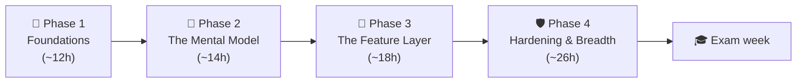
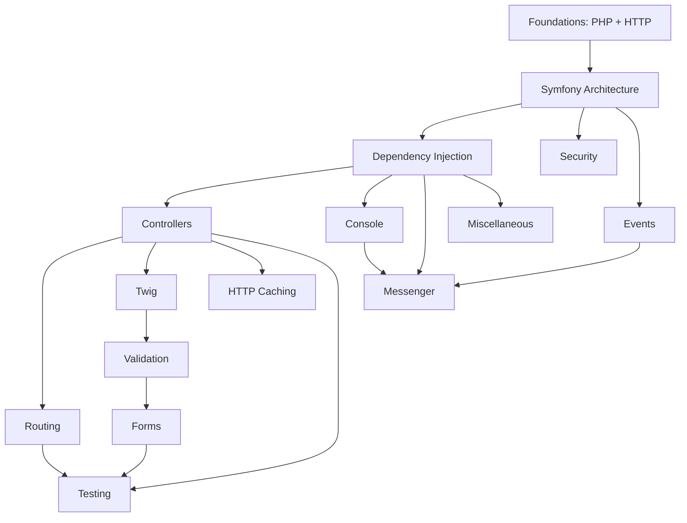

# Feuille de route d'apprentissage

Voici l'**ordre d'étude optimisé** — délibérément *différent* de l'ordre du syllabus.
Il enseigne d'abord le modèle mental (comment une request devient une response,
comment le container est construit), puis empile les fonctionnalités par-dessus, de
sorte qu'aucun concept n'est utilisé avant d'avoir été enseigné.

!!! abstract "How to read this"
    Les 15 domaines sont regroupés en **4 phases**. Travaillez phase par phase ; à
    l'intérieur d'une phase, suivez les numéros d'étape. Chaque étape utilise la même
    [boucle d'étude](#the-study-loop-same-for-every-stage), et chaque phase se termine
    par un **checkpoint** — un jalon mesurable qui vous dit s'il faut avancer ou
    revenir en arrière. La difficulté va de ★ (facile) à ★★★ (difficile) ; la
    **priorité de révision** indique ce qu'il faut réviser en dernière minute.

## The four phases at a glance

| Phase | Étapes | Thème | Vous avez terminé quand… |
|---|---|---|---|
| 🧱 **1. Foundations** | 1–2 | Le langage + le protocole | Vous savez raconter une requête HTTP sans Symfony |
| 🧠 **2. The Mental Model** | 3–4 | Kernel, events, container | Vous savez expliquer `HttpKernel::handle()` de mémoire |
| 🧩 **3. The Feature Layer** | 5–9 | Controllers → Forms | Vous savez construire et valider un form de bout en bout sur papier |
| 🛡 **4. Hardening & Breadth** | 10–15 | Sécurité, cache, Messenger, tests, composants | Vous réussissez un mock complet en conditions d'examen |

## The study loop (same for every stage)

!!! tip "One stage = one loop. Never skip step 5."
    1. **Survolez** la page d'index du domaine + le *In a nutshell* de chaque
       chapitre (10 min) — construisez la carte avant le territoire.
    2. **Lisez** chaque chapitre de bout en bout ; faites les encadrés *Predict first*
       **avant** de révéler ; recopiez à la main un exemple de code par chapitre.
    3. **Entraînez-vous** sur les *Certification questions* + *Exercises* du chapitre.
    4. **Testez-vous** : [Exam Simulator](exam-simulator.md) en mode Practice, filtré
       sur ce sujet, 15–20 questions.
    5. **Espacez** : relisez uniquement les blocs de synthèse *Last-minute revision* à
       **J+1**, **J+3** et **J+7** (5 min chacun). C'est cela qui ancre la mémoire.

!!! example "Real-world analogy"
    Le bachotage, c'est remplir une baignoire avec la bonde ouverte — impressionnant
    tant que le robinet coule, vide au matin. Les relectures J+1 / J+3 / J+7 sont de
    petits tours de robinet qui maintiennent le niveau pour une fraction de l'effort.

## Dependency graph

Chaque flèche ici est un **prérequis réel et déclaré** — extrait des métadonnées
`index.md` propres à chaque domaine (`Prerequisites:` / `Dependencies:`), pas
deviné. Deux de ces flèches corrigent un défaut de l'ancienne navigation
principale du site, qui avait dérivé et n'était plus synchronisée avec ce
graphe : Dependency Injection apparaissait auparavant *après* Controllers/Twig/
Forms dans le menu alors que ces chapitres citent explicitement Dependency
Injection comme prérequis, et Forms apparaissait *avant* Validation alors que le
chapitre Forms cite Validation comme prérequis. Les deux sont désormais corrigés
dans la navigation pour correspondre à ce graphe.

---

## 🧠 Pour les nuls

**C'est quoi cette page ?** L'ordre d'étude recommandé pour les 15 domaines — pas dans l'ordre alphabétique de la navigation, mais dans l'ordre où chaque concept s'appuie sur le précédent.

**Pourquoi ça existe ?** Étudier la Sécurité avant l'Injection de Dépendances serait comme apprendre à conduire avant de savoir ce qu'est une pédale — la Sécurité s'appuie directement sur des concepts enseignés avant elle dans ce parcours.

**🏠 Analogie de la vraie vie :** Un GPS qui calcule le meilleur itinéraire plutôt que de te laisser deviner ton chemin sur une carte routière complète — le Roadmap fait ce travail pour ton apprentissage.

**Symfony dans la vraie vie :** Les 15 domaines sont groupés en 4 phases (Fondations → Modèle mental → Couche fonctionnelle → Renforcement) — chaque phase se termine par un "checkpoint" qui vérifie que tu es prêt avant de continuer.

**⚠️ Erreur fréquente :** suivre la navigation de gauche (ordre alphabétique) au lieu de ce Roadmap — l'ordre alphabétique ignore complètement les prérequis réels entre domaines.

**🧠 Comment le mémoriser :** "Le Roadmap, c'est le GPS de ta révision — suis-le plutôt que de deviner ton propre chemin."

## 🧱 Phase 1 — Foundations (stages 1–2, ~8–10 h)

*Objectif : être capable de décrire ce qui se passe entre la saisie d'une URL et
l'affichage d'une page, sans aucun framework.*

| # | Étape | Pourquoi ici | Prérequis | Difficulté | Temps estimé | Priorité de révision |
|---|---|---|---|---|---|---|
| 1 | [PHP & Web Security](php-web-security/index.md) | Socle du langage (PHP 8.4) + modèle de menaces sur lequel tout repose | — | ★★☆ | 4–6 h | Haute |
| 2 | [HTTP](http/index.md) | Modèle mental request/response ; fondation de HttpFoundation | 1 | ★★☆ | 3–4 h | Haute |

- [ ] Boucle de l'étape 1 terminée (+ J+1/J+3/J+7 planifiés)
- [ ] Boucle de l'étape 2 terminée (+ J+1/J+3/J+7 planifiés)

!!! success "Checkpoint 1 — gate to Phase 2"
    Simulator, mode Practice, sujets *PHP & Web Security* + *HTTP*, 20 questions :
    **score ≥ 70 %**. En dessous, retravaillez les mauvaises réponses (l'écran de
    revue les trie en premier), puis retentez avec 20 nouvelles questions.

## 🧠 Phase 2 — The Mental Model (stages 3–4, ~11–15 h)

*Objectif : intérioriser les deux machines sur lesquelles tout le reste se branche —
le kernel piloté par les events et le container compilé. C'est la phase au meilleur
rendement pour l'examen.*

| # | Étape | Pourquoi ici | Prérequis | Difficulté | Temps estimé | Priorité de révision |
|---|---|---|---|---|---|---|
| 3 | [Symfony Architecture](architecture/index.md) | Kernel, events, cycle de vie de la request — le modèle mental central | 2 | ★★★ | 5–7 h | **Critical** |
| 4 | [Dependency Injection](dependency-injection/index.md) | La colonne vertébrale ; nécessaire à tous les autres composants | 3 | ★★★ | 6–8 h | **Critical** |

**Compléments de la phase 2 (Expert) :** après l'étape 3, lisez le
[HttpKernel::handle() tour](tours/httpkernel-handle.md) ; après l'étape 4, le
[chapitre Compiled Container](dependency-injection/container-dump.md) et la
[section kernel-events de l'Execution-Order Codex](revision/execution-order-codex.md).

- [ ] Boucle de l'étape 3 terminée · [ ] Kernel tour lu
- [ ] Boucle de l'étape 4 terminée · [ ] Codex §kernel events révisé

!!! success "Checkpoint 2 — gate to Phase 3"
    Deux tests : (a) Simulator sur *Architecture* + *Dependency Injection*, 20 Q,
    **≥ 70 %** ; (b) le test du tableau blanc — dessinez de mémoire la séquence des
    kernel events (request → … → terminate) et vérifiez-la avec le
    [Codex](revision/execution-order-codex.md). Les deux doivent être réussis.

## 🧩 Phase 3 — The Feature Layer (stages 5–9, ~17–22 h)

*Objectif : le chemin de requête du quotidien — un controller en entrée, une
response rendue/validée en sortie. Chaque étape s'appuie directement sur la
précédente ; respectez l'ordre.*

| # | Étape | Pourquoi ici | Prérequis | Difficulté | Temps estimé | Priorité de révision |
|---|---|---|---|---|---|---|
| 5 | [Controllers](controllers/index.md) | Première couche fonctionnelle, une fois le cycle de vie + la DI clairs | 3,4 | ★★☆ | 3–4 h | Haute |
| 6 | [Routing](routing/index.md) | Va de pair avec les controllers ; mécanismes internes du matcher/generator | 5 | ★★☆ | 3–4 h | Haute |
| 7 | [Templating (Twig)](twig/index.md) | Couche de présentation au-dessus des controllers | 5 | ★★☆ | 3–4 h | Moyenne |
| 8 | [Data Validation](validation/index.md) | Modèle constraint/validator ; prérequis des Forms | 4 | ★★☆ | 3–4 h | Moyenne |
| 9 | [Forms](forms/index.md) | Compose Twig + Validation + DI + events | 7,8 | ★★★ | 5–6 h | Haute |

**Compléments de la phase 3 (Expert) :** l'
[ArgumentResolver tour](tours/argument-resolver.md) après l'étape 5 ; le
[Form's-life tour](tours/form-lifecycle.md) après l'étape 9 — l'ordre des form
events (PRE_SET_DATA → … → POST_SUBMIT) est un thème d'examen garanti.

- [ ] 5 · [ ] 6 · [ ] 7 · [ ] 8 · [ ] 9 — boucles terminées
- [ ] Les deux tours lus · [ ] [Chapter Exams](exams/index.md) des étapes 5–9 réussis

!!! success "Checkpoint 3 — gate to Phase 4"
    Simulator, 30 questions réparties sur les cinq sujets de la phase 3 : **≥ 70 %**,
    et le [Forms chapter exam](exams/forms.md) avec au plus 2 erreurs. Les Forms sont
    l'endroit où se cachent les points isolés — n'emportez pas de faiblesses en
    phase 4.

## 🛡 Phase 4 — Hardening & Breadth (stages 10–15, ~24–32 h)

*Objectif : le bloc sécurité, à fort coefficient, puis l'étendue. La sécurité à elle
seule justifie son étiquette Critical — prévoyez-lui un vrai budget de temps.
Messenger obtient sa propre étape (détachée de Miscellaneous) car il est
individuellement **Critical/davantage pondéré** et ses vrais prérequis (Console,
Events) sont acquis juste après l'étape 12 — rien ne justifie de le repousser
derrière les étapes Testing/Miscellaneous, moins prioritaires.*

| # | Étape | Pourquoi ici | Prérequis | Difficulté | Temps estimé | Priorité de révision |
|---|---|---|---|---|---|---|
| 10 | [Security](security/index.md) | Firewalls, authenticators, voters — s'appuie sur les events + la DI + HTTP | 3,4 | ★★★ | 6–8 h | **Critical** |
| 11 | [HTTP Caching](http-caching/index.md) | Prolonge HTTP/response ; ESI, reverse proxy | 2,5 | ★★☆ | 2–3 h | Moyenne (pondération réduite) |
| 12 | [Console](console/index.md) | Largement autonome ; input/output/events | 4 | ★☆☆ | 2–3 h | Moyenne |
| 13 | [Messenger](messenger/index.md) | Messagerie asynchrone ; nécessite DI + Console + Events | 4,12,3 | ★★★ | 4–5 h | **Critical** (davantage pondéré) |
| 14 | [Automated Tests](testing/index.md) | Testez ce que vous savez désormais construire | 5,6,9 | ★★☆ | 3–4 h | Moyenne |
| 15 | [Miscellaneous](miscellaneous/index.md) | Composants avancés restants (Cache, Serializer, Mailer, Lock…) | 3,4 | ★★☆ | 5–7 h | Moyenne |

**Compléments de la phase 4 (Expert) :** le
[Firewall tour](tours/firewall-request-cycle.md) plus les cinq chapitres de sécurité
de niveau expert ([role hierarchy](security/role-hierarchy.md),
[decision strategies](security/access-decision-strategies.md),
[impersonation](security/impersonation.md),
[throttling](security/login-throttling.md),
[programmatic login](security/programmatic-login.md)) après l'étape 10.

- [ ] 10 · [ ] 11 · [ ] 12 · [ ] 13 · [ ] 14 · [ ] 15 — boucles terminées
- [ ] Firewall tour + chapitres de sécurité expert lus

!!! success "Checkpoint 4 — gate to exam week"
    Un **mock exam complet** dans le [Simulator](exam-simulator.md) (mode Exam :
    75 Q, 90 min, réponses masquées) avec un score **≥ 75 %** — la marge de 10 points
    au-dessus du seuil de réussite absorbe le stress du jour J. Sous 75 % ? La
    ventilation par sujet vous indique vers quelle phase revenir ; utilisez
    **Drill my weaknesses** chaque jour jusqu'à ce que ça passe.

---

## 🎓 Exam week — the 7-day countdown

| Jour | À faire | Temps |
|---|---|---|
| J-7 | Mock complet ([Mock Exam A](revision/mock-exam.md) ou mode Exam du Simulator) → notez les domaines faibles | 2 h |
| J-6 | **Drill my weaknesses** dans le Simulator + relecture des blocs de synthèse de ces domaines | 1–2 h |
| J-5 | [Execution-Order Codex](revision/execution-order-codex.md) — les 10 séquences de mémoire | 1 h |
| J-4 | [Edge-Case Drills](revision/edge-cases.md) — répondez à voix haute avant de révéler | 1–2 h |
| J-3 | Deuxième mock complet ([Mock B](revision/mock-exam-b.md)) → devrait battre le score de J-7 | 2 h |
| J-2 | [Top Traps](revision/traps.md) + [Easily Confused](revision/confusions.md) + [Flashcards](revision/flashcards/index.md) sur les domaines Critical | 1–2 h |
| J-1 | **Léger uniquement** : [Master Cheat Sheet](revision/cheat-sheet.md) + [Memory Aids](revision/memory-aids.md). Aucun contenu nouveau. Dormez. | 45 min |

!!! tip "Exam format reminder"
    Chaque question est **à sélection uniquement** — vrai/faux, réponse unique ou
    choix multiple. Vous n'écrivez jamais de texte ni de code. Le choix multiple est
    noté en tout-ou-rien, et le rythme est d'environ 72 secondes par question — deux
    choses que le mode Exam du Simulator entraîne précisément.

**Total :** environ 57–78 heures d'étude concentrée pour le niveau Expert.

## Practice & self-assessment

Étudier n'est que la moitié de la boucle — testez-vous au fur et à mesure. La
plateforme fournit une chaîne d'entraînement complète sur une **banque de
1 292 questions** couvrant les 157 sous-sujets :

| Outil | À utiliser pour | Quand |
|---|---|---|
| [Exam Simulator](exam-simulator.md) — **mode Practice** | Retour immédiat + explications, filtré par sujet/difficulté | Étape 4 de chaque boucle d'étude |
| [Exam Simulator](exam-simulator.md) — **mode Exam** | Le vrai format d'examen : 75 questions, 90 min, réponses masquées, rapport noté | Checkpoint 4 + semaine d'examen |
| **Drill my weaknesses** (Simulator) | Session construite automatiquement à partir de vos sujets suivis les plus faibles | Dès qu'un checkpoint échoue |
| [Chapter Exams](exams/index.md) | Séries fixes par domaine pour confirmer qu'un sujet est solide | Fin de chaque étape |
| [Mock Exams A/B/C](revision/mock-exam.md) | Répétitions générales grandeur nature avant le vrai jour | Semaine d'examen (J-7, J-3) |
| [Source Tours](tours/index.md) | Lire les véritables mécanismes internes — profondeur de niveau Expert | Compléments de phase |
| [Revision Hub](revision/index.md) | Cheat sheets, pièges, codex, cas limites, flashcards, planner | Relectures J+1/J+3/J+7 & semaine d'examen |

## Revision priority legend

- **Critical** — fortement testé ; à revoir en dernière minute : **Architecture,
  Dependency Injection, Security, Messenger**.
- **Haute / Moyenne** — proportionnel au poids dans l'examen. HTTP Caching est
  *Moyenne* du fait de sa pondération réduite dans l'examen Symfony 8.

## Two tracks

=== "Advanced track"

    Étapes 1–15, avec l'accent sur l'**usage correct** : configuration, flux
    courants et erreurs à éviter. Lisez attentivement les sections Theory, Code et
    Traps ; survolez les Deep Dives et les « compléments » de phase.

=== "Expert track"

    **Toutes** les étapes plus **chaque Deep Dive**, les compléments de phase
    ([Source Tours](tours/index.md), chapitres expert) et les sections
    internes/source. L'[Execution-Order Codex](revision/execution-order-codex.md) et
    l'[index des pièges du Revision Hub](revision/traps.md) sont obligatoires.
    Attendez-vous à des questions sur l'ordre d'exécution, les points d'extension et
    les cas limites.

## Topic-area indexes

- [PHP & Web Security](php-web-security/index.md)
- [HTTP](http/index.md)
- [Symfony Architecture](architecture/index.md)
- [Dependency Injection](dependency-injection/index.md)
- [Controllers](controllers/index.md)
- [Routing](routing/index.md)
- [Templating (Twig)](twig/index.md)
- [Data Validation](validation/index.md)
- [Forms](forms/index.md)
- [Security](security/index.md)
- [HTTP Caching](http-caching/index.md)
- [Console](console/index.md)
- [Messenger](messenger/index.md)
- [Automated Tests](testing/index.md)
- [Miscellaneous](miscellaneous/index.md)

---

<small>Related: [Exam Guide](exam-guide/index.md) · [Exam Simulator](exam-simulator.md) · [Revision Hub](revision/index.md) · [Home](index.md)</small>

## Official References

- [Official Symfony Certification](https://certification.symfony.com/)
- [Certification syllabus](https://certification.symfony.com/exams/symfony.html)
- [Symfony documentation home](https://symfony.com/doc/8.0/)
