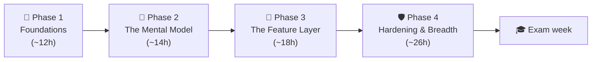
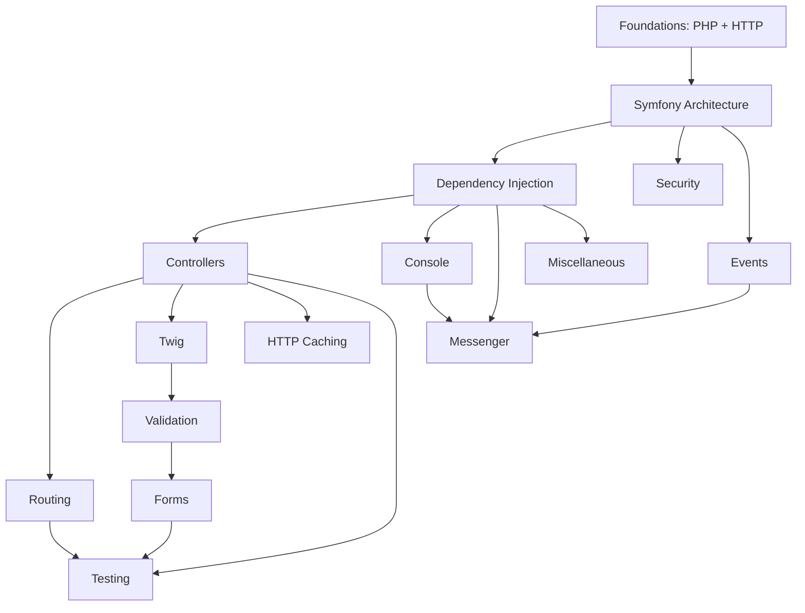

# Learning Roadmap

This is the **optimized study order** — deliberately *not* the syllabus order. It
teaches the mental model first (how a request becomes a response, how the container
is built), then layers features on top so no concept is used before it is taught.

!!! abstract "How to read this"
    The 15 topic areas are grouped into **4 phases**. Work phase by phase; inside a
    phase, follow the stage numbers. Every stage uses the same
    [study loop](#the-study-loop-same-for-every-stage), and every phase ends with a
    **checkpoint** — a measurable gate that tells you whether to move on or loop
    back. Difficulty is ★ (easy) to ★★★ (hard); **Revision priority** tells you
    what to drill last-minute.

## 🧠 Pour les nuls

**C'est quoi cette page ?** L'ordre d'étude recommandé pour les 15 domaines — pas dans l'ordre alphabétique de la navigation, mais dans l'ordre où chaque concept s'appuie sur le précédent.

**Pourquoi ça existe ?** Étudier la Sécurité avant l'Injection de Dépendances serait comme apprendre à conduire avant de savoir ce qu'est une pédale — la Sécurité s'appuie directement sur des concepts enseignés avant elle dans ce parcours.

**🏠 Analogie de la vraie vie :** Un GPS qui calcule le meilleur itinéraire plutôt que de te laisser deviner ton chemin sur une carte routière complète — le Roadmap fait ce travail pour ton apprentissage.

**Symfony dans la vraie vie :** Les 15 domaines sont groupés en 4 phases (Fondations → Modèle mental → Couche fonctionnelle → Renforcement) — chaque phase se termine par un "checkpoint" qui vérifie que tu es prêt avant de continuer.

**⚠️ Erreur fréquente :** suivre la navigation de gauche (ordre alphabétique) au lieu de ce Roadmap — l'ordre alphabétique ignore complètement les prérequis réels entre domaines.

**🧠 Comment le mémoriser :** "Le Roadmap, c'est le GPS de ta révision — suis-le plutôt que de deviner ton propre chemin."

## The four phases at a glance

| Phase | Stages | Theme | You're done when… |
|---|---|---|---|
| 🧱 **1. Foundations** | 1–2 | The language + the protocol | You can narrate an HTTP request without Symfony |
| 🧠 **2. The Mental Model** | 3–4 | Kernel, events, container | You can explain `HttpKernel::handle()` from memory |
| 🧩 **3. The Feature Layer** | 5–9 | Controllers → Forms | You can build & validate a form end-to-end on paper |
| 🛡 **4. Hardening & Breadth** | 10–15 | Security, caching, Messenger, tests, components | You pass a full mock in exam conditions |

## The study loop (same for every stage)

!!! tip "One stage = one loop. Never skip step 5."
    1. **Skim** the area's index page + each chapter's *In a nutshell* (10 min) —
       build the map before the territory.
    2. **Read** each chapter top-to-bottom; do the *Predict first* boxes **before**
       revealing; hand-copy one code example per chapter.
    3. **Drill** the chapter's *Certification questions* + *Exercises*.
    4. **Test**: [Exam Simulator](exam-simulator.md) in Practice mode, filtered to
       this topic, 15–20 questions.
    5. **Space it**: re-read only the *Last-minute revision* cheat blocks at
       **J+1**, **J+3**, **J+7** (5 min each). This is what makes it stick.

!!! example "Real-world analogy"
    Cramming is filling a bathtub with the drain open — impressive while the tap
    runs, empty by morning. The J+1 / J+3 / J+7 re-reads are little turns of the
    tap that keep the level up for a fraction of the effort.

## Dependency graph

Every arrow here is a **real, declared prerequisite** — extracted from each area's
own `index.md` metadata (`Prerequisites:` / `Dependencies:`), not guessed. Two of
these arrows correct a defect in the site's old top-level navigation, which had
drifted out of sync with this graph: Dependency Injection used to appear *after*
Controllers/Twig/Forms in the sidebar even though those chapters explicitly list
Dependency Injection as a prerequisite, and Forms used to appear *before*
Validation even though the Forms chapter lists Validation as a prerequisite. Both
are now fixed in the navigation to match this graph.

---

## 🧱 Phase 1 — Foundations (stages 1–2, ~8–10 h)

*Goal: be able to describe what happens between typing a URL and seeing a page,
with zero framework involved.*

| # | Stage | Why here | Prereqs | Difficulty | Est. time | Revision priority |
|---|---|---|---|---|---|---|
| 1 | [PHP & Web Security](php-web-security/index.md) | Language baseline (PHP 8.4) + threat model everything relies on | — | ★★☆ | 4–6 h | High |
| 2 | [HTTP](http/index.md) | Request/response mental model; foundation for HttpFoundation | 1 | ★★☆ | 3–4 h | High |

- [ ] Stage 1 loop done (+ J+1/J+3/J+7 planned)
- [ ] Stage 2 loop done (+ J+1/J+3/J+7 planned)

!!! success "Checkpoint 1 — gate to Phase 2"
    Simulator, Practice mode, topics *PHP & Web Security* + *HTTP*, 20 questions:
    **score ≥ 70%**. Below that, re-drill the wrong answers (the review screen
    sorts them first), then retry with a fresh 20.

## 🧠 Phase 2 — The Mental Model (stages 3–4, ~11–15 h)

*Goal: internalize the two machines everything else plugs into — the event-driven
kernel and the compiled container. This is the highest-yield phase of the exam.*

| # | Stage | Why here | Prereqs | Difficulty | Est. time | Revision priority |
|---|---|---|---|---|---|---|
| 3 | [Symfony Architecture](architecture/index.md) | Kernel, events, request lifecycle — the core mental model | 2 | ★★★ | 5–7 h | **Critical** |
| 4 | [Dependency Injection](dependency-injection/index.md) | The backbone; needed for every other component | 3 | ★★★ | 6–8 h | **Critical** |

**Phase 2 extras (Expert):** after stage 3, read the
[HttpKernel::handle() tour](tours/httpkernel-handle.md); after stage 4, the
[Compiled Container chapter](dependency-injection/container-dump.md) and the
[kernel-events section of the Execution-Order Codex](revision/execution-order-codex.md).

- [ ] Stage 3 loop done · [ ] Kernel tour read
- [ ] Stage 4 loop done · [ ] Codex §kernel events drilled

!!! success "Checkpoint 2 — gate to Phase 3"
    Two tests: (a) Simulator on *Architecture* + *Dependency Injection*, 20 Q,
    **≥ 70%**; (b) the whiteboard test — draw the kernel event sequence
    (request → … → terminate) from memory and check it against the
    [Codex](revision/execution-order-codex.md). Both must pass.

## 🧩 Phase 3 — The Feature Layer (stages 5–9, ~17–22 h)

*Goal: the everyday request path — controller in, rendered/validated response out.
Each stage builds directly on the previous one; keep the order.*

| # | Stage | Why here | Prereqs | Difficulty | Est. time | Revision priority |
|---|---|---|---|---|---|---|
| 5 | [Controllers](controllers/index.md) | First feature layer, once lifecycle + DI are clear | 3,4 | ★★☆ | 3–4 h | High |
| 6 | [Routing](routing/index.md) | Pairs with controllers; matcher/generator internals | 5 | ★★☆ | 3–4 h | High |
| 7 | [Templating (Twig)](twig/index.md) | Presentation layer on controllers | 5 | ★★☆ | 3–4 h | Medium |
| 8 | [Data Validation](validation/index.md) | Constraint/validator model; prerequisite for Forms | 4 | ★★☆ | 3–4 h | Medium |
| 9 | [Forms](forms/index.md) | Composes Twig + Validation + DI + events | 7,8 | ★★★ | 5–6 h | High |

**Phase 3 extras (Expert):** the
[ArgumentResolver tour](tours/argument-resolver.md) after stage 5; the
[Form's-life tour](tours/form-lifecycle.md) after stage 9 — the form event order
(PRE_SET_DATA → … → POST_SUBMIT) is a guaranteed exam theme.

- [ ] 5 · [ ] 6 · [ ] 7 · [ ] 8 · [ ] 9 — loops done
- [ ] Both tours read · [ ] [Chapter Exams](exams/index.md) for stages 5–9 passed

!!! success "Checkpoint 3 — gate to Phase 4"
    Simulator, 30 questions across the five Phase-3 topics: **≥ 70%**, and the
    [Forms chapter exam](exams/forms.md) with at most 2 mistakes. Forms is where
    single points hide — don't carry weaknesses into Phase 4.

## 🛡 Phase 4 — Hardening & Breadth (stages 10–15, ~24–32 h)

*Goal: the high-weight security block, then breadth. Security alone justifies its
Critical tag — budget real time for it. Messenger gets its own stage (split out of
Miscellaneous) because it is individually **Critical/up-weighted** and its real
prerequisites (Console, Events) are met right after stage 12 — no reason to defer
it behind the lower-priority Testing/Miscellaneous stages.*

| # | Stage | Why here | Prereqs | Difficulty | Est. time | Revision priority |
|---|---|---|---|---|---|---|
| 10 | [Security](security/index.md) | Firewalls, authenticators, voters — builds on events + DI + HTTP | 3,4 | ★★★ | 6–8 h | **Critical** |
| 11 | [HTTP Caching](http-caching/index.md) | Extends HTTP/response; ESI, reverse proxy | 2,5 | ★★☆ | 2–3 h | Medium (down-weighted) |
| 12 | [Console](console/index.md) | Mostly standalone; input/output/events | 4 | ★☆☆ | 2–3 h | Medium |
| 13 | [Messenger](messenger/index.md) | Async messaging; needs DI + Console + Events | 4,12,3 | ★★★ | 4–5 h | **Critical** (up-weighted) |
| 14 | [Automated Tests](testing/index.md) | Test what you can now build | 5,6,9 | ★★☆ | 3–4 h | Medium |
| 15 | [Miscellaneous](miscellaneous/index.md) | Remaining advanced components (Cache, Serializer, Mailer, Lock…) | 3,4 | ★★☆ | 5–7 h | Medium |

**Phase 4 extras (Expert):** the
[Firewall tour](tours/firewall-request-cycle.md) plus the five expert security
chapters ([role hierarchy](security/role-hierarchy.md),
[decision strategies](security/access-decision-strategies.md),
[impersonation](security/impersonation.md),
[throttling](security/login-throttling.md),
[programmatic login](security/programmatic-login.md)) after stage 10.

- [ ] 10 · [ ] 11 · [ ] 12 · [ ] 13 · [ ] 14 · [ ] 15 — loops done
- [ ] Firewall tour + expert security chapters read

!!! success "Checkpoint 4 — gate to exam week"
    A **full mock exam** in the [Simulator](exam-simulator.md) (Exam mode: 75 Q,
    90 min, hidden answers) scoring **≥ 75%** — the 10-point margin over the pass
    mark absorbs exam-day stress. Under 75%? The per-topic breakdown tells you
    which phase to loop back to; use **Drill my weaknesses** daily until it clears.

---

## 🎓 Exam week — the 7-day countdown

| Day | Do this | Time |
|---|---|---|
| J-7 | Full mock ([Mock Exam A](revision/mock-exam.md) or Simulator Exam mode) → note weak areas | 2 h |
| J-6 | **Drill my weaknesses** in the Simulator + re-read those areas' cheat blocks | 1–2 h |
| J-5 | [Execution-Order Codex](revision/execution-order-codex.md) — all 10 sequences from memory | 1 h |
| J-4 | [Edge-Case Drills](revision/edge-cases.md) — answer out loud before revealing | 1–2 h |
| J-3 | Second full mock ([Mock B](revision/mock-exam-b.md)) → should beat J-7's score | 2 h |
| J-2 | [Top Traps](revision/traps.md) + [Easily Confused](revision/confusions.md) + [Flashcards](revision/flashcards/index.md) on Critical areas | 1–2 h |
| J-1 | **Light only**: [Master Cheat Sheet](revision/cheat-sheet.md) + [Memory Aids](revision/memory-aids.md). No new material. Sleep. | 45 min |

!!! tip "Exam format reminder"
    Every question is **select-only** — True/False, Single answer, or Multiple
    choice. You never write text or code. Multiple choice is scored
    all-or-nothing, and pacing is ≈72 seconds per question — both are exactly what
    the Simulator's Exam mode trains.

**Total:** ~57–78 hours of focused study for Expert level.

## Practice & self-assessment

Study is only half the loop — test yourself as you go. The platform ships a full
practice toolchain over a **1,292-question bank** covering all 157 sub-topics:

| Tool | Use it for | When |
|---|---|---|
| [Exam Simulator](exam-simulator.md) — **Practice mode** | Instant feedback + explanations, filtered by topic/difficulty | Step 4 of every study loop |
| [Exam Simulator](exam-simulator.md) — **Exam mode** | Real exam shape: 75 questions, 90 min, hidden answers, scored report | Checkpoint 4 + exam week |
| **Drill my weaknesses** (Simulator) | Auto-built session from your weakest tracked topics | Whenever a checkpoint fails |
| [Chapter Exams](exams/index.md) | Fixed per-area sets to confirm a topic is solid | End of each stage |
| [Mock Exams A/B/C](revision/mock-exam.md) | Full-length dry runs before the real thing | Exam week (J-7, J-3) |
| [Source Tours](tours/index.md) | Reading the real internals — Expert-level depth | Phase extras |
| [Revision Hub](revision/index.md) | Cheat sheets, traps, codex, edge-cases, flashcards, planner | J+1/J+3/J+7 re-reads & exam week |

## Revision priority legend

- **Critical** — heavily tested; revisit last-minute: **Architecture, Dependency
  Injection, Security, Messenger**.
- **High / Medium** — proportional to exam weight. HTTP Caching is *Medium* due to
  its reduced weighting in the Symfony 8 exam.

## Two tracks

=== "Advanced track"

    Stages 1–15, with emphasis on **correct usage**: configuration, common flows,
    and avoiding mistakes. Read the Theory, Code, and Traps sections closely; skim
    the Deep Dives and the phase "extras".

=== "Expert track"

    **All** stages plus **every Deep Dive**, the phase extras
    ([Source Tours](tours/index.md), expert chapters), and the internals/source
    sections. The [Execution-Order Codex](revision/execution-order-codex.md) and
    [Revision Hub trap index](revision/traps.md) are mandatory. Expect questions
    on execution order, extension points, and edge cases.

## Topic-area indexes

- [PHP & Web Security](php-web-security/index.md)
- [HTTP](http/index.md)
- [Symfony Architecture](architecture/index.md)
- [Dependency Injection](dependency-injection/index.md)
- [Controllers](controllers/index.md)
- [Routing](routing/index.md)
- [Templating (Twig)](twig/index.md)
- [Data Validation](validation/index.md)
- [Forms](forms/index.md)
- [Security](security/index.md)
- [HTTP Caching](http-caching/index.md)
- [Console](console/index.md)
- [Messenger](messenger/index.md)
- [Automated Tests](testing/index.md)
- [Miscellaneous](miscellaneous/index.md)

---

<small>Related: [Exam Guide](exam-guide/index.md) · [Exam Simulator](exam-simulator.md) · [Revision Hub](revision/index.md) · [Home](index.md)</small>

## Official References

- [Official Symfony Certification](https://certification.symfony.com/)
- [Certification syllabus](https://certification.symfony.com/exams/symfony.html)
- [Symfony documentation home](https://symfony.com/doc/8.0/)
