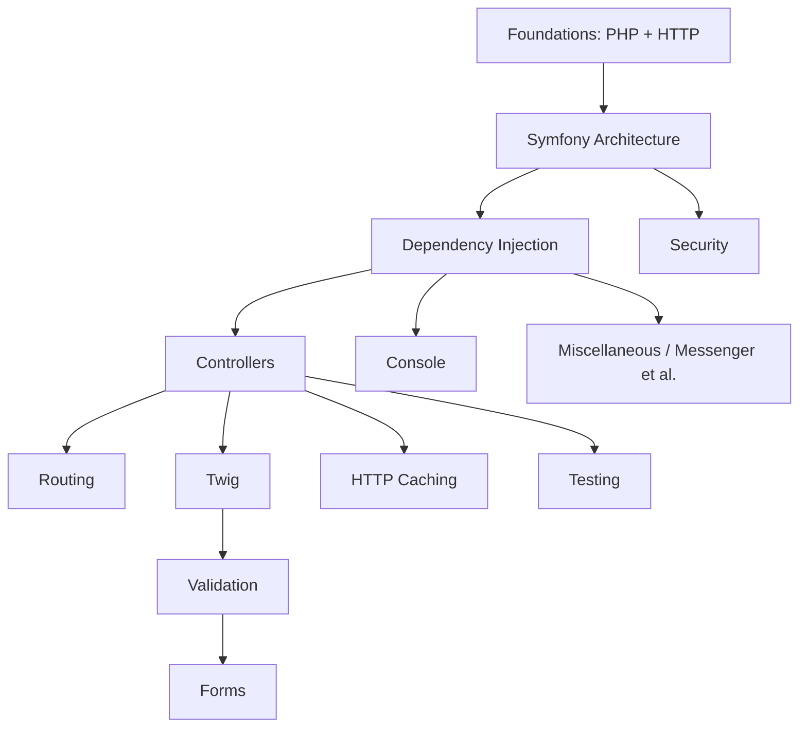

# Learning Roadmap

This is the **optimized study order** — deliberately *not* the syllabus order. It
teaches the mental model first (how a request becomes a response, how the container
is built), then layers features on top so no concept is used before it is taught.

!!! abstract "How to read this"
    Follow the stages top to bottom. Each stage links to its topic-area index.
    Difficulty is ★ (easy) to ★★★ (hard). **Revision priority** tells you what to
    drill last-minute. Two tracks (Advanced / Expert) are described at the bottom.
    After each stage, self-assess with the [Exam Simulator](exam-simulator.md) —
    filter it to the topic you just finished before moving on.

## Dependency graph

## Ordered stages

| # | Stage | Why here | Prereqs | Difficulty | Est. time | Revision priority |
|---|---|---|---|---|---|---|
| 1 | [PHP & Web Security](php-web-security/index.md) | Language baseline (PHP 8.4) + threat model everything relies on | — | ★★☆ | 4–6 h | High |
| 2 | [HTTP](http/index.md) | Request/response mental model; foundation for HttpFoundation | 1 | ★★☆ | 3–4 h | High |
| 3 | [Symfony Architecture](architecture/index.md) | Kernel, events, request lifecycle — the core mental model | 2 | ★★★ | 5–7 h | **Critical** |
| 4 | [Dependency Injection](dependency-injection/index.md) | The backbone; needed for every other component | 3 | ★★★ | 6–8 h | **Critical** |
| 5 | [Controllers](controllers/index.md) | First feature layer, once lifecycle + DI are clear | 3,4 | ★★☆ | 3–4 h | High |
| 6 | [Routing](routing/index.md) | Pairs with controllers; matcher/generator internals | 5 | ★★☆ | 3–4 h | High |
| 7 | [Templating (Twig)](twig/index.md) | Presentation layer on controllers | 5 | ★★☆ | 3–4 h | Medium |
| 8 | [Data Validation](validation/index.md) | Constraint/validator model; prerequisite for Forms | 4 | ★★☆ | 3–4 h | Medium |
| 9 | [Forms](forms/index.md) | Composes Twig + Validation + DI + events | 7,8 | ★★★ | 5–6 h | High |
| 10 | [Security](security/index.md) | Firewalls, authenticators, voters — builds on events + DI + HTTP | 3,4 | ★★★ | 6–8 h | **Critical** |
| 11 | [HTTP Caching](http-caching/index.md) | Extends HTTP/response; ESI, reverse proxy | 2,5 | ★★☆ | 2–3 h | Medium (down-weighted) |
| 12 | [Console](console/index.md) | Mostly standalone; input/output/events | 4 | ★☆☆ | 2–3 h | Medium |
| 13 | [Automated Tests](testing/index.md) | Test what you can now build | 5,6,9 | ★★☆ | 3–4 h | Medium |
| 14 | [Miscellaneous](miscellaneous/index.md) | Advanced components; **Messenger up-weighted** | 3,4 | ★★★ | 7–9 h | High (Messenger **Critical**) |

**Total:** ~55–75 hours of focused study for Expert level.

## Revision priority legend

- **Critical** — heavily tested; revisit last-minute: **Architecture, Dependency
  Injection, Security, Messenger**.
- **High / Medium** — proportional to exam weight. HTTP Caching is *Medium* due to
  its reduced weighting in the Symfony 8 exam.

## Practice & self-assessment

Study is only half the loop — test yourself as you go. The platform ships a full
practice toolchain over a **1,179-question bank** covering all 154 sub-topics:

| Tool | Use it for | When |
|---|---|---|
| [Exam Simulator](exam-simulator.md) — **Practice mode** | Instant feedback + explanations, filtered by topic/difficulty | After each stage above |
| [Exam Simulator](exam-simulator.md) — **Exam mode** | Real exam shape: 75 questions, 90 min, hidden answers, scored report | Once a track is ~80% done |
| [Chapter Exams](exams/index.md) | Fixed per-area sets to confirm a topic is solid | End of each stage |
| [Mock Exams A/B/C](revision/mock-exam.md) | Full-length dry runs before the real thing | Final week |
| [Revision Hub](revision/index.md) | Cheat sheets, traps, flashcards, study planner | Last-minute drilling |

!!! tip "Exam format reminder"
    Every question is **select-only** — True/False, Single answer, or Multiple
    choice. You never write text or code. The simulator mirrors this exactly, so
    practising in Exam mode also trains your pacing (≈72 seconds per question).

## Two tracks

=== "Advanced track"

    Stages 1–13, with emphasis on **correct usage**: configuration, common flows,
    and avoiding mistakes. Read the Theory, Code, and Traps sections closely; skim
    the Deep Dives.

=== "Expert track"

    **All** stages plus **every Deep Dive** and the internals/source sections. The
    [Revision Hub trap index](revision/traps.md) is mandatory. Expect questions on
    execution order, extension points, and edge cases.

## Topic-area indexes

- [PHP & Web Security](php-web-security/index.md)
- [HTTP](http/index.md)
- [Symfony Architecture](architecture/index.md)
- [Dependency Injection](dependency-injection/index.md)
- [Controllers](controllers/index.md)
- [Routing](routing/index.md)
- [Templating (Twig)](twig/index.md)
- [Data Validation](validation/index.md)
- [Forms](forms/index.md)
- [Security](security/index.md)
- [HTTP Caching](http-caching/index.md)
- [Console](console/index.md)
- [Automated Tests](testing/index.md)
- [Miscellaneous](miscellaneous/index.md)

---

<small>Related: [Exam Guide](exam-guide/index.md) · [Exam Simulator](exam-simulator.md) · [Revision Hub](revision/index.md) · [Home](index.md)</small>

## Official References

- [Official Symfony Certification](https://certification.symfony.com/)
- [Certification syllabus](https://certification.symfony.com/exams/symfony.html)
- [Symfony documentation home](https://symfony.com/doc/current/)
