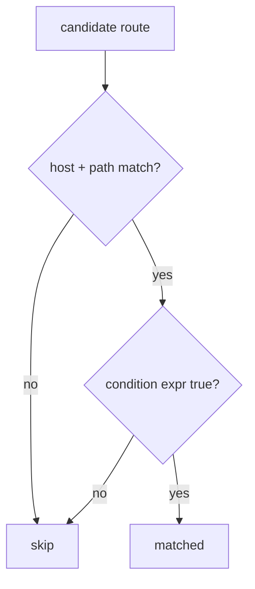

# Conditional Request Matching

!!! tip "In a nutshell"
    Une `condition` est un booléen ExpressionLanguage (sur `context`/`request`, avec
    `env()`/`service()`) qui agit comme un filtre de matching de dernier recours quand path, host, method et scheme ne suffisent pas.
    Réflexe examen : les conditions n'affectent que le matching (une condition fausse donne un 404, jamais d'effet sur `generateUrl()`).

!!! example "Real-world analogy"
    Pensez à un videur de boîte de nuit posté à la bonne porte du bon bâtiment. Vous
    avez déjà trouvé la bonne adresse (le host) et la bonne entrée (path + méthode), et le
    videur effectue maintenant un dernier contrôle personnalisé — le bracelet, la liste des invités,
    le dress code du soir. Si vous échouez, vous êtes simplement refoulé comme si la porte n'existait
    pas (un 404), jamais « interdit avec un motif ». Et le videur ne touche jamais aux invitations
    imprimées que le club envoie par courrier : ces adresses sont produites quelle que soit la personne
    qui serait réellement admise.

!!! abstract "Learning objectives"
    À la fin de ce chapitre, vous saurez :

    - [ ] Restreindre une route avec une expression `condition`
    - [ ] Utiliser les variables/fonctions `context`, `request`, `env()` et `service()`
    - [ ] Expliquer quand une condition est évaluée et son coût
    - [ ] Savoir pourquoi les conditions sont exclues de la génération d'URL

    **Syllabus:** `Routing → Conditional matching` ·
    **Level:** Expert ·
    **Est. time:** 20 min ·
    **Prerequisites:** [Host matching](host-matching.md)

---

## Theory

Quand path, host, method et scheme ne sont pas assez expressifs, une **`condition`**
vous permet de matcher sur une expression booléenne **ExpressionLanguage** arbitraire,
évaluée contre la request. Exemples : ne matcher que si un header spécifique est présent,
si une variable d'environnement de feature flag est activée, ou si un paramètre de query
a une certaine valeur.

Une condition est un filtre de dernier recours : la route est considérée comme matchée
**seulement si** l'expression retourne `true`. Comme elle peut inspecter n'importe quel
élément de la request, elle est puissante — mais elle s'exécute sur chaque candidate au
matching, donc gardez-la peu coûteuse.

!!! question "Predict first"
    La `condition` d'une route s'évalue à `false` au moment de la request. Est-ce que
    `generateUrl()` pour cette même route échoue aussi ?

??? note "Reveal"
    Non. Les conditions n'affectent que le **matching** — il n'y a aucune request à
    évaluer pendant la génération, donc l'URL est produite normalement. Une condition
    fausse donne un 404, et c'est à vous de vous assurer que le contexte cible matchera
    réellement.

## Deep Dive — how it works internally

`RouteCompiler` laisse la `condition` sous forme de chaîne d'expression sur la `Route`. Le
framework compile toutes les conditions à l'avance via
`Symfony\Component\ExpressionLanguage\ExpressionLanguage` et l'`ExpressionLanguageProvider`
du routing, de sorte que le matcher dumpé contient des **closures PHP compilées**,
pas d'`eval` à l'exécution. `UrlMatcher::handleRouteRequirements()` exécute la
condition après que le host et le path ont matché.

Variables et fonctions disponibles dans l'expression :

| Nom | Type | Ce que c'est |
|---|---|---|
| `context` | `RequestContext` | scheme, host, méthode, path info |
| `request` | `Request` | la request HttpFoundation complète |
| `env(name)` | fonction | la valeur d'une variable d'environnement |
| `service(id)` | fonction | un service (doit être taggé `routing.condition_service`) |

`service()` exige que le service cible porte le tag
`routing.condition_service` (ajoutez-le avec l'attribut `#[AsRoutingConditionService]`)
pour que le router sache qu'il peut être référencé. `env()` lit la valeur d'environnement
résolue par le container.



!!! note "Source reference"
    Les conditions sont compilées via `ExpressionLanguage` ; évaluées dans
    `UrlMatcher::handleRouteRequirements()` —
    [symfony/symfony `8.0`](https://github.com/symfony/symfony/blob/8.0/src/Symfony/Component/Routing/Matcher/UrlMatcher.php).

### Why generation ignores conditions

`generateUrl()` **ne peut pas** honorer une condition — il n'y a aucune request contre
laquelle l'évaluer. Les conditions n'affectent donc que le **matching** ; une route cachée
derrière une condition génère quand même son URL normalement, et c'est à vous de vous
assurer que le contexte cible matchera réellement.

## Configuration & code

=== "PHP Attributes"

    ```php
    <?php
    declare(strict_types=1);

    namespace App\Controller;

    use Symfony\Bundle\FrameworkBundle\Controller\AbstractController;
    use Symfony\Component\HttpFoundation\Response;
    use Symfony\Component\Routing\Attribute\Route;

    final class FeatureController extends AbstractController
    {
        // Match only for JSON-accepting clients on a feature-flagged env.
        #[Route(
            '/beta',
            name: 'app_beta',
            condition: "request.headers.get('Accept') matches '/application\\\\/json/' and env('FEATURE_BETA') == '1'",
            methods: ['GET'],
        )]
        public function beta(): Response
        {
            return $this->json(['beta' => true]);
        }
    }
    ```

=== "YAML"

    ```yaml
    # config/routes/feature.yaml
    app_beta:
        path: /beta
        controller: App\Controller\FeatureController::beta
        methods: [GET]
        condition: "context.getMethod() in ['GET', 'HEAD'] and request.query.has('preview')"
    ```

=== "service() in a condition"

    ```php
    <?php
    declare(strict_types=1);

    namespace App\Routing;

    use Symfony\Component\HttpFoundation\Request;
    use Symfony\Component\Routing\Attribute\AsRoutingConditionService;

    // Tag makes it callable as service('feature_checker') in a condition.
    #[AsRoutingConditionService(alias: 'feature_checker')]
    final class FeatureChecker
    {
        public function isEnabled(Request $request): bool
        {
            return $request->getClientIp() === '127.0.0.1';
        }
    }
    ```

    ```yaml
    app_internal:
        path: /internal
        controller: App\Controller\FeatureController::beta
        condition: "service('feature_checker').isEnabled(request)"
    ```

## Best practices & anti-patterns

| ✅ À faire | ❌ À éviter |
|---|---|
| Garder les conditions peu coûteuses et pures | Du travail lourd DB/HTTP dans une condition |
| Privilégier d'abord `methods`/`schemes`/`host` | Les réimplémenter dans une condition |
| Tagger les services avec `#[AsRoutingConditionService]` | Appeler des services non taggés |
| Se rappeler que la génération ignore les conditions | Supposer qu'une URL « ne sera pas générée » |

## When (not) to use it / alternatives

Ne recourez à `condition` que lorsque les contraintes intégrées ne peuvent pas exprimer la
règle. Pour method/scheme/host, utilisez les options dédiées — elles sont plus rapides et
apparaissent dans `debug:router`. Pour l'autorisation, utilisez les voters de
[Security](../security/index.md), pas une condition de routing (une condition échouée est
un 404, pas un 403 : elle divulgue moins d'informations mais ne peut pas non plus afficher
une page de login).

!!! danger "Certification traps"
    - Les conditions n'affectent que le **matching** — **jamais** la génération d'URL.
    - Une condition échouée produit un **404** (route non matchée), pas un 403.
    - Les cibles de `service()` **doivent être taggées** `routing.condition_service`
      (`#[AsRoutingConditionService]`).
    - Les variables sont `context` et `request` ; les fonctions sont `env()` et `service()`.
    - Les conditions sont **compilées** dans le matcher, pas évaluées via `eval` à chaque request.

!!! warning "Common mistakes"
    - Utiliser une condition pour l'authentification et s'étonner de l'absence de 403.
    - Référencer un service non taggé dans `service()`.
    - Une logique coûteuse qui s'exécute sur chaque route candidate.

## Exercises

1. **(Basic)** Matcher `/preview` uniquement quand la query string contient `preview`.
2. **(Intermediate)** Matcher `/internal` uniquement quand un service taggé
   `feature_checker` retourne true pour la request.

??? success "Solutions"

    **1.**

    ```php
    #[Route('/preview', name: 'app_preview',
        condition: "request.query.has('preview')", methods: ['GET'])]
    public function preview(): Response { /* ... */ }
    ```

    **2.** Voir l'exemple `service()` ci-dessus — taggez le checker avec
    `#[AsRoutingConditionService(alias: 'feature_checker')]` et référencez
    `service('feature_checker').isEnabled(request)`.

## Certification questions

??? question "Q1. A route's `condition` returns false. What is the outcome?"
    - [ ] A. 403 Forbidden
    - [x] B. 404 — the route is not matched ✅
    - [ ] C. 405 Method Not Allowed
    - [ ] D. The controller runs anyway

    **Why:** une condition fausse signifie que la route ne matche pas ; le matching continue.
    **Ref:** [Matching conditions](https://symfony.com/doc/current/routing.html#matching-expressions).

??? question "Q2. Which are valid inside a routing condition?"
    - [x] A. `context`, `request`, `env()`, `service()` ✅
    - [ ] B. `session`, `token`, `user()`
    - [ ] C. `kernel`, `container`
    - [ ] D. `params`, `route()`

    **Why:** l'expression provider du routing expose exactement ceux-ci.
    **Ref:** [Routing](https://symfony.com/doc/current/routing.html#matching-expressions).

??? question "Q3. Do conditions affect `generateUrl()`?"
    - [ ] A. Yes, generation fails if the condition is false
    - [x] B. No — conditions are matching-only ✅
    - [ ] C. Only for absolute URLs
    - [ ] D. Only in debug mode

    **Why:** il n'y a aucune request à évaluer ; la génération ignore les conditions.
    **Ref:** [Routing](https://symfony.com/doc/current/routing.html#matching-expressions).

??? question "Q4. To call `service('x')` in a condition, service `x` must…"
    - [x] A. Be tagged `routing.condition_service` (`#[AsRoutingConditionService]`) ✅
    - [ ] B. Be public
    - [ ] C. Implement `RouterInterface`
    - [ ] D. Extend `AbstractController`

    **Why:** seuls les services taggés sont exposés à l'expression de routing.
    **Ref:** [Routing](https://symfony.com/doc/current/routing.html#matching-expressions).

## Key takeaways

- `condition` matche sur un booléen ExpressionLanguage évalué contre la request.
- Variables `context`/`request` ; fonctions `env()`/`service()`.
- `service()` nécessite `#[AsRoutingConditionService]`.
- Matching uniquement ; false = 404 ; ignoré par la génération ; compilé (pas d'eval).

## Last-minute revision

!!! tip "Cheat sheet"
    - `condition: "request.headers.get('X') == 'y'"`.
    - `context` (RequestContext), `request` (Request), `env()`, `service()`.
    - Condition fausse ⇒ 404. La génération l'ignore.
    - Tag : `#[AsRoutingConditionService(alias: '...')]`.

## Connections

- **Depends on:** [Host matching](host-matching.md) — la condition ne s'exécute qu'après que host + path ont matché.
- **Reused in:** [Config & ExpressionLanguage](../miscellaneous/configuration.md) — les conditions sont des expressions ExpressionLanguage compilées.
- **Confused with:** [Security](../security/index.md) — une condition échouée est un 404, pas de l'autorisation (qui est un 403 via des voters).

## Official References
- [Official Symfony docs — Matching expressions](https://symfony.com/doc/current/routing.html#matching-expressions)
- [Symfony source — UrlMatcher](https://github.com/symfony/symfony/blob/8.0/src/Symfony/Component/Routing/Matcher/UrlMatcher.php)

## Video references

!!! tip "Watch & learn"
    Voici des chaînes vidéo officielles, mises à jour en continu — cherchez-y
    "Symfony routing" pour consolider ce chapitre. Nous lions des chaînes stables plutôt que
    des vidéos individuelles pour que les références ne périment jamais.

    - [SymfonyCasts screencasts](https://symfonycasts.com/tracks/symfony) — tutoriels scénarisés à suivre en codant.
    - [Symfony official YouTube](https://www.youtube.com/@SymfonyOfficial) — conférences et keynotes SymfonyCon.
    - [Official docs for this topic](https://symfony.com/doc/current/routing.html#matching-expressions) — certaines pages de la doc Symfony intègrent un screencast.

## Confidence check

Je suis prêt quand je peux :

- [ ] expliquer **pourquoi** les conditions ne concernent que le matching et n'affectent jamais la génération
- [ ] implémenter une `condition` utilisant `request`/`env()` et un `service()` taggé dans Symfony 8
- [ ] déboguer un appel `service()` qui échoue parce que la cible n'est pas taggée
- [ ] repérer qu'une condition fausse est un 404 (pas un 403) et que les conditions sont compilées (pas d'`eval`)
- [ ] expliquer où `UrlMatcher::handleRouteRequirements()` exécute la closure compilée

---

<small>Related: [Host matching](host-matching.md) · [Methods](methods.md) · [Special attributes](special-attributes.md) · [Config & ExpressionLanguage](../miscellaneous/configuration.md)</small>
