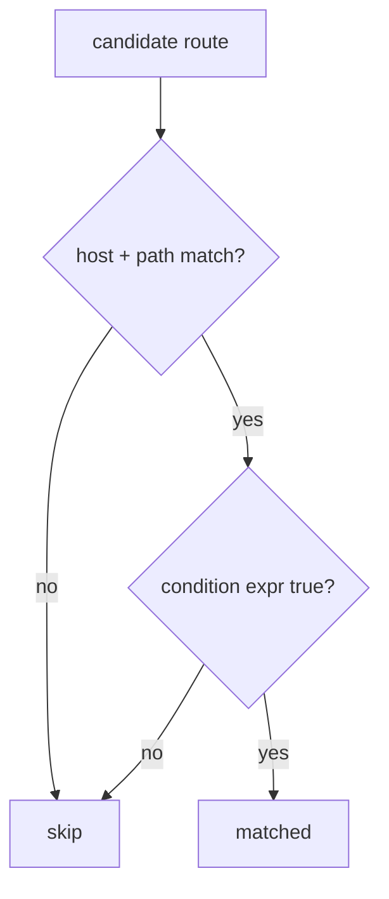

# Conditional Request Matching

!!! abstract "Learning objectives"
    By the end of this chapter you can:

    - [ ] Restrict a route with a `condition` expression
    - [ ] Use the `context`, `request`, `env()` and `service()` variables/functions
    - [ ] Explain when a condition is evaluated and its cost
    - [ ] Know why conditions are excluded from URL generation

    **Syllabus:** `Routing → Conditional matching` ·
    **Level:** Expert ·
    **Est. time:** 20 min ·
    **Prerequisites:** [Host matching](host-matching.md)

---

## Theory

When path, host, method and scheme are not expressive enough, a **`condition`** lets
you match on an arbitrary boolean **ExpressionLanguage** expression evaluated
against the request. Examples: only match when a specific header is present, when a
feature-flag env var is on, or when a query parameter has a value.

A condition is a last-mile filter: the route is considered matched **only if** the
expression returns `true`. Because it can inspect anything on the request, it is
powerful — but it runs on every candidate match, so keep it cheap.

## Deep Dive — how it works internally

`RouteCompiler` leaves the `condition` as an expression string on the `Route`. The
framework compiles all conditions ahead of time via
`Symfony\Component\ExpressionLanguage\ExpressionLanguage` and the routing
`ExpressionLanguageProvider`, so the dumped matcher contains **compiled PHP
closures**, not runtime `eval`. `UrlMatcher::handleRouteRequirements()` executes the
condition after the host and path have matched.

Available variables and functions in the expression:

| Name | Type | What it is |
|---|---|---|
| `context` | `RequestContext` | scheme, host, method, path info |
| `request` | `Request` | full HttpFoundation request |
| `env(name)` | function | value of an environment variable |
| `service(id)` | function | a service (must be tagged `routing.condition_service`) |

`service()` requires the target service to carry the
`routing.condition_service` tag (add it with the `#[AsRoutingConditionService]`
attribute) so the router knows it may be referenced. `env()` reads the resolved
container env value.



!!! note "Source reference"
    Conditions compile through `ExpressionLanguage`; evaluated in
    `UrlMatcher::handleRouteRequirements()` —
    [symfony/symfony `8.0`](https://github.com/symfony/symfony/blob/8.0/src/Symfony/Component/Routing/Matcher/UrlMatcher.php).

### Why generation ignores conditions

`generateUrl()` **cannot** honour a condition — there is no request to evaluate it
against. Conditions therefore affect **matching only**; a route hidden behind a
condition still generates its URL normally, and it is your job to ensure the target
context will actually match.

## Configuration & code

=== "PHP Attributes"

    ```php
    <?php
    declare(strict_types=1);

    namespace App\Controller;

    use Symfony\Bundle\FrameworkBundle\Controller\AbstractController;
    use Symfony\Component\HttpFoundation\Response;
    use Symfony\Component\Routing\Attribute\Route;

    final class FeatureController extends AbstractController
    {
        // Match only for JSON-accepting clients on a feature-flagged env.
        #[Route(
            '/beta',
            name: 'app_beta',
            condition: "request.headers.get('Accept') matches '/application\\\\/json/' and env('FEATURE_BETA') == '1'",
            methods: ['GET'],
        )]
        public function beta(): Response
        {
            return $this->json(['beta' => true]);
        }
    }
    ```

=== "YAML"

    ```yaml
    # config/routes/feature.yaml
    app_beta:
        path: /beta
        controller: App\Controller\FeatureController::beta
        methods: [GET]
        condition: "context.getMethod() in ['GET', 'HEAD'] and request.query.has('preview')"
    ```

=== "service() in a condition"

    ```php
    <?php
    declare(strict_types=1);

    namespace App\Routing;

    use Symfony\Component\HttpFoundation\Request;
    use Symfony\Component\Routing\Attribute\AsRoutingConditionService;

    // Tag makes it callable as service('feature_checker') in a condition.
    #[AsRoutingConditionService(alias: 'feature_checker')]
    final class FeatureChecker
    {
        public function isEnabled(Request $request): bool
        {
            return $request->getClientIp() === '127.0.0.1';
        }
    }
    ```

    ```yaml
    app_internal:
        path: /internal
        controller: App\Controller\FeatureController::beta
        condition: "service('feature_checker').isEnabled(request)"
    ```

## Best practices & anti-patterns

| ✅ Do | ❌ Avoid |
|---|---|
| Keep conditions cheap and pure | Heavy DB/HTTP work in a condition |
| Prefer `methods`/`schemes`/`host` first | Re-implementing them in a condition |
| Tag services with `#[AsRoutingConditionService]` | Calling untagged services |
| Remember generation ignores conditions | Assuming a URL "won't be generated" |

## When (not) to use it / alternatives

Reach for `condition` only when the built-in constraints cannot express the rule.
For method/scheme/host, use the dedicated options — they are faster and appear in
`debug:router`. For authorization, use [Security](../security/index.md) voters, not
a routing condition (a failed condition is a 404, not a 403, and leaks less but
also cannot show a login page).

!!! danger "Certification traps"
    - Conditions affect **matching only** — **never** URL generation.
    - A failed condition yields **404** (route not matched), not 403.
    - `service()` targets **must be tagged** `routing.condition_service`
      (`#[AsRoutingConditionService]`).
    - Variables are `context` and `request`; functions are `env()` and `service()`.
    - Conditions are **compiled** into the matcher, not `eval`'d per request.

!!! warning "Common mistakes"
    - Using a condition for auth and wondering why there's no 403.
    - Referencing an untagged service in `service()`.
    - Expensive logic that runs on every candidate route.

## Exercises

1. **(Basic)** Match `/preview` only when the query string contains `preview`.
2. **(Intermediate)** Match `/internal` only when a tagged `feature_checker`
   service returns true for the request.

??? success "Solutions"

    **1.**

    ```php
    #[Route('/preview', name: 'app_preview',
        condition: "request.query.has('preview')", methods: ['GET'])]
    public function preview(): Response { /* ... */ }
    ```

    **2.** See the `service()` example above — tag the checker with
    `#[AsRoutingConditionService(alias: 'feature_checker')]` and reference
    `service('feature_checker').isEnabled(request)`.

## Certification questions

??? question "Q1. A route's `condition` returns false. What is the outcome?"
    - [ ] A. 403 Forbidden
    - [x] B. 404 — the route is not matched ✅
    - [ ] C. 405 Method Not Allowed
    - [ ] D. The controller runs anyway

    **Why:** a false condition means the route does not match; matching continues.
    **Ref:** [Matching conditions](https://symfony.com/doc/current/routing.html#matching-expressions).

??? question "Q2. Which are valid inside a routing condition?"
    - [x] A. `context`, `request`, `env()`, `service()` ✅
    - [ ] B. `session`, `token`, `user()`
    - [ ] C. `kernel`, `container`
    - [ ] D. `params`, `route()`

    **Why:** the routing expression provider exposes exactly these.
    **Ref:** [Routing](https://symfony.com/doc/current/routing.html#matching-expressions).

??? question "Q3. Do conditions affect `generateUrl()`?"
    - [ ] A. Yes, generation fails if the condition is false
    - [x] B. No — conditions are matching-only ✅
    - [ ] C. Only for absolute URLs
    - [ ] D. Only in debug mode

    **Why:** there is no request to evaluate; generation ignores conditions.
    **Ref:** [Routing](https://symfony.com/doc/current/routing.html#matching-expressions).

??? question "Q4. To call `service('x')` in a condition, service `x` must…"
    - [x] A. Be tagged `routing.condition_service` (`#[AsRoutingConditionService]`) ✅
    - [ ] B. Be public
    - [ ] C. Implement `RouterInterface`
    - [ ] D. Extend `AbstractController`

    **Why:** only tagged services are exposed to the routing expression.
    **Ref:** [Routing](https://symfony.com/doc/current/routing.html#matching-expressions).

## Key takeaways

- `condition` matches on an ExpressionLanguage boolean over the request.
- Variables `context`/`request`; functions `env()`/`service()`.
- `service()` needs `#[AsRoutingConditionService]`.
- Matching-only; false = 404; ignored by generation; compiled (not eval).

## Last-minute revision

!!! tip "Cheat sheet"
    - `condition: "request.headers.get('X') == 'y'"`.
    - `context` (RequestContext), `request` (Request), `env()`, `service()`.
    - False condition ⇒ 404. Generation ignores it.
    - Tag: `#[AsRoutingConditionService(alias: '...')]`.

## References

- [Official Symfony docs — Matching expressions](https://symfony.com/doc/current/routing.html#matching-expressions)
- [Symfony source — UrlMatcher](https://github.com/symfony/symfony/blob/8.0/src/Symfony/Component/Routing/Matcher/UrlMatcher.php)

---

<small>Related: [Host matching](host-matching.md) · [Methods](methods.md) · [Special attributes](special-attributes.md) · [Config & ExpressionLanguage](../miscellaneous/configuration.md)</small>
