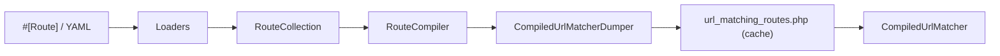

# Configuring Routes

!!! tip "In a nutshell"
    Une route associe un path d'URL à un controller sous un nom unique ; déclarez-la avec
    l'attribut `#[Route]` (ou en YAML) et le tout se compile en une seule `RouteCollection`.
    Réflexe examen : l'attribut est `Symfony\Component\Routing\Attribute\Route` et le matching suit la règle du premier match gagnant, dans l'ordre de déclaration.

!!! example "Real-world analogy"
    Une route est comme une entrée dans le cahier de tri d'une salle de courrier : chaque règle
    associe un motif d'adresse (le path) à un bureau de destination (le controller) sous une
    étiquette unique (le nom). L'employé lit les règles strictement de haut en bas et remet la
    lettre au *premier* bureau dont le motif correspond — jamais au « plus spécifique » — c'est
    pourquoi les règles étroites doivent figurer au-dessus des règles fourre-tout. Le cahier
    entier est tapé et plastifié une fois pour toutes (compilé dans un fichier de cache), si bien
    que chaque lettre entrante est triée d'un coup d'œil, sans relire la politique.

!!! abstract "Learning objectives"
    À la fin de ce chapitre, vous saurez :

    - [ ] Définir une route avec l'attribut `#[Route]` et son équivalent YAML
    - [ ] Associer un nom de route, un path et un controller, et appliquer un préfixe au niveau de la classe
    - [ ] Importer des ressources de routes et expliquer comment une `RouteCollection` est construite
    - [ ] Décrire comment les routes se compilent dans le matcher mis en cache

    **Syllabus:** `Routing → Configuration` ·
    **Level:** Advanced ·
    **Est. time:** 25 min ·
    **Prerequisites:** [Controllers](../controllers/index.md)

---

## Theory

Une **route** lie un *path* d'URL à un *controller*, sous un *nom* unique. Symfony 8
offre deux façons de premier plan de déclarer des routes (le syllabus ne couvre que
celles-ci) :

- **Attributs PHP** — `#[Route]` sur la classe du controller et/ou la méthode. C'est
  le choix par défaut recommandé : la route vit à côté du code qu'elle déclenche.
- **YAML** — des fichiers déclaratifs sous `config/routes/`, utiles pour des définitions
  tierces ou de simples préfixes, quand vous ne pouvez pas modifier le controller.

```php
// #[Route] attribute — the route sits next to the code it triggers
use Symfony\Component\Routing\Attribute\Route;

#[Route('/blog/{slug}', name: 'blog_show', methods: ['GET'])]
public function show(string $slug): Response { /* ... */ }

// The YAML equivalent lives in a file under config/routes/ (see below)
```

Les trois éléments obligatoires d'une route sont son **nom** (une clé chaîne, utilisée
pour la génération d'URL), son **path** (le motif d'URL avec des `{placeholders}`) et son
**controller** (le callable à exécuter). Tout le reste — méthodes, host,
requirements, defaults — est un raffinement optionnel.

```yaml
# config/routes/blog.yaml — the three mandatory pieces of a route
blog_show:                                            # name (unique key)
    path: /blog/{slug}                                # path with a {placeholder}
    controller: App\Controller\BlogController::show   # controller to run
```

!!! question "Predict first"
    Deux routes matchent toutes deux `/blog/latest` — l'une est déclarée avant l'autre.
    Quel controller s'exécute, et la route la *plus spécifique* remporte-t-elle l'égalité ?

??? note "Reveal"
    La route déclarée en **premier** gagne. Le matching suit la règle du premier match
    gagnant sur la `RouteCollection` ordonnée ; la spécificité n'entre pas en jeu — c'est
    pourquoi vous devez placer les routes spécifiques avant les routes fourre-tout.

## Deep Dive — how it works internally

Chaque route déclarée devient un objet `Symfony\Component\Routing\Route`, collecté
dans une `Symfony\Component\Routing\RouteCollection` (une map ordonnée nom → Route).
**L'ordre compte** : le matcher retourne la *première* route dont le path matche, donc
les routes les plus spécifiques doivent précéder les routes fourre-tout.

```php
use Symfony\Component\Routing\Route;
use Symfony\Component\Routing\RouteCollection;

$routes = new RouteCollection();          // ordered map: name -> Route
$routes->add('blog_latest', new Route('/blog/latest'));
$routes->add('blog_show', new Route('/blog/{slug}'));
// GET /blog/latest -> 'blog_latest' wins: first match in insertion order
```

Les loaders construisent la collection. Les attributs `#[Route]` sont lus par
`Symfony\Component\Routing\Loader\AttributeClassLoader` (via
l'`AttributeRouteControllerLoader` du framework) ; le YAML par `YamlFileLoader`. Tous
les loaders implémentent `Symfony\Component\Config\Loader\LoaderInterface` et sont
orchestrés par un `DelegatingLoader`.

Au warm-up, chaque `Route` est compilée par `Symfony\Component\Routing\RouteCompiler`
en une `Symfony\Component\Routing\CompiledRoute` : un **préfixe statique**, une **regex**
et une **liste de tokens**. La collection entière est dumpée par
`CompiledUrlMatcherDumper` dans un fichier unique, `url_matching_routes.php`, dans le
répertoire de cache. À chaque request, `Symfony\Component\Routing\Router` charge ce
fichier et instancie `Symfony\Component\Routing\Matcher\CompiledUrlMatcher` — aucun
parsing de routes n'a lieu à l'exécution, si bien que le matching se réduit
essentiellement à des lookups de tableaux/regex qu'`opcache` garde en mémoire.



!!! note "Source reference"
    `Symfony\Component\Routing\Router::getMatcher()` dumpe vers
    `{cache_dir}/url_matching_routes.php` —
    [symfony/symfony `8.0`](https://github.com/symfony/symfony/blob/8.0/src/Symfony/Component/Routing/Router.php).

### Naming and precedence

Si vous omettez `name:` sur un attribut, Symfony en génère un à partir de la classe et
de la méthode (`app_blog_index`). Préférez des noms explicites — les noms générés sont
fragiles et cassent les appels à `generateUrl()` quand vous renommez des méthodes.

```php
// No name: given -> Symfony generates "app_blog_index" from class + method
#[Route('/blog')]
public function index(): Response { /* ... */ }

// Explicit name: survives a method rename
#[Route('/blog', name: 'app_blog_index')]
public function index(): Response { /* ... */ }

// generateUrl() targets the name, not the method
$url = $this->generateUrl('app_blog_index'); // "/blog"
```

## Configuration & code

=== "PHP Attributes"

    ```php
    <?php
    declare(strict_types=1);

    namespace App\Controller;

    use Symfony\Bundle\FrameworkBundle\Controller\AbstractController;
    use Symfony\Component\HttpFoundation\Response;
    use Symfony\Component\Routing\Attribute\Route;

    #[Route('/blog', name: 'app_blog_')] // class-level prefix (path + name)
    final class BlogController extends AbstractController
    {
        #[Route('', name: 'index', methods: ['GET'])]
        public function index(): Response
        {
            return $this->render('blog/index.html.twig');
        }

        #[Route('/{slug}', name: 'show', methods: ['GET'])]
        public function show(string $slug): Response
        {
            return $this->render('blog/show.html.twig', ['slug' => $slug]);
        }
    }
    ```

=== "YAML"

    ```yaml
    # config/routes/blog.yaml
    app_blog_index:
        path: /blog
        controller: App\Controller\BlogController::index
        methods: [GET]

    app_blog_show:
        path: /blog/{slug}
        controller: App\Controller\BlogController::show
        methods: [GET]
    ```

=== "YAML import"

    ```yaml
    # config/routes.yaml
    controllers:
        resource:
            path: ../src/Controller/
            namespace: App\Controller
        type: attribute        # import #[Route] attributes

    api:
        resource: routes/api.yaml
        prefix: /api           # prefix every imported path
        name_prefix: api_      # prefix every imported name
    ```

=== "Console"

    ```console
    $ php bin/console debug:router app_blog_show
    ```

Le `#[Route]` au niveau de la classe fusionne avec les routes de méthode : les paths se
concatènent et le `name` devient un préfixe, si bien que `index` ci-dessus se résout en
un nom `app_blog_index` au path `/blog`.

## Best practices & anti-patterns

| ✅ À faire | ❌ À éviter |
|---|---|
| Donner à chaque route un `name` explicite et stable | Se reposer sur les noms auto-générés |
| Garder `#[Route]` à côté de son controller | Répartir une action entre YAML + attribut |
| Utiliser des préfixes de classe pour regrouper | Répéter `/admin` sur chaque méthode |
| Ordonner les routes spécifiques avant les fourre-tout | Un `/{slug}` gourmand masquant les routes suivantes |

## When (not) to use it / alternatives

Utilisez les **attributs** pour les controllers de l'application — colocalisés et sûrs
au refactoring. Utilisez le **YAML** quand vous ne pouvez pas toucher au controller
(routes vendor importées) ou pour une définition de simple redirection/préfixe. Les deux
compilent vers la même `RouteCollection` ; il n'y a aucune différence de performance à
l'exécution.

!!! danger "Certification traps"
    - La classe de `#[Route]` est `Symfony\Component\Routing\Attribute\Route` — l'ancienne
      `Annotation\Route` est **supprimée** dans Symfony 8.
    - Le matching de routes suit la règle du **premier match gagnant** dans l'ordre de la
      collection, pas du plus spécifique.
    - `type: attribute` (et non `annotation`) est le type de loader dans Symfony 8.
    - Un `name` au niveau de la classe est un **préfixe**, pas un nom complet.

!!! warning "Common mistakes"
    - Oublier que le path de classe est *préfixé*, produisant `/blog/blog/...`.
    - Deux routes partageant un nom — la seconde écrase silencieusement la première.

## Exercises

1. **(Basic)** Créez un `ProductController` avec une route `index` (`/products`) et une
   route `show` (`/products/{id}`), regroupées par un préfixe au niveau de la classe.
2. **(Intermediate)** Importez un `routes/legacy.yaml` sous le préfixe `/old` et le
   préfixe de nom `legacy_`, puis vérifiez avec `debug:router`.

??? success "Solutions"

    **1.**

    ```php
    <?php
    declare(strict_types=1);

    namespace App\Controller;

    use Symfony\Bundle\FrameworkBundle\Controller\AbstractController;
    use Symfony\Component\HttpFoundation\Response;
    use Symfony\Component\Routing\Attribute\Route;

    #[Route('/products', name: 'app_product_')]
    final class ProductController extends AbstractController
    {
        #[Route('', name: 'index', methods: ['GET'])]
        public function index(): Response
        {
            return $this->render('product/index.html.twig');
        }

        #[Route('/{id}', name: 'show', methods: ['GET'])]
        public function show(int $id): Response
        {
            return $this->render('product/show.html.twig', ['id' => $id]);
        }
    }
    ```

    Les noms se résolvent en `app_product_index` et `app_product_show`.

    **2.**

    ```yaml
    # config/routes.yaml
    legacy:
        resource: routes/legacy.yaml
        prefix: /old
        name_prefix: legacy_
    ```

    `php bin/console debug:router` liste chaque route importée avec son path `/old`
    et son préfixe de nom `legacy_`.

## Certification questions

??? question "Q1. What is the fully-qualified class of the routing attribute in Symfony 8?"
    - [ ] A. `Symfony\Component\Routing\Annotation\Route`
    - [x] B. `Symfony\Component\Routing\Attribute\Route` ✅
    - [ ] C. `Symfony\Routing\Route`
    - [ ] D. `Symfony\Component\HttpKernel\Attribute\Route`

    **Why:** la classe a déménagé dans le namespace `Attribute` ; l'alias `Annotation`
    est supprimé dans Symfony 8. **Ref:** [Routing](https://symfony.com/doc/current/routing.html).

??? question "Q2. Two routes match the same path. Which wins?"
    - [x] A. The one declared first in the `RouteCollection` ✅
    - [ ] B. The one with the most specific path
    - [ ] C. The one with the longest name
    - [ ] D. The last one declared

    **Why:** le matcher itère dans l'ordre d'insertion et retourne le premier match.
    **Ref:** [Routing](https://symfony.com/doc/current/routing.html).

??? question "Q3. What does a class-level `#[Route('/blog', name: 'app_blog_')]` contribute?"
    - [x] A. A path prefix and a name prefix for every method route ✅
    - [ ] B. A default controller for the class
    - [ ] C. A full route named `app_blog_`
    - [ ] D. Nothing without `methods`

    **Why:** les données de route au niveau de la classe sont fusionnées comme préfixes dans la route de chaque action.
    **Ref:** [Routing](https://symfony.com/doc/current/routing.html#creating-routes-as-attributes).

??? question "Q4. Which `type` imports `#[Route]` attributes in a YAML resource?"
    - [ ] A. `type: annotation`
    - [x] B. `type: attribute` ✅
    - [ ] C. `type: php`
    - [ ] D. `type: directory`

    **Why:** le chargement des attributs utilise `type: attribute` dans Symfony 8.
    **Ref:** [Routing](https://symfony.com/doc/current/routing.html).

## Key takeaways

- Une route = **nom + path + controller** ; le reste affine le matching.
- Attributs et YAML compilent tous deux vers une seule `RouteCollection`.
- Le matching suit la règle du **premier match gagnant** dans l'ordre de déclaration.
- Un `#[Route]` au niveau de la classe fournit des **préfixes** de path et de nom.

## Last-minute revision

!!! tip "Cheat sheet"
    - Attribut : `Symfony\Component\Routing\Attribute\Route`.
    - Fichier de cache compilé : `{cache}/url_matching_routes.php`.
    - Types d'import : `attribute`, `yaml`, `directory` ; clés `prefix`, `name_prefix`.
    - `debug:router` / `debug:router <name>` pour inspecter.

## Connections

- **Depends on:** [Controllers](../controllers/index.md) — une route existe pour pointer une URL vers un controller.
- **Reused in:** [URL generation](url-generation.md) — la même `RouteCollection` compile le generator.
- **Confused with:** [Requirements](requirements.md) — l'*ordre* de déclaration et la *spécificité* des regex décident de choses différentes.

## Official References
- [Official Symfony docs — Routing](https://symfony.com/doc/current/routing.html)
- [Symfony source — Router](https://github.com/symfony/symfony/blob/8.0/src/Symfony/Component/Routing/Router.php)
- [Symfony source — RouteCompiler](https://github.com/symfony/symfony/blob/8.0/src/Symfony/Component/Routing/RouteCompiler.php)

## Video references

!!! tip "Watch & learn"
    Voici des chaînes vidéo officielles, mises à jour en continu — cherchez-y
    "Symfony routing" pour consolider ce chapitre. Nous lions des chaînes stables plutôt que
    des vidéos individuelles pour que les références ne périment jamais.

    - [SymfonyCasts screencasts](https://symfonycasts.com/tracks/symfony) — tutoriels scénarisés à suivre en codant.
    - [Symfony official YouTube](https://www.youtube.com/@SymfonyOfficial) — conférences et keynotes SymfonyCon.
    - [Official docs for this topic](https://symfony.com/doc/current/routing.html) — certaines pages de la doc Symfony intègrent un screencast.

## Confidence check

Je suis prêt quand je peux :

- [ ] expliquer **pourquoi** les routes compilent en une seule `RouteCollection`/un seul matcher en cache
- [ ] implémenter un ensemble de `#[Route]` préfixés par la classe et un import YAML dans Symfony 8
- [ ] déboguer une route qui ne matche jamais parce qu'un fourre-tout la précède
- [ ] repérer que `Annotation\Route` / `type: annotation` est la mauvaise réponse pour Symfony 8
- [ ] expliquer comment loaders → `RouteCompiler` → `CompiledUrlMatcher` construisent le matching

---

<small>Related: [Requirements](requirements.md) · [Defaults](defaults.md) · [URL generation](url-generation.md) · [Debugging](debugging.md)</small>
