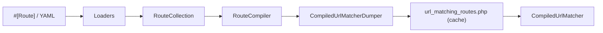

# Configuring Routes

!!! tip "In a nutshell"
    A route maps a URL path to a controller under a unique name; declare it with the
    `#[Route]` attribute (or YAML) and everything compiles into one `RouteCollection`.
    Exam hook: the attribute is `Symfony\Component\Routing\Attribute\Route` and matching is first-match-wins in declaration order.

!!! example "Real-world analogy"
    A route is like an entry in a mailroom's sorting rulebook: each rule pairs an address
    pattern (path) with a destination desk (controller) under a unique label (name). The clerk
    reads the rules strictly top to bottom and hands the letter to the *first* desk whose
    pattern fits — never the "most specific" one — which is why the narrow rules must sit above
    the broad catch-all ones. The whole rulebook is typed up and laminated once (compiled to a
    cached file), so each incoming letter is sorted by a quick glance, not by re-reading policy.

!!! abstract "Learning objectives"
    By the end of this chapter you can:

    - [ ] Define a route with the `#[Route]` attribute and its YAML equivalent
    - [ ] Map a route name, path, and controller, and apply a class-level prefix
    - [ ] Import route resources and explain how a `RouteCollection` is built
    - [ ] Describe how routes compile into the cached matcher

    **Syllabus:** `Routing → Configuration` ·
    **Level:** Advanced ·
    **Est. time:** 25 min ·
    **Prerequisites:** [Controllers](../controllers/index.md)

---

## Theory

A **route** binds a URL *path* to a *controller*, under a unique *name*. Symfony 8
offers two first-class ways to declare routes (the syllabus covers only these):

- **PHP attributes** — `#[Route]` on the controller class and/or method. This is
  the recommended default: the route lives next to the code it triggers.
- **YAML** — declarative files under `config/routes/`, useful for third-party or
  prefix-only definitions where you cannot edit the controller.

The three mandatory pieces of a route are its **name** (a string key, used for URL
generation), its **path** (the URL pattern with `{placeholders}`), and its
**controller** (the callable to run). Everything else — methods, host,
requirements, defaults — is an optional refinement.

!!! question "Predict first"
    Two routes both match `/blog/latest` — one is declared before the other. Which
    controller runs, and does the *more specific* route win the tie?

??? note "Reveal"
    The route declared **first** wins. Matching is first-match-wins over the ordered
    `RouteCollection`; specificity is irrelevant — that is why you must put specific
    routes before catch-all ones.

## Deep Dive — how it works internally

Every declared route becomes a `Symfony\Component\Routing\Route` object, collected
into a `Symfony\Component\Routing\RouteCollection` (an ordered map of name → Route).
**Order matters**: the matcher returns the *first* route whose path matches, so
more specific routes must come before catch-all ones.

Loaders build the collection. `#[Route]` attributes are read by
`Symfony\Component\Routing\Loader\AttributeClassLoader` (via the framework's
`AttributeRouteControllerLoader`); YAML by `YamlFileLoader`. All loaders implement
`Symfony\Component\Config\Loader\LoaderInterface` and are orchestrated by a
`DelegatingLoader`.

At warm-up each `Route` is compiled by `Symfony\Component\Routing\RouteCompiler`
into a `Symfony\Component\Routing\CompiledRoute`: a **static prefix**, a **regex**,
and a **token list**. The whole collection is dumped by
`CompiledUrlMatcherDumper` to a single file, `url_matching_routes.php`, in the
cache directory. On each request `Symfony\Component\Routing\Router` loads that file
and instantiates `Symfony\Component\Routing\Matcher\CompiledUrlMatcher` — no route
parsing happens at runtime, so matching is essentially array/regex lookups that
`opcache` keeps in memory.



!!! note "Source reference"
    `Symfony\Component\Routing\Router::getMatcher()` dumps to
    `{cache_dir}/url_matching_routes.php` —
    [symfony/symfony `8.0`](https://github.com/symfony/symfony/blob/8.0/src/Symfony/Component/Routing/Router.php).

### Naming and precedence

If you omit `name:` on an attribute, Symfony generates one from the class and
method (`app_blog_index`). Prefer explicit names — generated names are brittle and
break `generateUrl()` calls when you rename methods.

## Configuration & code

=== "PHP Attributes"

    ```php
    <?php
    declare(strict_types=1);

    namespace App\Controller;

    use Symfony\Bundle\FrameworkBundle\Controller\AbstractController;
    use Symfony\Component\HttpFoundation\Response;
    use Symfony\Component\Routing\Attribute\Route;

    #[Route('/blog', name: 'app_blog_')] // class-level prefix (path + name)
    final class BlogController extends AbstractController
    {
        #[Route('', name: 'index', methods: ['GET'])]
        public function index(): Response
        {
            return $this->render('blog/index.html.twig');
        }

        #[Route('/{slug}', name: 'show', methods: ['GET'])]
        public function show(string $slug): Response
        {
            return $this->render('blog/show.html.twig', ['slug' => $slug]);
        }
    }
    ```

=== "YAML"

    ```yaml
    # config/routes/blog.yaml
    app_blog_index:
        path: /blog
        controller: App\Controller\BlogController::index
        methods: [GET]

    app_blog_show:
        path: /blog/{slug}
        controller: App\Controller\BlogController::show
        methods: [GET]
    ```

=== "YAML import"

    ```yaml
    # config/routes.yaml
    controllers:
        resource:
            path: ../src/Controller/
            namespace: App\Controller
        type: attribute        # import #[Route] attributes

    api:
        resource: routes/api.yaml
        prefix: /api           # prefix every imported path
        name_prefix: api_      # prefix every imported name
    ```

=== "Console"

    ```console
    $ php bin/console debug:router app_blog_show
    ```

The class-level `#[Route]` merges with method routes: paths concatenate and the
`name` becomes a prefix, so `index` above resolves to name `app_blog_index` at
path `/blog`.

## Best practices & anti-patterns

| ✅ Do | ❌ Avoid |
|---|---|
| Give every route an explicit, stable `name` | Relying on auto-generated names |
| Keep `#[Route]` next to its controller | Splitting one action across YAML + attribute |
| Use class-level prefixes for grouping | Repeating `/admin` on every method |
| Order specific routes before catch-alls | A greedy `/{slug}` shadowing later routes |

## When (not) to use it / alternatives

Use **attributes** for application controllers — colocated and refactor-safe. Use
**YAML** when you cannot touch the controller (imported vendor routes) or need a
pure redirect/prefix definition. Both compile to the same `RouteCollection`; there
is no runtime performance difference.

!!! danger "Certification traps"
    - The `#[Route]` class is `Symfony\Component\Routing\Attribute\Route` — the old
      `Annotation\Route` is **removed** in Symfony 8.
    - Route matching is **first-match-wins** in collection order, not
      most-specific-wins.
    - `type: attribute` (not `annotation`) is the loader type in Symfony 8.
    - A class-level `name` is a **prefix**, not a full name.

!!! warning "Common mistakes"
    - Forgetting the class-level path is *prepended*, producing `/blog/blog/...`.
    - Two routes sharing a name — the later one silently overwrites the earlier.

## Exercises

1. **(Basic)** Create a `ProductController` with an `index` (`/products`) and a
   `show` (`/products/{id}`) route, grouped by a class-level prefix.
2. **(Intermediate)** Import a `routes/legacy.yaml` under prefix `/old` and name
   prefix `legacy_`, then verify with `debug:router`.

??? success "Solutions"

    **1.**

    ```php
    <?php
    declare(strict_types=1);

    namespace App\Controller;

    use Symfony\Bundle\FrameworkBundle\Controller\AbstractController;
    use Symfony\Component\HttpFoundation\Response;
    use Symfony\Component\Routing\Attribute\Route;

    #[Route('/products', name: 'app_product_')]
    final class ProductController extends AbstractController
    {
        #[Route('', name: 'index', methods: ['GET'])]
        public function index(): Response
        {
            return $this->render('product/index.html.twig');
        }

        #[Route('/{id}', name: 'show', methods: ['GET'])]
        public function show(int $id): Response
        {
            return $this->render('product/show.html.twig', ['id' => $id]);
        }
    }
    ```

    Names resolve to `app_product_index` and `app_product_show`.

    **2.**

    ```yaml
    # config/routes.yaml
    legacy:
        resource: routes/legacy.yaml
        prefix: /old
        name_prefix: legacy_
    ```

    `php bin/console debug:router` lists each imported route with its `/old` path
    and `legacy_` name prefix.

## Certification questions

??? question "Q1. What is the fully-qualified class of the routing attribute in Symfony 8?"
    - [ ] A. `Symfony\Component\Routing\Annotation\Route`
    - [x] B. `Symfony\Component\Routing\Attribute\Route` ✅
    - [ ] C. `Symfony\Routing\Route`
    - [ ] D. `Symfony\Component\HttpKernel\Attribute\Route`

    **Why:** the class moved to the `Attribute` namespace; the `Annotation` alias
    is removed in Symfony 8. **Ref:** [Routing](https://symfony.com/doc/current/routing.html).

??? question "Q2. Two routes match the same path. Which wins?"
    - [x] A. The one declared first in the `RouteCollection` ✅
    - [ ] B. The one with the most specific path
    - [ ] C. The one with the longest name
    - [ ] D. The last one declared

    **Why:** the matcher iterates in insertion order and returns the first match.
    **Ref:** [Routing](https://symfony.com/doc/current/routing.html).

??? question "Q3. What does a class-level `#[Route('/blog', name: 'app_blog_')]` contribute?"
    - [x] A. A path prefix and a name prefix for every method route ✅
    - [ ] B. A default controller for the class
    - [ ] C. A full route named `app_blog_`
    - [ ] D. Nothing without `methods`

    **Why:** class-level route data is merged as prefixes into each action's route.
    **Ref:** [Routing](https://symfony.com/doc/current/routing.html#creating-routes-as-attributes).

??? question "Q4. Which `type` imports `#[Route]` attributes in a YAML resource?"
    - [ ] A. `type: annotation`
    - [x] B. `type: attribute` ✅
    - [ ] C. `type: php`
    - [ ] D. `type: directory`

    **Why:** attribute loading uses `type: attribute` in Symfony 8.
    **Ref:** [Routing](https://symfony.com/doc/current/routing.html).

## Key takeaways

- A route = **name + path + controller**; extras refine matching.
- Attributes and YAML both compile to one `RouteCollection`.
- Matching is **first-match-wins** in declaration order.
- Class-level `#[Route]` supplies path and name **prefixes**.

## Last-minute revision

!!! tip "Cheat sheet"
    - Attribute: `Symfony\Component\Routing\Attribute\Route`.
    - Compiled cache file: `{cache}/url_matching_routes.php`.
    - Import types: `attribute`, `yaml`, `directory`; keys `prefix`, `name_prefix`.
    - `debug:router` / `debug:router <name>` to inspect.

## Connections

- **Depends on:** [Controllers](../controllers/index.md) — a route exists to point a URL at a controller.
- **Reused in:** [URL generation](url-generation.md) — the same `RouteCollection` compiles the generator.
- **Confused with:** [Requirements](requirements.md) — declaration *order* and regex *specificity* decide different things.

## Official References
- [Official Symfony docs — Routing](https://symfony.com/doc/current/routing.html)
- [Symfony source — Router](https://github.com/symfony/symfony/blob/8.0/src/Symfony/Component/Routing/Router.php)
- [Symfony source — RouteCompiler](https://github.com/symfony/symfony/blob/8.0/src/Symfony/Component/Routing/RouteCompiler.php)

## Video references

!!! tip "Watch & learn"
    These are official, continuously-updated video channels — search them for
    "Symfony routing" to reinforce this chapter. We link stable channels rather than
    individual videos so the references never rot.

    - [SymfonyCasts screencasts](https://symfonycasts.com/tracks/symfony) — scripted, code-along tutorials.
    - [Symfony official YouTube](https://www.youtube.com/@SymfonyOfficial) — SymfonyCon conference talks & keynotes.
    - [Official docs for this topic](https://symfony.com/doc/current/routing.html) — some Symfony doc pages embed a screencast.

## Confidence check

I'm ready when I can:

- [ ] explain **why** routes compile into one cached `RouteCollection`/matcher
- [ ] implement a class-prefixed `#[Route]` set and a YAML import in Symfony 8
- [ ] debug a route that never matches because a catch-all precedes it
- [ ] spot that `Annotation\Route` / `type: annotation` is the wrong Symfony 8 answer
- [ ] explain how loaders → `RouteCompiler` → `CompiledUrlMatcher` build matching

---

<small>Related: [Requirements](requirements.md) · [Defaults](defaults.md) · [URL generation](url-generation.md) · [Debugging](debugging.md)</small>
