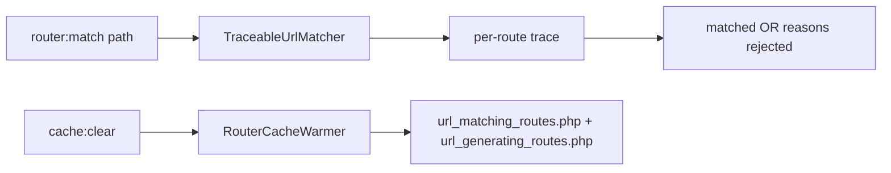

# Router Debugging

!!! tip "In a nutshell"
    `debug:router` liste/inspecte les routes ; `router:match <path>` simule une request et
    (via `TraceableUrlMatcher`) explique pourquoi chaque route a matché ou a été rejetée.
    Réflexe examen : en prod, le router compilé n'est pas rafraîchi automatiquement — après avoir modifié des routes, vous devez vider/réchauffer le cache.

!!! example "Real-world analogy"
    `router:match` est comme le simulateur d'itinéraire d'un GPS de voiture : vous saisissez une
    destination et il vous dit non seulement quelle route il prendrait, mais aussi *pourquoi* il a
    rejeté les autres — « cette rue est en sens interdit » (mauvaise méthode), « cette route est
    interdite aux camions » (mauvais host). Mais le GPS roule à partir d'une carte téléchargée sur
    l'appareil : en production, installer de nouveaux panneaux sur le terrain ne change rien tant que
    vous n'avez pas retéléchargé la carte (`cache:clear`), alors que l'appareil de dev remarque que
    les panneaux ont changé et se rafraîchit tout seul.

!!! abstract "Learning objectives"
    À la fin de ce chapitre, vous saurez :

    - [ ] Inspecter toutes les routes et une route donnée avec `debug:router`
    - [ ] Simuler un match avec `router:match` (path, méthode, host, scheme)
    - [ ] Expliquer le cache du router compilé et quand le vider
    - [ ] Lire les routes matchées vs générées dans le profiler

    **Syllabus:** `Routing → Router debugging` ·
    **Level:** Advanced ·
    **Est. time:** 18 min ·
    **Prerequisites:** [Configuration](configuration.md), [Methods](methods.md)

---

## Pour les nuls

### L'idée en une phrase
`router:match` simule une requête et t'explique précisément pourquoi chaque route a matché ou a été rejetée — un GPS pour le routeur.

### Imagine dans la vraie vie
`router:match` ressemble à un simulateur d'itinéraire GPS : tu entres une destination et il te dit non seulement quelle route il prendrait, mais *pourquoi* il a rejeté les autres — "cette rue est en sens interdit dans ce sens" (mauvaise méthode), "cette route est interdite aux camions" (mauvais host).

### Dans Symfony
Avant de déboguer "pourquoi mon URL donne-t-elle un 404 ?", lance `php bin/console router:match /mon-url` — la réponse (aucune route ne correspond, ou laquelle correspond) apparaît immédiatement, sans avoir à parcourir tout `mkdocs.yml` équivalent en config de routes.

### Exemple simple
```console
$ php bin/console router:match /produits/42 --method=POST
```

### Comment le mémoriser 🧠
Le GPS conduit depuis une carte téléchargée sur l'appareil : en production, changer les routes ne change rien tant que tu n'as pas "retéléchargé la carte" (`cache:clear`) — contrairement à `dev`, qui détecte le changement tout seul.


## Theory

Deux commandes console répondent aux questions de routing du quotidien :

- `debug:router` — liste chaque route avec sa méthode, son scheme, son host et son path ;
  passez un nom pour voir la définition complète d'une route (defaults, requirements,
  condition).
- `router:match <path>` — demande au matcher « quelle route cette URL toucherait-elle ? »,
  y compris *pourquoi* les autres ont été rejetées. Elle accepte `--method`, `--host` et
  `--scheme` pour reproduire les conditions exactes de la request.

```console
# debug:router — list everything, or show one route's full definition
$ php bin/console debug:router
$ php bin/console debug:router blog_show

# router:match — simulate a request with exact conditions
$ php bin/console router:match /blog/hello --method=POST --host=example.com --scheme=https
```

Les deux lisent la même `RouteCollection` compilée que l'application utilise : ce
qu'elles rapportent est ce que fait la production.

!!! question "Predict first"
    Vous modifiez des routes en **prod** et rechargez la page — l'ancien comportement
    persiste. Pourquoi, et qu'est-ce qui corrige cela ?

??? note "Reveal"
    Le router compilé est construit au warmup du cache et n'est **pas** rafraîchi
    automatiquement en prod : exécutez `cache:clear` / `cache:warmup`. (En `dev`, les
    fichiers de routes sont suivis comme ressources de cache et se reconstruisent
    automatiquement.)

## Deep Dive — how it works internally

`debug:router` (`RouterDebugCommand`) dumpe la `RouteCollection` via le service
`router` du framework. `router:match` (`RouterMatchCommand`) construit un
`RequestContext` à partir de vos options et exécute un
`Symfony\Component\Routing\Matcher\TraceableUrlMatcher`
— un matcher qui enregistre chaque route essayée et la raison de son succès ou de son
échec (path non conforme, méthode non autorisée, host non conforme, condition échouée).
C'est cette trace qui lui permet de vous dire qu'une route « a presque matché mais la
méthode était mauvaise ».

```php
use Symfony\Component\Routing\Matcher\TraceableUrlMatcher;
use Symfony\Component\Routing\RequestContext;

// What RouterMatchCommand does (RouterDebugCommand just dumps the collection);
// $routes is the RouteCollection from the framework's `router` service
$context = new RequestContext(method: 'POST');   // built from --method/--host/--scheme
$matcher = new TraceableUrlMatcher($routes, $context);

foreach ($matcher->getTraces('/blog/hello') as $trace) {
    // $trace['name'] + $trace['log'], e.g. "Method 'POST' does not match: GET, HEAD"
}
```

Souvenez-vous du [cache compilé](configuration.md) : les routes sont dumpées vers
`{cache_dir}/url_matching_routes.php` et `url_generating_routes.php`. En `dev`,
Symfony suit les fichiers de routes comme **ressources** de cache et reconstruit
automatiquement quand ils changent. En `prod`, le cache est construit par le
`RouterCacheWarmer` pendant `cache:clear`/`cache:warmup` et n'est **pas** rafraîchi
automatiquement — donc **après avoir modifié des routes en prod, vous devez vider le
cache**, sinon l'ancien matcher/generator persiste.



!!! note "Source reference"
    `RouterMatchCommand` utilise `TraceableUrlMatcher` ;
    `RouterCacheWarmer` réchauffe les fichiers compilés —
    [debug command](https://github.com/symfony/symfony/blob/8.0/src/Symfony/Bundle/FrameworkBundle/Command/RouterMatchCommand.php) ·
    [TraceableUrlMatcher](https://github.com/symfony/symfony/blob/8.0/src/Symfony/Component/Routing/Matcher/TraceableUrlMatcher.php).

## Configuration & code

=== "List & inspect"

    ```console
    $ php bin/console debug:router
    ---------------- -------- -------- ------ -----------------------
     Name             Method   Scheme   Host   Path
    ---------------- -------- -------- ------ -----------------------
     app_blog_index   GET      ANY      ANY    /blog
     blog_show        GET      ANY      ANY    /blog/{slug}
    ---------------- -------- -------- ------ -----------------------

    $ php bin/console debug:router blog_show
    ```

=== "Simulate a match"

    ```console
    $ php bin/console router:match /blog/hello --method=GET
    [OK] Route "blog_show" matches

    $ php bin/console router:match /blog/hello --method=POST
    None of the routes match the path "/blog/hello" with method "POST"
    # (shows blog_show rejected: method not allowed)
    ```

=== "Cache implications"

    ```console
    # After editing routes in prod, rebuild the compiled router:
    $ php bin/console cache:clear --env=prod

    # Or warm explicitly:
    $ php bin/console cache:warmup --env=prod
    ```

Le panneau **Routing** du profiler affiche la `_route` matchée et ses paramètres pour la
request courante ; la web debug toolbar y renvoie directement.

## Best practices & anti-patterns

| ✅ À faire | ❌ À éviter |
|---|---|
| Utiliser `router:match` avec `--method/--host` | Deviner pourquoi une route renvoie un 404 |
| `cache:clear` après un changement de routes en prod | Modifier les routes en prod sans vider le cache |
| Vérifier les regex avec `debug:router <name>` | Supposer qu'un `<...>` inline a compilé comme prévu |
| Lire le panneau Routing du profiler | Ajouter des `dump()` dans les controllers pour trouver `_route` |

## When (not) to use it / alternatives

`router:match` est le moyen le plus rapide de déboguer la précédence et les confusions
405/404. Pour les problèmes de génération (mauvais host/scheme), inspectez
`RequestContext`/`default_uri` plutôt que le matcher. Dans les tests, faites des
assertions sur `$client->getRequest()->attributes->get('_route')`
plutôt que de scraper le HTML.

!!! danger "Certification traps"
    - En **prod**, des routes modifiées exigent une **reconstruction du cache** ; le
      matcher compilé n'est pas rafraîchi automatiquement.
    - `router:match` utilise un **TraceableUrlMatcher** et rapporte *pourquoi* les routes
      échouent — pas seulement la gagnante.
    - `debug:router` montre la vue **compilée**, y compris scheme/host = `ANY`.
    - Les fichiers compilés sont `url_matching_routes.php` et `url_generating_routes.php`.

!!! warning "Common mistakes"
    - S'attendre à ce que de nouvelles routes fonctionnent en prod sans `cache:clear`.
    - Lancer `router:match` sans `--method` et prendre un 405 pour une absence de match.
    - Confondre `debug:router` (liste statique) avec `router:match` (simulation en direct).

## Exercises

1. **(Basic)** Listez toutes les routes, puis affichez la définition complète de l'une
   d'elles par son nom.
2. **(Intermediate)** Utilisez `router:match` pour prouver que `POST /blog/hello` est
   rejeté à cause de la méthode alors que `GET /blog/hello` matche.

??? success "Solutions"

    **1.**

    ```console
    $ php bin/console debug:router
    $ php bin/console debug:router blog_show
    ```

    **2.**

    ```console
    $ php bin/console router:match /blog/hello --method=GET
    # [OK] Route "blog_show" matches
    $ php bin/console router:match /blog/hello --method=POST
    # No match: blog_show rejected (method GET/HEAD only)
    ```

## Certification questions

??? question "Q1. Which command simulates matching a specific URL?"
    - [ ] A. `debug:router`
    - [x] B. `router:match` ✅
    - [ ] C. `debug:route`
    - [ ] D. `router:debug`

    **Why:** `router:match` exécute le matcher (traçable) contre un path donné.
    **Ref:** [Routing](https://symfony.com/doc/8.0/routing.html#debugging-routes).

??? question "Q2. After changing routes in the prod environment you must…"
    - [x] A. Clear/warm the cache (`cache:clear`) ✅
    - [ ] B. Restart PHP-FPM only
    - [ ] C. Nothing — routes always reload
    - [ ] D. Delete `vendor/`

    **Why:** le router compilé est construit au warmup du cache et n'est pas rafraîchi
    automatiquement en prod. **Ref:** [Routing](https://symfony.com/doc/8.0/routing.html).

??? question "Q3. What does `router:match` use to explain rejections?"
    - [x] A. `TraceableUrlMatcher` ✅
    - [ ] B. `CompiledUrlGenerator`
    - [ ] C. `RequestContext`
    - [ ] D. `RouteCollection` only

    **Why:** le matcher traçable enregistre le résultat pour chaque route candidate.
    **Ref:** [TraceableUrlMatcher](https://github.com/symfony/symfony/blob/8.0/src/Symfony/Component/Routing/Matcher/TraceableUrlMatcher.php).

??? question "Q4. Which files hold the compiled router in the cache dir?"
    - [x] A. `url_matching_routes.php` and `url_generating_routes.php` ✅
    - [ ] B. `routes.php` and `router.php`
    - [ ] C. `matcher.php` and `generator.php`
    - [ ] D. `RouteCollection.php`

    **Why:** les dumpers écrivent ces deux fichiers compilés.
    **Ref:** [Router source](https://github.com/symfony/symfony/blob/8.0/src/Symfony/Component/Routing/Router.php).

## Key takeaways

- `debug:router` liste/inspecte ; `router:match` simule une request.
- `router:match` utilise `TraceableUrlMatcher` et explique *pourquoi* les routes échouent.
- Les changements de routes en prod exigent une **reconstruction du cache**.
- Fichiers compilés : `url_matching_routes.php`, `url_generating_routes.php`.

## Last-minute revision

!!! tip "Cheat sheet"
    - `debug:router [name]` · `router:match <path> --method --host --scheme`.
    - Prod : `cache:clear` après modification des routes.
    - Profiler → panneau Routing affiche `_route`.

## Connections

- **Depends on:** [Configuration](configuration.md) — les deux commandes lisent la même `RouteCollection` compilée.
- **Reused in:** [Methods](methods.md) — `router:match --method` distingue un 405 d'un 404.
- **Confused with:** [URL generation](url-generation.md) — la `_route` du matcher vs le fichier compilé séparé du generator.

## Official References
- [Official Symfony docs — Debugging routes](https://symfony.com/doc/8.0/routing.html#debugging-routes)
- [Symfony source — RouterMatchCommand](https://github.com/symfony/symfony/blob/8.0/src/Symfony/Bundle/FrameworkBundle/Command/RouterMatchCommand.php)

## Video references

!!! tip "Watch & learn"
    Voici des chaînes vidéo officielles, mises à jour en continu — cherchez-y
    "Symfony routing" pour consolider ce chapitre. Nous lions des chaînes stables plutôt que
    des vidéos individuelles pour que les références ne périment jamais.

    - [SymfonyCasts screencasts](https://symfonycasts.com/tracks/symfony) — tutoriels scénarisés à suivre en codant.
    - [Symfony official YouTube](https://www.youtube.com/@SymfonyOfficial) — conférences et keynotes SymfonyCon.
    - [Official docs for this topic](https://symfony.com/doc/8.0/routing.html#debugging-routes) — certaines pages de la doc Symfony intègrent un screencast.

## Confidence check

Je suis prêt quand je peux :

- [ ] expliquer le cache du router compilé en dev vs prod et quand le vider
- [ ] implémenter des invocations de `debug:router` et `router:match` dans Symfony 8
- [ ] déboguer une route qui renvoie 404/405 à l'aide de la sortie de `TraceableUrlMatcher`
- [ ] repérer que les changements de routes en prod exigent une reconstruction du cache (pas un simple rechargement)
- [ ] expliquer les deux fichiers compilés et le panneau Routing du profiler

---

<small>Related: [Configuration](configuration.md) · [Methods](methods.md) · [Conditions](conditions.md) · [URL generation](url-generation.md)</small>
