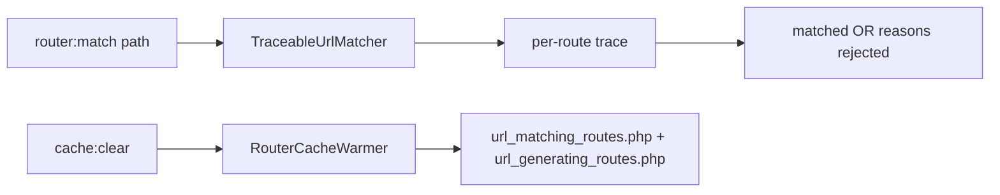

# Router Debugging

!!! tip "In a nutshell"
    `debug:router` lists/inspects routes; `router:match <path>` simulates a request and
    (via `TraceableUrlMatcher`) explains why each route matched or was rejected.
    Exam hook: in prod the compiled router is not auto-refreshed — after changing routes you must clear/warm the cache.

!!! example "Real-world analogy"
    `router:match` is like a car GPS route simulator: you punch in a destination and it not only
    tells you which road it would take, but *why* it rejected the others — "that street is
    one-way the wrong direction" (wrong method), "that road is closed to trucks" (wrong host).
    But the GPS drives from a map downloaded onto the device: in production, putting up new road
    signs out in the field changes nothing until you re-download the map (`cache:clear`), whereas
    the dev unit notices the signs changed and refreshes on its own.

!!! abstract "Learning objectives"
    By the end of this chapter you can:

    - [ ] Inspect all routes and one route with `debug:router`
    - [ ] Simulate a match with `router:match` (path, method, host, scheme)
    - [ ] Explain the compiled-router cache and when to clear it
    - [ ] Read matched vs generated routes in the profiler

    **Syllabus:** `Routing → Router debugging` ·
    **Level:** Advanced ·
    **Est. time:** 18 min ·
    **Prerequisites:** [Configuration](configuration.md), [Methods](methods.md)

---

## Theory

Two console commands answer the everyday routing questions:

- `debug:router` — lists every route with method, scheme, host and path; pass a
  name to see one route's full definition (defaults, requirements, condition).
- `router:match <path>` — asks the matcher "which route would this URL hit?",
  including *why* others were rejected. It accepts `--method`, `--host` and
  `--scheme` to reproduce the exact request conditions.

Both read the same compiled `RouteCollection` the app uses, so what they report is
what production does.

!!! question "Predict first"
    You edit routes in **prod** and reload the page — the old behaviour persists.
    Why, and what fixes it?

??? note "Reveal"
    The compiled router is built at cache warmup and is **not** auto-refreshed in
    prod, so run `cache:clear` / `cache:warmup`. (In `dev` the route files are tracked
    as cache resources and rebuild automatically.)

## Deep Dive — how it works internally

`debug:router` (`RouterDebugCommand`) dumps the `RouteCollection` via the framework's
`router` service. `router:match` (`RouterMatchCommand`) builds a `RequestContext`
from your options and runs a `Symfony\Component\Routing\Matcher\TraceableUrlMatcher`
— a matcher that records each route it tried and the reason it passed or failed
(path mismatch, method not allowed, host mismatch, failed condition). That trace is
what lets it tell you a route "almost matched but the method was wrong".

Remember the [compiled cache](configuration.md): routes are dumped to
`{cache_dir}/url_matching_routes.php` and `url_generating_routes.php`. In `dev`,
Symfony tracks the route files as cache **resources** and rebuilds automatically
when they change. In `prod`, the cache is built by the `RouterCacheWarmer` during
`cache:clear`/`cache:warmup` and is **not** auto-refreshed — so **after changing
routes in prod you must clear the cache** or the old matcher/generator persists.



!!! note "Source reference"
    `RouterMatchCommand` uses `TraceableUrlMatcher`;
    `RouterCacheWarmer` warms the compiled files —
    [debug command](https://github.com/symfony/symfony/blob/8.0/src/Symfony/Bundle/FrameworkBundle/Command/RouterMatchCommand.php) ·
    [TraceableUrlMatcher](https://github.com/symfony/symfony/blob/8.0/src/Symfony/Component/Routing/Matcher/TraceableUrlMatcher.php).

## Configuration & code

=== "List & inspect"

    ```console
    $ php bin/console debug:router
    ---------------- -------- -------- ------ -----------------------
     Name             Method   Scheme   Host   Path
    ---------------- -------- -------- ------ -----------------------
     app_blog_index   GET      ANY      ANY    /blog
     blog_show        GET      ANY      ANY    /blog/{slug}
    ---------------- -------- -------- ------ -----------------------

    $ php bin/console debug:router blog_show
    ```

=== "Simulate a match"

    ```console
    $ php bin/console router:match /blog/hello --method=GET
    [OK] Route "blog_show" matches

    $ php bin/console router:match /blog/hello --method=POST
    None of the routes match the path "/blog/hello" with method "POST"
    # (shows blog_show rejected: method not allowed)
    ```

=== "Cache implications"

    ```console
    # After editing routes in prod, rebuild the compiled router:
    $ php bin/console cache:clear --env=prod

    # Or warm explicitly:
    $ php bin/console cache:warmup --env=prod
    ```

The profiler's **Routing** panel shows the matched `_route` and its parameters for
the current request; the web debug toolbar links straight to it.

## Best practices & anti-patterns

| ✅ Do | ❌ Avoid |
|---|---|
| Use `router:match` with `--method/--host` | Guessing why a route 404s |
| `cache:clear` after prod route changes | Editing routes in prod without clearing |
| Check `debug:router <name>` for regexes | Assuming inline `<...>` compiled as expected |
| Read the profiler Routing panel | Adding `dump()` in controllers to find `_route` |

## When (not) to use it / alternatives

`router:match` is the fastest way to debug precedence and 405/404 confusion. For
generation problems (wrong host/scheme), inspect `RequestContext`/`default_uri`
rather than the matcher. In tests, assert on `$client->getRequest()->attributes->get('_route')`
instead of scraping HTML.

!!! danger "Certification traps"
    - In **prod**, changed routes need a **cache rebuild**; the compiled matcher is
      not auto-refreshed.
    - `router:match` uses a **TraceableUrlMatcher** and reports *why* routes fail —
      not just the winner.
    - `debug:router` shows the **compiled** view, including scheme/host = `ANY`.
    - The compiled files are `url_matching_routes.php` and `url_generating_routes.php`.

!!! warning "Common mistakes"
    - Expecting new routes to work in prod without `cache:clear`.
    - Running `router:match` without `--method` and misreading a 405 as a no-match.
    - Confusing `debug:router` (static list) with `router:match` (live simulation).

## Exercises

1. **(Basic)** List all routes, then show the full definition of one by name.
2. **(Intermediate)** Use `router:match` to prove that `POST /blog/hello` is
   rejected by method while `GET /blog/hello` matches.

??? success "Solutions"

    **1.**

    ```console
    $ php bin/console debug:router
    $ php bin/console debug:router blog_show
    ```

    **2.**

    ```console
    $ php bin/console router:match /blog/hello --method=GET
    # [OK] Route "blog_show" matches
    $ php bin/console router:match /blog/hello --method=POST
    # No match: blog_show rejected (method GET/HEAD only)
    ```

## Certification questions

??? question "Q1. Which command simulates matching a specific URL?"
    - [ ] A. `debug:router`
    - [x] B. `router:match` ✅
    - [ ] C. `debug:route`
    - [ ] D. `router:debug`

    **Why:** `router:match` runs the (traceable) matcher against a given path.
    **Ref:** [Routing](https://symfony.com/doc/current/routing.html#debugging-routes).

??? question "Q2. After changing routes in the prod environment you must…"
    - [x] A. Clear/warm the cache (`cache:clear`) ✅
    - [ ] B. Restart PHP-FPM only
    - [ ] C. Nothing — routes always reload
    - [ ] D. Delete `vendor/`

    **Why:** the compiled router is built at cache warmup and not auto-refreshed in
    prod. **Ref:** [Routing](https://symfony.com/doc/current/routing.html).

??? question "Q3. What does `router:match` use to explain rejections?"
    - [x] A. `TraceableUrlMatcher` ✅
    - [ ] B. `CompiledUrlGenerator`
    - [ ] C. `RequestContext`
    - [ ] D. `RouteCollection` only

    **Why:** the traceable matcher records the outcome for each candidate route.
    **Ref:** [TraceableUrlMatcher](https://github.com/symfony/symfony/blob/8.0/src/Symfony/Component/Routing/Matcher/TraceableUrlMatcher.php).

??? question "Q4. Which files hold the compiled router in the cache dir?"
    - [x] A. `url_matching_routes.php` and `url_generating_routes.php` ✅
    - [ ] B. `routes.php` and `router.php`
    - [ ] C. `matcher.php` and `generator.php`
    - [ ] D. `RouteCollection.php`

    **Why:** the dumpers write these two compiled files.
    **Ref:** [Router source](https://github.com/symfony/symfony/blob/8.0/src/Symfony/Component/Routing/Router.php).

## Key takeaways

- `debug:router` lists/inspects; `router:match` simulates a request.
- `router:match` uses `TraceableUrlMatcher` and explains *why* routes fail.
- Prod route changes require a **cache rebuild**.
- Compiled files: `url_matching_routes.php`, `url_generating_routes.php`.

## Last-minute revision

!!! tip "Cheat sheet"
    - `debug:router [name]` · `router:match <path> --method --host --scheme`.
    - Prod: `cache:clear` after route edits.
    - Profiler → Routing panel shows `_route`.

## Connections

- **Depends on:** [Configuration](configuration.md) — both commands read the same compiled `RouteCollection`.
- **Reused in:** [Methods](methods.md) — `router:match --method` distinguishes a 405 from a 404.
- **Confused with:** [URL generation](url-generation.md) — the matcher's `_route` vs the generator's separate compiled file.

## Official References
- [Official Symfony docs — Debugging routes](https://symfony.com/doc/current/routing.html#debugging-routes)
- [Symfony source — RouterMatchCommand](https://github.com/symfony/symfony/blob/8.0/src/Symfony/Bundle/FrameworkBundle/Command/RouterMatchCommand.php)

## Video references

!!! tip "Watch & learn"
    These are official, continuously-updated video channels — search them for
    "Symfony routing" to reinforce this chapter. We link stable channels rather than
    individual videos so the references never rot.

    - [SymfonyCasts screencasts](https://symfonycasts.com/tracks/symfony) — scripted, code-along tutorials.
    - [Symfony official YouTube](https://www.youtube.com/@SymfonyOfficial) — SymfonyCon conference talks & keynotes.
    - [Official docs for this topic](https://symfony.com/doc/current/routing.html#debugging-routes) — some Symfony doc pages embed a screencast.

## Confidence check

I'm ready when I can:

- [ ] explain the dev vs prod compiled-router cache and when to clear it
- [ ] implement `debug:router` and `router:match` invocations in Symfony 8
- [ ] debug a route that 404s/405s using `TraceableUrlMatcher` output
- [ ] spot that prod route changes need a cache rebuild (not just a reload)
- [ ] explain the two compiled files and the profiler Routing panel

---

<small>Related: [Configuration](configuration.md) · [Methods](methods.md) · [Conditions](conditions.md) · [URL generation](url-generation.md)</small>
