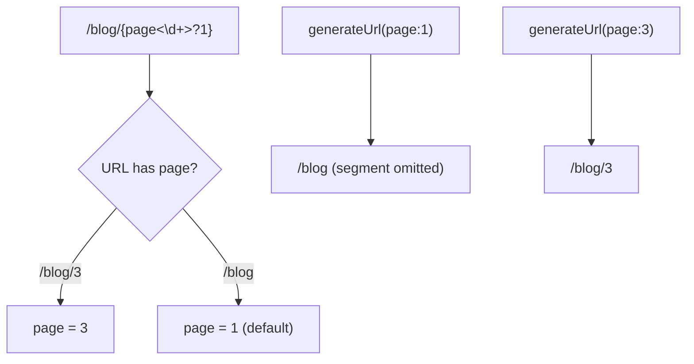

# Valeurs par défaut & paramètres optionnels

!!! tip "In a nutshell"
    Une valeur par défaut rend un placeholder optionnel, écrite en inline comme `{page<\d+>?1}` ou via
    le tableau `defaults`, de sorte que `/blog` et `/blog/2` matchent tous les deux.
    Piège d'examen : seuls les placeholders en fin de chemin peuvent être optionnels, et la génération omet un segment dont la valeur est égale à sa valeur par défaut.

!!! example "Real-world analogy"
    Pensez à un formulaire d'adresse postale où la dernière ligne — disons « Appartement 1 » — est
    optionnelle et supposée quand elle est laissée vide. Vous pouvez omettre cette dernière ligne
    et la lettre arrive quand même, mais vous ne pouvez pas laisser la *rue* vide tout en gardant
    l'appartement, car le lecteur n'aurait aucun moyen de savoir quelle ligne manque. Et quand
    vous écrivez l'adresse d'un appartement qui *est* le numéro 1, vous omettez simplement cette
    ligne entièrement — la forme canonique la plus courte — plutôt que d'écrire de façon
    redondante la valeur par défaut que tout le monde suppose déjà.

!!! abstract "Learning objectives"
    À la fin de ce chapitre, vous saurez :

    - [ ] Donner une valeur par défaut à un placeholder avec `defaults` et en inline `{page<\d+>?1}`
    - [ ] Expliquer pourquoi seuls les paramètres en fin de chemin peuvent être optionnels
    - [ ] Prédire quelle URL est générée quand une valeur est égale à sa valeur par défaut
    - [ ] Combiner requirements et valeurs par défaut sur le même placeholder

    **Syllabus:** `Routing → Default values` ·
    **Level:** Advanced ·
    **Est. time:** 20 min ·
    **Prerequisites:** [Requirements](requirements.md)

---

## Pour les nuls

### L'idée en une phrase
Une valeur par défaut rend un paramètre optionnel — et seul le **dernier** paramètre d'une route peut être optionnel.

### Imagine dans la vraie vie
Un formulaire d'adresse postale où la dernière ligne — "Appartement 1" — est optionnelle et supposée quand elle est vide. Tu peux omettre cette ligne finale et la lettre arrive quand même, mais tu ne peux pas laisser la *rue* vide tout en gardant l'appartement — le facteur ne saurait pas quelle ligne manque.

### Dans Symfony
`{page<\d+>?1}` rend `/blog` équivalent à `/blog/1` — mais on ne peut jamais rendre un segment du milieu optionnel sans rendre tous les segments qui le suivent optionnels aussi.

### Exemple simple
```php
#[Route('/blog/{page<\d+>?1}')] // /blog et /blog/2 matchent tous les deux
```

### Comment le mémoriser 🧠
Seuls les paramètres **en fin de route** peuvent être optionnels — comme la dernière ligne d'une adresse, jamais une ligne au milieu.

A **default value** makes a placeholder **optional**: if the URL omits it, the
route still matches and the controller receives the default. `/blog/{page}` with
`page` defaulting to `1` matches both `/blog` and `/blog/2`.

Two syntaxes, again equivalent:

- **Inline** — `{page<\d+>?1}`: requirement `\d+`, then `?` and the default `1`.
  Use `?` with **no value** for a `null` default.
- **`defaults` array** — `defaults: {page: 1}`.

```php
// Inline: <requirement> before ?, then the default -> /blog and /blog/7 both match
#[Route('/blog/{page<\d+>?1}', name: 'blog_list')]

// Bare ? with no value -> default is null
#[Route('/report/{format?}', name: 'report')]

// Equivalent `defaults` array form
#[Route('/blog/{page}', name: 'blog_list', requirements: ['page' => '\d+'], defaults: ['page' => 1])]
```

Crucially, **only the trailing placeholders can be optional**. `/{a}/{b}` cannot
make `a` optional while `b` is required, because the matcher cannot tell where the
missing segment was.

!!! question "Predict first"
    `page` defaults to `1`. What does `generateUrl('blog_list', ['page' => 1])`
    produce — `/blog/1` or `/blog`?

??? note "Reveal"
    `/blog`. The generator **omits** a trailing segment whose value equals its
    default, producing the canonical shortest URL. Pass `page => 2` and you get
    `/blog/2`.


## Theory

Une **valeur par défaut** rend un placeholder **optionnel** : si l'URL l'omet, la
route matche quand même et le controller reçoit la valeur par défaut. `/blog/{page}` avec
`page` valant `1` par défaut matche à la fois `/blog` et `/blog/2`.

Deux syntaxes, là encore équivalentes :

- **Inline** — `{page<\d+>?1}` : requirement `\d+`, puis `?` et la valeur par défaut `1`.
  Utilisez `?` **sans valeur** pour une valeur par défaut `null`.
- **Tableau `defaults`** — `defaults: {page: 1}`.

```php
// Inline: <requirement> before ?, then the default -> /blog and /blog/7 both match
#[Route('/blog/{page<\d+>?1}', name: 'blog_list')]

// Bare ? with no value -> default is null
#[Route('/report/{format?}', name: 'report')]

// Equivalent `defaults` array form
#[Route('/blog/{page}', name: 'blog_list', requirements: ['page' => '\d+'], defaults: ['page' => 1])]
```

Point crucial : **seuls les placeholders en fin de chemin peuvent être optionnels**. `/{a}/{b}` ne peut pas
rendre `a` optionnel alors que `b` est requis, car le matcher ne pourrait pas déterminer où se
trouve le segment manquant.

!!! question "Predict first"
    `page` vaut `1` par défaut. Que produit `generateUrl('blog_list', ['page' => 1])`
    — `/blog/1` ou `/blog` ?

??? note "Reveal"
    `/blog`. Le generator **omet** un segment final dont la valeur est égale à sa
    valeur par défaut, produisant l'URL canonique la plus courte. Passez `page => 2` et vous obtenez
    `/blog/2`.

## Deep Dive — how it works internally

Lors de la compilation, `RouteCompiler` marque un token comme **optionnel** quand le
placeholder possède une valeur par défaut *et* que chaque token qui le suit est lui aussi optionnel
(ou du texte littéral faisant partie de la queue optionnelle). Il émet des groupes optionnels
imbriqués dans la regex, par ex. `/blog(?:/(?P<page>\d+))?`, afin que tout le segment final
puisse être absent. Les valeurs par défaut elles-mêmes sont stockées sur la `Route` (`getDefaults()`) et fusionnées
dans les paramètres matchés par le matcher ; elles ne sont **pas** capturées depuis l'URL.

```php
use Symfony\Component\Routing\Route;

$route = new Route('/blog/{page}', defaults: ['page' => 1], requirements: ['page' => '\d+']);
$route->getDefaults();           // ['page' => 1] — stored on the Route
$compiled = $route->compile();   // RouteCompiler marks the trailing token optional
$compiled->getRegex();           // contains the nested group /blog(?:/(?P<page>\d+))?
```

Le même jeu de valeurs par défaut est consulté par le **generator** : quand vous appelez
`generateUrl('blog', ['page' => 1])` et que `1` est égal à la valeur par défaut, le generator
**omet** le segment final, produisant `/blog` — l'URL canonique la plus courte.
Cela garde les URLs générées stables et évite les variantes de contenu dupliqué.



!!! note "Source reference"
    La logique des tokens optionnels vit dans `RouteCompiler::compilePattern()` —
    [symfony/symfony `8.0`](https://github.com/symfony/symfony/blob/8.0/src/Symfony/Component/Routing/RouteCompiler.php).

### Non-placeholder defaults

`defaults` peut aussi transporter des valeurs qui n'apparaissent jamais dans le chemin — le plus souvent
`_format`, `_locale`, ou un `_controller`. Elles sont transmises directement aux
attributs de la request. Voir [Special attributes](special-attributes.md).

```yaml
# defaults may carry values that never appear in the path
legacy_home:
    path: /home
    defaults:
        _controller: App\Controller\HomeController::index  # callable to run
        _format: json    # request format
        _locale: en      # request locale
```

## Configuration & code

=== "PHP Attributes"

    ```php
    <?php
    declare(strict_types=1);

    namespace App\Controller;

    use Symfony\Bundle\FrameworkBundle\Controller\AbstractController;
    use Symfony\Component\HttpFoundation\Response;
    use Symfony\Component\Routing\Attribute\Route;

    final class BlogController extends AbstractController
    {
        // Inline: digits only, default 1 -> matches /blog and /blog/2
        #[Route('/blog/{page<\d+>?1}', name: 'blog_list', methods: ['GET'])]
        public function list(int $page): Response
        {
            return $this->render('blog/list.html.twig', ['page' => $page]);
        }

        // Array form + a nullable trailing param via `?` with no value.
        #[Route(
            '/archive/{year<\d+>}/{month?}',
            name: 'blog_archive',
            defaults: ['month' => null],
            methods: ['GET'],
        )]
        public function archive(int $year, ?string $month): Response
        {
            return $this->render('blog/archive.html.twig', [
                'year' => $year,
                'month' => $month,
            ]);
        }
    }
    ```

=== "YAML"

    ```yaml
    # config/routes/blog.yaml
    blog_list:
        path: /blog/{page<\d+>}
        controller: App\Controller\BlogController::list
        defaults:
            page: 1
        methods: [GET]

    blog_archive:
        path: /archive/{year<\d+>}/{month}
        controller: App\Controller\BlogController::archive
        defaults:
            month: null
        methods: [GET]
    ```

=== "PHP default in signature"

    ```php
    <?php
    declare(strict_types=1);

    // A PHP default on the argument is used only if the attribute has no
    // matching value; prefer the route `defaults` as the source of truth.
    #[Route('/blog/{page<\d+>?1}', name: 'blog_list')]
    public function list(int $page = 1): Response { /* ... */ }
    ```

## Best practices & anti-patterns

| ✅ À faire | ❌ À éviter |
|---|---|
| Ne rendre optionnels que les placeholders **finaux** | Tenter de rendre optionnel un paramètre au milieu |
| Garder la valeur par défaut de la route et celle de PHP synchronisées | Des valeurs par défaut contradictoires |
| Combiner `<regex>` puis `?default` | Omettre le requirement sur des ids optionnels |
| Utiliser `?` (sans valeur) pour une valeur par défaut `null` | Compter sur `''` là où `null` est voulu |

## When (not) to use it / alternatives

Les valeurs par défaut sont idéales pour la pagination et les filtres optionnels. Si un paramètre est vraiment
requis pour que l'action ait un sens, gardez-le obligatoire et exposez une route
séparée pour le cas « sans valeur » plutôt qu'une valeur par défaut déroutante. Pour choisir entre
plusieurs valeurs fixes, préférez des routes distinctes ou une regex de type énumération dans `requirements`
plutôt qu'une valeur par défaut.

!!! danger "Certification traps"
    - **Seuls les placeholders finaux** peuvent être optionnels — un trou au milieu est une
      erreur de compilation / un no-match.
    - L'ordre inline est `{name<requirement>?default}` — le requirement **avant** le `?`.
    - `{name?}` (`?` seul) signifie une valeur par défaut **`null`**, pas une chaîne vide.
    - Quand une valeur générée est égale à la valeur par défaut, le segment est **omis**.

!!! warning "Common mistakes"
    - `{page?1<\d+>}` — mauvais ordre ; le requirement doit précéder le `?`.
    - Attendre `/blog/1` de `generateUrl('blog_list', ['page' => 1])` — vous obtenez
      `/blog`.

## Exercises

1. **(Basic)** Faites en sorte que `/products/{page}` ait `1` comme page par défaut, chiffres uniquement, en inline.
2. **(Intermediate)** Construisez `/events/{year<\d+>}/{month<\d+>?}` où `month` est
   optionnel et null quand absent ; montrez les deux URLs qui matchent.

??? success "Solutions"

    **1.**

    ```php
    #[Route('/products/{page<\d+>?1}', name: 'product_list', methods: ['GET'])]
    public function list(int $page): Response { /* ... */ }
    ```

    Matche `/products` (page 1) et `/products/5`.

    **2.**

    ```php
    #[Route(
        '/events/{year<\d+>}/{month<\d+>?}',
        name: 'event_year',
        defaults: ['month' => null],
        methods: ['GET'],
    )]
    public function year(int $year, ?int $month): Response { /* ... */ }
    ```

    Matche `/events/2026` (`month = null`) et `/events/2026/07`.

## Certification questions

??? question "Q1. Which placeholder is optional with a default of 1?"
    - [ ] A. `{page?1<\d+>}`
    - [x] B. `{page<\d+>?1}` ✅
    - [ ] C. `{page=1<\d+>}`
    - [ ] D. `{page<\d+=1>}`

    **Why:** la syntaxe inline est `{name<requirement>?default}`.
    **Ref:** [Optional parameters](https://symfony.com/doc/8.0/routing.html#optional-parameters).

??? question "Q2. `generateUrl('blog', ['page' => 1])` where `page` defaults to 1 produces?"
    - [x] A. `/blog` ✅
    - [ ] B. `/blog/1`
    - [ ] C. `/blog?page=1`
    - [ ] D. An exception

    **Why:** le generator omet un segment final dont la valeur est égale à la valeur par défaut.
    **Ref:** [Routing](https://symfony.com/doc/8.0/routing.html).

??? question "Q3. Which parameter can be made optional in `/{a}/{b}`?"
    - [ ] A. `a` only
    - [x] B. `b` only (trailing) ✅
    - [ ] C. Both independently
    - [ ] D. Neither

    **Why:** seuls les placeholders en fin de chemin peuvent être omis de l'URL.
    **Ref:** [Routing](https://symfony.com/doc/8.0/routing.html#optional-parameters).

??? question "Q4. What default does `{slug?}` declare?"
    - [ ] A. Empty string `''`
    - [x] B. `null` ✅
    - [ ] C. `'slug'`
    - [ ] D. `0`

    **Why:** un `?` seul sans valeur définit la valeur par défaut à `null`.
    **Ref:** [Routing](https://symfony.com/doc/8.0/routing.html#optional-parameters).

## Key takeaways

- Une valeur par défaut rend un placeholder optionnel ; **seuls les placeholders finaux** sont éligibles.
- Ordre inline : `{name<requirement>?default}` ; `?` seul signifie `null`.
- La génération supprime les segments égaux à leur valeur par défaut (URL canonique).
- `defaults` transporte aussi des valeurs hors chemin comme `_format`/`_locale`.

## Last-minute revision

!!! tip "Cheat sheet"
    - `{page<\d+>?1}` = chiffres, optionnel, 1 par défaut.
    - `{slug?}` = optionnel, null par défaut.
    - Matche avec & sans le segment final.
    - `generateUrl(valeur par défaut)` ⇒ segment omis.

## Connections

- **Depends on:** [Requirements](requirements.md) — l'ordre inline est `{name<requirement>?default}`, la valeur par défaut suivant la regex.
- **Reused in:** [URL generation](url-generation.md) — la génération supprime les segments finaux égaux à leur valeur par défaut.
- **Confused with:** [Special attributes](special-attributes.md) — les valeurs par défaut hors chemin comme `_format`/`_locale` n'apparaissent jamais dans le chemin.

## Official References
- [Official Symfony docs — Optional parameters](https://symfony.com/doc/8.0/routing.html#optional-parameters)
- [Symfony source — RouteCompiler](https://github.com/symfony/symfony/blob/8.0/src/Symfony/Component/Routing/RouteCompiler.php)

## Video references

!!! tip "Watch & learn"
    Ce sont des chaînes vidéo officielles, mises à jour en continu — cherchez-y
    "Symfony routing" pour renforcer ce chapitre. Nous lions des chaînes stables plutôt que
    des vidéos individuelles afin que les références ne se périment jamais.

    - [SymfonyCasts screencasts](https://symfonycasts.com/tracks/symfony) — tutoriels scénarisés à suivre en codant.
    - [Symfony official YouTube](https://www.youtube.com/@SymfonyOfficial) — conférences & keynotes SymfonyCon.
    - [Official docs for this topic](https://symfony.com/doc/8.0/routing.html#optional-parameters) — certaines pages de la doc Symfony intègrent un screencast.

## Confidence check

Je suis prêt quand je peux :

- [ ] expliquer **pourquoi** seuls les placeholders finaux peuvent être optionnels
- [ ] implémenter en Symfony 8 la forme inline `{page<\d+>?1}` et la forme tableau `defaults`
- [ ] déboguer un paramètre optionnel « au milieu » qui ne compile pas / ne matche pas
- [ ] repérer que `{slug?}` vaut `null` par défaut (pas `''`) et que les valeurs par défaut sont supprimées à la génération
- [ ] expliquer comment `RouteCompiler` émet des groupes regex optionnels imbriqués

---

<small>Related: [Requirements](requirements.md) · [Configuration](configuration.md) · [Special attributes](special-attributes.md)</small>
