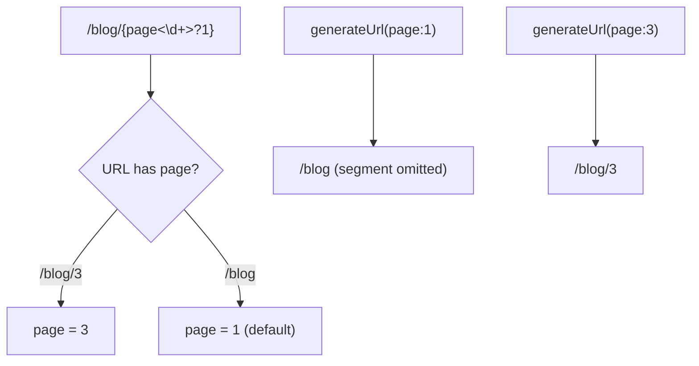

# Default Values & Optional Parameters

!!! tip "In a nutshell"
    A default value makes a placeholder optional, written inline as `{page<\d+>?1}` or via
    the `defaults` array, so `/blog` and `/blog/2` both match.
    Exam hook: only trailing placeholders can be optional, and generation omits a segment whose value equals its default.

!!! example "Real-world analogy"
    Think of a postal address form where the last line — say "Apartment 1" — is optional and
    assumed when left blank. You can drop that trailing line and the letter still arrives, but
    you cannot leave the *street* blank while keeping the apartment, because the reader would
    have no way to tell which line went missing. And when you write out the address for an
    apartment that *is* number 1, you simply omit that line entirely — the shortest, canonical
    form — rather than redundantly writing the default everyone already assumes.

!!! abstract "Learning objectives"
    By the end of this chapter you can:

    - [ ] Give a placeholder a default with `defaults` and inline `{page<\d+>?1}`
    - [ ] Explain why only trailing parameters can be optional
    - [ ] Predict which URL is generated when a value equals its default
    - [ ] Combine requirements and defaults on the same placeholder

    **Syllabus:** `Routing → Default values` ·
    **Level:** Advanced ·
    **Est. time:** 20 min ·
    **Prerequisites:** [Requirements](requirements.md)

    **Examen Symfony 8 :** OUI

---

## Pour les nuls

### L'idée en une phrase
Une valeur par défaut rend un paramètre optionnel — et seul le **dernier** paramètre d'une route peut être optionnel.

### Imagine dans la vraie vie
Un formulaire d'adresse postale où la dernière ligne — "Appartement 1" — est optionnelle et supposée quand elle est vide. Tu peux omettre cette ligne finale et la lettre arrive quand même, mais tu ne peux pas laisser la *rue* vide tout en gardant l'appartement — le facteur ne saurait pas quelle ligne manque.

### Dans Symfony
`{page<\d+>?1}` rend `/blog` équivalent à `/blog/1` — mais on ne peut jamais rendre un segment du milieu optionnel sans rendre tous les segments qui le suivent optionnels aussi.

### Exemple simple
```php
#[Route('/blog/{page<\d+>?1}')] // /blog et /blog/2 matchent tous les deux
```

### Comment le mémoriser 🧠
Seuls les paramètres **en fin de route** peuvent être optionnels — comme la dernière ligne d'une adresse, jamais une ligne au milieu.

A **default value** makes a placeholder **optional**: if the URL omits it, the
route still matches and the controller receives the default. `/blog/{page}` with
`page` defaulting to `1` matches both `/blog` and `/blog/2`.

Two syntaxes, again equivalent:

- **Inline** — `{page<\d+>?1}`: requirement `\d+`, then `?` and the default `1`.
  Use `?` with **no value** for a `null` default.
- **`defaults` array** — `defaults: {page: 1}`.

```php
// Inline: <requirement> before ?, then the default -> /blog and /blog/7 both match
#[Route('/blog/{page<\d+>?1}', name: 'blog_list')]

// Bare ? with no value -> default is null
#[Route('/report/{format?}', name: 'report')]

// Equivalent `defaults` array form
#[Route('/blog/{page}', name: 'blog_list', requirements: ['page' => '\d+'], defaults: ['page' => 1])]
```

Crucially, **only the trailing placeholders can be optional**. `/{a}/{b}` cannot
make `a` optional while `b` is required, because the matcher cannot tell where the
missing segment was.

!!! question "Predict first"
    `page` defaults to `1`. What does `generateUrl('blog_list', ['page' => 1])`
    produce — `/blog/1` or `/blog`?

??? note "Reveal"
    `/blog`. The generator **omits** a trailing segment whose value equals its
    default, producing the canonical shortest URL. Pass `page => 2` and you get
    `/blog/2`.

## Deep Dive — how it works internally

During compilation, `RouteCompiler` marks a token as **optional** when the
placeholder has a default *and* every token after it is also optional (or literal
text that's part of the optional tail). It emits nested optional groups in the
regex, e.g. `/blog(?:/(?P<page>\d+))?`, so the whole trailing segment can be
absent. Defaults themselves are stored on the `Route` (`getDefaults()`) and merged
into the matched parameters by the matcher; they are **not** captured from the URL.

```php
use Symfony\Component\Routing\Route;

$route = new Route('/blog/{page}', defaults: ['page' => 1], requirements: ['page' => '\d+']);
$route->getDefaults();           // ['page' => 1] — stored on the Route
$compiled = $route->compile();   // RouteCompiler marks the trailing token optional
$compiled->getRegex();           // contains the nested group /blog(?:/(?P<page>\d+))?
```

The same default set is consulted by the **generator**: when you call
`generateUrl('blog', ['page' => 1])` and `1` equals the default, the generator
**omits** the trailing segment, producing `/blog` — the canonical shortest URL.
This keeps generated URLs stable and avoids duplicate-content variants.



!!! note "Source reference"
    Optional-token logic lives in `RouteCompiler::compilePattern()` —
    [symfony/symfony `8.0`](https://github.com/symfony/symfony/blob/8.0/src/Symfony/Component/Routing/RouteCompiler.php).

### Non-placeholder defaults

`defaults` can also carry values that never appear in the path — commonly
`_format`, `_locale`, or a `_controller`. These are passed straight through to the
request attributes. See [Special attributes](special-attributes.md).

```yaml
# defaults may carry values that never appear in the path
legacy_home:
    path: /home
    defaults:
        _controller: App\Controller\HomeController::index  # callable to run
        _format: json    # request format
        _locale: en      # request locale
```

## Configuration & code

=== "PHP Attributes"

    ```php
    <?php
    declare(strict_types=1);

    namespace App\Controller;

    use Symfony\Bundle\FrameworkBundle\Controller\AbstractController;
    use Symfony\Component\HttpFoundation\Response;
    use Symfony\Component\Routing\Attribute\Route;

    final class BlogController extends AbstractController
    {
        // Inline: digits only, default 1 -> matches /blog and /blog/2
        #[Route('/blog/{page<\d+>?1}', name: 'blog_list', methods: ['GET'])]
        public function list(int $page): Response
        {
            return $this->render('blog/list.html.twig', ['page' => $page]);
        }

        // Array form + a nullable trailing param via `?` with no value.
        #[Route(
            '/archive/{year<\d+>}/{month?}',
            name: 'blog_archive',
            defaults: ['month' => null],
            methods: ['GET'],
        )]
        public function archive(int $year, ?string $month): Response
        {
            return $this->render('blog/archive.html.twig', [
                'year' => $year,
                'month' => $month,
            ]);
        }
    }
    ```

=== "YAML"

    ```yaml
    # config/routes/blog.yaml
    blog_list:
        path: /blog/{page<\d+>}
        controller: App\Controller\BlogController::list
        defaults:
            page: 1
        methods: [GET]

    blog_archive:
        path: /archive/{year<\d+>}/{month}
        controller: App\Controller\BlogController::archive
        defaults:
            month: null
        methods: [GET]
    ```

=== "PHP default in signature"

    ```php
    <?php
    declare(strict_types=1);

    // A PHP default on the argument is used only if the attribute has no
    // matching value; prefer the route `defaults` as the source of truth.
    #[Route('/blog/{page<\d+>?1}', name: 'blog_list')]
    public function list(int $page = 1): Response { /* ... */ }
    ```

## Best practices & anti-patterns

| ✅ Do | ❌ Avoid |
|---|---|
| Default only **trailing** placeholders | Trying to make a middle param optional |
| Keep the route default and PHP default in sync | Conflicting default values |
| Combine `<regex>` then `?default` | Omitting the requirement on optional ids |
| Use `?` (no value) for a `null` default | Relying on `''` where `null` is meant |

## When (not) to use it / alternatives

Defaults are ideal for pagination and optional filters. If a parameter is truly
required for the action to make sense, keep it mandatory and expose a separate
route for the "no value" case instead of a confusing default. For choosing between
several fixed values, prefer distinct routes or a `requirements` enum-like regex
over defaulting.

!!! danger "Certification traps"
    - **Only trailing** placeholders may be optional — a gap in the middle is a
      compile error / no-match.
    - Inline order is `{name<requirement>?default}` — requirement **before** `?`.
    - `{name?}` (bare `?`) means default **`null`**, not empty string.
    - When a generated value equals the default, the segment is **omitted**.

!!! warning "Common mistakes"
    - `{page?1<\d+>}` — wrong order; requirement must precede the `?`.
    - Expecting `/blog/1` from `generateUrl('blog_list', ['page' => 1])` — you get
      `/blog`.

## Exercises

1. **(Basic)** Make `/products/{page}` default to page `1`, digits only, inline.
2. **(Intermediate)** Build `/events/{year<\d+>}/{month<\d+>?}` where `month` is
   optional and null when absent; show both matching URLs.

??? success "Solutions"

    **1.**

    ```php
    #[Route('/products/{page<\d+>?1}', name: 'product_list', methods: ['GET'])]
    public function list(int $page): Response { /* ... */ }
    ```

    Matches `/products` (page 1) and `/products/5`.

    **2.**

    ```php
    #[Route(
        '/events/{year<\d+>}/{month<\d+>?}',
        name: 'event_year',
        defaults: ['month' => null],
        methods: ['GET'],
    )]
    public function year(int $year, ?int $month): Response { /* ... */ }
    ```

    Matches `/events/2026` (`month = null`) and `/events/2026/07`.

## Certification questions

*Question d'entraînement inspirée du syllabus — jamais une question officielle de l'examen.*

??? question "Q1. Which placeholder is optional with a default of 1?"
    - [ ] A. `{page?1<\d+>}`
    - [x] B. `{page<\d+>?1}` ✅
    - [ ] C. `{page=1<\d+>}`
    - [ ] D. `{page<\d+=1>}`

    **Why:** inline syntax is `{name<requirement>?default}`.
    **Ref:** [Optional parameters](https://symfony.com/doc/8.0/routing.html#optional-parameters).

??? question "Q2. `generateUrl('blog', ['page' => 1])` where `page` defaults to 1 produces?"
    - [x] A. `/blog` ✅
    - [ ] B. `/blog/1`
    - [ ] C. `/blog?page=1`
    - [ ] D. An exception

    **Why:** the generator omits a trailing segment whose value equals the default.
    **Ref:** [Routing](https://symfony.com/doc/8.0/routing.html).

??? question "Q3. Which parameter can be made optional in `/{a}/{b}`?"
    - [ ] A. `a` only
    - [x] B. `b` only (trailing) ✅
    - [ ] C. Both independently
    - [ ] D. Neither

    **Why:** only trailing placeholders can be omitted from the URL.
    **Ref:** [Routing](https://symfony.com/doc/8.0/routing.html#optional-parameters).

??? question "Q4. What default does `{slug?}` declare?"
    - [ ] A. Empty string `''`
    - [x] B. `null` ✅
    - [ ] C. `'slug'`
    - [ ] D. `0`

    **Why:** a bare `?` with no value sets the default to `null`.
    **Ref:** [Routing](https://symfony.com/doc/8.0/routing.html#optional-parameters).

## Key takeaways

- A default makes a placeholder optional; **only trailing** ones qualify.
- Inline order: `{name<requirement>?default}`; `?` alone means `null`.
- Generation drops segments equal to their default (canonical URL).
- `defaults` also carries non-path values like `_format`/`_locale`.

## Last-minute revision

!!! tip "Cheat sheet"
    - `{page<\d+>?1}` = digits, optional, default 1.
    - `{slug?}` = optional, default null.
    - Matches with & without the trailing segment.
    - `generateUrl(default value)` ⇒ segment omitted.

## Connections

- **Depends on:** [Requirements](requirements.md) — inline order is `{name<requirement>?default}`, the default following the regex.
- **Reused in:** [URL generation](url-generation.md) — generation drops trailing segments equal to their default.
- **Confused with:** [Special attributes](special-attributes.md) — non-path defaults like `_format`/`_locale` never appear in the path.

## Official References
- [Official Symfony docs — Optional parameters](https://symfony.com/doc/8.0/routing.html#optional-parameters)
- [Symfony source — RouteCompiler](https://github.com/symfony/symfony/blob/8.0/src/Symfony/Component/Routing/RouteCompiler.php)

## Video references

!!! tip "Watch & learn"
    These are official, continuously-updated video channels — search them for
    "Symfony routing" to reinforce this chapter. We link stable channels rather than
    individual videos so the references never rot.

    - [SymfonyCasts screencasts](https://symfonycasts.com/tracks/symfony) — scripted, code-along tutorials.
    - [Symfony official YouTube](https://www.youtube.com/@SymfonyOfficial) — SymfonyCon conference talks & keynotes.
    - [Official docs for this topic](https://symfony.com/doc/8.0/routing.html#optional-parameters) — some Symfony doc pages embed a screencast.

## Confidence check

I'm ready when I can:

- [ ] explain **why** only trailing placeholders can be optional
- [ ] implement inline `{page<\d+>?1}` and the array `defaults` form in Symfony 8
- [ ] debug a "middle" optional parameter that will not compile / match
- [ ] spot that `{slug?}` defaults to `null` (not `''`) and defaults are dropped on generation
- [ ] explain how `RouteCompiler` emits nested optional regex groups

---

<small>Related: [Requirements](requirements.md) · [Configuration](configuration.md) · [Special attributes](special-attributes.md)</small>
