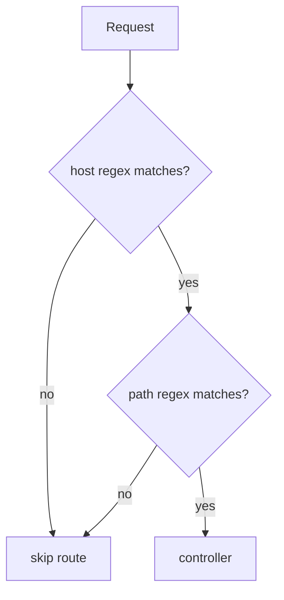

# Correspondance par nom de domaine (host)

!!! tip "In a nutshell"
    L'option `host` restreint une route à un domaine et peut capturer des sous-domaines comme
    paramètres (`{tenant}.example.com`), ce qui permet les apps multi-tenant et à sous-domaine admin.
    Piège d'examen : les tokens de host valent par défaut `[^.]+` (séparateur point), le host est vérifié avant le chemin, et la génération vers un autre host force une URL absolue.

!!! example "Real-world analogy"
    Imaginez un grand campus de bureaux avec plusieurs bâtiments qui utilisent tous les mêmes
    numéros de salle. L'accueil vérifie *quel bâtiment* vous cherchez avant même de regarder la
    salle, donc la « Salle 101 » du bâtiment Admin et la « Salle 101 » du bâtiment Ventes mènent à
    des personnes différentes (host vérifié avant le chemin). Un placeholder de sous-domaine, c'est
    comme « le bâtiment {tenant} » — une seule étiquette sans point à l'intérieur. Et pour envoyer
    un visiteur vers un *autre* bâtiment, vous devez lui donner l'adresse complète du bâtiment, pas
    seulement « Salle 101 », de la même façon qu'un lien inter-host est forcé en URL absolue.

!!! abstract "Learning objectives"
    À la fin de ce chapitre, vous saurez :

    - [ ] Matcher des routes par `host` et utiliser des placeholders de host
    - [ ] Ajouter des `requirements` et `defaults` de host pour les sous-domaines
    - [ ] Expliquer comment le host est intégré dans la regex compilée
    - [ ] Générer des URLs correctes pour des routes multi-domaines

    **Syllabus:** `Routing → Domain name matching` ·
    **Level:** Expert ·
    **Est. time:** 20 min ·
    **Prerequisites:** [Configuration](configuration.md), [Requirements](requirements.md)

---

## Theory

Par défaut, une route matche sur le **chemin uniquement**, quel que soit le host. L'option `host`
ajoute une contrainte sur le nom de host de la request, de sorte que `admin.example.com/` et
`example.com/` peuvent router vers des controllers différents même avec des chemins identiques. Le
host peut lui-même contenir des **placeholders** (`{subdomain}.example.com`), transformant le
sous-domaine en paramètre du controller — la base des apps multi-tenant.

```php
// Same path, different host -> different controller
#[Route('/', name: 'main_home', host: 'example.com')]
public function main(): Response { /* ... */ }

// Host placeholder: the subdomain becomes a controller parameter
#[Route('/', name: 'tenant_home', host: '{subdomain}.example.com')]
public function tenant(string $subdomain): Response { /* ... */ }
```

!!! question "Predict first"
    Dans `host: '{tenant}.example.com'` sans `requirements`, que matche `{tenant}`
    — et le host est-il testé avant ou après le chemin ?

??? note "Reveal"
    Il matche `[^.]+` — une seule étiquette sans point, car les tokens de host utilisent par défaut un
    séparateur point, pas `/`. La regex de host est vérifiée en **premier** dans
    `matchCollection()` ; c'est seulement si elle passe que la regex de chemin s'exécute.

## Deep Dive — how it works internally

`RouteCompiler` compile le `host` en une **seconde regex** stockée sur la
`CompiledRoute` (`getHostRegex()` / tokens de host), distincte de la regex de chemin.
`UrlMatcher::matchCollection()` vérifie d'abord la regex de host contre
`RequestContext::getHost()` ; c'est seulement si elle matche qu'il teste le chemin. Les
placeholders de host obéissent aux mêmes règles `requirements`/`defaults` que les placeholders de
chemin, mais leur séparateur par défaut est `.` plutôt que `/` (un token de host matche donc
`[^.]+` par défaut).

```php
// RouteCompiler folds the host into a second regex on the CompiledRoute
$route = new Route(
    '/',
    defaults: ['tenant' => 'www'],            // host placeholders accept defaults...
    requirements: ['tenant' => '[a-z0-9]+'],  // ...and requirements, like path ones
    host: '{tenant}.example.com',
);
$compiled = $route->compile();
$compiled->getHostRegex();  // host regex, separate from $compiled->getRegex() (path)

// UrlMatcher::matchCollection() tests it against RequestContext::getHost() first
$context = new RequestContext(host: 'acme.example.com');
$context->getHost();        // 'acme.example.com'
```

Le host de contexte vient du `RequestContext`, alimenté depuis la request entrante
(et normalisé en minuscules). Comme les contraintes de host vivent dans les données compilées,
elles ajoutent un coût d'exécution négligeable — juste un test de regex de plus.

Pour la **génération**, un host avec placeholders force une **URL absolue ou network**
quand le host demandé diffère du host de contexte courant : le generator
ne peut pas produire une URL chemin-seul qui change de host, il promeut donc le type de
référence automatiquement.



!!! note "Source reference"
    La regex/les tokens de host sont construits dans `RouteCompiler::compile()` ; matchés dans
    `UrlMatcher::matchCollection()` —
    [symfony/symfony `8.0`](https://github.com/symfony/symfony/blob/8.0/src/Symfony/Component/Routing/Matcher/UrlMatcher.php).

## Configuration & code

=== "PHP Attributes"

    ```php
    <?php
    declare(strict_types=1);

    namespace App\Controller;

    use Symfony\Bundle\FrameworkBundle\Controller\AbstractController;
    use Symfony\Component\HttpFoundation\Response;
    use Symfony\Component\Routing\Attribute\Route;

    final class SiteController extends AbstractController
    {
        // Same path, different host -> different action.
        #[Route('/', name: 'admin_home', host: 'admin.example.com', methods: ['GET'])]
        public function admin(): Response
        {
            return $this->render('admin/home.html.twig');
        }

        // Host placeholder captured as a parameter.
        #[Route(
            '/',
            name: 'tenant_home',
            host: '{tenant}.example.com',
            requirements: ['tenant' => '[a-z0-9\-]+'],
            defaults: ['tenant' => 'www'],
            methods: ['GET'],
        )]
        public function tenant(string $tenant): Response
        {
            return $this->render('tenant/home.html.twig', ['tenant' => $tenant]);
        }
    }
    ```

=== "YAML"

    ```yaml
    # config/routes/site.yaml
    admin_home:
        path: /
        controller: App\Controller\SiteController::admin
        host: admin.example.com
        methods: [GET]

    tenant_home:
        path: /
        controller: App\Controller\SiteController::tenant
        host: '{tenant}.example.com'
        requirements:
            tenant: '[a-z0-9\-]+'
        defaults:
            tenant: www
        methods: [GET]
    ```

=== "Group by host (YAML import)"

    ```yaml
    # config/routes.yaml — apply one host to a whole imported set
    admin_area:
        resource: '../src/Controller/Admin/'
        namespace: App\Controller\Admin
        type: attribute
        host: admin.example.com
    ```

Générer `tenant_home` avec `['tenant' => 'acme']` produit une URL absolue comme
`https://acme.example.com/` car le host diffère du host courant.

## Best practices & anti-patterns

| ✅ À faire | ❌ À éviter |
|---|---|
| Contraindre les placeholders de host avec une regex | Un `{sub}` ouvert matchant n'importe quelle étiquette |
| Fournir un `default` de host pour le site de base | Exiger un sous-domaine partout |
| Grouper les routes multi-domaines via le `host` d'import | Répéter `host:` sur chaque route |
| S'attendre à des URLs absolues entre hosts | Supposer qu'une URL chemin-seul peut changer de host |

## When (not) to use it / alternatives

Utilisez `host` pour de véritables apps multi-domaines / multi-tenant ou un sous-domaine admin. Si
vous avez seulement besoin de *brancher le comportement* selon le host, une vérification basée sur la request ou une
[condition expression](conditions.md) peut être plus simple. Évitez la correspondance par host pour la
locale (`fr.example.com`) sauf si le SEO l'exige — les chemins préfixés par locale (voir
[Locale](locale.md)) sont généralement plus simples.

!!! danger "Certification traps"
    - Les placeholders de host valent par défaut `[^.]+` (séparateur point), pas `[^/]+`.
    - Le host est matché **avant** le chemin dans `matchCollection()`.
    - Générer une URL pour un **host différent** force une URL absolue/network.
    - Le host de contexte est mis en **minuscules** ; écrivez les contraintes de host en minuscules.

!!! warning "Common mistakes"
    - Oublier le `default` de host, si bien que le domaine nu renvoie un 404.
    - Attendre que `path()` change de sous-domaine — il émet une URL absolue à la place.
    - Des regex de host sensibles à la casse qui échouent sur des hosts normalisés.

## Exercises

1. **(Basic)** Routez `/` sur `api.example.com` vers un `ApiHomeController`.
2. **(Intermediate)** Capturez `{tenant}` depuis `{tenant}.example.com`, avec `www` par
   défaut, restreint aux alphanumériques minuscules, et générez l'URL de `acme`.

??? success "Solutions"

    **1.**

    ```php
    #[Route('/', name: 'api_home', host: 'api.example.com', methods: ['GET'])]
    public function home(): Response { /* ... */ }
    ```

    **2.** Voir `tenant_home` ci-dessus.

    ```php
    $url = $this->generateUrl('tenant_home', ['tenant' => 'acme'],
        \Symfony\Component\Routing\Generator\UrlGeneratorInterface::ABSOLUTE_URL);
    // https://acme.example.com/
    ```

## Certification questions

??? question "Q1. What is the default regex for a host placeholder?"
    - [ ] A. `[^/]+`
    - [x] B. `[^.]+` ✅
    - [ ] C. `.+`
    - [ ] D. `\w+`

    **Why:** les hosts sont séparés par des points, un token matche donc toute étiquette sans point.
    **Ref:** [Sub-domain routing](https://symfony.com/doc/current/routing.html#sub-domain-routing).

??? question "Q2. During matching, when is the host checked?"
    - [x] A. Before the path regex ✅
    - [ ] B. After the controller runs
    - [ ] C. Only during generation
    - [ ] D. Never; host is informational

    **Why:** `matchCollection()` teste d'abord la regex de host, puis le chemin.
    **Ref:** [Routing](https://symfony.com/doc/current/routing.html#sub-domain-routing).

??? question "Q3. Generating a URL for a route on a different host produces?"
    - [x] A. An absolute (or network) URL ✅
    - [ ] B. A relative path
    - [ ] C. An exception
    - [ ] D. The current host's URL

    **Why:** une URL chemin-seul ne peut pas changer de host, le generator la promeut donc.
    **Ref:** [Routing](https://symfony.com/doc/current/routing.html#generating-urls).

??? question "Q4. How do you apply one host to a whole imported controller dir?"
    - [x] A. Set `host:` on the YAML `resource` import ✅
    - [ ] B. Set `host:` in `services.yaml`
    - [ ] C. It is not possible
    - [ ] D. Use `_host` in defaults

    **Why:** les options d'import comme `host`, `prefix`, `name_prefix` se propagent aux routes
    importées. **Ref:** [Routing](https://symfony.com/doc/current/routing.html).

## Key takeaways

- `host` contraint le host de la request ; les placeholders capturent les sous-domaines.
- Le host se compile en une **regex distincte**, vérifiée avant le chemin.
- Les tokens de host valent par défaut `[^.]+` ; ils supportent `requirements`/`defaults`.
- La génération inter-host force une URL absolue/network.

## Last-minute revision

!!! tip "Cheat sheet"
    - `host: '{sub}.example.com'` + `requirements`/`defaults`.
    - Regex de host par défaut `[^.]+` ; matché avant le chemin.
    - `generateUrl` inter-host → URL absolue.
    - `host:` au niveau de l'import groupe les routes.

## Connections

- **Depends on:** [Requirements](requirements.md) — les placeholders de host obéissent aux mêmes règles `requirements`/`defaults` (avec une regex par défaut différente).
- **Reused in:** [URL generation](url-generation.md) — une route inter-host force une URL absolue/network.
- **Confused with:** [Locale](locale.md) — locale basée sur le host (`fr.example.com`) vs locale en préfixe de chemin.

## Official References
- [Official Symfony docs — Sub-domain routing](https://symfony.com/doc/current/routing.html#sub-domain-routing)
- [Symfony source — UrlMatcher](https://github.com/symfony/symfony/blob/8.0/src/Symfony/Component/Routing/Matcher/UrlMatcher.php)

## Video references

!!! tip "Watch & learn"
    Ce sont des chaînes vidéo officielles, mises à jour en continu — cherchez-y
    "Symfony routing" pour renforcer ce chapitre. Nous lions des chaînes stables plutôt que
    des vidéos individuelles afin que les références ne se périment jamais.

    - [SymfonyCasts screencasts](https://symfonycasts.com/tracks/symfony) — tutoriels scénarisés à suivre en codant.
    - [Symfony official YouTube](https://www.youtube.com/@SymfonyOfficial) — conférences & keynotes SymfonyCon.
    - [Official docs for this topic](https://symfony.com/doc/current/routing.html#sub-domain-routing) — certaines pages de la doc Symfony intègrent un screencast.

## Confidence check

Je suis prêt quand je peux :

- [ ] expliquer **pourquoi** un placeholder de host vaut par défaut `[^.]+` et est matché avant le chemin
- [ ] implémenter en Symfony 8 une route à host fixe et une route de sous-domaine `{tenant}`
- [ ] déboguer un 404 sur le domaine nu causé par un `default` de host manquant
- [ ] repérer que la génération inter-host renvoie une URL absolue, pas un chemin
- [ ] expliquer comment le host se compile en une regex distincte sur `CompiledRoute`

---

<small>Related: [Configuration](configuration.md) · [Conditions](conditions.md) · [URL generation](url-generation.md) · [Locale](locale.md)</small>
