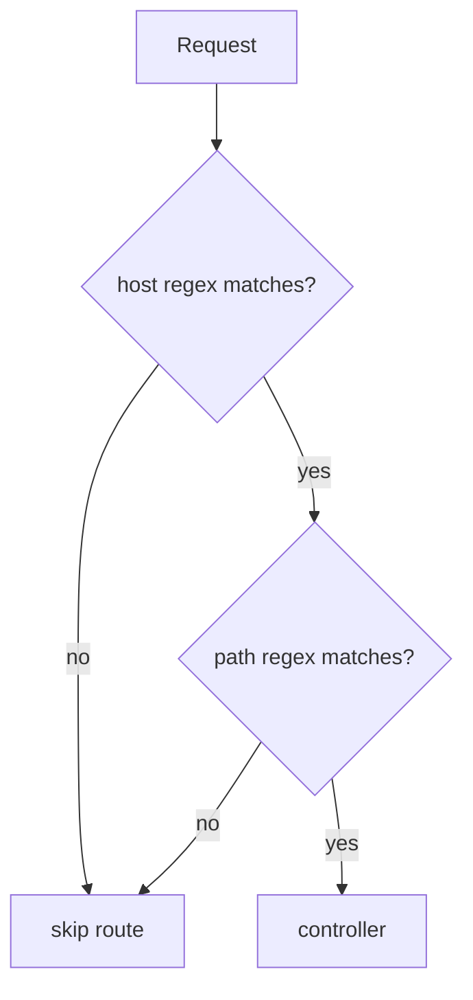

# Domain Name (Host) Matching

!!! tip "In a nutshell"
    The `host` option constrains a route to a domain and can capture subdomains as
    parameters (`{tenant}.example.com`), enabling multi-tenant and admin-subdomain apps.
    Exam hook: host tokens default to `[^.]+` (dot separator), the host is checked before the path, and cross-host generation forces an absolute URL.

!!! example "Real-world analogy"
    Picture a large office campus with several buildings that all happen to use the same room
    numbers. Reception checks *which building* you want before it ever looks up the room, so
    "Room 101" in the Admin building and "Room 101" in the Sales building lead to different
    people (host checked before path). A subdomain placeholder is like "the {tenant} building" —
    a single label with no dots inside. And to send a visitor to a *different* building you must
    hand them the full building address, not just "Room 101", the same way a cross-host link is
    forced to an absolute URL.

!!! abstract "Learning objectives"
    By the end of this chapter you can:

    - [ ] Match routes by `host` and use host placeholders
    - [ ] Add host `requirements` and `defaults` for subdomains
    - [ ] Explain how the host is folded into the compiled regex
    - [ ] Generate correct URLs for multi-domain routes

    **Syllabus:** `Routing → Domain name matching` ·
    **Level:** Expert ·
    **Est. time:** 20 min ·
    **Prerequisites:** [Configuration](configuration.md), [Requirements](requirements.md)

---

## Theory

By default a route matches on **path only**, regardless of host. The `host` option
adds a constraint on the request's host name, so `admin.example.com/` and
`example.com/` can route to different controllers even with identical paths. The
host may itself contain **placeholders** (`{subdomain}.example.com`), turning the
subdomain into a controller parameter — the basis of multi-tenant apps.

!!! question "Predict first"
    In `host: '{tenant}.example.com'` with no `requirements`, what does `{tenant}`
    match — and is the host tested before or after the path?

??? note "Reveal"
    It matches `[^.]+` — a single label with no dot, because host tokens default to a
    dot separator, not `/`. The host regex is checked **first** in
    `matchCollection()`; only if it passes does the path regex run.

## Deep Dive — how it works internally

`RouteCompiler` compiles the `host` into a **second regex** stored on the
`CompiledRoute` (`getHostRegex()` / host tokens), separate from the path regex.
`UrlMatcher::matchCollection()` first checks the host regex against
`RequestContext::getHost()`; only if it matches does it test the path. Host
placeholders obey the same `requirements`/`defaults` rules as path placeholders,
but their default separator is `.` rather than `/` (so a host token matches
`[^.]+` by default).

The context host comes from `RequestContext`, populated from the incoming request
(and normalized to lowercase). Because host constraints live in the compiled data,
they add negligible runtime cost — just one more regex test.

For **generation**, a host with placeholders forces an **absolute or network URL**
when the requested host differs from the current context host: the generator
cannot produce a path-only URL that changes host, so it upgrades the reference
type automatically.



!!! note "Source reference"
    Host regex/tokens are built in `RouteCompiler::compile()`; matched in
    `UrlMatcher::matchCollection()` —
    [symfony/symfony `8.0`](https://github.com/symfony/symfony/blob/8.0/src/Symfony/Component/Routing/Matcher/UrlMatcher.php).

## Configuration & code

=== "PHP Attributes"

    ```php
    <?php
    declare(strict_types=1);

    namespace App\Controller;

    use Symfony\Bundle\FrameworkBundle\Controller\AbstractController;
    use Symfony\Component\HttpFoundation\Response;
    use Symfony\Component\Routing\Attribute\Route;

    final class SiteController extends AbstractController
    {
        // Same path, different host -> different action.
        #[Route('/', name: 'admin_home', host: 'admin.example.com', methods: ['GET'])]
        public function admin(): Response
        {
            return $this->render('admin/home.html.twig');
        }

        // Host placeholder captured as a parameter.
        #[Route(
            '/',
            name: 'tenant_home',
            host: '{tenant}.example.com',
            requirements: ['tenant' => '[a-z0-9\-]+'],
            defaults: ['tenant' => 'www'],
            methods: ['GET'],
        )]
        public function tenant(string $tenant): Response
        {
            return $this->render('tenant/home.html.twig', ['tenant' => $tenant]);
        }
    }
    ```

=== "YAML"

    ```yaml
    # config/routes/site.yaml
    admin_home:
        path: /
        controller: App\Controller\SiteController::admin
        host: admin.example.com
        methods: [GET]

    tenant_home:
        path: /
        controller: App\Controller\SiteController::tenant
        host: '{tenant}.example.com'
        requirements:
            tenant: '[a-z0-9\-]+'
        defaults:
            tenant: www
        methods: [GET]
    ```

=== "Group by host (YAML import)"

    ```yaml
    # config/routes.yaml — apply one host to a whole imported set
    admin_area:
        resource: '../src/Controller/Admin/'
        namespace: App\Controller\Admin
        type: attribute
        host: admin.example.com
    ```

Generating `tenant_home` with `['tenant' => 'acme']` yields an absolute URL like
`https://acme.example.com/` because the host differs from the current one.

## Best practices & anti-patterns

| ✅ Do | ❌ Avoid |
|---|---|
| Constrain host placeholders with a regex | Open `{sub}` matching any label |
| Provide a host `default` for the base site | Requiring a subdomain everywhere |
| Group multi-domain routes via import `host` | Repeating `host:` on every route |
| Expect absolute URLs across hosts | Assuming a path-only URL can switch host |

## When (not) to use it / alternatives

Use `host` for genuine multi-domain / multi-tenant apps or an admin subdomain. If
you only need to *branch behaviour* by host, a request-based check or a
[condition expression](conditions.md) may be simpler. Avoid host matching for
locale (`fr.example.com`) unless SEO demands it — prefixed locale paths (see
[Locale](locale.md)) are usually easier.

!!! danger "Certification traps"
    - Host placeholders default to `[^.]+` (dot separator), not `[^/]+`.
    - Host is matched **before** path in `matchCollection()`.
    - Generating a URL for a **different host** forces an absolute/network URL.
    - The context host is **lowercased**; write host constraints in lowercase.

!!! warning "Common mistakes"
    - Forgetting the host `default`, so the plain domain 404s.
    - Expecting `path()` to switch subdomains — it emits an absolute URL instead.
    - Case-sensitive host regexes failing on normalized hosts.

## Exercises

1. **(Basic)** Route `/` on `api.example.com` to an `ApiHomeController`.
2. **(Intermediate)** Capture `{tenant}` from `{tenant}.example.com`, default
   `www`, restricted to lowercase alphanumerics, and generate `acme`'s URL.

??? success "Solutions"

    **1.**

    ```php
    #[Route('/', name: 'api_home', host: 'api.example.com', methods: ['GET'])]
    public function home(): Response { /* ... */ }
    ```

    **2.** See `tenant_home` above.

    ```php
    $url = $this->generateUrl('tenant_home', ['tenant' => 'acme'],
        \Symfony\Component\Routing\Generator\UrlGeneratorInterface::ABSOLUTE_URL);
    // https://acme.example.com/
    ```

## Certification questions

??? question "Q1. What is the default regex for a host placeholder?"
    - [ ] A. `[^/]+`
    - [x] B. `[^.]+` ✅
    - [ ] C. `.+`
    - [ ] D. `\w+`

    **Why:** hosts are separated by dots, so a token matches any non-dot label.
    **Ref:** [Sub-domain routing](https://symfony.com/doc/current/routing.html#sub-domain-routing).

??? question "Q2. During matching, when is the host checked?"
    - [x] A. Before the path regex ✅
    - [ ] B. After the controller runs
    - [ ] C. Only during generation
    - [ ] D. Never; host is informational

    **Why:** `matchCollection()` tests the host regex first, then the path.
    **Ref:** [Routing](https://symfony.com/doc/current/routing.html#sub-domain-routing).

??? question "Q3. Generating a URL for a route on a different host produces?"
    - [x] A. An absolute (or network) URL ✅
    - [ ] B. A relative path
    - [ ] C. An exception
    - [ ] D. The current host's URL

    **Why:** a path-only URL cannot change host, so the generator upgrades it.
    **Ref:** [Routing](https://symfony.com/doc/current/routing.html#generating-urls).

??? question "Q4. How do you apply one host to a whole imported controller dir?"
    - [x] A. Set `host:` on the YAML `resource` import ✅
    - [ ] B. Set `host:` in `services.yaml`
    - [ ] C. It is not possible
    - [ ] D. Use `_host` in defaults

    **Why:** import options like `host`, `prefix`, `name_prefix` cascade to imported
    routes. **Ref:** [Routing](https://symfony.com/doc/current/routing.html).

## Key takeaways

- `host` constrains the request host; placeholders capture subdomains.
- Host compiles to a **separate regex**, checked before the path.
- Host tokens default to `[^.]+`; support `requirements`/`defaults`.
- Cross-host generation forces an absolute/network URL.

## Last-minute revision

!!! tip "Cheat sheet"
    - `host: '{sub}.example.com'` + `requirements`/`defaults`.
    - Host default regex `[^.]+`; matched before path.
    - Cross-host `generateUrl` → absolute URL.
    - Import-level `host:` groups routes.

## Connections

- **Depends on:** [Requirements](requirements.md) — host placeholders obey the same `requirements`/`defaults` rules (with a different default regex).
- **Reused in:** [URL generation](url-generation.md) — a cross-host route forces an absolute/network URL.
- **Confused with:** [Locale](locale.md) — host-based locale (`fr.example.com`) vs a prefixed-path locale.

## Official References
- [Official Symfony docs — Sub-domain routing](https://symfony.com/doc/current/routing.html#sub-domain-routing)
- [Symfony source — UrlMatcher](https://github.com/symfony/symfony/blob/8.0/src/Symfony/Component/Routing/Matcher/UrlMatcher.php)

## Confidence check

I'm ready when I can:

- [ ] explain **why** a host placeholder defaults to `[^.]+` and is matched before the path
- [ ] implement a fixed-host route and a `{tenant}` subdomain route in Symfony 8
- [ ] debug a plain-domain 404 caused by a missing host `default`
- [ ] spot that cross-host generation returns an absolute URL, not a path
- [ ] explain how the host compiles to a separate regex on `CompiledRoute`

---

<small>Related: [Configuration](configuration.md) · [Conditions](conditions.md) · [URL generation](url-generation.md) · [Locale](locale.md)</small>
