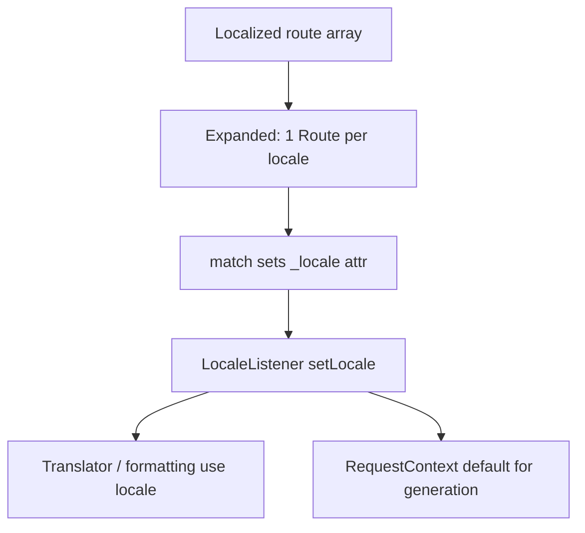

# Détection de la locale & routes localisées

!!! tip "In a nutshell"
    Donnez à une même action des chemins par langue en faisant de `path` une map locale→chemin ; la
    `_locale` matchée pilote ensuite les traductions et le formatage pour toute la request.
    Piège d'examen : Symfony ne devine pas la locale depuis `Accept-Language` par défaut — c'est opt-in via `set_locale_from_accept_language`.

!!! example "Real-world analogy"
    Pensez à un musée où la même exposition a deux entrées signalées dans des langues différentes :
    "/about" et "/a-propos" mènent à la même salle, mais la porte par laquelle vous êtes entré
    définit la langue de chaque cartel, audioguide et ticket de la boutique pour le reste de votre
    visite (la `_locale` matchée pilote toutes les traductions). Point crucial : l'accueil ne va *pas*
    deviner votre langue à partir du passeport dans votre poche — il ne connaît que la porte que
    vous avez choisie, à moins que vous ne demandiez explicitement au personnel de lire votre
    préférence (opt-in de `Accept-Language`).

!!! abstract "Learning objectives"
    À la fin de ce chapitre, vous saurez :

    - [ ] Définir des chemins par locale avec un `#[Route]` localisé / un tableau YAML
    - [ ] Expliquer comment `_locale` est devinée, définie et mémorisée
    - [ ] Générer des URLs pour une locale spécifique
    - [ ] Définir une locale par défaut et valider le requirement `_locale`

    **Syllabus:** `Routing → User's locale guessing & localized routes` ·
    **Level:** Advanced ·
    **Est. time:** 22 min ·
    **Prerequisites:** [Defaults](defaults.md), [Special attributes](special-attributes.md)

---

## Theory

Les apps internationalisées exposent souvent la **même action sous des chemins différents par
langue** : `/about` (en) et `/a-propos` (fr). Symfony le supporte nativement :
déclarez une route dont le `path` est une **map de locale → chemin**, et elle s'étend en une
route par locale, chacune portant le default `_locale` correspondant. La `_locale`
matchée pilote ensuite les traductions et le formatage pour toute la request.

La locale peut aussi venir d'un **préfixe de chemin** (`/{_locale}/blog`) ou être **devinée**
depuis la request. Quelle que soit la source, le framework la stocke sur la request et
la mémorise pour la session afin que les liens restent dans la langue de l'utilisateur.

!!! question "Predict first"
    Vous définissez seulement `framework.default_locale: en`. Un navigateur envoie
    `Accept-Language: fr`. Symfony sert-il le français automatiquement ?

??? note "Reveal"
    Non. Symfony n'analyse **pas** `Accept-Language` par défaut — activez
    `set_locale_from_accept_language`, ou lisez `Request::getPreferredLanguage()`
    vous-même. Précédence : `_locale` matchée → session persistante → `default_locale`.

## Deep Dive — how it works internally

Une route localisée (`path` sous forme de tableau) est étendue au chargement en plusieurs
objets `Route` partageant un nom suffixé en interne par la locale, chacun avec
`defaults['_locale']` défini et un requirement `_locale`. Au match, l'attribut `_locale`
est copié dans la request (voir [Special attributes](special-attributes.md)).

Deux listeners coopèrent :

- `Symfony\Component\HttpKernel\EventListener\LocaleListener` — sur `kernel.request`,
  il lit `_locale` dans les attributs de la request et appelle
  `Request::setLocale()`. Sur les requests suivantes, si le router a défini une locale par défaut via
  le `RequestContext`, il alimente la génération pour que `path()` conserve la locale courante.
- `Symfony\Component\HttpKernel\EventListener\LocaleAwareListener` — propage la
  locale aux services locale-aware (translator, etc.).

**Précédence de détection** (du plus fort au plus faible) : un paramètre de route `_locale` matché →
la locale persistante stockée en session → `framework.default_locale`. Symfony n'analyse
**pas** automatiquement `Accept-Language` pour vous ; pour l'honorer, lisez
`Request::getPreferredLanguage($available)` dans un controller/listener et définissez la
locale vous-même.

Pour la **génération**, `_locale` est un paramètre spécial ordinaire : passez-le pour sélectionner une
variante localisée, ou omettez-le pour réutiliser la locale de la request courante (le
default du `RequestContext` que le router définit).



!!! note "Source reference"
    Le `LocaleListener` définit la locale de la request depuis `_locale` —
    [symfony/symfony `8.0`](https://github.com/symfony/symfony/blob/8.0/src/Symfony/Component/HttpKernel/EventListener/LocaleListener.php).

## Configuration & code

=== "PHP Attributes"

    ```php
    <?php
    declare(strict_types=1);

    namespace App\Controller;

    use Symfony\Bundle\FrameworkBundle\Controller\AbstractController;
    use Symfony\Component\HttpFoundation\Response;
    use Symfony\Component\Routing\Attribute\Route;

    final class AboutController extends AbstractController
    {
        // One action, two locale-specific paths.
        #[Route(
            path: ['en' => '/about', 'fr' => '/a-propos'],
            name: 'app_about',
            methods: ['GET'],
        )]
        public function about(): Response
        {
            return $this->render('about.html.twig');
        }
    }
    ```

=== "Prefixed locale"

    ```php
    <?php
    declare(strict_types=1);

    namespace App\Controller;

    use Symfony\Bundle\FrameworkBundle\Controller\AbstractController;
    use Symfony\Component\HttpFoundation\Response;
    use Symfony\Component\Routing\Attribute\Route;

    // /{_locale}/blog with a locale whitelist and a default.
    #[Route('/{_locale}/blog', name: 'app_blog',
        requirements: ['_locale' => 'en|fr|de'],
        defaults: ['_locale' => 'en'], methods: ['GET'])]
    final class BlogController extends AbstractController
    {
        public function index(): Response
        {
            return $this->render('blog/index.html.twig');
        }
    }
    ```

=== "YAML (localized + prefix)"

    ```yaml
    # config/routes/about.yaml
    app_about:
        path:
            en: /about
            fr: /a-propos
        controller: App\Controller\AboutController::about
        methods: [GET]
    ```

    ```yaml
    # config/routes.yaml — prefix a whole import per locale
    site:
        resource: '../src/Controller/Site/'
        namespace: App\Controller\Site
        type: attribute
        prefix:
            en: ''
            fr: /fr
    ```

=== "Default locale (framework)"

    ```yaml
    # config/packages/translation.yaml
    framework:
        default_locale: en
        # set_locale_from_accept_language: true  # opt-in Accept-Language guess
    ```

Générez l'URL d'une locale spécifique en passant `_locale` :

```php
$fr = $this->generateUrl('app_about', ['_locale' => 'fr']); // /a-propos
```

## Best practices & anti-patterns

| ✅ À faire | ❌ À éviter |
|---|---|
| Restreindre `_locale` avec un requirement | Un `_locale` ouvert acceptant n'importe quoi |
| Définir `framework.default_locale` | Coder en dur `'en'` dans les controllers |
| Utiliser des tableaux de chemins localisés pour le SEO | Un `?lang=` en query string pour du vrai i18n |
| Passer `_locale` à `generateUrl` quand nécessaire | Supposer que les liens restent dans une seule langue |

## When (not) to use it / alternatives

Utilisez des **tableaux de chemins localisés** quand les slugs traduits comptent pour le SEO. Utilisez un
**préfixe `/{_locale}`** pour des structures uniformes où seul le segment de langue
change. Si vous n'avez pas du tout besoin de locales par URL, définissez simplement la locale une fois depuis
`Accept-Language`/la préférence utilisateur dans un listener et gardez des chemins uniques. Voir le
chapitre [Intl](../miscellaneous/intl.md), plus large, pour le formatage et la traduction.

!!! danger "Certification traps"
    - Symfony ne devine **pas** la locale depuis `Accept-Language` par défaut — activez
      `set_locale_from_accept_language` ou faites-le vous-même.
    - `_locale` est un **paramètre spécial** ; son match appelle `Request::setLocale()`.
    - Un tableau `path` localisé s'étend en **une route par locale**.
    - Ajoutez toujours un **requirement** `_locale`, sinon des locales invalides matchent.
    - `generateUrl` réutilise la locale **courante** sauf si vous passez `_locale`.

!!! warning "Common mistakes"
    - Oublier le requirement `_locale`, laissant `/xx/blog` matcher.
    - S'attendre à ce que la langue du navigateur soit honorée automatiquement.
    - Ne pas définir `default_locale`, la génération manque alors de repli.

## Exercises

1. **(Basic)** Donnez à une même action deux chemins localisés : `/contact` (en),
   `/contact-fr` (fr).
2. **(Intermediate)** Ajoutez `/{_locale}/help` restreint à `en|fr|es`, avec `en` par
   défaut, et générez l'URL espagnole.

??? success "Solutions"

    **1.**

    ```php
    #[Route(path: ['en' => '/contact', 'fr' => '/contact-fr'],
        name: 'app_contact', methods: ['GET'])]
    public function contact(): Response { /* ... */ }
    ```

    **2.**

    ```php
    #[Route('/{_locale}/help', name: 'app_help',
        requirements: ['_locale' => 'en|fr|es'],
        defaults: ['_locale' => 'en'], methods: ['GET'])]
    public function help(): Response { /* ... */ }
    ```

    ```php
    $es = $this->generateUrl('app_help', ['_locale' => 'es']); // /es/help
    ```

## Certification questions

??? question "Q1. Does Symfony guess the locale from `Accept-Language` by default?"
    - [ ] A. Yes, always
    - [x] B. No — it must be enabled or done manually ✅
    - [ ] C. Only for API routes
    - [ ] D. Only in debug mode

    **Why:** l'opt-in se fait via `set_locale_from_accept_language`, ou vous la définissez vous-même.
    **Ref:** [Localization](https://symfony.com/doc/current/routing.html#localized-routes-i18n).

??? question "Q2. A `#[Route(path: ['en' => '/about', 'fr' => '/a-propos'])]` produces?"
    - [x] A. One route per locale, each with a `_locale` default ✅
    - [ ] B. A single route matching both paths
    - [ ] C. A redirect between the two paths
    - [ ] D. An error — arrays are not allowed

    **Why:** les chemins localisés s'étendent en routes par locale au chargement.
    **Ref:** [Routing i18n](https://symfony.com/doc/current/routing.html#localized-routes-i18n).

??? question "Q3. Matching a `_locale` route parameter causes what?"
    - [x] A. `Request::setLocale()` is called (via LocaleListener) ✅
    - [ ] B. The session is destroyed
    - [ ] C. A 301 redirect
    - [ ] D. Nothing until you read it

    **Why:** `_locale` est un paramètre spécial appliqué par le LocaleListener.
    **Ref:** [Routing](https://symfony.com/doc/current/routing.html#special-parameters).

??? question "Q4. How do you generate the French URL of `app_about`?"
    - [x] A. `generateUrl('app_about', ['_locale' => 'fr'])` ✅
    - [ ] B. `generateUrl('app_about_fr')`
    - [ ] C. `generateUrl('app_about', ['lang' => 'fr'])`
    - [ ] D. It is not possible

    **Why:** passez le paramètre spécial `_locale` pour sélectionner la variante localisée.
    **Ref:** [Routing i18n](https://symfony.com/doc/current/routing.html#localized-routes-i18n).

## Key takeaways

- Les tableaux `path` localisés s'étendent en une route par locale.
- `_locale` (matchée, session persistante, ou `default_locale`) définit la locale de la request.
- La détection via `Accept-Language` est **opt-in**, pas automatique.
- Contraignez toujours `_locale` et définissez `framework.default_locale`.

## Last-minute revision

!!! tip "Cheat sheet"
    - `path: {en: /about, fr: /a-propos}`.
    - `/{_locale}/...` + `requirements: {_locale: 'en|fr'}` + default.
    - `generateUrl(name, {_locale: 'fr'})`.
    - `framework.default_locale` ; détection via `set_locale_from_accept_language`.

## Connections

- **Depends on:** [Special attributes](special-attributes.md) — `_locale` est un paramètre spécial qui déclenche `Request::setLocale()`.
- **Reused in:** [Intl](../miscellaneous/intl.md) — la locale matchée pilote la traduction et le formatage.
- **Confused with:** [Host matching](host-matching.md) — stratégies de locale par host vs par préfixe de chemin.

## Official References
- [Official Symfony docs — Localized routes (i18n)](https://symfony.com/doc/current/routing.html#localized-routes-i18n)
- [Symfony source — LocaleListener](https://github.com/symfony/symfony/blob/8.0/src/Symfony/Component/HttpKernel/EventListener/LocaleListener.php)

## Video references

!!! tip "Watch & learn"
    Ce sont des chaînes vidéo officielles, mises à jour en continu — cherchez-y
    "Symfony routing" pour renforcer ce chapitre. Nous lions des chaînes stables plutôt que
    des vidéos individuelles afin que les références ne se périment jamais.

    - [SymfonyCasts screencasts](https://symfonycasts.com/tracks/symfony) — tutoriels scénarisés à suivre en codant.
    - [Symfony official YouTube](https://www.youtube.com/@SymfonyOfficial) — conférences & keynotes SymfonyCon.
    - [Official docs for this topic](https://symfony.com/doc/current/routing.html#localized-routes-i18n) — certaines pages de la doc Symfony intègrent un screencast.

## Confidence check

Je suis prêt quand je peux :

- [ ] expliquer comment `_locale` est devinée, définie et mémorisée (l'ordre de précédence)
- [ ] implémenter en Symfony 8 un tableau `path` localisé et un préfixe `/{_locale}`
- [ ] déboguer `/xx/blog` qui matche parce que le requirement `_locale` manque
- [ ] repérer que la détection via `Accept-Language` est opt-in, pas automatique
- [ ] expliquer comment `LocaleListener`/`LocaleAwareListener` propagent la locale

---

<small>Related: [Special attributes](special-attributes.md) · [Defaults](defaults.md) · [Intl](../miscellaneous/intl.md) · [URL generation](url-generation.md)</small>
