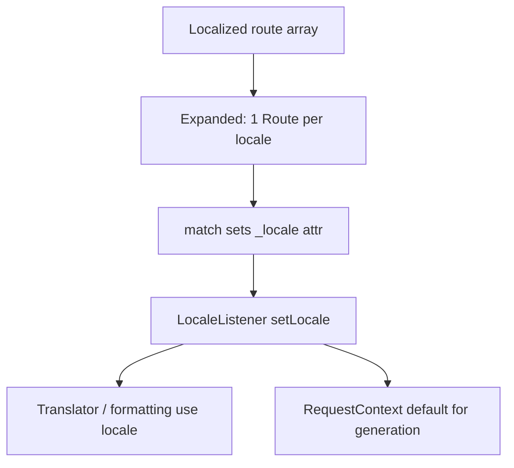

# Locale Guessing & Localized Routes

!!! tip "In a nutshell"
    Give one action per-language paths by making `path` a locale→path map; the matched
    `_locale` then drives translations and formatting for the whole request.
    Exam hook: Symfony does not guess the locale from `Accept-Language` by default — it is opt-in via `set_locale_from_accept_language`.

!!! abstract "Learning objectives"
    By the end of this chapter you can:

    - [ ] Define per-locale paths with a localized `#[Route]` / YAML array
    - [ ] Explain how `_locale` is guessed, set, and remembered
    - [ ] Generate URLs for a specific locale
    - [ ] Set a default locale and validate the `_locale` requirement

    **Syllabus:** `Routing → User's locale guessing & localized routes` ·
    **Level:** Advanced ·
    **Est. time:** 22 min ·
    **Prerequisites:** [Defaults](defaults.md), [Special attributes](special-attributes.md)

---

## Theory

Internationalized apps often expose the **same action under different paths per
language**: `/about` (en) and `/a-propos` (fr). Symfony supports this natively:
declare a route whose `path` is a **map of locale → path**, and it expands into one
route per locale, each carrying the matching `_locale` default. The matched
`_locale` then drives translations and formatting for the whole request.

Locale can also come from a **path prefix** (`/{_locale}/blog`) or be **guessed**
from the request. Whatever the source, the framework stores it on the request and
remembers it for the session so links stay in the user's language.

!!! question "Predict first"
    You set only `framework.default_locale: en`. A browser sends
    `Accept-Language: fr`. Does Symfony serve French automatically?

??? note "Reveal"
    No. Symfony does **not** parse `Accept-Language` by default — opt in with
    `set_locale_from_accept_language`, or read `Request::getPreferredLanguage()`
    yourself. Precedence: matched `_locale` → sticky session → `default_locale`.

## Deep Dive — how it works internally

A localized route (`path` as an array) is expanded at load time into several
`Route` objects sharing a name suffixed by locale internally, each with
`defaults['_locale']` set and a `_locale` requirement. On match, the `_locale`
attribute is copied into the request (see [Special attributes](special-attributes.md)).

Two listeners cooperate:

- `Symfony\Component\HttpKernel\EventListener\LocaleListener` — on `kernel.request`
  it reads `_locale` from the request attributes and calls
  `Request::setLocale()`. On later requests, if the router set a default locale via
  `RequestContext`, it seeds generation so `path()` keeps the current locale.
- `Symfony\Component\HttpKernel\EventListener\LocaleAwareListener` — propagates the
  locale to locale-aware services (translator, etc.).

**Guessing precedence** (highest first): a matched `_locale` route parameter →
the sticky locale stored in the session → `framework.default_locale`. Symfony does
**not** auto-parse `Accept-Language` for you; to honour it, read
`Request::getPreferredLanguage($available)` in a controller/listener and set the
locale yourself.

For **generation**, `_locale` is a normal special parameter: pass it to select a
localized variant, or omit it to reuse the current request's locale (the
`RequestContext` default the router sets).



!!! note "Source reference"
    `LocaleListener` sets the request locale from `_locale` —
    [symfony/symfony `8.0`](https://github.com/symfony/symfony/blob/8.0/src/Symfony/Component/HttpKernel/EventListener/LocaleListener.php).

## Configuration & code

=== "PHP Attributes"

    ```php
    <?php
    declare(strict_types=1);

    namespace App\Controller;

    use Symfony\Bundle\FrameworkBundle\Controller\AbstractController;
    use Symfony\Component\HttpFoundation\Response;
    use Symfony\Component\Routing\Attribute\Route;

    final class AboutController extends AbstractController
    {
        // One action, two locale-specific paths.
        #[Route(
            path: ['en' => '/about', 'fr' => '/a-propos'],
            name: 'app_about',
            methods: ['GET'],
        )]
        public function about(): Response
        {
            return $this->render('about.html.twig');
        }
    }
    ```

=== "Prefixed locale"

    ```php
    <?php
    declare(strict_types=1);

    namespace App\Controller;

    use Symfony\Bundle\FrameworkBundle\Controller\AbstractController;
    use Symfony\Component\HttpFoundation\Response;
    use Symfony\Component\Routing\Attribute\Route;

    // /{_locale}/blog with a locale whitelist and a default.
    #[Route('/{_locale}/blog', name: 'app_blog',
        requirements: ['_locale' => 'en|fr|de'],
        defaults: ['_locale' => 'en'], methods: ['GET'])]
    final class BlogController extends AbstractController
    {
        public function index(): Response
        {
            return $this->render('blog/index.html.twig');
        }
    }
    ```

=== "YAML (localized + prefix)"

    ```yaml
    # config/routes/about.yaml
    app_about:
        path:
            en: /about
            fr: /a-propos
        controller: App\Controller\AboutController::about
        methods: [GET]
    ```

    ```yaml
    # config/routes.yaml — prefix a whole import per locale
    site:
        resource: '../src/Controller/Site/'
        namespace: App\Controller\Site
        type: attribute
        prefix:
            en: ''
            fr: /fr
    ```

=== "Default locale (framework)"

    ```yaml
    # config/packages/translation.yaml
    framework:
        default_locale: en
        # set_locale_from_accept_language: true  # opt-in Accept-Language guess
    ```

Generate a specific locale's URL by passing `_locale`:

```php
$fr = $this->generateUrl('app_about', ['_locale' => 'fr']); // /a-propos
```

## Best practices & anti-patterns

| ✅ Do | ❌ Avoid |
|---|---|
| Whitelist `_locale` with a requirement | Open `_locale` accepting anything |
| Set `framework.default_locale` | Hard-coding `'en'` in controllers |
| Use localized path arrays for SEO paths | Query-string `?lang=` for real i18n |
| Pass `_locale` to `generateUrl` when needed | Assuming links stay in one language |

## When (not) to use it / alternatives

Use **localized path arrays** when translated slugs matter for SEO. Use a
**`/{_locale}` prefix** for uniform structures where only the language segment
changes. If you don't need per-URL locales at all, just set the locale once from
`Accept-Language`/user preference in a listener and keep single paths. See the
broader [Intl chapter](../miscellaneous/intl.md) for formatting and translation.

!!! danger "Certification traps"
    - Symfony does **not** guess locale from `Accept-Language` by default — enable
      `set_locale_from_accept_language` or do it yourself.
    - `_locale` is a **special parameter**; matching it calls `Request::setLocale()`.
    - A localized `path` array expands into **one route per locale**.
    - Always add a `_locale` **requirement** or invalid locales match.
    - `generateUrl` reuses the **current** locale unless you pass `_locale`.

!!! warning "Common mistakes"
    - Forgetting the `_locale` requirement, letting `/xx/blog` match.
    - Expecting the browser language to be honoured automatically.
    - Not setting `default_locale`, so generation lacks a fallback.

## Exercises

1. **(Basic)** Give one action two localized paths: `/contact` (en),
   `/contact-fr` (fr).
2. **(Intermediate)** Add `/{_locale}/help` restricted to `en|fr|es`, default
   `en`, and generate the Spanish URL.

??? success "Solutions"

    **1.**

    ```php
    #[Route(path: ['en' => '/contact', 'fr' => '/contact-fr'],
        name: 'app_contact', methods: ['GET'])]
    public function contact(): Response { /* ... */ }
    ```

    **2.**

    ```php
    #[Route('/{_locale}/help', name: 'app_help',
        requirements: ['_locale' => 'en|fr|es'],
        defaults: ['_locale' => 'en'], methods: ['GET'])]
    public function help(): Response { /* ... */ }
    ```

    ```php
    $es = $this->generateUrl('app_help', ['_locale' => 'es']); // /es/help
    ```

## Certification questions

??? question "Q1. Does Symfony guess the locale from `Accept-Language` by default?"
    - [ ] A. Yes, always
    - [x] B. No — it must be enabled or done manually ✅
    - [ ] C. Only for API routes
    - [ ] D. Only in debug mode

    **Why:** you opt in via `set_locale_from_accept_language` or set it yourself.
    **Ref:** [Localization](https://symfony.com/doc/current/routing.html#localized-routes-i18n).

??? question "Q2. A `#[Route(path: ['en' => '/about', 'fr' => '/a-propos'])]` produces?"
    - [x] A. One route per locale, each with a `_locale` default ✅
    - [ ] B. A single route matching both paths
    - [ ] C. A redirect between the two paths
    - [ ] D. An error — arrays are not allowed

    **Why:** localized paths expand into per-locale routes at load time.
    **Ref:** [Routing i18n](https://symfony.com/doc/current/routing.html#localized-routes-i18n).

??? question "Q3. Matching a `_locale` route parameter causes what?"
    - [x] A. `Request::setLocale()` is called (via LocaleListener) ✅
    - [ ] B. The session is destroyed
    - [ ] C. A 301 redirect
    - [ ] D. Nothing until you read it

    **Why:** `_locale` is a special parameter applied by the LocaleListener.
    **Ref:** [Routing](https://symfony.com/doc/current/routing.html#special-parameters).

??? question "Q4. How do you generate the French URL of `app_about`?"
    - [x] A. `generateUrl('app_about', ['_locale' => 'fr'])` ✅
    - [ ] B. `generateUrl('app_about_fr')`
    - [ ] C. `generateUrl('app_about', ['lang' => 'fr'])`
    - [ ] D. It is not possible

    **Why:** pass the `_locale` special parameter to select the localized variant.
    **Ref:** [Routing i18n](https://symfony.com/doc/current/routing.html#localized-routes-i18n).

## Key takeaways

- Localized `path` arrays expand into one route per locale.
- `_locale` (matched, sticky session, or `default_locale`) sets the request locale.
- `Accept-Language` guessing is **opt-in**, not automatic.
- Always constrain `_locale` and set `framework.default_locale`.

## Last-minute revision

!!! tip "Cheat sheet"
    - `path: {en: /about, fr: /a-propos}`.
    - `/{_locale}/...` + `requirements: {_locale: 'en|fr'}` + default.
    - `generateUrl(name, {_locale: 'fr'})`.
    - `framework.default_locale`; guess via `set_locale_from_accept_language`.

## Connections

- **Depends on:** [Special attributes](special-attributes.md) — `_locale` is a special parameter that triggers `Request::setLocale()`.
- **Reused in:** [Intl](../miscellaneous/intl.md) — the matched locale drives translation and formatting.
- **Confused with:** [Host matching](host-matching.md) — host-based vs path-prefix locale strategies.

## Official References
- [Official Symfony docs — Localized routes (i18n)](https://symfony.com/doc/current/routing.html#localized-routes-i18n)
- [Symfony source — LocaleListener](https://github.com/symfony/symfony/blob/8.0/src/Symfony/Component/HttpKernel/EventListener/LocaleListener.php)

## Confidence check

I'm ready when I can:

- [ ] explain how `_locale` is guessed, set, and remembered (the precedence order)
- [ ] implement a localized `path` array and a `/{_locale}` prefix in Symfony 8
- [ ] debug `/xx/blog` matching because the `_locale` requirement is missing
- [ ] spot that `Accept-Language` guessing is opt-in, not automatic
- [ ] explain how `LocaleListener`/`LocaleAwareListener` propagate the locale

---

<small>Related: [Special attributes](special-attributes.md) · [Defaults](defaults.md) · [Intl](../miscellaneous/intl.md) · [URL generation](url-generation.md)</small>
