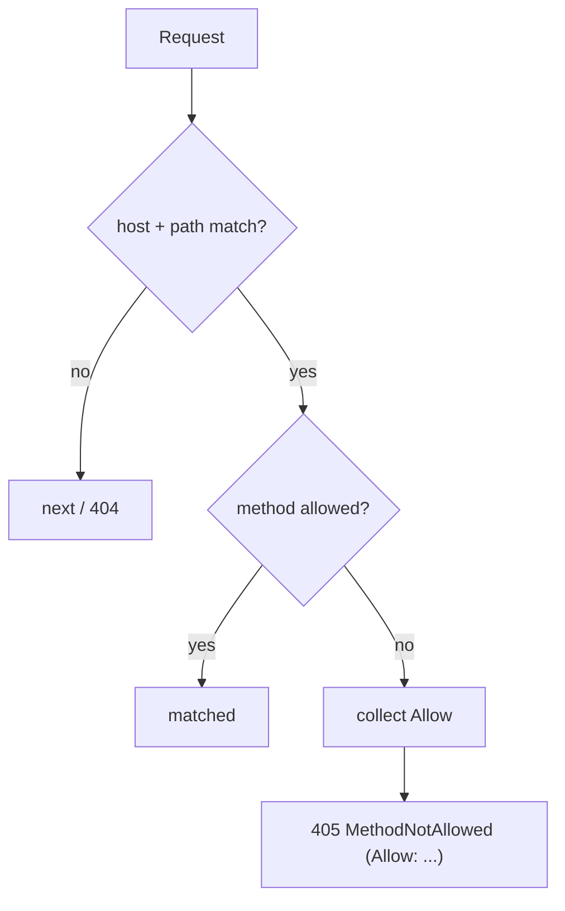

# HTTP Method Matching

!!! tip "In a nutshell"
    L'option `methods` limite les verbes HTTP qu'une route accepte, si bien qu'un même chemin
    peut servir des actions différentes selon le verbe ; associez-la à `schemes` pour des endpoints en HTTPS uniquement.
    Piège d'examen : un chemin qui correspond mais avec le mauvais verbe donne un 405 (avec `Allow`), pas un 404 — et `GET` correspond aussi à `HEAD`.

!!! example "Real-world analogy"
    Un chemin avec `methods` est comme un guichet de banque qui existe mais ne traite que
    certaines opérations. Présentez-vous au guichet « Dépôts » (le bon chemin) pour ouvrir un
    crédit immobilier (le mauvais verbe) : le guichetier ne fait pas comme si le guichet
    n'existait pas (404) — il vous répond « ce guichet ne fait que les dépôts et les retraits »
    (405 avec une liste `Allow`). Demander simplement à *consulter* le solde est traité comme une
    demande de dépôt dont on jette la paperasse (GET couvre aussi HEAD), et si vous arrivez par la
    rue non sécurisée, on vous indique simplement l'entrée sécurisée d'à côté (une redirection de
    scheme) au lieu de vous refuser.

!!! abstract "Learning objectives"
    À la fin de ce chapitre, vous saurez :

    - [ ] Restreindre une route à des méthodes HTTP précises avec `methods`
    - [ ] Expliquer le comportement automatique `GET ⇒ HEAD` et les réponses 405
    - [ ] Combiner `methods` avec `schemes` pour des endpoints en HTTPS uniquement
    - [ ] Comprendre comment `_method`/method override interagit avec le matching

    **Syllabus:** `Routing → HTTP methods matching` ·
    **Level:** Advanced ·
    **Est. time:** 18 min ·
    **Prerequisites:** [Configuration](configuration.md)

---

## Theory

L'option `methods` limite les verbes HTTP qu'une route accepte. C'est ainsi qu'un même
chemin sert des actions différentes selon le verbe — `GET /posts` liste, `POST /posts`
crée. Donnez à chaque verbe sa propre route (ou listez plusieurs verbes sur une même
route) plutôt que de faire des branchements dans une seule action.

L'option associée `schemes` restreint le scheme de l'URL (`http`/`https`). Les combiner
permet d'exprimer « POST, en HTTPS uniquement » directement dans la définition de la route.

!!! question "Predict first"
    Une route n'autorise que `GET`. Un `POST` arrive sur ce chemin exact. Est-ce un 404,
    un 405, ou l'action `GET` s'exécute-t-elle quand même ?

??? note "Reveal"
    **405 Method Not Allowed** avec un header `Allow` — le *chemin* a correspondu mais
    pas le verbe (un mauvais chemin donnerait un 404). Notez que `methods: ['GET']`
    correspond aussi automatiquement à `HEAD`.

## Deep Dive — how it works internally

`methods` et `schemes` sont stockés sur la `Route` et intégrés dans le matcher compilé.
`UrlMatcher::matchCollection()` fait d'abord correspondre host + chemin ; si ceux-ci
correspondent mais que la **méthode** n'est pas autorisée, il collecte les méthodes
autorisées de la route et, après avoir épuisé la collection, lève
`Symfony\Component\Routing\Exception\MethodNotAllowedException` → **405** avec un header
`Allow` listant les verbes permis. Un décalage de scheme se comporte différemment : le
`RedirectableUrlMatcher` émet une **redirection vers le bon scheme** (une request
`http` vers une route en `https` uniquement est donc redirigée, pas rejetée).

Deux subtilités :

- **`GET` implique `HEAD`.** Une route avec `methods: ['GET']` correspond aussi à `HEAD` ;
  HttpKernel traite `HEAD` en exécutant l'action `GET` et en supprimant le corps de la réponse.
- **Method override.** `Symfony\Component\HttpFoundation\Request::getMethod()` peut
  retourner une méthode surchargée (par exemple le champ `_method` d'un form ou le header
  `X-HTTP-Method-Override`) **seulement si** `Request::enableHttpMethodParameterOverride()`
  est activé. Le matcher compare avec `getMethod()`, donc l'override affecte
  le routing.



!!! note "Source reference"
    La gestion des méthodes/schemes dans `UrlMatcher::matchCollection()` et
    `RedirectableUrlMatcher` —
    [symfony/symfony `8.0`](https://github.com/symfony/symfony/blob/8.0/src/Symfony/Component/Routing/Matcher/UrlMatcher.php).

## Configuration & code

=== "PHP Attributes"

    ```php
    <?php
    declare(strict_types=1);

    namespace App\Controller;

    use Symfony\Bundle\FrameworkBundle\Controller\AbstractController;
    use Symfony\Component\HttpFoundation\Response;
    use Symfony\Component\Routing\Attribute\Route;

    final class PostController extends AbstractController
    {
        #[Route('/posts', name: 'post_index', methods: ['GET'])]
        public function index(): Response
        {
            return $this->render('post/index.html.twig');
        }

        // HTTPS-only creation endpoint.
        #[Route('/posts', name: 'post_create', methods: ['POST'], schemes: ['https'])]
        public function create(): Response
        {
            return new Response(status: Response::HTTP_CREATED);
        }

        // Several verbs on one route.
        #[Route('/posts/{id<\d+>}', name: 'post_update', methods: ['PUT', 'PATCH'])]
        public function update(int $id): Response
        {
            return new Response();
        }
    }
    ```

=== "YAML"

    ```yaml
    # config/routes/post.yaml
    post_index:
        path: /posts
        controller: App\Controller\PostController::index
        methods: [GET]

    post_create:
        path: /posts
        controller: App\Controller\PostController::create
        methods: [POST]
        schemes: [https]
    ```

=== "Method override (config)"

    ```php
    <?php
    declare(strict_types=1);

    // public/index.php or a listener, if you rely on _method form fields.
    use Symfony\Component\HttpFoundation\Request;

    Request::enableHttpMethodParameterOverride();
    ```

## Best practices & anti-patterns

| ✅ Do | ❌ Avoid |
|---|---|
| Une route par verbe (ou une courte liste) | Brancher sur `$request->getMethod()` |
| `schemes: ['https']` pour les routes sensibles | N'imposer HTTPS que dans un firewall |
| S'appuyer sur `GET ⇒ HEAD` | Déclarer `HEAD` explicitement |
| Retourner un vrai 405 avec `Allow` | Traiter une mauvaise méthode comme un 404 |

## When (not) to use it / alternatives

Définissez toujours `methods` sur les endpoints d'écriture — cela évite les mutations
déclenchées accidentellement par un GET et clarifie la sortie de `debug:router`. Pour
imposer le scheme, `schemes` redirige élégamment ; un `requires_channel` de sécurité
dans le firewall est une alternative quand la règle est large. N'utilisez pas `methods`
comme mécanisme d'autorisation.

!!! danger "Certification traps"
    - `methods: ['GET']` correspond aussi automatiquement à **HEAD**.
    - Le chemin correspond mais pas la méthode → **405** (avec `Allow`), **pas 404**.
    - Un décalage de **scheme** déclenche une **redirection**, pas un 405.
    - Le method override (`_method`) ne fonctionne qu'après
      `Request::enableHttpMethodParameterOverride()`.
    - Les noms de méthodes sont **insensibles à la casse**, mais par convention en majuscules.

!!! warning "Common mistakes"
    - S'attendre à un 404 quand le verbe est mauvais (c'est un 405).
    - Déclarer `HEAD` à côté de `GET` (redondant).
    - Supposer que l'override `_method` fonctionne par défaut — ce n'est pas le cas.

## Exercises

1. **(Basic)** Exposez `GET /tags` et `POST /tags` sous forme de deux routes sur un même chemin.
2. **(Intermediate)** Rendez `DELETE /tags/{id<\d+>}` accessible en HTTPS uniquement et décrivez la
   réponse à une request `http` ainsi qu'à un `GET` sur le même chemin.

??? success "Solutions"

    **1.**

    ```php
    #[Route('/tags', name: 'tag_index', methods: ['GET'])]
    public function index(): Response { /* ... */ }

    #[Route('/tags', name: 'tag_create', methods: ['POST'])]
    public function create(): Response { /* ... */ }
    ```

    **2.**

    ```php
    #[Route('/tags/{id<\d+>}', name: 'tag_delete', methods: ['DELETE'], schemes: ['https'])]
    public function delete(int $id): Response { /* ... */ }
    ```

    Un DELETE en `http` est **redirigé** vers l'URL `https`. Un `GET` sur
    `/tags/{id}` reçoit **405 Method Not Allowed** avec `Allow: DELETE`.

## Certification questions

??? question "Q1. A route allows only `GET`. A `POST` to that path returns?"
    - [ ] A. 404 Not Found
    - [x] B. 405 Method Not Allowed ✅
    - [ ] C. 200 OK
    - [ ] D. 301 redirect

    **Why:** le chemin correspond mais pas la méthode, d'où un 405 avec un header `Allow`.
    **Ref:** [HTTP methods](https://symfony.com/doc/current/routing.html#matching-http-methods).

??? question "Q2. `methods: ['GET']` also matches which verb?"
    - [x] A. HEAD ✅
    - [ ] B. POST
    - [ ] C. OPTIONS
    - [ ] D. PUT

    **Why:** HttpKernel traite HEAD comme un GET sans corps, donc les routes GET correspondent à HEAD.
    **Ref:** [Routing](https://symfony.com/doc/current/routing.html#matching-http-methods).

??? question "Q3. An `http` request to an `https`-only route results in?"
    - [x] A. A redirect to the `https` URL ✅
    - [ ] B. 405 Method Not Allowed
    - [ ] C. 403 Forbidden
    - [ ] D. 404 Not Found

    **Why:** le matcher redirectable redirige les décalages de scheme.
    **Ref:** [Routing](https://symfony.com/doc/current/routing.html#matching-the-http-scheme).

??? question "Q4. For a form's `_method` field to change routing, you must…"
    - [x] A. Call `Request::enableHttpMethodParameterOverride()` ✅
    - [ ] B. Add `methods: ['_method']`
    - [ ] C. Nothing — it's on by default
    - [ ] D. Set `framework.http_method_override: false`

    **Why:** le method override est optionnel (opt-in) via `enableHttpMethodParameterOverride()`.
    **Ref:** [HttpFoundation](https://symfony.com/doc/current/components/http_foundation.html).

## Key takeaways

- `methods` limite les verbes ; `GET` correspond aussi à `HEAD`.
- Mauvaise méthode sur un chemin qui correspond = **405 + Allow**, pas 404.
- Décalage de `schemes` = **redirection**, pas rejet.
- L'override `_method` nécessite `enableHttpMethodParameterOverride()`.

## Last-minute revision

!!! tip "Cheat sheet"
    - `methods: ['GET','POST']`, `schemes: ['https']`.
    - GET ⇒ HEAD. Mauvais verbe ⇒ 405. Mauvais scheme ⇒ redirection.
    - Override : `Request::enableHttpMethodParameterOverride()`.

## Connections

- **Depends on:** [Configuration](configuration.md) — `methods`/`schemes` affinent une route déjà déclarée.
- **Reused in:** [Redirects](redirects.md) — un décalage de scheme redirige, et un POST avec slash final donne un 405.
- **Confused with:** [Controllers → The Request](../controllers/request.md) — le matcher teste `Request::getMethod()` (override compris).

## Official References
- [Official Symfony docs — Matching HTTP methods](https://symfony.com/doc/current/routing.html#matching-http-methods)
- [Symfony source — UrlMatcher](https://github.com/symfony/symfony/blob/8.0/src/Symfony/Component/Routing/Matcher/UrlMatcher.php)

## Video references

!!! tip "Watch & learn"
    Voici des chaînes vidéo officielles, mises à jour en continu — recherchez-y
    « Symfony routing » pour consolider ce chapitre. Nous référençons des chaînes stables
    plutôt que des vidéos individuelles afin que les références ne périment jamais.

    - [SymfonyCasts screencasts](https://symfonycasts.com/tracks/symfony) — tutoriels scénarisés à suivre en codant.
    - [Symfony official YouTube](https://www.youtube.com/@SymfonyOfficial) — conférences et keynotes SymfonyCon.
    - [Official docs for this topic](https://symfony.com/doc/current/routing.html#matching-http-methods) — certaines pages de la doc Symfony intègrent un screencast.

## Confidence check

Je suis prêt quand je sais :

- [ ] expliquer **pourquoi** un mauvais verbe donne un 405 (+`Allow`) alors qu'un mauvais scheme redirige
- [ ] implémenter des routes par verbe et un endpoint en HTTPS uniquement en Symfony 8
- [ ] déboguer un override `_method` qui « ne fait rien » (non activé)
- [ ] repérer que déclarer `HEAD` à côté de `GET` est redondant et que 404 ≠ 405
- [ ] expliquer comment `matchCollection()` collecte les méthodes autorisées pour le header `Allow`

---

<small>Related: [Configuration](configuration.md) · [Redirects](redirects.md) · [Conditions](conditions.md) · [Controllers → The Request](../controllers/request.md)</small>
