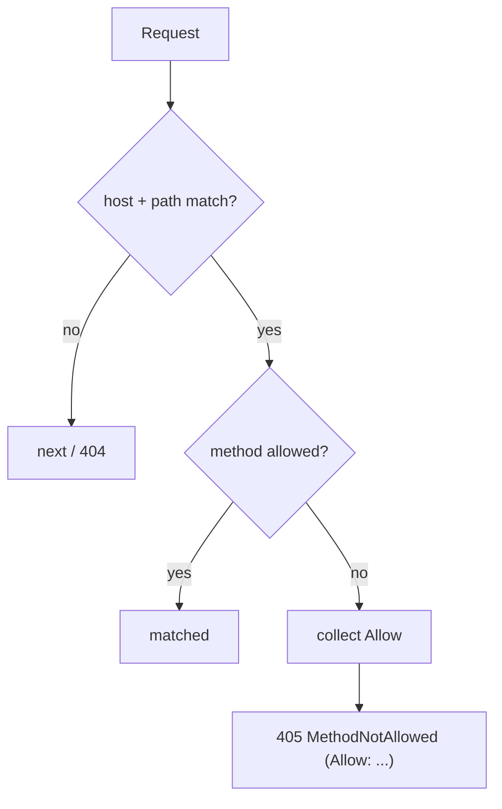

# HTTP Method Matching

!!! tip "In a nutshell"
    The `methods` option limits which HTTP verbs a route accepts, so one path can serve
    different actions per verb; pair it with `schemes` for HTTPS-only endpoints.
    Exam hook: a matching path with the wrong verb is a 405 (with `Allow`), not a 404 — and `GET` also matches `HEAD`.

!!! example "Real-world analogy"
    A path with `methods` is like a bank counter that exists but only handles certain
    transactions. Walk up to the "Deposits" window (the right path) and ask to open a mortgage
    (the wrong verb) and the teller does not pretend the window doesn't exist (404) — they tell
    you "this window only does deposits and withdrawals" (405 with an `Allow` list). Asking merely
    to *see* the balance is treated like a deposit request with the paperwork discarded (GET also
    covers HEAD), and if you showed up on the insecure street they simply point you to the secure
    entrance next door (a scheme redirect) instead of refusing you.

!!! abstract "Learning objectives"
    By the end of this chapter you can:

    - [ ] Restrict a route to specific HTTP methods with `methods`
    - [ ] Explain the automatic `GET ⇒ HEAD` behaviour and 405 responses
    - [ ] Combine `methods` with `schemes` for HTTPS-only endpoints
    - [ ] Understand how `_method`/method override interacts with matching

    **Syllabus:** `Routing → HTTP methods matching` ·
    **Level:** Advanced ·
    **Est. time:** 18 min ·
    **Prerequisites:** [Configuration](configuration.md)

---

## Theory

The `methods` option limits which HTTP verbs a route accepts. It is how one path
serves different actions per verb — `GET /posts` lists, `POST /posts` creates. Give
each verb its own route (or list several verbs on one route) rather than branching
inside a single action.

The related `schemes` option restricts the URL scheme (`http`/`https`). Combining
them expresses "POST, over HTTPS only" in the route definition.

!!! question "Predict first"
    A route allows only `GET`. A `POST` hits that exact path. Is it a 404, a 405, or
    does the `GET` action run anyway?

??? note "Reveal"
    **405 Method Not Allowed** with an `Allow` header — the *path* matched but the
    verb didn't (a wrong path would be 404). Note `methods: ['GET']` also matches
    `HEAD` automatically.

## Deep Dive — how it works internally

`methods` and `schemes` are stored on the `Route` and folded into the compiled
matcher. `UrlMatcher::matchCollection()` first matches host + path; if those match
but the **method** is not allowed, it collects the route's allowed methods and,
after exhausting the collection, throws
`Symfony\Component\Routing\Exception\MethodNotAllowedException` → **405** with an
`Allow` header listing permitted verbs. A scheme mismatch behaves differently: the
`RedirectableUrlMatcher` issues a **redirect to the correct scheme** (so an
`http` request to an `https`-only route is redirected, not rejected).

Two subtleties:

- **`GET` implies `HEAD`.** A route with `methods: ['GET']` also matches `HEAD`;
  HttpKernel handles `HEAD` by running the `GET` action and stripping the body.
- **Method override.** `Symfony\Component\HttpFoundation\Request::getMethod()` can
  return an overridden method (e.g. a form's `_method` field or the
  `X-HTTP-Method-Override` header) **only if** `Request::enableHttpMethodParameterOverride()`
  is enabled. The matcher matches against `getMethod()`, so the override affects
  routing.



!!! note "Source reference"
    Method/scheme handling in `UrlMatcher::matchCollection()` and
    `RedirectableUrlMatcher` —
    [symfony/symfony `8.0`](https://github.com/symfony/symfony/blob/8.0/src/Symfony/Component/Routing/Matcher/UrlMatcher.php).

## Configuration & code

=== "PHP Attributes"

    ```php
    <?php
    declare(strict_types=1);

    namespace App\Controller;

    use Symfony\Bundle\FrameworkBundle\Controller\AbstractController;
    use Symfony\Component\HttpFoundation\Response;
    use Symfony\Component\Routing\Attribute\Route;

    final class PostController extends AbstractController
    {
        #[Route('/posts', name: 'post_index', methods: ['GET'])]
        public function index(): Response
        {
            return $this->render('post/index.html.twig');
        }

        // HTTPS-only creation endpoint.
        #[Route('/posts', name: 'post_create', methods: ['POST'], schemes: ['https'])]
        public function create(): Response
        {
            return new Response(status: Response::HTTP_CREATED);
        }

        // Several verbs on one route.
        #[Route('/posts/{id<\d+>}', name: 'post_update', methods: ['PUT', 'PATCH'])]
        public function update(int $id): Response
        {
            return new Response();
        }
    }
    ```

=== "YAML"

    ```yaml
    # config/routes/post.yaml
    post_index:
        path: /posts
        controller: App\Controller\PostController::index
        methods: [GET]

    post_create:
        path: /posts
        controller: App\Controller\PostController::create
        methods: [POST]
        schemes: [https]
    ```

=== "Method override (config)"

    ```php
    <?php
    declare(strict_types=1);

    // public/index.php or a listener, if you rely on _method form fields.
    use Symfony\Component\HttpFoundation\Request;

    Request::enableHttpMethodParameterOverride();
    ```

## Best practices & anti-patterns

| ✅ Do | ❌ Avoid |
|---|---|
| One route per verb (or a short list) | Branching by `$request->getMethod()` |
| `schemes: ['https']` for sensitive routes | Enforcing HTTPS only in a firewall |
| Rely on `GET ⇒ HEAD` | Declaring `HEAD` explicitly |
| Return proper 405 with `Allow` | Catching wrong-method as 404 |

## When (not) to use it / alternatives

Always set `methods` on write endpoints — it prevents accidental GET-triggered
mutations and improves `debug:router` clarity. For scheme enforcement, `schemes`
redirects gracefully; a security `requires_channel` in the firewall is an
alternative when the rule is broad. Do not use `methods` as authorization.

!!! danger "Certification traps"
    - `methods: ['GET']` also matches **HEAD** automatically.
    - Path matches but method doesn't → **405** (with `Allow`), **not 404**.
    - A **scheme** mismatch triggers a **redirect**, not a 405.
    - Method override (`_method`) only works after
      `Request::enableHttpMethodParameterOverride()`.
    - Method names are **case-insensitive** but conventionally uppercase.

!!! warning "Common mistakes"
    - Expecting a 404 when the verb is wrong (it's 405).
    - Declaring `HEAD` alongside `GET` (redundant).
    - Assuming `_method` override works by default — it does not.

## Exercises

1. **(Basic)** Expose `GET /tags` and `POST /tags` as two routes on one path.
2. **(Intermediate)** Make `DELETE /tags/{id<\d+>}` HTTPS-only and describe the
   response to an `http` request and to a `GET` on the same path.

??? success "Solutions"

    **1.**

    ```php
    #[Route('/tags', name: 'tag_index', methods: ['GET'])]
    public function index(): Response { /* ... */ }

    #[Route('/tags', name: 'tag_create', methods: ['POST'])]
    public function create(): Response { /* ... */ }
    ```

    **2.**

    ```php
    #[Route('/tags/{id<\d+>}', name: 'tag_delete', methods: ['DELETE'], schemes: ['https'])]
    public function delete(int $id): Response { /* ... */ }
    ```

    An `http` DELETE is **redirected** to the `https` URL. A `GET` on
    `/tags/{id}` gets **405 Method Not Allowed** with `Allow: DELETE`.

## Certification questions

??? question "Q1. A route allows only `GET`. A `POST` to that path returns?"
    - [ ] A. 404 Not Found
    - [x] B. 405 Method Not Allowed ✅
    - [ ] C. 200 OK
    - [ ] D. 301 redirect

    **Why:** path matches but method doesn't, yielding 405 with an `Allow` header.
    **Ref:** [HTTP methods](https://symfony.com/doc/current/routing.html#matching-http-methods).

??? question "Q2. `methods: ['GET']` also matches which verb?"
    - [x] A. HEAD ✅
    - [ ] B. POST
    - [ ] C. OPTIONS
    - [ ] D. PUT

    **Why:** HttpKernel treats HEAD as a bodyless GET, so GET routes match HEAD.
    **Ref:** [Routing](https://symfony.com/doc/current/routing.html#matching-http-methods).

??? question "Q3. An `http` request to an `https`-only route results in?"
    - [x] A. A redirect to the `https` URL ✅
    - [ ] B. 405 Method Not Allowed
    - [ ] C. 403 Forbidden
    - [ ] D. 404 Not Found

    **Why:** the redirectable matcher redirects scheme mismatches.
    **Ref:** [Routing](https://symfony.com/doc/current/routing.html#matching-the-http-scheme).

??? question "Q4. For a form's `_method` field to change routing, you must…"
    - [x] A. Call `Request::enableHttpMethodParameterOverride()` ✅
    - [ ] B. Add `methods: ['_method']`
    - [ ] C. Nothing — it's on by default
    - [ ] D. Set `framework.http_method_override: false`

    **Why:** method override is opt-in via `enableHttpMethodParameterOverride()`.
    **Ref:** [HttpFoundation](https://symfony.com/doc/current/components/http_foundation.html).

## Key takeaways

- `methods` limits verbs; `GET` also matches `HEAD`.
- Wrong method on a matching path = **405 + Allow**, not 404.
- `schemes` mismatch = **redirect**, not rejection.
- `_method` override needs `enableHttpMethodParameterOverride()`.

## Last-minute revision

!!! tip "Cheat sheet"
    - `methods: ['GET','POST']`, `schemes: ['https']`.
    - GET ⇒ HEAD. Wrong verb ⇒ 405. Wrong scheme ⇒ redirect.
    - Override: `Request::enableHttpMethodParameterOverride()`.

## Connections

- **Depends on:** [Configuration](configuration.md) — `methods`/`schemes` refine an already-declared route.
- **Reused in:** [Redirects](redirects.md) — a scheme mismatch redirects, and a trailing-slash POST is a 405.
- **Confused with:** [Controllers → The Request](../controllers/request.md) — the matcher tests `Request::getMethod()` (with any override).

## Official References
- [Official Symfony docs — Matching HTTP methods](https://symfony.com/doc/current/routing.html#matching-http-methods)
- [Symfony source — UrlMatcher](https://github.com/symfony/symfony/blob/8.0/src/Symfony/Component/Routing/Matcher/UrlMatcher.php)

## Video references

!!! tip "Watch & learn"
    These are official, continuously-updated video channels — search them for
    "Symfony routing" to reinforce this chapter. We link stable channels rather than
    individual videos so the references never rot.

    - [SymfonyCasts screencasts](https://symfonycasts.com/tracks/symfony) — scripted, code-along tutorials.
    - [Symfony official YouTube](https://www.youtube.com/@SymfonyOfficial) — SymfonyCon conference talks & keynotes.
    - [Official docs for this topic](https://symfony.com/doc/current/routing.html#matching-http-methods) — some Symfony doc pages embed a screencast.

## Confidence check

I'm ready when I can:

- [ ] explain **why** a wrong verb is 405 (+`Allow`) but a wrong scheme redirects
- [ ] implement per-verb routes and an HTTPS-only endpoint in Symfony 8
- [ ] debug a `_method` override that "does nothing" (not enabled)
- [ ] spot that declaring `HEAD` beside `GET` is redundant and 404 ≠ 405
- [ ] explain how `matchCollection()` collects allowed methods for the `Allow` header

---

<small>Related: [Configuration](configuration.md) · [Redirects](redirects.md) · [Conditions](conditions.md) · [Controllers → The Request](../controllers/request.md)</small>
