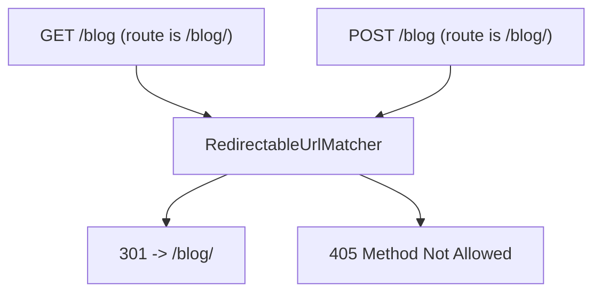

# Triggering Redirects from Routing

!!! tip "In a nutshell"
    Utilisez le `RedirectController` intégré pour définir des redirections uniquement en config :
    `redirectAction` cible un nom de route, `urlRedirectAction` un chemin littéral, et `permanent: true` en fait un 301.
    Piège d'examen : un décalage de slash final redirige automatiquement (301) uniquement pour GET/HEAD — un POST vers la forme non canonique donne un 405.

!!! example "Real-world analogy"
    Une route de redirection est comme un ordre de réexpédition à la poste : le courrier destiné à
    l'ancienne adresse est automatiquement transféré vers la nouvelle, et vous décidez si le
    déménagement est permanent (301) ou temporaire (302). La règle du slash final est la subtilité :
    une simple lettre (un GET sûr) est discrètement réexpédiée vers l'adresse canonique, mais un
    colis signé, sensible à la méthode d'acheminement (un POST), n'est *pas* réacheminé en silence —
    le guichetier vous le rend marqué « non distribuable à cette adresse » (405), car le réexpédier
    supprimerait le traitement voulu par l'expéditeur.

!!! abstract "Learning objectives"
    À la fin de ce chapitre, vous saurez :

    - [ ] Configurer une route de redirection pure avec `RedirectController`
    - [ ] Choisir entre les actions `urlRedirect` et `redirect`
    - [ ] Expliquer le comportement de redirection automatique du slash final dans Symfony
    - [ ] Décider entre redirections au niveau du routing et au niveau du controller

    **Syllabus:** `Routing → Trigger redirects` ·
    **Level:** Advanced ·
    **Est. time:** 20 min ·
    **Prerequisites:** [Configuration](configuration.md), [URL generation](url-generation.md)

---

## Theory

Parfois, une URL ne doit exécuter aucune logique métier — elle doit simplement
**rediriger** vers une autre URL ou route. Symfony fournit un controller prêt à l'emploi,
`Symfony\Bundle\FrameworkBundle\Controller\RedirectController`, pour définir des
redirections **de manière déclarative dans la config des routes** sans écrire de controller.

Deux actions :

- `RedirectController::redirectAction` — redirige vers une autre **route** (par son nom),
  en transmettant les paramètres.
- `RedirectController::urlRedirectAction` — redirige vers un **chemin/URL littéral**.

Les deux acceptent `permanent` (301 vs 302) et peuvent forcer `scheme`/`httpPort`/`httpsPort`.
Pour les redirections qui dépendent d'une logique, redirigez plutôt depuis le controller (voir
[Controllers → HTTP Redirects](../controllers/http-redirects.md)).

```yaml
# redirectAction: target a route by NAME
legacy_home:
    path: /home
    controller: Symfony\Bundle\FrameworkBundle\Controller\RedirectController::redirectAction
    defaults:
        route: app_dashboard   # target route name
        permanent: true        # 301 (default false = 302)

# urlRedirectAction: target a literal PATH/URL, optionally forcing the scheme
legacy_docs:
    path: /old-docs
    controller: Symfony\Bundle\FrameworkBundle\Controller\RedirectController::urlRedirectAction
    defaults:
        path: /docs            # literal target path
        scheme: https          # httpPort / httpsPort can be forced too
```

!!! question "Predict first"
    Une route est définie comme `/blog/`. Un `GET /blog` et un `POST /blog` arrivent
    tous les deux. Que reçoit chacun ?

??? note "Reveal"
    `GET /blog` → redirection **301** vers `/blog/` (la redirection automatique du slash
    final pour les méthodes sûres). `POST /blog` → **405**, car rediriger transformerait
    silencieusement le POST en GET.

## Deep Dive — how it works internally

Une route de redirection est une route ordinaire dont le default `_controller` pointe vers
`RedirectController`, avec des defaults décrivant la cible. Quand elle correspond, le kernel
exécute le controller comme n'importe quel autre ; celui-ci construit une
`Symfony\Component\HttpFoundation\RedirectResponse` (ou lève
`Symfony\Component\HttpKernel\Exception\HttpException` si la cible manque) et la
retourne. Rien de spécial ne se passe dans le matcher — la « redirection » n'est qu'un
controller produisant une réponse 30x.

```php
// Simplified: the route's _controller default points at RedirectController;
// the other defaults (path, permanent, ...) become controller arguments.
public function urlRedirectAction(Request $request, string $path, bool $permanent = false): Response
{
    if ('' === $path) {
        // missing target -> HttpException (404, or 410 when permanent)
        throw new HttpException($permanent ? 410 : 404);
    }

    // the "redirect" is just an ordinary controller returning a 30x response
    return new RedirectResponse($path, $permanent ? 301 : 302);
}
```

### Automatic trailing-slash redirects

Le matcher compilé a un comportement subtil et pertinent pour l'examen. Si le chemin d'une
route se termine par `/` (par exemple `/blog/`) et que la request arrive **sans** le slash
(`/blog`), une request `GET`/`HEAD` reçoit une **redirection 301 vers l'URL avec slash** via
`Symfony\Component\Routing\Matcher\RedirectableUrlMatcher`. L'inverse est aussi vrai :
une request avec un slash final en trop vers une route définie sans slash est redirigée vers
la forme canonique. Cela ne s'applique qu'aux **méthodes sûres** — un `POST` vers la forme
non canonique donne **405 Method Not Allowed**, pas une redirection, pour éviter de
transformer un POST en GET.



!!! note "Source reference"
    `RedirectableUrlMatcher` gère les 301 de slash final ;
    `RedirectController` construit la response —
    [routing matcher](https://github.com/symfony/symfony/blob/8.0/src/Symfony/Component/Routing/Matcher/RedirectableUrlMatcher.php) ·
    [RedirectController](https://github.com/symfony/symfony/blob/8.0/src/Symfony/Bundle/FrameworkBundle/Controller/RedirectController.php).

## Configuration & code

=== "YAML (to a route)"

    ```yaml
    # config/routes.yaml
    # Old name -> new route, keeping parameters, permanent (301).
    legacy_article:
        path: /article/{id<\d+>}
        controller: Symfony\Bundle\FrameworkBundle\Controller\RedirectController::redirectAction
        defaults:
            route: blog_show          # target route name
            permanent: true           # 301 instead of 302
            # keepQueryParams: true   # forward ?a=b
    ```

=== "YAML (to a URL/path)"

    ```yaml
    # config/routes.yaml
    docs_root:
        path: /docs
        controller: Symfony\Bundle\FrameworkBundle\Controller\RedirectController::urlRedirectAction
        defaults:
            path: /docs/intro         # literal path
            permanent: false          # 302
    ```

=== "PHP Attributes"

    ```php
    <?php
    declare(strict_types=1);

    namespace App\Controller;

    use Symfony\Component\HttpFoundation\RedirectResponse;
    use Symfony\Component\HttpFoundation\Response;
    use Symfony\Component\Routing\Attribute\Route;
    use Symfony\Bundle\FrameworkBundle\Controller\AbstractController;

    // For logic-driven redirects, redirect from your own action:
    final class GoController extends AbstractController
    {
        #[Route('/go/{id<\d+>}', name: 'app_go', methods: ['GET'])]
        public function go(int $id): Response
        {
            // 302 to a named route
            return $this->redirectToRoute('blog_show', ['id' => $id]);
            // Or: return new RedirectResponse('https://example.com', 301);
        }
    }
    ```

Il n'existe pas d'attribut `#[Route]` dédié pour `RedirectController` ; les redirections
déclaratives s'expriment en YAML (ou en config de routes PHP), tandis que les controllers
à attributs redirigent via `redirectToRoute()`/`RedirectResponse`.

## Best practices & anti-patterns

| ✅ Do | ❌ Avoid |
|---|---|
| Utiliser `RedirectController` pour les redirections statiques | Écrire un controller juste pour rediriger |
| `permanent: true` (301) pour les URLs déplacées | 301 pour des redirections temporaires/A-B (mis en cache !) |
| Préserver les params avec `redirectAction` | Perdre les query params sur les URLs héritées |
| Laisser le matcher faire les 301 de slash final | Ajouter des routes manuelles de correction de slash |

## When (not) to use it / alternatives

Utilisez le `RedirectController` au niveau du routing pour les redirections **statiques et
inconditionnelles** (URLs renommées, chemins de courtoisie). Utilisez un **controller**
(`redirectToRoute()`) dès que la cible dépend des données, de l'utilisateur ou de
l'authentification. Notez que les 301 sont agressivement mis en cache par les navigateurs —
préférez un 302 tant qu'une cible est encore susceptible de changer.

!!! danger "Certification traps"
    - La redirection automatique du slash final est **301 et GET/HEAD uniquement** ; un POST
      vers la forme non canonique retourne **405**, pas une redirection.
    - `permanent: true` = **301**, la valeur par défaut est **302**.
    - `redirectAction` cible un **nom de route** ; `urlRedirectAction` cible un
      **chemin/URL**.
    - La redirection est produite par un **controller**, pas par le matcher (sauf le cas
      du slash final).

!!! warning "Common mistakes"
    - Utiliser un 301 pour des redirections temporaires et ne plus pouvoir les changer ensuite.
    - Oublier `keepQueryParams`/`keepRequestMethod` quand c'est nécessaire.
    - S'attendre à ce qu'un POST vers `/blog` (route `/blog/`) redirige — il donne un 405.

## Exercises

1. **(Basic)** Redirigez `/home` vers la route `app_dashboard` avec un 301.
2. **(Intermediate)** Redirigez `/legacy/{id<\d+>}` vers `blog_show` en préservant l'id
   et la query string, de façon permanente.

??? success "Solutions"

    **1.**

    ```yaml
    home_redirect:
        path: /home
        controller: Symfony\Bundle\FrameworkBundle\Controller\RedirectController::redirectAction
        defaults:
            route: app_dashboard
            permanent: true
    ```

    **2.**

    ```yaml
    legacy_redirect:
        path: /legacy/{id<\d+>}
        controller: Symfony\Bundle\FrameworkBundle\Controller\RedirectController::redirectAction
        defaults:
            route: blog_show
            permanent: true
            keepQueryParams: true
    ```

    Le `{id}` capturé est transmis automatiquement à `blog_show`.

## Certification questions

??? question "Q1. A route path is `/blog/`. A `GET /blog` request results in?"
    - [x] A. 301 redirect to `/blog/` ✅
    - [ ] B. 404 Not Found
    - [ ] C. 302 redirect to `/blog/`
    - [ ] D. Direct match, no redirect

    **Why:** `RedirectableUrlMatcher` émet un 301 vers l'URL canonique avec slash pour
    les méthodes sûres. **Ref:** [Trailing slash](https://symfony.com/doc/current/routing.html#redirecting-urls-with-trailing-slashes).

??? question "Q2. `POST /blog` where the route is `/blog/` yields?"
    - [ ] A. 301 redirect
    - [x] B. 405 Method Not Allowed ✅
    - [ ] C. 200 OK
    - [ ] D. 308 redirect

    **Why:** rediriger un POST changerait sa méthode, donc le matcher retourne un 405.
    **Ref:** [Routing](https://symfony.com/doc/current/routing.html#redirecting-urls-with-trailing-slashes).

??? question "Q3. Which controller action redirects to a route **name**?"
    - [x] A. `RedirectController::redirectAction` ✅
    - [ ] B. `RedirectController::urlRedirectAction`
    - [ ] C. `RedirectController::routeAction`
    - [ ] D. `RedirectController::nameAction`

    **Why:** `redirectAction` prend un default `route` ; `urlRedirectAction` prend un
    `path`. **Ref:** [Redirecting](https://symfony.com/doc/current/routing.html).

??? question "Q4. `permanent: true` sets which status code?"
    - [x] A. 301 ✅
    - [ ] B. 302
    - [ ] C. 307
    - [ ] D. 308

    **Why:** `permanent` active un 301 ; la valeur par défaut est un 302.
    **Ref:** [Routing](https://symfony.com/doc/current/routing.html).

## Key takeaways

- `RedirectController` offre des redirections uniquement en config : `redirectAction` (route),
  `urlRedirectAction` (chemin/URL).
- `permanent: true` = 301 ; par défaut 302.
- Décalage de slash final → **301 pour GET/HEAD**, **405 pour POST**.
- Les redirections pilotées par la logique relèvent d'un controller (`redirectToRoute()`).

## Last-minute revision

!!! tip "Cheat sheet"
    - `redirectAction` → `route` ; `urlRedirectAction` → `path`.
    - `permanent`, `keepQueryParams`, `keepRequestMethod`, `scheme`.
    - Décalage de slash : 301 (méthode sûre) / 405 (POST).

## Connections

- **Depends on:** [Configuration](configuration.md) — une route de redirection est une route ordinaire dont le `_controller` est `RedirectController`.
- **Reused in:** [URL generation](url-generation.md) — `redirectAction` transmet les params à une URL cible générée.
- **Confused with:** [Controllers → HTTP Redirects](../controllers/http-redirects.md) — redirections uniquement en config vs `redirectToRoute()` piloté par la logique.

## Official References
- [Official Symfony docs — Redirecting URLs](https://symfony.com/doc/current/routing.html#redirecting-urls-with-trailing-slashes)
- [Symfony source — RedirectController](https://github.com/symfony/symfony/blob/8.0/src/Symfony/Bundle/FrameworkBundle/Controller/RedirectController.php)

## Video references

!!! tip "Watch & learn"
    Voici des chaînes vidéo officielles, mises à jour en continu — recherchez-y
    « Symfony routing » pour consolider ce chapitre. Nous référençons des chaînes stables
    plutôt que des vidéos individuelles afin que les références ne périment jamais.

    - [SymfonyCasts screencasts](https://symfonycasts.com/tracks/symfony) — tutoriels scénarisés à suivre en codant.
    - [Symfony official YouTube](https://www.youtube.com/@SymfonyOfficial) — conférences et keynotes SymfonyCon.
    - [Official docs for this topic](https://symfony.com/doc/current/routing.html#redirecting-urls-with-trailing-slashes) — certaines pages de la doc Symfony intègrent un screencast.

## Confidence check

Je suis prêt quand je sais :

- [ ] expliquer quand utiliser `RedirectController` vs une redirection depuis un controller
- [ ] implémenter `redirectAction`/`urlRedirectAction` avec `permanent` en Symfony 8
- [ ] déboguer un POST vers une route avec slash qui retourne 405 au lieu de rediriger
- [ ] repérer que la redirection de slash final est 301/GET-HEAD uniquement et que `permanent` = 301
- [ ] expliquer que (hors slash final) la redirection est produite par un controller, pas par le matcher

---

<small>Related: [Configuration](configuration.md) · [URL generation](url-generation.md) · [Controllers → HTTP Redirects](../controllers/http-redirects.md) · [Methods](methods.md)</small>
