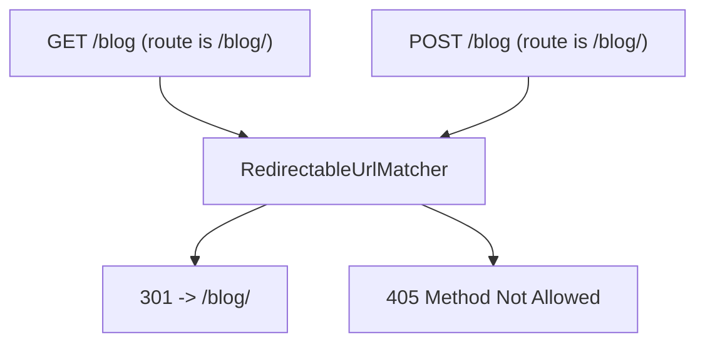

# Triggering Redirects from Routing

!!! tip "In a nutshell"
    Use the built-in `RedirectController` to define config-only redirects: `redirectAction`
    targets a route name, `urlRedirectAction` a literal path, and `permanent: true` makes it a 301.
    Exam hook: a trailing-slash mismatch auto-redirects (301) only for GET/HEAD — a POST to the non-canonical form is a 405.

!!! example "Real-world analogy"
    A redirect route is like a change-of-address order at the post office: mail for the old
    address is automatically forwarded to the new one, and you decide whether the move is
    permanent (301) or temporary (302). The trailing-slash rule is the subtlety: a plain letter
    (a safe GET) gets quietly forwarded to the canonical address, but a signed, method-sensitive
    parcel (a POST) is *not* silently rerouted — the clerk hands it back marked "not deliverable
    as addressed" (405), because forwarding it would strip the sender's intended handling.

!!! abstract "Learning objectives"
    By the end of this chapter you can:

    - [ ] Configure a redirect-only route with `RedirectController`
    - [ ] Choose between `urlRedirect` and `redirect` actions
    - [ ] Explain Symfony's automatic trailing-slash redirect behaviour
    - [ ] Decide between routing-level and controller-level redirects

    **Syllabus:** `Routing → Trigger redirects` ·
    **Level:** Advanced ·
    **Est. time:** 20 min ·
    **Prerequisites:** [Configuration](configuration.md), [URL generation](url-generation.md)

---

## Theory

Sometimes a URL should not run business logic — it should just **redirect** to
another URL or route. Symfony ships a ready-made controller,
`Symfony\Bundle\FrameworkBundle\Controller\RedirectController`, so you can define
redirects **declaratively in route config** without writing a controller.

Two actions:

- `RedirectController::redirectAction` — redirect to another **route** (by name),
  forwarding parameters.
- `RedirectController::urlRedirectAction` — redirect to a **literal path/URL**.

Both accept `permanent` (301 vs 302) and can force `scheme`/`httpPort`/`httpsPort`.
For redirects that depend on logic, redirect from the controller instead (see
[Controllers → HTTP Redirects](../controllers/http-redirects.md)).

```yaml
# redirectAction: target a route by NAME
legacy_home:
    path: /home
    controller: Symfony\Bundle\FrameworkBundle\Controller\RedirectController::redirectAction
    defaults:
        route: app_dashboard   # target route name
        permanent: true        # 301 (default false = 302)

# urlRedirectAction: target a literal PATH/URL, optionally forcing the scheme
legacy_docs:
    path: /old-docs
    controller: Symfony\Bundle\FrameworkBundle\Controller\RedirectController::urlRedirectAction
    defaults:
        path: /docs            # literal target path
        scheme: https          # httpPort / httpsPort can be forced too
```

!!! question "Predict first"
    A route is defined as `/blog/`. A `GET /blog` and a `POST /blog` both arrive.
    What does each one get?

??? note "Reveal"
    `GET /blog` → **301** redirect to `/blog/` (the trailing-slash auto-redirect for
    safe methods). `POST /blog` → **405**, because redirecting would silently turn
    the POST into a GET.

## Deep Dive — how it works internally

A redirect route is an ordinary route whose `_controller` default points at
`RedirectController`, plus defaults describing the target. When matched, the kernel
runs the controller like any other; it builds a
`Symfony\Component\HttpFoundation\RedirectResponse` (or throws
`Symfony\Component\HttpKernel\Exception\HttpException` for a missing target) and
returns it. Nothing special happens in the matcher — the "redirect" is just a
controller producing a 30x response.

```php
// Simplified: the route's _controller default points at RedirectController;
// the other defaults (path, permanent, ...) become controller arguments.
public function urlRedirectAction(Request $request, string $path, bool $permanent = false): Response
{
    if ('' === $path) {
        // missing target -> HttpException (404, or 410 when permanent)
        throw new HttpException($permanent ? 410 : 404);
    }

    // the "redirect" is just an ordinary controller returning a 30x response
    return new RedirectResponse($path, $permanent ? 301 : 302);
}
```

### Automatic trailing-slash redirects

The compiled matcher has a subtle, exam-relevant behaviour. If a route path ends
with `/` (e.g. `/blog/`) and the request comes in **without** the slash (`/blog`),
a `GET`/`HEAD` request is answered with a **301 redirect to the slashed URL** via
`Symfony\Component\Routing\Matcher\RedirectableUrlMatcher`. The reverse also holds:
a request with an extra trailing slash to a route defined without one redirects to
the canonical form. This only applies to **safe methods** — a `POST` to the
non-canonical form yields **405 Method Not Allowed**, not a redirect, to avoid
turning a POST into a GET.



!!! note "Source reference"
    `RedirectableUrlMatcher` handles trailing-slash 301s;
    `RedirectController` builds the response —
    [routing matcher](https://github.com/symfony/symfony/blob/8.0/src/Symfony/Component/Routing/Matcher/RedirectableUrlMatcher.php) ·
    [RedirectController](https://github.com/symfony/symfony/blob/8.0/src/Symfony/Bundle/FrameworkBundle/Controller/RedirectController.php).

## Configuration & code

=== "YAML (to a route)"

    ```yaml
    # config/routes.yaml
    # Old name -> new route, keeping parameters, permanent (301).
    legacy_article:
        path: /article/{id<\d+>}
        controller: Symfony\Bundle\FrameworkBundle\Controller\RedirectController::redirectAction
        defaults:
            route: blog_show          # target route name
            permanent: true           # 301 instead of 302
            # keepQueryParams: true   # forward ?a=b
    ```

=== "YAML (to a URL/path)"

    ```yaml
    # config/routes.yaml
    docs_root:
        path: /docs
        controller: Symfony\Bundle\FrameworkBundle\Controller\RedirectController::urlRedirectAction
        defaults:
            path: /docs/intro         # literal path
            permanent: false          # 302
    ```

=== "PHP Attributes"

    ```php
    <?php
    declare(strict_types=1);

    namespace App\Controller;

    use Symfony\Component\HttpFoundation\RedirectResponse;
    use Symfony\Component\HttpFoundation\Response;
    use Symfony\Component\Routing\Attribute\Route;
    use Symfony\Bundle\FrameworkBundle\Controller\AbstractController;

    // For logic-driven redirects, redirect from your own action:
    final class GoController extends AbstractController
    {
        #[Route('/go/{id<\d+>}', name: 'app_go', methods: ['GET'])]
        public function go(int $id): Response
        {
            // 302 to a named route
            return $this->redirectToRoute('blog_show', ['id' => $id]);
            // Or: return new RedirectResponse('https://example.com', 301);
        }
    }
    ```

There is no dedicated `#[Route]` attribute for `RedirectController`; declarative
redirects are expressed in YAML (or PHP route config), while attribute-based
controllers redirect via `redirectToRoute()`/`RedirectResponse`.

## Best practices & anti-patterns

| ✅ Do | ❌ Avoid |
|---|---|
| Use `RedirectController` for static redirects | Writing a controller just to redirect |
| `permanent: true` (301) for moved URLs | 301 for temporary/A-B redirects (cached!) |
| Preserve params with `redirectAction` | Losing query params on legacy URLs |
| Let the matcher do trailing-slash 301s | Adding manual slash-fixing routes |

## When (not) to use it / alternatives

Use routing-level `RedirectController` for **static, unconditional** redirects
(renamed URLs, vanity paths). Use a **controller** (`redirectToRoute()`) whenever
the target depends on data, the user, or auth. Note that 301s are aggressively
cached by browsers — prefer 302 while a target is still in flux.

!!! danger "Certification traps"
    - Trailing-slash auto-redirect is **301 and GET/HEAD only**; POST to the
      non-canonical form returns **405**, not a redirect.
    - `permanent: true` = **301**, default is **302**.
    - `redirectAction` targets a **route name**; `urlRedirectAction` targets a
      **path/URL**.
    - The redirect is produced by a **controller**, not by the matcher (except the
      trailing-slash case).

!!! warning "Common mistakes"
    - Using 301 for temporary redirects and then being unable to change them.
    - Forgetting `keepQueryParams`/`keepRequestMethod` when needed.
    - Expecting a POST to `/blog` (route `/blog/`) to redirect — it 405s.

## Exercises

1. **(Basic)** Redirect `/home` to the `app_dashboard` route with a 301.
2. **(Intermediate)** Redirect `/legacy/{id<\d+>}` to `blog_show` preserving the id
   and query string, permanently.

??? success "Solutions"

    **1.**

    ```yaml
    home_redirect:
        path: /home
        controller: Symfony\Bundle\FrameworkBundle\Controller\RedirectController::redirectAction
        defaults:
            route: app_dashboard
            permanent: true
    ```

    **2.**

    ```yaml
    legacy_redirect:
        path: /legacy/{id<\d+>}
        controller: Symfony\Bundle\FrameworkBundle\Controller\RedirectController::redirectAction
        defaults:
            route: blog_show
            permanent: true
            keepQueryParams: true
    ```

    The matched `{id}` is forwarded to `blog_show` automatically.

## Certification questions

??? question "Q1. A route path is `/blog/`. A `GET /blog` request results in?"
    - [x] A. 301 redirect to `/blog/` ✅
    - [ ] B. 404 Not Found
    - [ ] C. 302 redirect to `/blog/`
    - [ ] D. Direct match, no redirect

    **Why:** `RedirectableUrlMatcher` issues a 301 to the canonical slashed URL for
    safe methods. **Ref:** [Trailing slash](https://symfony.com/doc/current/routing.html#redirecting-urls-with-trailing-slashes).

??? question "Q2. `POST /blog` where the route is `/blog/` yields?"
    - [ ] A. 301 redirect
    - [x] B. 405 Method Not Allowed ✅
    - [ ] C. 200 OK
    - [ ] D. 308 redirect

    **Why:** redirecting a POST would change its method, so the matcher returns 405.
    **Ref:** [Routing](https://symfony.com/doc/current/routing.html#redirecting-urls-with-trailing-slashes).

??? question "Q3. Which controller action redirects to a route **name**?"
    - [x] A. `RedirectController::redirectAction` ✅
    - [ ] B. `RedirectController::urlRedirectAction`
    - [ ] C. `RedirectController::routeAction`
    - [ ] D. `RedirectController::nameAction`

    **Why:** `redirectAction` takes a `route` default; `urlRedirectAction` takes a
    `path`. **Ref:** [Redirecting](https://symfony.com/doc/current/routing.html).

??? question "Q4. `permanent: true` sets which status code?"
    - [x] A. 301 ✅
    - [ ] B. 302
    - [ ] C. 307
    - [ ] D. 308

    **Why:** `permanent` toggles a 301; the default is a 302.
    **Ref:** [Routing](https://symfony.com/doc/current/routing.html).

## Key takeaways

- `RedirectController` gives config-only redirects: `redirectAction` (route),
  `urlRedirectAction` (path/URL).
- `permanent: true` = 301; default 302.
- Trailing-slash mismatch → **301 for GET/HEAD**, **405 for POST**.
- Logic-driven redirects belong in a controller (`redirectToRoute()`).

## Last-minute revision

!!! tip "Cheat sheet"
    - `redirectAction` → `route`; `urlRedirectAction` → `path`.
    - `permanent`, `keepQueryParams`, `keepRequestMethod`, `scheme`.
    - Slash mismatch: 301 (safe) / 405 (POST).

## Connections

- **Depends on:** [Configuration](configuration.md) — a redirect route is an ordinary route whose `_controller` is `RedirectController`.
- **Reused in:** [URL generation](url-generation.md) — `redirectAction` forwards params to a generated target URL.
- **Confused with:** [Controllers → HTTP Redirects](../controllers/http-redirects.md) — config-only redirects vs logic-driven `redirectToRoute()`.

## Official References
- [Official Symfony docs — Redirecting URLs](https://symfony.com/doc/current/routing.html#redirecting-urls-with-trailing-slashes)
- [Symfony source — RedirectController](https://github.com/symfony/symfony/blob/8.0/src/Symfony/Bundle/FrameworkBundle/Controller/RedirectController.php)

## Video references

!!! tip "Watch & learn"
    These are official, continuously-updated video channels — search them for
    "Symfony routing" to reinforce this chapter. We link stable channels rather than
    individual videos so the references never rot.

    - [SymfonyCasts screencasts](https://symfonycasts.com/tracks/symfony) — scripted, code-along tutorials.
    - [Symfony official YouTube](https://www.youtube.com/@SymfonyOfficial) — SymfonyCon conference talks & keynotes.
    - [Official docs for this topic](https://symfony.com/doc/current/routing.html#redirecting-urls-with-trailing-slashes) — some Symfony doc pages embed a screencast.

## Confidence check

I'm ready when I can:

- [ ] explain when to use `RedirectController` vs a controller redirect
- [ ] implement `redirectAction`/`urlRedirectAction` with `permanent` in Symfony 8
- [ ] debug a POST to a slashed route returning 405 instead of redirecting
- [ ] spot that the trailing-slash redirect is 301/GET-HEAD-only and `permanent` = 301
- [ ] explain that (except trailing slash) the redirect is produced by a controller, not the matcher

---

<small>Related: [Configuration](configuration.md) · [URL generation](url-generation.md) · [Controllers → HTTP Redirects](../controllers/http-redirects.md) · [Methods](methods.md)</small>
