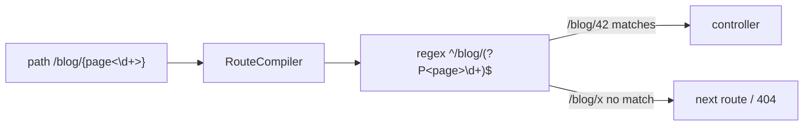

# Restricting URL Parameters (Requirements)

!!! tip "In a nutshell"
    Un requirement restreint le pattern par défaut `[^/]+` d'un placeholder à une regex précise,
    écrite en ligne comme `{id<\d+>}` ou via le tableau `requirements` (les deux sont équivalents).
    Piège d'examen : il est compilé dans la regex de la route, donc une valeur non conforme échoue simplement à correspondre (un 404), jamais un 400.

!!! example "Real-world analogy"
    Un requirement est comme la fente calibrée du monnayeur d'un distributeur automatique. La fente
    n'admet qu'une pièce du bon diamètre ; un jeton de la mauvaise forme n'allume pas de voyant
    d'erreur — il ne rentre tout simplement pas et tombe directement vers le mécanisme suivant (le
    matching passe à la route suivante, pour finir en 404). C'est un contrôle de *forme* à l'entrée,
    pas une vérification que la pièce est contrefaite ou sans valeur — vérifier qu'une valeur bien
    formée est réellement valide est le travail d'étapes ultérieures, pas de la fente du monnayeur.

!!! abstract "Learning objectives"
    À la fin de ce chapitre, vous saurez :

    - [ ] Contraindre un placeholder avec `requirements` et avec la syntaxe en ligne `{id<\d+>}`
    - [ ] Expliquer comment un requirement devient partie intégrante de la regex compilée
    - [ ] Prédire le matching quand une valeur viole un requirement
    - [ ] Choisir entre les syntaxes en ligne et en tableau

    **Syllabus:** `Routing → Restrict URL parameters` ·
    **Level:** Advanced ·
    **Est. time:** 20 min ·
    **Prerequisites:** [Configuration](configuration.md)

---

## Theory

Par défaut, un placeholder `{id}` correspond à **tout caractère sauf `/`** (regex
`[^/]+`). Un **requirement** restreint ce pattern à une expression régulière précise,
si bien que `/blog/{page}` peut être forcé à n'accepter que des chiffres. Cela fait deux choses :

1. Cela **évite les fausses correspondances** — `/blog/hello` n'atteint plus une route numérique.
2. Cela permet à **plusieurs routes de partager une même forme de chemin** et de se
   différencier par le pattern (une route `id` numérique vs une route `slug` textuelle).

Symfony 8 offre deux syntaxes équivalentes : **en ligne** `{id<\d+>}` dans le chemin,
et le tableau **`requirements`**. La syntaxe en ligne est concise et garde la contrainte
à côté du placeholder ; le tableau convient mieux quand la regex est longue ou réutilisée.

```php
// Inline syntax: the constraint lives next to the placeholder
#[Route('/blog/{page<\d+>}', name: 'blog_paged')]

// requirements array: strictly equivalent, better for long/reused regexes
#[Route('/blog/{page}', name: 'blog_paged', requirements: ['page' => '\d+'])]
```

!!! question "Predict first"
    `/blog/{page<\d+>}` reçoit `/blog/latest`. Le router lève-t-il un 400, `page`
    devient-il `'latest'`, ou se passe-t-il autre chose ?

??? note "Reveal"
    Ni l'un ni l'autre — le requirement est compilé **dans la regex de la route**, donc
    l'URL échoue simplement à correspondre à cette route et le matcher continue
    (typiquement un 404). Les requirements relèvent du *matching*, jamais de la validation,
    donc le routing ne produit aucun 400.

## Deep Dive — how it works internally

`Symfony\Component\Routing\RouteCompiler::compile()` parse le chemin, extrait chaque
token `{name}` et recherche son requirement (depuis la syntaxe en ligne `<...>` ou le
tableau `requirements`). Il remplace le placeholder par un **groupe de capture nommé**
utilisant cette regex ; les tokens sans requirement reçoivent le `[^/]+` par défaut (ou
`.+` pour le catch-all spécial). Le résultat est une regex `CompiledRoute` unique comme
`#^/blog/(?P<page>\d+)$#sD`.

```php
use Symfony\Component\Routing\Route;

// Route::compile() delegates to RouteCompiler::compile()
$route = new Route('/blog/{page}', requirements: ['page' => '\d+']);
$compiled = $route->compile();  // returns a CompiledRoute
echo $compiled->getRegex();     // #^/blog/(?P<page>\d+)$#sD
// Without a requirement, the {page} token would default to [^/]+
```

Comme la contrainte est intégrée à la regex compilée, une URL non conforme **échoue
simplement à correspondre à cette route** — le matcher passe à la route suivante ou finit
par lever `Symfony\Component\Routing\Exception\ResourceNotFoundException` (rendue comme
un 404). Les requirements participent donc au **matching**, pas à la validation : il n'y a
pas de « 400 bad parameter » venant du routing lui-même.



!!! note "Source reference"
    `Symfony\Component\Routing\RouteCompiler` construit la regex et les tokens —
    [symfony/symfony `8.0`](https://github.com/symfony/symfony/blob/8.0/src/Symfony/Component/Routing/RouteCompiler.php).

### Anchoring and gotchas

Les regex de requirement sont **implicitement ancrées** sur l'ensemble du token —
n'ajoutez pas `^`/`$`. Un requirement `\d+` devient `(?P<id>\d+)`. Évitez d'envelopper
dans des groupes supplémentaires ; utilisez des groupes non capturants `(?:...)` si vous
avez besoin de grouper. Le séparateur par défaut est `/`, donc `[^/]+` ne peut pas
franchir plusieurs segments de chemin, sauf si vous optez pour `.+` (voir le pattern
catch-all ci-dessous).

```php
// Implicitly anchored: '\d+' compiles to (?P<id>\d+) — never add ^ or $
#[Route('/order/{id}', requirements: ['id' => '\d+'])]

// Grouping: use a non-capturing (?:...) group, never a capturing (...)
#[Route('/report/{period}', requirements: ['period' => '(?:day|week|month)'])]
```

## Configuration & code

=== "PHP Attributes"

    ```php
    <?php
    declare(strict_types=1);

    namespace App\Controller;

    use Symfony\Bundle\FrameworkBundle\Controller\AbstractController;
    use Symfony\Component\HttpFoundation\Response;
    use Symfony\Component\Routing\Attribute\Route;

    final class BlogController extends AbstractController
    {
        // Inline requirement: only digits.
        #[Route('/blog/{page<\d+>}', name: 'blog_paged', methods: ['GET'])]
        public function paged(int $page): Response
        {
            return $this->render('blog/index.html.twig', ['page' => $page]);
        }

        // Array requirement: reusable, documented regex.
        #[Route(
            '/blog/{slug}',
            name: 'blog_show',
            requirements: ['slug' => '[a-z0-9\-]+'],
            methods: ['GET'],
        )]
        public function show(string $slug): Response
        {
            return $this->render('blog/show.html.twig', ['slug' => $slug]);
        }
    }
    ```

=== "YAML"

    ```yaml
    # config/routes/blog.yaml
    blog_paged:
        path: /blog/{page<\d+>}
        controller: App\Controller\BlogController::paged
        methods: [GET]

    blog_show:
        path: /blog/{slug}
        controller: App\Controller\BlogController::show
        requirements:
            slug: '[a-z0-9\-]+'
        methods: [GET]
    ```

=== "Catch-all"

    ```php
    <?php
    declare(strict_types=1);

    namespace App\Controller;

    use Symfony\Bundle\FrameworkBundle\Controller\AbstractController;
    use Symfony\Component\HttpFoundation\Response;
    use Symfony\Component\Routing\Attribute\Route;

    final class WikiController extends AbstractController
    {
        // .+ lets the parameter span slashes: /wiki/a/b/c
        #[Route('/wiki/{path<.+>}', name: 'wiki_page', methods: ['GET'])]
        public function page(string $path): Response
        {
            return $this->render('wiki/page.html.twig', ['path' => $path]);
        }
    }
    ```

L'ordre de déclaration compte : placez `blog_paged` (numérique) **avant** `blog_show`
(slug), sinon `/blog/42` est capturé comme un slug.

## Best practices & anti-patterns

| ✅ Do | ❌ Avoid |
|---|---|
| Contraindre `id`/`page` à `\d+` | Laisser les ids numériques en `[^/]+` |
| Utiliser `{id<\d+>}` en ligne pour les regex courtes | Entasser d'énormes regex en ligne |
| Ordonner les routes numériques avant les routes slug | Une route slug qui masque la route id |
| Utiliser `.+` délibérément pour les params multi-segments | Un `.+` accidentel qui avale les segments suivants |

## When (not) to use it / alternatives

Les requirements servent à la **désambiguïsation du routing**, pas à la validation métier.
Pour rejeter une valeur *bien formée mais invalide* (par exemple un id inexistant), laissez
la request correspondre et gérez-la dans le controller / value resolver avec un 404.
Utilisez le composant [Validation](../validation/index.md) pour les règles de form/DTO —
n'encodez jamais de logique métier complexe dans une regex de route.

!!! danger "Certification traps"
    - Un requirement non satisfait produit un **404 (pas de correspondance)**, jamais un 400 depuis le routing.
    - Les requirements sont **implicitement ancrés** ; ajouter `^`/`$` est une erreur.
    - La regex par défaut d'un placeholder est `[^/]+` — elle ne franchit **pas** le `/`.
    - `{id<\d+>}` en ligne et `requirements: {id: '\d+'}` sont exactement équivalents.

!!! warning "Common mistakes"
    - Placer une route `{slug}` avant une route `{id<\d+>}`, masquant la route numérique.
    - Utiliser des groupes capturants `(...)` dans un requirement et casser le mapping des tokens.
    - S'attendre à ce que `[^/]+` corresponde à `a/b` — il faut `.+`.

## Exercises

1. **(Basic)** Contraignez `/user/{id}` aux chiffres avec la syntaxe en ligne.
2. **(Intermediate)** Ajoutez une route `/user/{username}` (lettres, chiffres, `_`) et
   ordonnez-la correctement avec la route id numérique pour que les deux fonctionnent.

??? success "Solutions"

    **1.**

    ```php
    #[Route('/user/{id<\d+>}', name: 'user_show', methods: ['GET'])]
    public function show(int $id): Response { /* ... */ }
    ```

    **2.**

    ```php
    // Numeric id route FIRST so /user/42 is not treated as a username.
    #[Route('/user/{id<\d+>}', name: 'user_show', methods: ['GET'])]
    public function show(int $id): Response { /* ... */ }

    #[Route(
        '/user/{username}',
        name: 'user_by_name',
        requirements: ['username' => '[a-zA-Z0-9_]+'],
        methods: ['GET'],
    )]
    public function byName(string $username): Response { /* ... */ }
    ```

## Certification questions

??? question "Q1. `/blog/{page<\d+>}` receives `/blog/latest`. What happens?"
    - [ ] A. Controller runs with `page = 'latest'`
    - [ ] B. A 400 Bad Request from the router
    - [x] C. The route does not match; matching continues (likely 404) ✅
    - [ ] D. `page` is cast to `0`

    **Why:** le requirement est compilé dans la regex, donc une valeur non numérique
    échoue simplement à correspondre. **Ref:** [Parameter validation](https://symfony.com/doc/8.0/routing.html#parameters-validation).

??? question "Q2. Which two are equivalent?"
    - [x] A. `{id<\d+>}` and `requirements: {id: '\d+'}` ✅
    - [ ] B. `{id}` and `requirements: {id: '\d+'}`
    - [ ] C. `{id<\d+>}` and `defaults: {id: '\d+'}`
    - [ ] D. `{id}` and `{id<.+>}`

    **Why:** le `<...>` en ligne est un sucre syntaxique pour une entrée `requirements`.
    **Ref:** [Routing requirements](https://symfony.com/doc/8.0/routing.html#parameters-validation).

??? question "Q3. What is the default regex for a placeholder without a requirement?"
    - [ ] A. `.+`
    - [ ] B. `\w+`
    - [x] C. `[^/]+` ✅
    - [ ] D. `.*`

    **Why:** par défaut, les placeholders correspondent à n'importe quels caractères sauf le séparateur `/`.
    **Ref:** [Routing](https://symfony.com/doc/8.0/routing.html).

??? question "Q4. How do you let one parameter capture multiple path segments?"
    - [ ] A. `{path<\w+>}`
    - [x] B. `{path<.+>}` ✅
    - [ ] C. Set `defaults: {path: '/'}`
    - [ ] D. It is impossible

    **Why:** surcharger le requirement en `.+` permet au token de franchir les slashes.
    **Ref:** [Routing](https://symfony.com/doc/8.0/routing.html#slash-in-parameters).

## Key takeaways

- Les requirements sont compilés dans la regex de la route ; une violation signifie **pas de correspondance**.
- La regex de token par défaut est `[^/]+` ; utilisez `.+` pour franchir les slashes.
- `{id<\d+>}` en ligne ≡ `requirements: {id: '\d+'}`.
- Les regex sont auto-ancrées — pas de `^`/`$`, pas de groupes capturants.

## Last-minute revision

!!! tip "Cheat sheet"
    - En ligne : `{name<regex>}`. Tableau : `requirements: {name: 'regex'}`.
    - Défaut : `[^/]+`. Catch-all : `<.+>`.
    - Échec = 404 (pas de correspondance), pas 400.
    - Ordonner les routes numériques avant les routes slug.

## Connections

- **Depends on:** [Configuration](configuration.md) — un requirement affine une route dans la même `RouteCollection`.
- **Reused in:** [Defaults](defaults.md) — la forme en ligne `{id<\d+>?1}` combine un requirement et un default.
- **Confused with:** [Validation](../validation/index.md) — la regex de routing désambiguïse le matching ; la validité métier est le travail du Validator.

## Official References
- [Official Symfony docs — Parameter validation](https://symfony.com/doc/8.0/routing.html#parameters-validation)
- [Symfony source — RouteCompiler](https://github.com/symfony/symfony/blob/8.0/src/Symfony/Component/Routing/RouteCompiler.php)

## Video references

!!! tip "Watch & learn"
    Voici des chaînes vidéo officielles, mises à jour en continu — recherchez-y
    « Symfony routing » pour consolider ce chapitre. Nous référençons des chaînes stables
    plutôt que des vidéos individuelles afin que les références ne périment jamais.

    - [SymfonyCasts screencasts](https://symfonycasts.com/tracks/symfony) — tutoriels scénarisés à suivre en codant.
    - [Symfony official YouTube](https://www.youtube.com/@SymfonyOfficial) — conférences et keynotes SymfonyCon.
    - [Official docs for this topic](https://symfony.com/doc/8.0/routing.html#parameters-validation) — certaines pages de la doc Symfony intègrent un screencast.

## Confidence check

Je suis prêt quand je sais :

- [ ] expliquer **pourquoi** un requirement est compilé dans la regex (matching, pas validation)
- [ ] implémenter `{id<\d+>}` en ligne et le tableau `requirements` équivalent en Symfony 8
- [ ] déboguer une route `{slug}` qui masque une route numérique `{id<\d+>}`
- [ ] repérer qu'une valeur non conforme donne un 404, jamais un 400
- [ ] expliquer le token par défaut `[^/]+` et quand l'élargir en `.+`

---

<small>Related: [Configuration](configuration.md) · [Defaults](defaults.md) · [Debugging](debugging.md)</small>
