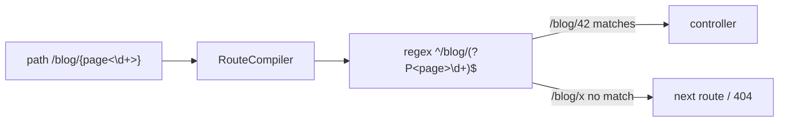

# Restricting URL Parameters (Requirements)

!!! tip "In a nutshell"
    A requirement narrows a placeholder's default `[^/]+` pattern to a specific regex,
    written inline as `{id<\d+>}` or via the `requirements` array (the two are equivalent).
    Exam hook: it's compiled into the route regex, so a violating value simply fails to match (a 404), never a 400.

!!! abstract "Learning objectives"
    By the end of this chapter you can:

    - [ ] Constrain a placeholder with `requirements` and with inline `{id<\d+>}`
    - [ ] Explain how a requirement becomes part of the compiled regex
    - [ ] Predict matching when a value violates a requirement
    - [ ] Choose between inline and array requirement syntaxes

    **Syllabus:** `Routing → Restrict URL parameters` ·
    **Level:** Advanced ·
    **Est. time:** 20 min ·
    **Prerequisites:** [Configuration](configuration.md)

---

## Theory

By default a placeholder `{id}` matches **any character except `/`** (regex
`[^/]+`). A **requirement** narrows that pattern to a specific regular expression,
so `/blog/{page}` can be forced to accept only digits. This does two things:

1. It **prevents false matches** — `/blog/hello` no longer hits a numeric route.
2. It lets **several routes share a path shape** and disambiguate by pattern
   (a numeric `id` route vs a textual `slug` route).

Symfony 8 offers two equivalent syntaxes: **inline** `{id<\d+>}` inside the path,
and the **`requirements`** array. Inline is concise and keeps the constraint next
to the placeholder; the array is better when the regex is long or reused.

## Deep Dive — how it works internally

`Symfony\Component\Routing\RouteCompiler::compile()` parses the path, extracts each
`{name}` token, and looks up its requirement (from the inline `<...>` syntax or the
`requirements` array). It substitutes the placeholder with a **named capture group**
using that regex; tokens with no requirement get the default `[^/]+` (or `.+` for
the special catch-all). The result is a single `CompiledRoute` regex like
`#^/blog/(?P<page>\d+)$#sD`.

Because the constraint is baked into the compiled regex, a violating URL simply
**fails to match that route** — the matcher moves on to the next route or finally
throws `Symfony\Component\Routing\Exception\ResourceNotFoundException` (surfaced as
a 404). Requirements therefore participate in **matching**, not validation: there
is no "400 bad parameter" from routing itself.



!!! note "Source reference"
    `Symfony\Component\Routing\RouteCompiler` builds the regex and tokens —
    [symfony/symfony `8.0`](https://github.com/symfony/symfony/blob/8.0/src/Symfony/Component/Routing/RouteCompiler.php).

### Anchoring and gotchas

Requirement regexes are **implicitly anchored** to the whole token — do not add
`^`/`$`. A requirement of `\d+` becomes `(?P<id>\d+)`. Avoid wrapping in extra
groups; use non-capturing `(?:...)` if you need grouping. The default separator is
`/`, so `[^/]+` cannot span path segments unless you opt into `.+` (see the
catch-all pattern below).

## Configuration & code

=== "PHP Attributes"

    ```php
    <?php
    declare(strict_types=1);

    namespace App\Controller;

    use Symfony\Bundle\FrameworkBundle\Controller\AbstractController;
    use Symfony\Component\HttpFoundation\Response;
    use Symfony\Component\Routing\Attribute\Route;

    final class BlogController extends AbstractController
    {
        // Inline requirement: only digits.
        #[Route('/blog/{page<\d+>}', name: 'blog_paged', methods: ['GET'])]
        public function paged(int $page): Response
        {
            return $this->render('blog/index.html.twig', ['page' => $page]);
        }

        // Array requirement: reusable, documented regex.
        #[Route(
            '/blog/{slug}',
            name: 'blog_show',
            requirements: ['slug' => '[a-z0-9\-]+'],
            methods: ['GET'],
        )]
        public function show(string $slug): Response
        {
            return $this->render('blog/show.html.twig', ['slug' => $slug]);
        }
    }
    ```

=== "YAML"

    ```yaml
    # config/routes/blog.yaml
    blog_paged:
        path: /blog/{page<\d+>}
        controller: App\Controller\BlogController::paged
        methods: [GET]

    blog_show:
        path: /blog/{slug}
        controller: App\Controller\BlogController::show
        requirements:
            slug: '[a-z0-9\-]+'
        methods: [GET]
    ```

=== "Catch-all"

    ```php
    <?php
    declare(strict_types=1);

    namespace App\Controller;

    use Symfony\Bundle\FrameworkBundle\Controller\AbstractController;
    use Symfony\Component\HttpFoundation\Response;
    use Symfony\Component\Routing\Attribute\Route;

    final class WikiController extends AbstractController
    {
        // .+ lets the parameter span slashes: /wiki/a/b/c
        #[Route('/wiki/{path<.+>}', name: 'wiki_page', methods: ['GET'])]
        public function page(string $path): Response
        {
            return $this->render('wiki/page.html.twig', ['path' => $path]);
        }
    }
    ```

Declaration order matters: put `blog_paged` (numeric) **before** `blog_show`
(slug), otherwise `/blog/42` is captured as a slug.

## Best practices & anti-patterns

| ✅ Do | ❌ Avoid |
|---|---|
| Constrain `id`/`page` to `\d+` | Leaving numeric ids as `[^/]+` |
| Use inline `{id<\d+>}` for short regexes | Cramming huge regexes inline |
| Order numeric routes before slug routes | Slug route shadowing the id route |
| Use `.+` deliberately for path-spanning params | Accidental `.+` swallowing later segments |

## When (not) to use it / alternatives

Requirements are for **routing disambiguation**, not business validation. To
reject a *well-formed but invalid* value (e.g. a non-existent id), let the request
match and handle it in the controller / value resolver with a 404. Use the
[Validation](../validation/index.md) component for form/DTO rules — never encode
complex business logic in a route regex.

!!! danger "Certification traps"
    - A failing requirement yields **404 (no match)**, never a 400 from routing.
    - Requirements are **implicitly anchored**; adding `^`/`$` is wrong.
    - Default placeholder regex is `[^/]+` — it will **not** cross `/`.
    - Inline `{id<\d+>}` and `requirements: {id: '\d+'}` are exactly equivalent.

!!! warning "Common mistakes"
    - Ordering a `{slug}` route before a `{id<\d+>}` route, hiding the numeric one.
    - Using capturing groups `(...)` in a requirement and breaking token mapping.
    - Expecting `[^/]+` to match `a/b` — you need `.+`.

## Exercises

1. **(Basic)** Constrain `/user/{id}` to digits using the inline syntax.
2. **(Intermediate)** Add a `/user/{username}` route (letters, digits, `_`) and
   order it correctly with the numeric id route so both resolve.

??? success "Solutions"

    **1.**

    ```php
    #[Route('/user/{id<\d+>}', name: 'user_show', methods: ['GET'])]
    public function show(int $id): Response { /* ... */ }
    ```

    **2.**

    ```php
    // Numeric id route FIRST so /user/42 is not treated as a username.
    #[Route('/user/{id<\d+>}', name: 'user_show', methods: ['GET'])]
    public function show(int $id): Response { /* ... */ }

    #[Route(
        '/user/{username}',
        name: 'user_by_name',
        requirements: ['username' => '[a-zA-Z0-9_]+'],
        methods: ['GET'],
    )]
    public function byName(string $username): Response { /* ... */ }
    ```

## Certification questions

??? question "Q1. `/blog/{page<\d+>}` receives `/blog/latest`. What happens?"
    - [ ] A. Controller runs with `page = 'latest'`
    - [ ] B. A 400 Bad Request from the router
    - [x] C. The route does not match; matching continues (likely 404) ✅
    - [ ] D. `page` is cast to `0`

    **Why:** the requirement is compiled into the regex, so a non-numeric value
    simply fails to match. **Ref:** [Parameter validation](https://symfony.com/doc/current/routing.html#parameters-validation).

??? question "Q2. Which two are equivalent?"
    - [x] A. `{id<\d+>}` and `requirements: {id: '\d+'}` ✅
    - [ ] B. `{id}` and `requirements: {id: '\d+'}`
    - [ ] C. `{id<\d+>}` and `defaults: {id: '\d+'}`
    - [ ] D. `{id}` and `{id<.+>}`

    **Why:** inline `<...>` is syntactic sugar for a `requirements` entry.
    **Ref:** [Routing requirements](https://symfony.com/doc/current/routing.html#parameters-validation).

??? question "Q3. What is the default regex for a placeholder without a requirement?"
    - [ ] A. `.+`
    - [ ] B. `\w+`
    - [x] C. `[^/]+` ✅
    - [ ] D. `.*`

    **Why:** placeholders match any characters except the `/` separator by default.
    **Ref:** [Routing](https://symfony.com/doc/current/routing.html).

??? question "Q4. How do you let one parameter capture multiple path segments?"
    - [ ] A. `{path<\w+>}`
    - [x] B. `{path<.+>}` ✅
    - [ ] C. Set `defaults: {path: '/'}`
    - [ ] D. It is impossible

    **Why:** overriding the requirement to `.+` allows the token to span slashes.
    **Ref:** [Routing](https://symfony.com/doc/current/routing.html#slash-in-parameters).

## Key takeaways

- Requirements are compiled into the route regex; violations mean **no match**.
- Default token regex is `[^/]+`; use `.+` to cross slashes.
- Inline `{id<\d+>}` ≡ `requirements: {id: '\d+'}`.
- Regexes are auto-anchored — no `^`/`$`, no capturing groups.

## Last-minute revision

!!! tip "Cheat sheet"
    - Inline: `{name<regex>}`. Array: `requirements: {name: 'regex'}`.
    - Default: `[^/]+`. Catch-all: `<.+>`.
    - Fail = 404 (no match), not 400.
    - Order numeric routes before slug routes.

## Official References
- [Official Symfony docs — Parameter validation](https://symfony.com/doc/current/routing.html#parameters-validation)
- [Symfony source — RouteCompiler](https://github.com/symfony/symfony/blob/8.0/src/Symfony/Component/Routing/RouteCompiler.php)

---

<small>Related: [Configuration](configuration.md) · [Defaults](defaults.md) · [Debugging](debugging.md)</small>
