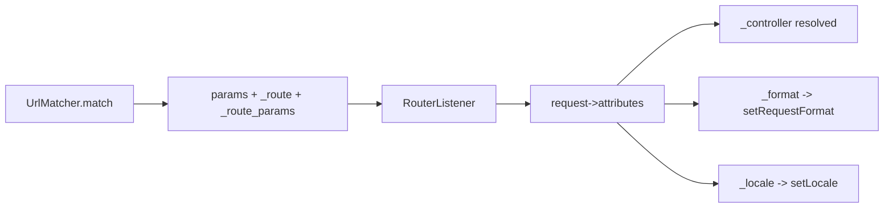

# Special Internal Routing Attributes

!!! tip "In a nutshell"
    Les paramètres préfixés d'un underscore sont réservés : `_controller`, `_format`, `_locale`,
    `_fragment` configurent la request, tandis que `_route` et `_route_params` sont des sorties en lecture seule injectées par le matcher.
    Point d'examen : le `RouterListener` copie la sortie du matcher dans les attributs de la request, et `_format` définit le format de la request (déterminant le `Content-Type`).

!!! example "Real-world analogy"
    Pensez à une étiquette d'expédition avec des cases réservées que le système du transporteur
    comprend. Certaines cases, c'est vous qui les remplissez — « manipuler comme fragile »,
    « documents en français » (les entrées comme `_controller`, `_format`, `_locale`) — et elles
    changent la manière dont le colis est traité. D'autres cases sont tamponnées par le centre de
    tri au moment où il scanne le paquet — le numéro de suivi et l'itinéraire emprunté (`_route`,
    `_route_params`) — vous pouvez les lire sur l'étiquette mais vous ne devez jamais les écrire
    vous-même. Le convoyeur de scan qui recopie tout cela sur le colis, c'est le `RouterListener`.

!!! abstract "Learning objectives"
    À la fin de ce chapitre, vous saurez :

    - [ ] Nommer les attributs de routing spéciaux et ce que chacun contrôle
    - [ ] Utiliser `_format`, `_locale`, `_fragment` et lire `_route`/`_route_params`
    - [ ] Expliquer comment `_controller` relie une route au code
    - [ ] Marquer une route `stateless` et savoir ce que cela impose

    **Syllabus:** `Routing → Special internal attributes` ·
    **Level:** Expert ·
    **Est. time:** 20 min ·
    **Prerequisites:** [Defaults](defaults.md)

---

## Theory

Certains paramètres qui apparaissent dans les `defaults`/placeholders d'une route sont
**réservés** : Symfony les lit pour configurer la request plutôt que de les passer comme
arguments ordinaires du controller. Par convention, ils sont préfixés d'un underscore.

| Attribut | Rôle |
|---|---|
| `_controller` | Le callable du controller à exécuter |
| `_format` | Format de la request → `Content-Type` (p. ex. `json`) |
| `_locale` | La locale de la request |
| `_fragment` | Le fragment d'URL (`#...`) à la génération |
| `_route` | Nom de la route matchée (lecture seule) |
| `_route_params` | Les paramètres de la route matchée (lecture seule) |

!!! question "Predict first"
    Pouvez-vous définir `_route` dans les `defaults` d'une route pour changer ce que
    retourne `$request->attributes->get('_route')` ?

??? note "Reveal"
    Non. `_route` et `_route_params` sont des **sorties en lecture seule** injectées par
    le matcher — vous les lisez, jamais vous ne les définissez. Les entrées que vous
    *pouvez* définir sont `_controller`, `_format`, `_locale` et `_fragment`.

## Deep Dive — how it works internally

Quand `UrlMatcher::match()` réussit, il retourne un **tableau de paramètres** fusionné
à partir des defaults de la route et des placeholders capturés, et il y injecte `_route`
(le nom matché) et `_route_params` (les valeurs des placeholders). Le `RouterListener`
du framework (un subscriber de `kernel.request`) copie chaque paramètre retourné dans
le sac d'attributs de la `Request` (`$request->attributes`).

```php
// UrlMatcher::match() output for GET /blog/42:
[
    '_controller' => 'App\Controller\BlogController::show',
    'id' => '42',
    '_route' => 'blog_show',            // injected by the matcher
    '_route_params' => ['id' => '42'],  // injected too
];
// RouterListener (kernel.request) then copies every entry into the Request:
$request->attributes->get('_route'); // 'blog_show'
```

À partir de là :

- `_controller` est résolu par le `ControllerResolver` en un callable.
- `_format` est appliqué via `Request::setRequestFormat()`, ce qui influence la
  négociation de contenu et le `Content-Type` par défaut d'une `Response`.
- `_locale` est appliqué via `Request::setLocale()` et mémorisé pour que le
  `LocaleListener` puisse aussi le définir comme valeur par défaut pour les requests
  suivantes (voir [Locale](locale.md)).
- `_fragment` est pris en compte par le **generator**, ajouté sous la forme `#fragment`.

```php
// _controller -> ControllerResolver turns it into a callable
$controller = $controllerResolver->getController($request);

// _format -> Request::setRequestFormat(), drives the Response Content-Type
$request->setRequestFormat('json');

// _locale -> Request::setLocale() (LocaleListener re-applies it later)
$request->setLocale('fr');

// _fragment -> only used by the generator: /blog/42#comments
$url = $generator->generate('blog_show', ['id' => 42, '_fragment' => 'comments']);
```

`_route` et `_route_params` sont des **sorties** — ne les définissez jamais vous-même ;
lisez-les (p. ex. pour du logging ou dans un subscriber) via
`$request->attributes->get('_route')`.



!!! note "Source reference"
    `Symfony\Component\HttpKernel\EventListener\RouterListener` copie la sortie du
    matcher dans les attributs de la request —
    [symfony/symfony `8.0`](https://github.com/symfony/symfony/blob/8.0/src/Symfony/Component/HttpKernel/EventListener/RouterListener.php).

### Stateless routes

`#[Route(stateless: true)]` déclare que le traitement de la route ne doit **ni démarrer
ni utiliser la session**. En `kernel.dev`/debug, si la session est malgré tout utilisée,
un avertissement `Symfony\Component\HttpKernel\Exception\UnexpectedSessionUsageException`
est levé afin de repérer une statefulness accidentelle — important pour les endpoints
cacheables et les API. C'est un contrat/une assertion, pas une interdiction silencieuse
en prod.

```php
#[Route('/api/status', name: 'api_status', stateless: true)]
public function status(Request $request): Response
{
    // In debug, touching the session here is reported
    // via UnexpectedSessionUsageException:
    // $request->getSession()->get('user'); // would trigger the warning
    return new Response('OK');
}
```

## Configuration & code

=== "PHP Attributes"

    ```php
    <?php
    declare(strict_types=1);

    namespace App\Controller;

    use Symfony\Bundle\FrameworkBundle\Controller\AbstractController;
    use Symfony\Component\HttpFoundation\Request;
    use Symfony\Component\HttpFoundation\Response;
    use Symfony\Component\Routing\Attribute\Route;

    final class ApiController extends AbstractController
    {
        // _format from the extension; stateless API endpoint.
        #[Route(
            '/api/items.{_format}',
            name: 'api_items',
            defaults: ['_format' => 'json'],
            requirements: ['_format' => 'json|xml'],
            methods: ['GET'],
            stateless: true,
        )]
        public function items(Request $request): Response
        {
            // Read-only routing outputs:
            $routeName = $request->attributes->get('_route');       // 'api_items'
            $params = $request->attributes->get('_route_params');   // ['_format' => ...]

            return $this->json([
                'route' => $routeName,
                'format' => $request->getRequestFormat(), // json|xml
                'params' => $params,
            ]);
        }
    }
    ```

=== "YAML"

    ```yaml
    # config/routes/api.yaml
    api_items:
        path: /api/items.{_format}
        controller: App\Controller\ApiController::items
        defaults:
            _format: json
        requirements:
            _format: json|xml
        methods: [GET]
        stateless: true
    ```

=== "Fragment on generation"

    ```php
    <?php
    declare(strict_types=1);

    // _fragment is added as #section2 by the generator.
    $url = $this->generateUrl('blog_show', ['id' => 42, '_fragment' => 'comments']);
    // => /blog/42#comments
    ```

## Best practices & anti-patterns

| ✅ À faire | ❌ À éviter |
|---|---|
| Contraindre `_format` avec un requirement | Laisser `_format` accepter n'importe quoi |
| Marquer les routes API/cacheables `stateless` | Lire la session dans des routes stateless |
| Lire `_route`/`_route_params` pour le logging | Définir `_route` vous-même |
| Utiliser `_locale` pour les routes i18n | Parser la locale à la main depuis le path |

## When (not) to use it / alternatives

Définissez `_format` quand une même action sert plusieurs représentations ; sinon,
négociez dans le controller. Utilisez `stateless: true` pour les API et les pages que
vous comptez mettre en cache HTTP. `_fragment` n'a de sens qu'à la génération ; pour des
ancres internes dans les templates, vous pouvez simplement ajouter `#anchor` dans le href.

!!! danger "Certification traps"
    - `_route` et `_route_params` sont des **sorties en lecture seule** définies par le matcher.
    - `_format` définit le **format de la request**, déterminant le `Content-Type` — ce
      n'est pas qu'un suffixe d'URL.
    - `stateless: true` déclenche un avertissement **uniquement en debug** quand la
      session est utilisée ; c'est une assertion, pas un blocage strict en prod.
    - Ces valeurs vivent dans les **attributs** de la request, remplis par le `RouterListener`.

!!! warning "Common mistakes"
    - Traiter `_locale`/`_format` comme des arguments normaux de controller et se tromper
      en les tapant.
    - S'attendre à ce que `_fragment` influence le matching — il n'agit qu'à la génération.
    - Oublier un requirement sur `_format`, laissant `items.exe` matcher.

## Exercises

1. **(Basic)** Ajoutez `_format` (json|xml, json par défaut) à une route de liste d'API.
2. **(Intermediate)** Dans un contexte `kernel.request`, loggez la `_route` matchée et
   ses `_route_params` pour chaque request.

??? success "Solutions"

    **1.** Voir l'exemple `api_items` ci-dessus — `_format` dans `defaults` +
    `requirements`, avec `.{_format}` dans le path.

    **2.**

    ```php
    <?php
    declare(strict_types=1);

    namespace App\EventListener;

    use Psr\Log\LoggerInterface;
    use Symfony\Component\EventDispatcher\Attribute\AsEventListener;
    use Symfony\Component\HttpKernel\Event\ControllerEvent;

    #[AsEventListener]
    final readonly class RouteLogger
    {
        public function __construct(private LoggerInterface $logger) {}

        public function __invoke(ControllerEvent $event): void
        {
            $request = $event->getRequest();
            $this->logger->info('matched route', [
                'route' => $request->attributes->get('_route'),
                'params' => $request->attributes->get('_route_params'),
            ]);
        }
    }
    ```

## Certification questions

??? question "Q1. Which attribute holds the name of the matched route?"
    - [ ] A. `_controller`
    - [x] B. `_route` ✅
    - [ ] C. `_route_name`
    - [ ] D. `_name`

    **Why:** le matcher injecte `_route` avec le nom de la route matchée.
    **Ref:** [Special parameters](https://symfony.com/doc/current/routing.html#special-parameters).

??? question "Q2. What does `_format` do when matched?"
    - [x] A. Sets the request format (affects `Content-Type`) ✅
    - [ ] B. Only appears in the URL, no effect
    - [ ] C. Selects the controller
    - [ ] D. Sets the HTTP method

    **Why:** le `RouterListener`/`Request::setRequestFormat()` l'utilise pour la
    négociation de contenu. **Ref:** [Routing](https://symfony.com/doc/current/routing.html#special-parameters).

??? question "Q3. `stateless: true` primarily does what?"
    - [x] A. Asserts the route must not use the session (warns in debug) ✅
    - [ ] B. Disables routing cache
    - [ ] C. Forces HTTPS
    - [ ] D. Makes the route match any method

    **Why:** il signale toute utilisation accidentelle de la session pendant le développement.
    **Ref:** [Stateless routes](https://symfony.com/doc/current/routing.html#stateless-routes).

??? question "Q4. Where does `_fragment` take effect?"
    - [ ] A. During matching
    - [x] B. During URL generation (appends `#fragment`) ✅
    - [ ] C. In the response body
    - [ ] D. In the session

    **Why:** le generator l'ajoute comme fragment de l'URL ; le matcher l'ignore.
    **Ref:** [Routing](https://symfony.com/doc/current/routing.html#special-parameters).

## Key takeaways

- Attributs réservés : `_controller`, `_format`, `_locale`, `_fragment` (entrées) ;
  `_route`, `_route_params` (sorties).
- Le `RouterListener` copie la sortie du matcher dans les attributs de la request.
- `_format` pilote la négociation de contenu ; `_locale` définit la locale de la request.
- `stateless: true` affirme qu'aucune session n'est utilisée (avertissement en debug).

## Last-minute revision

!!! tip "Cheat sheet"
    - Entrées : `_controller`, `_format`, `_locale`, `_fragment`.
    - Sorties : `_route`, `_route_params` (à lire via `request->attributes`).
    - `stateless: true` = pas de session (assertion en debug).
    - Rempli par le `RouterListener` sur `kernel.request`.

## Connections

- **Depends on:** [Defaults](defaults.md) — les attributs spéciaux ne sont que des clés `defaults` réservées.
- **Reused in:** [Locale](locale.md) — `_locale` est l'attribut spécial qui définit la locale de la request.
- **Confused with:** [URL generation](url-generation.md) — `_fragment` n'agit qu'à la génération, jamais au matching.

## Official References
- [Official Symfony docs — Special parameters](https://symfony.com/doc/current/routing.html#special-parameters)
- [Official Symfony docs — Stateless routes](https://symfony.com/doc/current/routing.html#stateless-routes)
- [Symfony source — RouterListener](https://github.com/symfony/symfony/blob/8.0/src/Symfony/Component/HttpKernel/EventListener/RouterListener.php)

## Video references

!!! tip "Watch & learn"
    Ce sont des chaînes vidéo officielles, mises à jour en continu — cherchez-y
    « Symfony routing » pour consolider ce chapitre. Nous lions des chaînes stables
    plutôt que des vidéos individuelles pour que les références ne périment jamais.

    - [SymfonyCasts screencasts](https://symfonycasts.com/tracks/symfony) — tutoriels scénarisés, à coder en suivant.
    - [Symfony official YouTube](https://www.youtube.com/@SymfonyOfficial) — conférences et keynotes SymfonyCon.
    - [Official docs for this topic](https://symfony.com/doc/current/routing.html#special-parameters) — certaines pages de la doc Symfony intègrent un screencast.

## Confidence check

Je suis prêt quand je peux :

- [ ] expliquer les attributs spéciaux d'entrée vs de sortie et ce que chacun contrôle
- [ ] implémenter `_format` avec un requirement et une route `stateless` en Symfony 8
- [ ] déboguer `items.exe` qui matche parce que `_format` n'avait pas de requirement
- [ ] repérer que `_route`/`_route_params` sont en lecture seule et que `_fragment` n'agit qu'à la génération
- [ ] expliquer comment le `RouterListener` copie la sortie du matcher dans les attributs de la request

---

<small>Related: [Defaults](defaults.md) · [Locale](locale.md) · [Conditions](conditions.md) · [Controllers](../controllers/index.md)</small>
