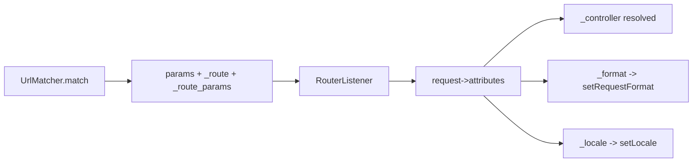

# Special Internal Routing Attributes

!!! tip "In a nutshell"
    Underscore-prefixed parameters are reserved: `_controller`, `_format`, `_locale`,
    `_fragment` configure the request, while `_route` and `_route_params` are read-only outputs the matcher injects.
    Exam hook: `RouterListener` copies matcher output into request attributes, and `_format` sets the request format (driving `Content-Type`).

!!! example "Real-world analogy"
    Think of a shipping label with reserved boxes the courier's system understands. Some boxes
    you fill in yourself — "handle as fragile", "documents in French" (inputs like `_controller`,
    `_format`, `_locale`) — and they change how the parcel is processed. Other boxes are stamped
    by the sorting facility as it scans the package — the tracking number and the route it took
    (`_route`, `_route_params`) — which you may read off the label but must never write yourself.
    The scanning conveyor that copies all of this onto the package is the `RouterListener`.

!!! abstract "Learning objectives"
    By the end of this chapter you can:

    - [ ] Name the special routing attributes and what each controls
    - [ ] Use `_format`, `_locale`, `_fragment` and read `_route`/`_route_params`
    - [ ] Explain how `_controller` connects a route to code
    - [ ] Mark a route `stateless` and know what that enforces

    **Syllabus:** `Routing → Special internal attributes` ·
    **Level:** Expert ·
    **Est. time:** 20 min ·
    **Prerequisites:** [Defaults](defaults.md)

---

## Theory

Some parameters that appear in a route's `defaults`/placeholders are **reserved**:
Symfony reads them to configure the request rather than passing them as ordinary
controller arguments. They are conventionally prefixed with an underscore.

| Attribute | Purpose |
|---|---|
| `_controller` | The controller callable to run |
| `_format` | Request format → `Content-Type` (e.g. `json`) |
| `_locale` | The request locale |
| `_fragment` | The URL fragment (`#...`) when generating |
| `_route` | Name of the matched route (read-only) |
| `_route_params` | The matched route's parameters (read-only) |

!!! question "Predict first"
    Can you set `_route` in a route's `defaults` to change what
    `$request->attributes->get('_route')` returns?

??? note "Reveal"
    No. `_route` and `_route_params` are **read-only outputs** injected by the
    matcher — you read them, never set them. The inputs you *do* set are
    `_controller`, `_format`, `_locale` and `_fragment`.

## Deep Dive — how it works internally

When `UrlMatcher::match()` succeeds it returns an **array of parameters** merged
from the route defaults and captured placeholders, and it injects `_route` (the
matched name) and `_route_params` (the placeholder values). The framework's
`RouterListener` (a `kernel.request` subscriber) copies every returned parameter
into the `Request`'s attribute bag (`$request->attributes`).

```php
// UrlMatcher::match() output for GET /blog/42:
[
    '_controller' => 'App\Controller\BlogController::show',
    'id' => '42',
    '_route' => 'blog_show',            // injected by the matcher
    '_route_params' => ['id' => '42'],  // injected too
];
// RouterListener (kernel.request) then copies every entry into the Request:
$request->attributes->get('_route'); // 'blog_show'
```

From there:

- `_controller` is resolved by `ControllerResolver` into a callable.
- `_format` is applied via `Request::setRequestFormat()`, influencing content
  negotiation and the default `Content-Type` of a `Response`.
- `_locale` is applied via `Request::setLocale()` and stored so the
  `LocaleListener` can also set it as a default for subsequent requests
  (see [Locale](locale.md)).
- `_fragment` is honoured by the **generator**, appended as `#fragment`.

```php
// _controller -> ControllerResolver turns it into a callable
$controller = $controllerResolver->getController($request);

// _format -> Request::setRequestFormat(), drives the Response Content-Type
$request->setRequestFormat('json');

// _locale -> Request::setLocale() (LocaleListener re-applies it later)
$request->setLocale('fr');

// _fragment -> only used by the generator: /blog/42#comments
$url = $generator->generate('blog_show', ['id' => 42, '_fragment' => 'comments']);
```

`_route` and `_route_params` are **outputs** — never set them yourself; read them
(e.g. in logging or a subscriber) via `$request->attributes->get('_route')`.



!!! note "Source reference"
    `Symfony\Component\HttpKernel\EventListener\RouterListener` copies matcher
    output into request attributes —
    [symfony/symfony `8.0`](https://github.com/symfony/symfony/blob/8.0/src/Symfony/Component/HttpKernel/EventListener/RouterListener.php).

### Stateless routes

`#[Route(stateless: true)]` declares that handling the route must **not start or
use the session**. In `kernel.dev`/debug, if the session is nonetheless used, a
`Symfony\Component\HttpKernel\Exception\UnexpectedSessionUsageException` warning is
raised so you catch accidental statefulness — important for cacheable and API
endpoints. It is a contract/assertion, not silent enforcement in prod.

```php
#[Route('/api/status', name: 'api_status', stateless: true)]
public function status(Request $request): Response
{
    // In debug, touching the session here is reported
    // via UnexpectedSessionUsageException:
    // $request->getSession()->get('user'); // would trigger the warning
    return new Response('OK');
}
```

## Configuration & code

=== "PHP Attributes"

    ```php
    <?php
    declare(strict_types=1);

    namespace App\Controller;

    use Symfony\Bundle\FrameworkBundle\Controller\AbstractController;
    use Symfony\Component\HttpFoundation\Request;
    use Symfony\Component\HttpFoundation\Response;
    use Symfony\Component\Routing\Attribute\Route;

    final class ApiController extends AbstractController
    {
        // _format from the extension; stateless API endpoint.
        #[Route(
            '/api/items.{_format}',
            name: 'api_items',
            defaults: ['_format' => 'json'],
            requirements: ['_format' => 'json|xml'],
            methods: ['GET'],
            stateless: true,
        )]
        public function items(Request $request): Response
        {
            // Read-only routing outputs:
            $routeName = $request->attributes->get('_route');       // 'api_items'
            $params = $request->attributes->get('_route_params');   // ['_format' => ...]

            return $this->json([
                'route' => $routeName,
                'format' => $request->getRequestFormat(), // json|xml
                'params' => $params,
            ]);
        }
    }
    ```

=== "YAML"

    ```yaml
    # config/routes/api.yaml
    api_items:
        path: /api/items.{_format}
        controller: App\Controller\ApiController::items
        defaults:
            _format: json
        requirements:
            _format: json|xml
        methods: [GET]
        stateless: true
    ```

=== "Fragment on generation"

    ```php
    <?php
    declare(strict_types=1);

    // _fragment is added as #section2 by the generator.
    $url = $this->generateUrl('blog_show', ['id' => 42, '_fragment' => 'comments']);
    // => /blog/42#comments
    ```

## Best practices & anti-patterns

| ✅ Do | ❌ Avoid |
|---|---|
| Constrain `_format` with a requirement | Leaving `_format` open to anything |
| Mark API/cacheable routes `stateless` | Reading the session in stateless routes |
| Read `_route`/`_route_params` for logging | Setting `_route` yourself |
| Use `_locale` for i18n routes | Hand-parsing the locale from the path |

## When (not) to use it / alternatives

Set `_format` when the same action serves multiple representations; otherwise
negotiate in the controller. Use `stateless: true` for APIs and pages you intend to
HTTP-cache. `_fragment` is only meaningful at generation time; for in-page anchors
in templates you can just append `#anchor` in the href.

!!! danger "Certification traps"
    - `_route` and `_route_params` are **read-only outputs** set by the matcher.
    - `_format` sets the **request format**, driving `Content-Type` — not just a
      URL suffix.
    - `stateless: true` triggers a warning **only in debug** when the session is
      used; it is an assertion, not a hard prod block.
    - These live in request **attributes**, populated by `RouterListener`.

!!! warning "Common mistakes"
    - Treating `_locale`/`_format` as normal controller args and mis-typing them.
    - Expecting `_fragment` to affect matching — it only affects generation.
    - Forgetting a `_format` requirement, letting `items.exe` match.

## Exercises

1. **(Basic)** Add `_format` (json|xml, default json) to an API list route.
2. **(Intermediate)** In a `kernel.request` context, log the matched `_route` and
   its `_route_params` for every request.

??? success "Solutions"

    **1.** See the `api_items` example above — `_format` in `defaults` +
    `requirements`, with `.{_format}` in the path.

    **2.**

    ```php
    <?php
    declare(strict_types=1);

    namespace App\EventListener;

    use Psr\Log\LoggerInterface;
    use Symfony\Component\EventDispatcher\Attribute\AsEventListener;
    use Symfony\Component\HttpKernel\Event\ControllerEvent;

    #[AsEventListener]
    final readonly class RouteLogger
    {
        public function __construct(private LoggerInterface $logger) {}

        public function __invoke(ControllerEvent $event): void
        {
            $request = $event->getRequest();
            $this->logger->info('matched route', [
                'route' => $request->attributes->get('_route'),
                'params' => $request->attributes->get('_route_params'),
            ]);
        }
    }
    ```

## Certification questions

??? question "Q1. Which attribute holds the name of the matched route?"
    - [ ] A. `_controller`
    - [x] B. `_route` ✅
    - [ ] C. `_route_name`
    - [ ] D. `_name`

    **Why:** the matcher injects `_route` with the matched route's name.
    **Ref:** [Special parameters](https://symfony.com/doc/8.0/routing.html#special-parameters).

??? question "Q2. What does `_format` do when matched?"
    - [x] A. Sets the request format (affects `Content-Type`) ✅
    - [ ] B. Only appears in the URL, no effect
    - [ ] C. Selects the controller
    - [ ] D. Sets the HTTP method

    **Why:** `RouterListener`/`Request::setRequestFormat()` uses it for content
    negotiation. **Ref:** [Routing](https://symfony.com/doc/8.0/routing.html#special-parameters).

??? question "Q3. `stateless: true` primarily does what?"
    - [x] A. Asserts the route must not use the session (warns in debug) ✅
    - [ ] B. Disables routing cache
    - [ ] C. Forces HTTPS
    - [ ] D. Makes the route match any method

    **Why:** it flags accidental session usage during development.
    **Ref:** [Stateless routes](https://symfony.com/doc/8.0/routing.html#stateless-routes).

??? question "Q4. Where does `_fragment` take effect?"
    - [ ] A. During matching
    - [x] B. During URL generation (appends `#fragment`) ✅
    - [ ] C. In the response body
    - [ ] D. In the session

    **Why:** the generator appends it as the URL fragment; it is ignored by the
    matcher. **Ref:** [Routing](https://symfony.com/doc/8.0/routing.html#special-parameters).

## Key takeaways

- Reserved attributes: `_controller`, `_format`, `_locale`, `_fragment` (inputs);
  `_route`, `_route_params` (outputs).
- `RouterListener` copies matcher output into request attributes.
- `_format` drives content negotiation; `_locale` sets the request locale.
- `stateless: true` asserts no session use (debug-time warning).

## Last-minute revision

!!! tip "Cheat sheet"
    - Inputs: `_controller`, `_format`, `_locale`, `_fragment`.
    - Outputs: `_route`, `_route_params` (read via `request->attributes`).
    - `stateless: true` = no session (debug assertion).
    - Populated by `RouterListener` on `kernel.request`.

## Connections

- **Depends on:** [Defaults](defaults.md) — special attributes are just reserved `defaults` keys.
- **Reused in:** [Locale](locale.md) — `_locale` is the special attribute that sets the request locale.
- **Confused with:** [URL generation](url-generation.md) — `_fragment` acts only at generation, never in matching.

## Official References
- [Official Symfony docs — Special parameters](https://symfony.com/doc/8.0/routing.html#special-parameters)
- [Official Symfony docs — Stateless routes](https://symfony.com/doc/8.0/routing.html#stateless-routes)
- [Symfony source — RouterListener](https://github.com/symfony/symfony/blob/8.0/src/Symfony/Component/HttpKernel/EventListener/RouterListener.php)

## Video references

!!! tip "Watch & learn"
    These are official, continuously-updated video channels — search them for
    "Symfony routing" to reinforce this chapter. We link stable channels rather than
    individual videos so the references never rot.

    - [SymfonyCasts screencasts](https://symfonycasts.com/tracks/symfony) — scripted, code-along tutorials.
    - [Symfony official YouTube](https://www.youtube.com/@SymfonyOfficial) — SymfonyCon conference talks & keynotes.
    - [Official docs for this topic](https://symfony.com/doc/8.0/routing.html#special-parameters) — some Symfony doc pages embed a screencast.

## Confidence check

I'm ready when I can:

- [ ] explain the input vs output special attributes and what each controls
- [ ] implement `_format` with a requirement and a `stateless` route in Symfony 8
- [ ] debug `items.exe` matching because `_format` had no requirement
- [ ] spot that `_route`/`_route_params` are read-only and `_fragment` is generation-only
- [ ] explain how `RouterListener` copies matcher output into request attributes

---

<small>Related: [Defaults](defaults.md) · [Locale](locale.md) · [Conditions](conditions.md) · [Controllers](../controllers/index.md)</small>
