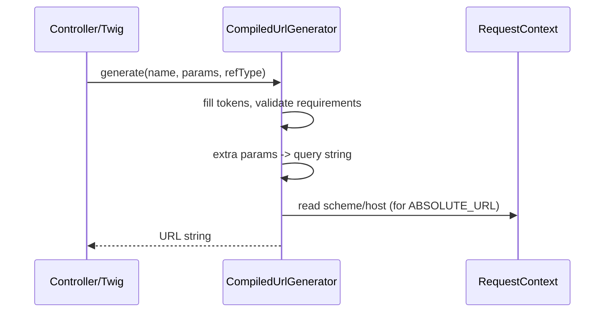

# Generating URLs

!!! tip "In a nutshell"
    La génération transforme un nom de route plus des paramètres en URL — générez toujours
    à partir des noms, ne codez jamais les paths en dur, et choisissez un reference type pour
    décider quelle portion de l'URL émettre.
    Point d'examen : les constantes vivent sur `UrlGeneratorInterface`, le défaut est `ABSOLUTE_PATH`, et les paramètres en trop (non-placeholders) deviennent la query string.

!!! example "Real-world analogy"
    Générer une URL, c'est comme appeler depuis les contacts de votre téléphone au lieu de
    mémoriser les numéros : vous appelez « Alice » (un nom de route) et le téléphone remplit
    son numéro actuel ; quand elle change de numéro, vous le mettez à jour une seule fois et
    chaque appel futur aboutit toujours. Le reference type, c'est la portion du numéro que
    vous composez — l'extension interne (`ABSOLUTE_PATH`), le numéro complet avec indicatifs
    pays et régional pour appeler depuis l'étranger (`ABSOLUTE_URL`), et ainsi de suite. Tout
    supplément qui ne fait pas partie du numéro — comme un code PIN de conférence — voyage en
    query string, et quand vous composez depuis une ligne fixe sans contexte d'appel (CLI),
    vous devez préconfigurer l'indicatif (`default_uri`), sinon le numéro sort faux.

!!! abstract "Learning objectives"
    À la fin de ce chapitre, vous saurez :

    - [ ] Générer une URL à partir d'un nom de route dans les controllers, les services et Twig
    - [ ] Choisir le bon **reference type** (absolute, path, network, relative)
    - [ ] Expliquer comment les paramètres en trop deviennent la query string
    - [ ] Décrire comment le `RequestContext` fournit host/scheme au generator

    **Syllabus:** `Routing → Generate URLs` ·
    **Level:** Advanced ·
    **Est. time:** 25 min ·
    **Prerequisites:** [Configuration](configuration.md), [Defaults](defaults.md)

---

## Pour les nuls

### L'idée en une phrase
Générer une URL, c'est composer un numéro depuis les contacts de ton téléphone plutôt que de mémoriser les chiffres — tu appelles "Alice" (le nom de la route), pas son numéro brut.

### Imagine dans la vraie vie
Tu appelles "Alice" depuis tes contacts plutôt que de mémoriser son numéro — si elle change de numéro, tu le mets à jour une seule fois et tous tes futurs appels fonctionnent encore. Le type de référence, c'est combien du numéro tu composes : le poste interne (`ABSOLUTE_PATH`) ou le numéro complet avec indicatif pour appeler depuis l'étranger (`ABSOLUTE_URL`).

### Dans Symfony
Écrire `path('produit_show', ['id' => 5])` au lieu de `/produits/5` en dur signifie que si la route change de chemin demain, tous les liens générés se mettent à jour automatiquement.

### Exemple simple
```php
$this->generateUrl('produit_show', ['id' => 5]); // jamais '/produits/5' en dur
```

### Comment le mémoriser 🧠
Tout paramètre qui ne correspond à aucun placeholder de la route finit automatiquement en **query string** — comme un PIN de conférence qui voyage à côté du numéro composé, pas dedans.


## Theory

Le routing fonctionne dans les deux sens. Le **matching** transforme une URL en
controller ; la **génération** transforme un *nom* de route plus des paramètres en URL.
Générez toujours les URLs à partir des noms — ne codez jamais les paths en dur — afin
qu'un changement de path en un seul endroit mette à jour chaque lien automatiquement.

Le contrat est `Symfony\Component\Routing\Generator\UrlGeneratorInterface`.
Dans un controller vous appelez `$this->generateUrl($name, $params, $referenceType)` ;
dans Twig les fonctions `path()` et `url()` ; dans un service vous injectez l'interface.

```php
// Controller: helper from AbstractController
$url = $this->generateUrl('blog_show', ['id' => 42]); // /blog/42

// Service: inject the contract and call generate()
public function __construct(private UrlGeneratorInterface $urlGenerator) {}
$this->urlGenerator->generate('blog_show', ['id' => 42]);

// Twig: path() for a path, url() for an absolute URL
// {{ path('blog_show', {id: 42}) }}   {{ url('blog_show', {id: 42}) }}
```

Un **reference type** décide quelle portion de l'URL est émise :

| Constante | Exemple de sortie |
|---|---|
| `ABSOLUTE_PATH` (défaut) | `/blog/42` |
| `ABSOLUTE_URL` | `https://example.com/blog/42` |
| `NETWORK_PATH` | `//example.com/blog/42` |
| `RELATIVE_PATH` | `../42` |

!!! question "Predict first"
    Une commande console construit `generateUrl(..., ABSOLUTE_URL)` et le lien sort
    en `http://localhost/...`. Pourquoi ?

??? note "Reveal"
    Il n'y a pas de request en CLI, donc le `RequestContext` n'a pas de vrai host —
    configurez `framework.router.default_uri`. (Rappelez-vous aussi que le reference
    type par défaut est `ABSOLUTE_PATH`, un path relatif à la racine, pas une URL complète.)

## Deep Dive — how it works internally

Le service `router` du framework implémente `UrlGeneratorInterface` ; à l'exécution il
délègue à `Symfony\Component\Routing\Generator\CompiledUrlGenerator`, construit à partir
du fichier dumpé `url_generating_routes.php` (compilé par `CompiledUrlGeneratorDumper`).
La génération est donc une simple recherche rapide dans un tableau, par nom de route —
aucun objet route n'est re-parsé.

```php
// The framework 'router' service implements UrlGeneratorInterface:
public function __construct(private UrlGeneratorInterface $urlGenerator) {}

// At runtime it delegates to CompiledUrlGenerator, which reads the
// url_generating_routes.php file dumped by CompiledUrlGeneratorDumper —
// resolving the name is a plain array lookup:
$url = $this->urlGenerator->generate('blog_show', ['id' => 42]);
```

Pour chaque route, le generator détient la liste des tokens, les defaults, les
requirements et les métadonnées host/scheme. `generate()` :

1. Recherche la route par nom (lève
   `Symfony\Component\Routing\Exception\RouteNotFoundException` si elle est absente).
2. Remplit les tokens à partir des paramètres passés + defaults de la route ; valide
   chacun contre son requirement (lève `InvalidParameterException` en cas d'écart).
3. **Omet** les segments finaux dont la valeur est égale au défaut.
4. Ajoute tout **paramètre restant** en **query string** `?key=value`.
5. Préfixe scheme/host depuis le `RequestContext` selon le reference type.

```php
use Symfony\Component\Routing\Exception\InvalidParameterException;
use Symfony\Component\Routing\Exception\RouteNotFoundException;

try {
    // 'ref' is not a placeholder -> appended as ?ref=footer (step 4)
    $url = $generator->generate('blog_show', ['id' => 42, 'ref' => 'footer']);
} catch (RouteNotFoundException) {
    // step 1: unknown route name
} catch (InvalidParameterException) {
    // step 2: e.g. id 'abc' fails the \d+ requirement
}
```

`Symfony\Component\Routing\RequestContext` porte le scheme courant, le host, la base
URL, les ports HTTP/HTTPS et la méthode. Pendant une request, il est alimenté depuis la
`Request` entrante ; en CLI (p. ex. Messenger, emails, console) il n'y a **pas de
request**, donc le context retombe sur la config `router.request_context.*`
(`default_uri`) — configurez-la, sinon les URLs absolues sortent en `http://localhost`.

```yaml
# config/packages/routing.yaml
# With no incoming Request (CLI, Messenger), the RequestContext
# falls back to the router.request_context.* values derived from:
framework:
    router:
        default_uri: 'https://example.com/'
```



!!! note "Source reference"
    `Symfony\Component\Routing\Generator\UrlGenerator::generate()` et
    `RequestContext` —
    [symfony/symfony `8.0`](https://github.com/symfony/symfony/blob/8.0/src/Symfony/Component/Routing/Generator/UrlGenerator.php).

### Scheme-forced routes

Si une route déclare `schemes: ['https']` et que le context courant est `http`, la
génération est **automatiquement promue en URL absolue** avec le scheme `https`,
même si vous avez demandé `ABSOLUTE_PATH` — sinon le lien ne pourrait pas changer
de scheme.

```php
#[Route('/checkout', name: 'checkout', schemes: ['https'])]

// Current context is plain http; ABSOLUTE_PATH (the default) is requested...
$url = $this->generateUrl('checkout');
// ...but generation upgrades the scheme: 'https://example.com/checkout'
```

## Configuration & code

=== "Controller"

    ```php
    <?php
    declare(strict_types=1);

    namespace App\Controller;

    use Symfony\Bundle\FrameworkBundle\Controller\AbstractController;
    use Symfony\Component\HttpFoundation\Response;
    use Symfony\Component\Routing\Attribute\Route;
    use Symfony\Component\Routing\Generator\UrlGeneratorInterface;

    final class LinkController extends AbstractController
    {
        #[Route('/links', name: 'app_links', methods: ['GET'])]
        public function links(): Response
        {
            // /blog/42
            $path = $this->generateUrl('blog_show', ['id' => 42]);

            // https://example.com/blog/42
            $abs = $this->generateUrl(
                'blog_show',
                ['id' => 42],
                UrlGeneratorInterface::ABSOLUTE_URL,
            );

            // /blog/42?ref=newsletter  (ref is not a placeholder)
            $withQuery = $this->generateUrl('blog_show', [
                'id' => 42,
                'ref' => 'newsletter',
            ]);

            return $this->json(compact('path', 'abs', 'withQuery'));
        }
    }
    ```

=== "Service (DI)"

    ```php
    <?php
    declare(strict_types=1);

    namespace App\Notifier;

    use Symfony\Component\Routing\Generator\UrlGeneratorInterface;

    final readonly class MailLinkBuilder
    {
        public function __construct(
            private UrlGeneratorInterface $urlGenerator,
        ) {}

        public function confirmUrl(int $id): string
        {
            // Emails need absolute URLs — no request context in the queue worker.
            return $this->urlGenerator->generate(
                'app_confirm',
                ['id' => $id],
                UrlGeneratorInterface::ABSOLUTE_URL,
            );
        }
    }
    ```

=== "Twig"

    ```twig
    {# relative path (default) #}
    <a href="{{ path('blog_show', { id: 42 }) }}">Read</a>

    {# absolute URL for emails / canonical tags #}
    <link rel="canonical" href="{{ url('blog_show', { id: 42 }) }}">
    ```

=== "CLI context (YAML)"

    ```yaml
    # config/packages/routing.yaml
    framework:
        router:
            # Used to build absolute URLs when there is no request (CLI, Messenger).
            default_uri: 'https://example.com/'
    ```

## Best practices & anti-patterns

| ✅ À faire | ❌ À éviter |
|---|---|
| Générer à partir des **noms** de routes | Coder `/blog/42` en dur |
| Utiliser `ABSOLUTE_URL` pour emails/CLI | Émettre des liens relatifs dans les jobs en file |
| Configurer `default_uri` pour les workers | Livrer des liens `http://localhost` |
| Passer des extras pour les query strings | Concaténer `?a=b` à la main |

## When (not) to use it / alternatives

Utilisez `path()`/`ABSOLUTE_PATH` pour les liens internes à la page (plus courts,
agnostiques du scheme). Utilisez `url()`/`ABSOLUTE_URL` quand le lien sort du contexte
de la page : emails, RSS, sitemaps, balises canonical, ou tout ce qui est généré depuis
la console ou un worker Messenger. `NETWORK_PATH` est un choix de niche pour des assets
protocol-relative ; `RELATIVE_PATH` est rarement nécessaire et plus difficile à raisonner.

!!! danger "Certification traps"
    - Le reference type par défaut est **`ABSOLUTE_PATH`** (un path relatif à la racine),
      pas une URL complète.
    - Les constantes vivent sur **`UrlGeneratorInterface`**
      (`ABSOLUTE_URL`, `ABSOLUTE_PATH`, `RELATIVE_PATH`, `NETWORK_PATH`).
    - Les paramètres en trop (non-placeholders) deviennent la **query string**.
    - Une route restreinte par `schemes` peut forcer une URL absolue même quand vous
      avez demandé un path.
    - Sans request, les URLs absolues utilisent `default_uri` / les défauts du
      `RequestContext` — ce n'est pas magique.

!!! warning "Common mistakes"
    - Envoyer des liens `path()` par email (relatifs → cassés dans la boîte de réception).
    - Oublier `default_uri`, si bien que les liens console/worker deviennent `http://localhost`.
    - Passer une valeur qui échoue au requirement de la route →
      `InvalidParameterException`.

## Exercises

1. **(Basic)** Dans un controller, générez une URL absolue vers `blog_show` pour l'id 7.
2. **(Intermediate)** Dans un service sans request (worker de file), construisez un lien
   de réinitialisation de mot de passe et expliquez quelle config rend le host correct.

??? success "Solutions"

    **1.**

    ```php
    $url = $this->generateUrl(
        'blog_show',
        ['id' => 7],
        UrlGeneratorInterface::ABSOLUTE_URL,
    );
    ```

    **2.**

    ```php
    public function resetUrl(string $token): string
    {
        return $this->urlGenerator->generate(
            'app_reset_password',
            ['token' => $token],
            UrlGeneratorInterface::ABSOLUTE_URL,
        );
    }
    ```

    Configurez `framework.router.default_uri: 'https://example.com/'` pour que le
    `RequestContext` du generator ait un vrai host/scheme en dehors d'une request web.

## Certification questions

??? question "Q1. What is the default reference type of `generateUrl()`?"
    - [ ] A. `ABSOLUTE_URL`
    - [x] B. `ABSOLUTE_PATH` ✅
    - [ ] C. `NETWORK_PATH`
    - [ ] D. `RELATIVE_PATH`

    **Why:** il retourne par défaut un path relatif à la racine comme `/blog/42`.
    **Ref:** [Generating URLs](https://symfony.com/doc/8.0/routing.html#generating-urls).

??? question "Q2. `generateUrl('blog_show', ['id' => 42, 'utm' => 'x'])` yields?"
    - [x] A. `/blog/42?utm=x` ✅
    - [ ] B. `/blog/42/x`
    - [ ] C. An `InvalidParameterException`
    - [ ] D. `/blog/42`

    **Why:** les paramètres qui ne sont pas des placeholders sont ajoutés en query string.
    **Ref:** [Routing](https://symfony.com/doc/8.0/routing.html#generating-urls).

??? question "Q3. Which class holds `ABSOLUTE_URL`, `NETWORK_PATH`, etc.?"
    - [ ] A. `UrlGenerator`
    - [x] B. `UrlGeneratorInterface` ✅
    - [ ] C. `RequestContext`
    - [ ] D. `Router`

    **Why:** les constantes de reference type sont définies sur l'interface.
    **Ref:** [Routing](https://symfony.com/doc/8.0/routing.html).

??? question "Q4. Why might a console command generate `http://localhost/...`?"
    - [x] A. No `RequestContext` host; `default_uri` not configured ✅
    - [ ] B. `ABSOLUTE_PATH` was used
    - [ ] C. The route is missing `methods`
    - [ ] D. Twig is disabled

    **Why:** sans request, le generator s'appuie sur `router.default_uri`.
    **Ref:** [Routing in commands](https://symfony.com/doc/8.0/routing.html#generating-urls-in-commands).

??? question "Q5. Which Twig function produces an absolute URL?"
    - [ ] A. `path()`
    - [x] B. `url()` ✅
    - [ ] C. `asset()`
    - [ ] D. `absolute_url()` only

    **Why:** `url()` correspond à `ABSOLUTE_URL` ; `path()` correspond à `ABSOLUTE_PATH`.
    **Ref:** [Routing](https://symfony.com/doc/8.0/routing.html#generating-urls-in-templates).

## Key takeaways

- Générez les URLs à partir des **noms** ; ne codez jamais les paths en dur.
- Les constantes de reference type vivent sur `UrlGeneratorInterface` ; le défaut est
  `ABSOLUTE_PATH`.
- Paramètres en trop → query string ; écart avec un requirement → exception.
- Les URLs absolues nécessitent un `RequestContext`/`default_uri` en dehors des requests web.

## Last-minute revision

!!! tip "Cheat sheet"
    - `$this->generateUrl(name, params, UrlGeneratorInterface::ABSOLUTE_URL)`.
    - Twig : `path()` = path, `url()` = absolue.
    - Types : `ABSOLUTE_PATH` (défaut), `ABSOLUTE_URL`, `NETWORK_PATH`,
      `RELATIVE_PATH`.
    - Liens CLI → configurez `framework.router.default_uri`.

## Connections

- **Depends on:** [Configuration](configuration.md) — la génération lit la même `RouteCollection` compilée, par nom.
- **Reused in:** [Twig → URLs](../twig/urls.md) — `path()`/`url()` appellent ce generator depuis les templates.
- **Confused with:** [Defaults](defaults.md) — une valeur égale à son défaut est omise de l'URL générée.

## Official References
- [Official Symfony docs — Generating URLs](https://symfony.com/doc/8.0/routing.html#generating-urls)
- [Symfony source — UrlGenerator](https://github.com/symfony/symfony/blob/8.0/src/Symfony/Component/Routing/Generator/UrlGenerator.php)
- [Symfony source — RequestContext](https://github.com/symfony/symfony/blob/8.0/src/Symfony/Component/Routing/RequestContext.php)

## Video references

!!! tip "Watch & learn"
    Ce sont des chaînes vidéo officielles, mises à jour en continu — cherchez-y
    « Symfony routing » pour consolider ce chapitre. Nous lions des chaînes stables
    plutôt que des vidéos individuelles pour que les références ne périment jamais.

    - [SymfonyCasts screencasts](https://symfonycasts.com/tracks/symfony) — tutoriels scénarisés, à coder en suivant.
    - [Symfony official YouTube](https://www.youtube.com/@SymfonyOfficial) — conférences et keynotes SymfonyCon.
    - [Official docs for this topic](https://symfony.com/doc/8.0/routing.html#generating-urls) — certaines pages de la doc Symfony intègrent un screencast.

## Confidence check

Je suis prêt quand je peux :

- [ ] expliquer les quatre reference types et que le défaut est `ABSOLUTE_PATH`
- [ ] implémenter la génération dans un controller, un service DI et Twig en Symfony 8
- [ ] déboguer des liens `http://localhost` issus d'un worker/console (`default_uri` manquant)
- [ ] repérer que les paramètres en trop deviennent la query string et que les constantes vivent sur `UrlGeneratorInterface`
- [ ] expliquer comment `CompiledUrlGenerator` et `RequestContext` collaborent

---

<small>Related: [Configuration](configuration.md) · [Redirects](redirects.md) · [Host matching](host-matching.md) · [Methods](methods.md)</small>
