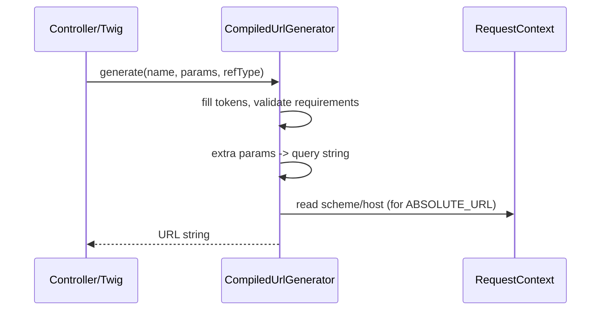

# Generating URLs

!!! tip "In a nutshell"
    Generation turns a route name plus parameters back into a URL — always generate from
    names, never hard-code paths, and pick a reference type for how much of the URL to emit.
    Exam hook: the constants live on `UrlGeneratorInterface`, the default is `ABSOLUTE_PATH`, and extra (non-placeholder) params become the query string.

!!! abstract "Learning objectives"
    By the end of this chapter you can:

    - [ ] Generate a URL from a route name in controllers, services, and Twig
    - [ ] Choose the correct **reference type** (absolute, path, network, relative)
    - [ ] Explain how extra parameters become the query string
    - [ ] Describe how `RequestContext` supplies host/scheme to the generator

    **Syllabus:** `Routing → Generate URLs` ·
    **Level:** Advanced ·
    **Est. time:** 25 min ·
    **Prerequisites:** [Configuration](configuration.md), [Defaults](defaults.md)

---

## Theory

Routing works both ways. **Matching** turns a URL into a controller; **generation**
turns a route *name* plus parameters back into a URL. Always generate URLs from
names — never hard-code paths — so that changing a path in one place updates every
link automatically.

The contract is `Symfony\Component\Routing\Generator\UrlGeneratorInterface`.
In a controller you call `$this->generateUrl($name, $params, $referenceType)`; in
Twig the `path()` and `url()` functions; in a service you inject the interface.

A **reference type** decides how much of the URL is emitted:

| Constant | Example output |
|---|---|
| `ABSOLUTE_PATH` (default) | `/blog/42` |
| `ABSOLUTE_URL` | `https://example.com/blog/42` |
| `NETWORK_PATH` | `//example.com/blog/42` |
| `RELATIVE_PATH` | `../42` |

## Deep Dive — how it works internally

The framework's `router` service implements `UrlGeneratorInterface`; at runtime it
delegates to `Symfony\Component\Routing\Generator\CompiledUrlGenerator`, built from
the dumped `url_generating_routes.php` file (compiled by
`CompiledUrlGeneratorDumper`). Generation is therefore a fast array lookup by
route name — no route objects are re-parsed.

For each route the generator holds the token list, defaults, requirements, and
host/scheme metadata. `generate()`:

1. Looks up the route by name (throws
   `Symfony\Component\Routing\Exception\RouteNotFoundException` if missing).
2. Fills tokens from the passed params + route defaults; validates each against its
   requirement (throws `InvalidParameterException` on mismatch).
3. **Omits** trailing segments whose value equals the default.
4. Appends any **left-over parameters** as a `?key=value` **query string**.
5. Prefixes scheme/host from the `RequestContext` per the reference type.

`Symfony\Component\Routing\RequestContext` carries the current scheme, host, base
URL, HTTP/HTTPS ports and method. During a request it is populated from the
incoming `Request`; in CLI (e.g. Messenger, emails, console) there is **no request**,
so the context falls back to `router.request_context.*` config
(`default_uri`) — set it or absolute URLs come out as `http://localhost`.



!!! note "Source reference"
    `Symfony\Component\Routing\Generator\UrlGenerator::generate()` and
    `RequestContext` —
    [symfony/symfony `8.0`](https://github.com/symfony/symfony/blob/8.0/src/Symfony/Component/Routing/Generator/UrlGenerator.php).

### Scheme-forced routes

If a route declares `schemes: ['https']` and the current context is `http`,
generation is **automatically upgraded to an absolute URL** with the `https`
scheme even when you asked for `ABSOLUTE_PATH` — otherwise the link could not
switch scheme.

## Configuration & code

=== "Controller"

    ```php
    <?php
    declare(strict_types=1);

    namespace App\Controller;

    use Symfony\Bundle\FrameworkBundle\Controller\AbstractController;
    use Symfony\Component\HttpFoundation\Response;
    use Symfony\Component\Routing\Attribute\Route;
    use Symfony\Component\Routing\Generator\UrlGeneratorInterface;

    final class LinkController extends AbstractController
    {
        #[Route('/links', name: 'app_links', methods: ['GET'])]
        public function links(): Response
        {
            // /blog/42
            $path = $this->generateUrl('blog_show', ['id' => 42]);

            // https://example.com/blog/42
            $abs = $this->generateUrl(
                'blog_show',
                ['id' => 42],
                UrlGeneratorInterface::ABSOLUTE_URL,
            );

            // /blog/42?ref=newsletter  (ref is not a placeholder)
            $withQuery = $this->generateUrl('blog_show', [
                'id' => 42,
                'ref' => 'newsletter',
            ]);

            return $this->json(compact('path', 'abs', 'withQuery'));
        }
    }
    ```

=== "Service (DI)"

    ```php
    <?php
    declare(strict_types=1);

    namespace App\Notifier;

    use Symfony\Component\Routing\Generator\UrlGeneratorInterface;

    final readonly class MailLinkBuilder
    {
        public function __construct(
            private UrlGeneratorInterface $urlGenerator,
        ) {}

        public function confirmUrl(int $id): string
        {
            // Emails need absolute URLs — no request context in the queue worker.
            return $this->urlGenerator->generate(
                'app_confirm',
                ['id' => $id],
                UrlGeneratorInterface::ABSOLUTE_URL,
            );
        }
    }
    ```

=== "Twig"

    ```twig
    {# relative path (default) #}
    <a href="{{ path('blog_show', { id: 42 }) }}">Read</a>

    {# absolute URL for emails / canonical tags #}
    <link rel="canonical" href="{{ url('blog_show', { id: 42 }) }}">
    ```

=== "CLI context (YAML)"

    ```yaml
    # config/packages/routing.yaml
    framework:
        router:
            # Used to build absolute URLs when there is no request (CLI, Messenger).
            default_uri: 'https://example.com/'
    ```

## Best practices & anti-patterns

| ✅ Do | ❌ Avoid |
|---|---|
| Generate from route **names** | Hard-coding `/blog/42` |
| Use `ABSOLUTE_URL` for emails/CLI | Emitting relative links in queued jobs |
| Configure `default_uri` for workers | Shipping `http://localhost` links |
| Pass extras for query strings | Concatenating `?a=b` by hand |

## When (not) to use it / alternatives

Use `path()`/`ABSOLUTE_PATH` for in-page links (smaller, scheme-agnostic). Use
`url()`/`ABSOLUTE_URL` when the link leaves the page context: emails, RSS,
sitemaps, canonical tags, or anything generated from the console or a Messenger
worker. `NETWORK_PATH` is a niche choice for protocol-relative assets;
`RELATIVE_PATH` is rarely needed and harder to reason about.

!!! danger "Certification traps"
    - Default reference type is **`ABSOLUTE_PATH`** (a root-relative path), not a
      full URL.
    - The constants live on **`UrlGeneratorInterface`**
      (`ABSOLUTE_URL`, `ABSOLUTE_PATH`, `RELATIVE_PATH`, `NETWORK_PATH`).
    - Extra (non-placeholder) params become the **query string**.
    - A `schemes`-restricted route can force an absolute URL even when you asked
      for a path.
    - Without a request, absolute URLs use `default_uri` / `RequestContext`
      defaults — not magic.

!!! warning "Common mistakes"
    - Emailing `path()` links (relative → broken in the inbox).
    - Forgetting `default_uri`, so console/worker links become `http://localhost`.
    - Passing a value that fails the route's requirement →
      `InvalidParameterException`.

## Exercises

1. **(Basic)** In a controller, generate an absolute URL to `blog_show` for id 7.
2. **(Intermediate)** In a service with no request (queue worker), build a
   password-reset link and explain what config makes the host correct.

??? success "Solutions"

    **1.**

    ```php
    $url = $this->generateUrl(
        'blog_show',
        ['id' => 7],
        UrlGeneratorInterface::ABSOLUTE_URL,
    );
    ```

    **2.**

    ```php
    public function resetUrl(string $token): string
    {
        return $this->urlGenerator->generate(
            'app_reset_password',
            ['token' => $token],
            UrlGeneratorInterface::ABSOLUTE_URL,
        );
    }
    ```

    Set `framework.router.default_uri: 'https://example.com/'` so the generator's
    `RequestContext` has a real host/scheme outside a web request.

## Certification questions

??? question "Q1. What is the default reference type of `generateUrl()`?"
    - [ ] A. `ABSOLUTE_URL`
    - [x] B. `ABSOLUTE_PATH` ✅
    - [ ] C. `NETWORK_PATH`
    - [ ] D. `RELATIVE_PATH`

    **Why:** it returns a root-relative path like `/blog/42` by default.
    **Ref:** [Generating URLs](https://symfony.com/doc/current/routing.html#generating-urls).

??? question "Q2. `generateUrl('blog_show', ['id' => 42, 'utm' => 'x'])` yields?"
    - [x] A. `/blog/42?utm=x` ✅
    - [ ] B. `/blog/42/x`
    - [ ] C. An `InvalidParameterException`
    - [ ] D. `/blog/42`

    **Why:** parameters that are not placeholders are appended as a query string.
    **Ref:** [Routing](https://symfony.com/doc/current/routing.html#generating-urls).

??? question "Q3. Which class holds `ABSOLUTE_URL`, `NETWORK_PATH`, etc.?"
    - [ ] A. `UrlGenerator`
    - [x] B. `UrlGeneratorInterface` ✅
    - [ ] C. `RequestContext`
    - [ ] D. `Router`

    **Why:** the reference-type constants are defined on the interface.
    **Ref:** [Routing](https://symfony.com/doc/current/routing.html).

??? question "Q4. Why might a console command generate `http://localhost/...`?"
    - [x] A. No `RequestContext` host; `default_uri` not configured ✅
    - [ ] B. `ABSOLUTE_PATH` was used
    - [ ] C. The route is missing `methods`
    - [ ] D. Twig is disabled

    **Why:** without a request the generator relies on `router.default_uri`.
    **Ref:** [Routing in commands](https://symfony.com/doc/current/routing.html#generating-urls-in-commands).

??? question "Q5. Which Twig function produces an absolute URL?"
    - [ ] A. `path()`
    - [x] B. `url()` ✅
    - [ ] C. `asset()`
    - [ ] D. `absolute_url()` only

    **Why:** `url()` maps to `ABSOLUTE_URL`; `path()` maps to `ABSOLUTE_PATH`.
    **Ref:** [Routing](https://symfony.com/doc/current/routing.html#generating-urls-in-templates).

## Key takeaways

- Generate URLs from **names**; never hard-code paths.
- Reference-type constants live on `UrlGeneratorInterface`; default is
  `ABSOLUTE_PATH`.
- Extra params → query string; requirement mismatch → exception.
- Absolute URLs need a `RequestContext`/`default_uri` outside web requests.

## Last-minute revision

!!! tip "Cheat sheet"
    - `$this->generateUrl(name, params, UrlGeneratorInterface::ABSOLUTE_URL)`.
    - Twig: `path()` = path, `url()` = absolute.
    - Types: `ABSOLUTE_PATH` (default), `ABSOLUTE_URL`, `NETWORK_PATH`,
      `RELATIVE_PATH`.
    - CLI links → set `framework.router.default_uri`.

## Official References
- [Official Symfony docs — Generating URLs](https://symfony.com/doc/current/routing.html#generating-urls)
- [Symfony source — UrlGenerator](https://github.com/symfony/symfony/blob/8.0/src/Symfony/Component/Routing/Generator/UrlGenerator.php)
- [Symfony source — RequestContext](https://github.com/symfony/symfony/blob/8.0/src/Symfony/Component/Routing/RequestContext.php)

---

<small>Related: [Configuration](configuration.md) · [Redirects](redirects.md) · [Host matching](host-matching.md) · [Methods](methods.md)</small>
