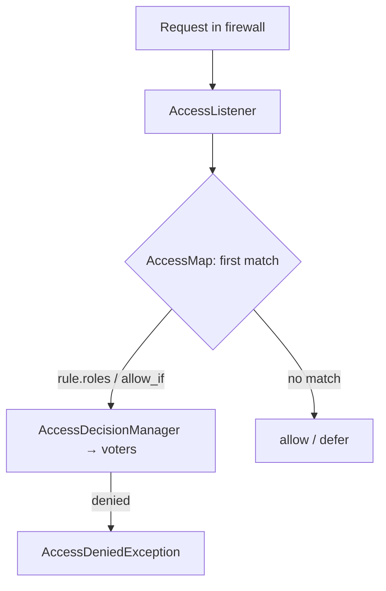

# Access Control Rules

!!! tip "In a nutshell"
    `access_control` est une liste de règles d'autorisation basées sur l'URL,
    lue de haut en bas ; seule la **première règle correspondante** est
    appliquée.
    Piège d'examen : ordonnez du spécifique vers le général, et utilisez
    `PUBLIC_ACCESS` (et non `IS_AUTHENTICATED_ANONYMOUSLY`, supprimé) pour les
    chemins ouverts.

!!! example "Real-world analogy"
    `access_control` est la liste de règles affichée à l'entrée : « personnel
    uniquement au-delà de ce point », « les visiteurs signent le registre »,
    « tout le monde est bienvenu dans le hall ». Le gardien lit de haut en bas
    et applique la **première** ligne qui correspond à votre destination — le
    reste n'est pas lu.

!!! abstract "Learning objectives"
    À la fin de ce chapitre, vous saurez :

    - [ ] Écrire des règles `access_control` matchant sur path/roles/ip/host/methods/port.
    - [ ] Utiliser les expressions `allow_if` et `requires_channel: https`.
    - [ ] Appliquer la sémantique **first-match** et relier les règles aux voters.

    **Syllabus:** `Security → access_control` ·
    **Level:** Expert ·
    **Est. time:** 30 min ·
    **Prerequisites:** [Roles](roles.md) · [Firewalls](firewalls.md)

---

## Theory

`access_control` est une liste de règles d'**autorisation** basées sur l'URL
dans `security.yaml`. Chaque request est confrontée à la liste **de haut en
bas**, et la **première règle correspondante** est appliquée — les autres sont
ignorées. Si aucune règle ne correspond, l'accès est autorisé (l'autorisation
est déléguée aux gardes au niveau des controllers).

Une règle a deux moitiés : les **matchers** (cette règle s'applique-t-elle ?) et
les **exigences** (que doit satisfaire le token ?).

| Matcher | Requirement |
|---|---|
| `path`, `host`, `port`, `ip`/`ips`, `methods` | `roles`, `allow_if`, `requires_channel` |

!!! question "Predict first"
    Votre liste contient `{ path: ^/, roles: PUBLIC_ACCESS }` en premier, puis
    `{ path: ^/admin, roles: ROLE_ADMIN }`. `/admin` est-il protégé ?

??? note "Reveal"
    Non. Seule la **première règle correspondante** s'applique, et `^/` matche
    `/admin`, donc la règle `PUBLIC_ACCESS` gagne et l'admin est grand ouvert.
    Ordonnez du spécifique vers le général ; le catch-all `^/` va toujours en
    dernier.

## Deep Dive — how it works internally

### Where it runs

Les règles sont compilées en une `AccessMap` (`security.access.map`).
L'`AccessListener` (`Symfony\Component\Security\Http\Firewall\AccessListener`),
membre du firewall retenu, recherche la **première** entrée correspondante et
appelle `AccessDecisionManager::decide()` avec les `roles`/l'expression de la
règle. `access_control` passe donc en fin de compte par les **mêmes voters**
que `isGranted()` — ce n'est qu'une façade de l'autorisation pilotée par l'URL.



!!! note "Source reference"
    `Symfony\Component\Security\Http\Firewall\AccessListener` et
    `Symfony\Component\Security\Http\AccessMap` —
    [symfony/symfony `8.0`](https://github.com/symfony/symfony/blob/8.0/src/Symfony/Component/Security/Http/Firewall/AccessListener.php).

### First-match — the classic trap

Comme seul le premier match s'applique, **ordonnez les règles de la plus
spécifique à la plus générale**. Une règle `^/` trop large placée en premier
masque tout ce qui suit.

```yaml
access_control:
    - { path: ^/admin/users, roles: ROLE_SUPER_ADMIN }  # specific first
    - { path: ^/admin,       roles: ROLE_ADMIN }
    - { path: ^/,            roles: PUBLIC_ACCESS }      # catch-all last
```

Au sein d'une même règle, plusieurs `roles` sont combinés en **OR** (un seul
suffit).

### `allow_if` expressions

`allow_if` exécute une expression ExpressionLanguage via l'`ExpressionVoter`.
Elle a accès à `user`, `token`, `request`, `subject`, et à des fonctions comme
`is_granted()`, `is_authenticated()`, `is_fully_authenticated()`,
`is_remember_me()`. Quand `roles` et `allow_if` sont tous deux définis, **les
deux** doivent passer.

### `requires_channel`

`requires_channel: https` force une redirection vers HTTPS pour les chemins
correspondants (et `http` force le clair). C'est appliqué par le
`ChannelListener` **avant** l'authentification, donc cela protège même la page
de login.

### IP / host / methods / port

- `ips` accepte des adresses simples ou des plages CIDR ; une règle avec `ips`
  ne s'applique qu'aux clients correspondants (utile avec `PUBLIC_ACCESS` pour
  autoriser un réseau interne).
- `methods`, `host`, `port` restreignent encore les cas où la règle s'applique.

!!! info "Expert note"
    `access_control` appelle le *même* `AccessDecisionManager` et les mêmes
    voters que `isGranted()` — ce n'est qu'une façade en forme d'URL. La seule
    chose qu'il ne peut pas faire est de passer un **subject**, donc « peut
    éditer *ce* post » est impossible ici ; cela relève de `#[IsGranted]` + un
    voter. Voyez `access_control` comme une protection de zone grossière, les
    voters comme une protection par objet.

??? example "Debugging story"
    **Symptôme :** un dashboard interne de métriques sur `/admin/metrics`
    renvoyait 403 aux utilisateurs du bureau, même depuis le LAN.
    **Diagnostic :** la règle `{ ips: [...], roles: PUBLIC_ACCESS }` était
    listée *après* un large `{ path: ^/admin, roles: ROLE_ADMIN }`, qui matchait
    en premier. **Correctif :** remonter la règle spécifique `^/admin/metrics`
    au-dessus de `^/admin`. **À éviter :** ordonnez toujours les règles du
    spécifique vers le général et vérifiez avec
    `debug:config security access_control`.

??? abstract "Source-code tour"
    - `Symfony\Component\Security\Http\AccessMap` — la liste compilée ; renvoie
      les exigences du premier pattern correspondant.
    - `...\Http\Firewall\AccessListener` — recherche le match et appelle le
      decision manager.
    - `...\Http\Firewall\ChannelListener` — applique `requires_channel` *avant*
      l'authentification.
    - `...\Core\Authorization\AccessDecisionManager` — le même manager/les mêmes
      voters que `isGranted()`.
    - `...\Core\Authorization\Voter\ExpressionVoter` — évalue les expressions
      `allow_if`.

## Configuration & code

=== "YAML"

    ```yaml
    # config/packages/security.yaml
    security:
        access_control:
            # Force HTTPS on the whole login/account area (runs pre-auth).
            - { path: ^/(login|account), requires_channel: https }

            # Intranet-only admin metrics, no login required from the office LAN.
            - { path: ^/admin/metrics, roles: PUBLIC_ACCESS, ips: [192.168.0.0/16, 127.0.0.1] }

            # Expression: verified AND fully authenticated.
            - { path: ^/checkout, allow_if: "is_fully_authenticated() and user.isVerified()" }

            - { path: ^/admin, roles: ROLE_ADMIN }
            - { path: ^/,      roles: PUBLIC_ACCESS }
    ```

=== "Console"

    ```console
    $ php bin/console debug:config security access_control
    ```

## Best practices & anti-patterns

| ✅ Do | ❌ Avoid |
|---|---|
| Règles spécifiques en premier, catch-all en dernier | Une règle `^/` trop large avant les règles spécifiques |
| `requires_channel: https` sur les zones d'auth | Servir le login en HTTP non chiffré |
| Combiner `ips` + `PUBLIC_ACCESS` pour les LAN | Le contrôle d'IP comme seule authentification |
| Utiliser `access_control` pour les zones d'URL | Des règles par objet ici (utilisez des voters) |

## When (not) to use it / alternatives

`access_control` est idéal pour des règles **grossières, en forme d'URL**
(toute la zone `/admin`, forcer HTTPS). Pour les décisions qui nécessitent le
**subject** (« peut éditer *ce* post ? »), utilisez `#[IsGranted]` + un
[voter](voters.md) — `access_control` n'a pas de subject.

!!! danger "Certification traps"
    - **Le premier match gagne.** L'ordre compte ; une règle générale en premier
      masque le reste.
    - `access_control` **ne peut pas passer de subject** aux voters — il est
      uniquement basé sur l'URL.
    - Plusieurs `roles` dans une règle sont en **OR** ; `roles` + `allow_if`
      ensemble sont en **AND**.
    - `requires_channel` s'exécute **avant** l'authentification (la redirection
      a lieu d'abord).
    - Aucune règle correspondante ⇒ **accès autorisé** (pas refusé) —
      l'autorisation repose alors sur les gardes des controllers.

!!! warning "Common mistakes"
    - Supposer que toutes les règles correspondantes s'appliquent (seule la
      première l'est).
    - Utiliser `IS_AUTHENTICATED_ANONYMOUSLY` (supprimé) au lieu de
      `PUBLIC_ACCESS`.

## Exercises

1. **(Advanced)** Écrivez des règles qui forcent HTTPS sur `^/account` et
   exigent `ROLE_ADMIN` sur `^/admin`, avec un catch-all public.
2. **(Expert)** Expliquez pourquoi placer `{ path: ^/, roles: PUBLIC_ACCESS }`
   en premier casse une règle `^/admin` suivante.

??? success "Solutions"

    **1.**
    ```yaml
    access_control:
        - { path: ^/account, requires_channel: https }
        - { path: ^/admin,   roles: ROLE_ADMIN }
        - { path: ^/,        roles: PUBLIC_ACCESS }
    ```

    **2.** `^/` matche chaque chemin, y compris `/admin`. Comme le premier match
    gagne, la règle `PUBLIC_ACCESS` est appliquée et la règle `^/admin` en
    dessous n'est jamais évaluée — l'admin devient public.

## Certification questions

??? question "Q1. How many `access_control` rules apply to a request?"
    - [ ] A. All that match
    - [x] B. Only the first matching rule ✅
    - [ ] C. The most specific match
    - [ ] D. The last matching rule

    **Why:** L'`AccessMap` renvoie le premier match ; l'évaluation s'arrête là.
    **Ref:** [Access control](https://symfony.com/doc/current/security.html#securing-url-patterns-access-control).

??? question "Q2. A rule has `roles: [ROLE_A, ROLE_B]`. Access is granted when the user has…"
    - [x] A. Either `ROLE_A` or `ROLE_B` ✅
    - [ ] B. Both roles
    - [ ] C. Neither
    - [ ] D. Exactly one

    **Why:** Plusieurs roles dans une règle sont combinés en OR.
    **Ref:** [access_control roles](https://symfony.com/doc/current/security.html#securing-url-patterns-access-control).

??? question "Q3. No `access_control` rule matches the request. What happens?"
    - [ ] A. 403 Forbidden
    - [x] B. Access is allowed (deferred to controller guards) ✅
    - [ ] C. 401 Unauthorized
    - [ ] D. The firewall re-authenticates

    **Why:** `access_control` ne refuse que sur une règle correspondante ; pas
    de match signifie aucune restriction au niveau de l'URL.
    **Ref:** [Access control](https://symfony.com/doc/current/security.html).

## Key takeaways

- `access_control` = autorisation basée sur l'URL, le premier match gagne.
- Matchers : path/host/port/ip(s)/methods ; exigences : roles/allow_if/requires_channel.
- Il passe par le même `AccessDecisionManager`/les mêmes voters que
  `isGranted()`.
- Pas de support du subject, et aucun match ⇒ autorisé ; utilisez les voters
  pour les règles par objet.

## Last-minute revision

!!! tip "Cheat sheet"
    - Le premier match gagne → le spécifique d'abord, le catch-all `^/` en
      dernier.
    - Les roles dans une règle = OR ; `roles` + `allow_if` = AND.
    - `requires_channel: https` = redirection pré-authentification.
    - `ips` + `PUBLIC_ACCESS` = allowlist LAN ; aucun match = autorisé.

## Connections

- **Depends on:** [Firewalls](firewalls.md) — l'`AccessListener` s'exécute dans
  la chaîne de listeners du firewall retenu.
- **Depends on:** [Authorization](authorization.md) — les règles se résolvent
  via le même `AccessDecisionManager` que `isGranted()`.
- **Reused in:** [Voters](voters.md) — `roles`/`allow_if` sont in fine des
  décisions de voters.
- **Confused with:** [Roles](roles.md) — `access_control` protège des *zones*
  d'URL ; il ne peut pas voir de subject, contrairement à un voter.

## Official References
- [Symfony docs — access_control](https://symfony.com/doc/current/security.html#securing-url-patterns-access-control)
- [Symfony docs — Security expressions](https://symfony.com/doc/current/security/expressions.html)
- [Symfony source — AccessListener](https://github.com/symfony/symfony/blob/8.0/src/Symfony/Component/Security/Http/Firewall/AccessListener.php)

## Video references

!!! tip "Watch & learn"
    Voici des chaînes vidéo officielles, mises à jour en continu — cherchez-y
    « Symfony security » pour consolider ce chapitre. Nous lions des chaînes
    stables plutôt que des vidéos individuelles pour que les références ne
    périment jamais.

    - [SymfonyCasts screencasts](https://symfonycasts.com/tracks/symfony) — tutoriels scénarisés à suivre en codant.
    - [Symfony official YouTube](https://www.youtube.com/@SymfonyOfficial) — conférences et keynotes SymfonyCon.
    - [Official docs for this topic](https://symfony.com/doc/current/security.html#securing-url-patterns-access-control) — certaines pages de la doc Symfony intègrent un screencast.

## Confidence check

Je suis prêt quand je peux :

- [ ] expliquer **pourquoi** `access_control` existe aux côtés de `#[IsGranted]`/des voters
- [ ] écrire des règles ordonnées avec `path`/`ips`/`allow_if`/`requires_channel`
- [ ] déboguer une règle qui ne se déclenche jamais parce qu'une plus large la précède
- [ ] repérer le piège : `access_control` ne peut pas passer de subject
- [ ] expliquer qu'il passe en interne par le même `AccessDecisionManager`

---

<small>Related: [Roles](roles.md) · [Firewalls](firewalls.md) ·
[Voters & Voting Strategies](voters.md) · [Authorization](authorization.md)</small>
