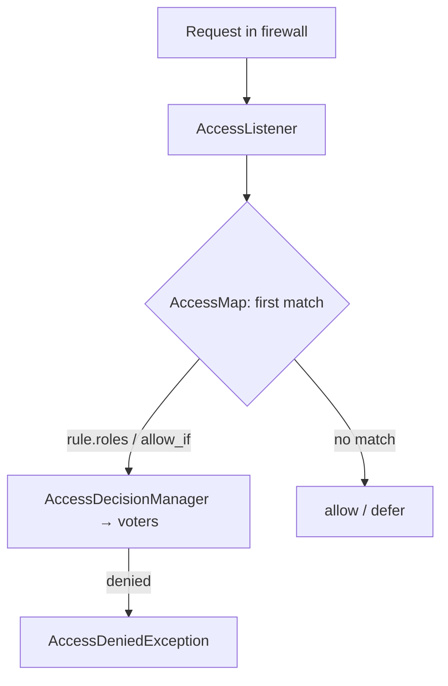

# Access Control Rules

!!! tip "In a nutshell"
    `access_control` is a top-to-bottom list of URL-based authorization rules; only
    the **first matching rule** is enforced.
    Exam hook: order specific → general, and use `PUBLIC_ACCESS` (not the removed
    `IS_AUTHENTICATED_ANONYMOUSLY`) for open paths.

!!! example "Real-world analogy"
    `access_control` is the posted list of rules by the entrance: "staff only
    past this point", "visitors sign in", "everyone welcome in the lobby". The
    guard reads top-to-bottom and enforces the **first** line that fits your
    destination — the rest go unread.

!!! abstract "Learning objectives"
    By the end of this chapter you can:

    - [ ] Write `access_control` rules matching on path/roles/ip/host/methods/port.
    - [ ] Use `allow_if` expressions and `requires_channel: https`.
    - [ ] Apply **first-match** semantics and relate rules to voters.

    **Syllabus:** `Security → access_control` ·
    **Level:** Expert ·
    **Est. time:** 30 min ·
    **Prerequisites:** [Roles](roles.md) · [Firewalls](firewalls.md)

---

## Theory

`access_control` is a list of URL-based **authorization** rules in
`security.yaml`. Each request is checked against the list **top-to-bottom**, and
the **first matching rule** is enforced — the rest are ignored. If no rule
matches, access is allowed (authorization defers to controller-level guards).

A rule has two halves: **matchers** (does this rule apply?) and
**requirements** (what must the token satisfy?).

| Matcher | Requirement |
|---|---|
| `path`, `host`, `port`, `ip`/`ips`, `methods` | `roles`, `allow_if`, `requires_channel` |

## Deep Dive — how it works internally

### Where it runs

The rules compile into an `AccessMap` (`security.access.map`). The
`AccessListener` (`Symfony\Component\Security\Http\Firewall\AccessListener`),
part of the matched firewall, looks up the **first** matching entry and calls
`AccessDecisionManager::decide()` with the rule's `roles`/expression. So
`access_control` ultimately runs through the **same voters** as `isGranted()` —
it is just a URL-driven front end to authorization.



!!! note "Source reference"
    `Symfony\Component\Security\Http\Firewall\AccessListener` and
    `Symfony\Component\Security\Http\AccessMap` —
    [symfony/symfony `8.0`](https://github.com/symfony/symfony/blob/8.0/src/Symfony/Component/Security/Http/Firewall/AccessListener.php).

### First-match — the classic trap

Because only the first match applies, **order rules from most specific to most
general**. A broad `^/` rule placed first shadows everything below it.

```yaml
access_control:
    - { path: ^/admin/users, roles: ROLE_SUPER_ADMIN }  # specific first
    - { path: ^/admin,       roles: ROLE_ADMIN }
    - { path: ^/,            roles: PUBLIC_ACCESS }      # catch-all last
```

Within one rule, multiple `roles` are combined with **OR** (any one grants).

### `allow_if` expressions

`allow_if` runs an ExpressionLanguage expression via the `ExpressionVoter`. It
has access to `user`, `token`, `request`, `subject`, and functions like
`is_granted()`, `is_authenticated()`, `is_fully_authenticated()`,
`is_remember_me()`. When both `roles` and `allow_if` are set, **both** must pass.

### `requires_channel`

`requires_channel: https` forces a redirect to HTTPS for matching paths (and
`http` forces plain). It is enforced by the `ChannelListener` **before**
authentication, so it protects even the login page.

### IP / host / methods / port

- `ips` accepts single addresses or CIDR ranges; a rule with `ips` only applies
  to matching clients (useful with `PUBLIC_ACCESS` to whitelist an internal net).
- `methods`, `host`, `port` further narrow when the rule applies.

## Configuration & code

=== "YAML"

    ```yaml
    # config/packages/security.yaml
    security:
        access_control:
            # Force HTTPS on the whole login/account area (runs pre-auth).
            - { path: ^/(login|account), requires_channel: https }

            # Intranet-only admin metrics, no login required from the office LAN.
            - { path: ^/admin/metrics, roles: PUBLIC_ACCESS, ips: [192.168.0.0/16, 127.0.0.1] }

            # Expression: verified AND fully authenticated.
            - { path: ^/checkout, allow_if: "is_fully_authenticated() and user.isVerified()" }

            - { path: ^/admin, roles: ROLE_ADMIN }
            - { path: ^/,      roles: PUBLIC_ACCESS }
    ```

=== "Console"

    ```console
    $ php bin/console debug:config security access_control
    ```

## Best practices & anti-patterns

| ✅ Do | ❌ Avoid |
|---|---|
| Specific rules first, catch-all last | Broad `^/` rule before specific ones |
| `requires_channel: https` for auth areas | Serving login over plain HTTP |
| Combine `ips` + `PUBLIC_ACCESS` for LANs | IP checks as the only auth |
| Use `access_control` for URL zones | Per-object rules here (use voters) |

## When (not) to use it / alternatives

`access_control` is ideal for **coarse, URL-shaped** rules (whole `/admin` area,
force HTTPS). For decisions that need the **subject** ("can edit *this* post?"),
use `#[IsGranted]` + a [voter](voters.md) — `access_control` has no subject.

!!! danger "Certification traps"
    - **First match wins.** Order matters; a general rule first shadows the rest.
    - `access_control` **cannot pass a subject** to voters — it is URL-based only.
    - Multiple `roles` in one rule are **OR**; `roles` + `allow_if` together are
      **AND**.
    - `requires_channel` runs **before** authentication (redirect happens first).
    - No matching rule ⇒ **access allowed** (not denied) — authorization then
      relies on controller guards.

!!! warning "Common mistakes"
    - Assuming all matching rules are applied (only the first is).
    - Using `IS_AUTHENTICATED_ANONYMOUSLY` (removed) instead of `PUBLIC_ACCESS`.

## Exercises

1. **(Advanced)** Write rules that force HTTPS on `^/account` and require
   `ROLE_ADMIN` on `^/admin`, with a public catch-all.
2. **(Expert)** Explain why placing `{ path: ^/, roles: PUBLIC_ACCESS }` first
   breaks a following `^/admin` rule.

??? success "Solutions"

    **1.**
    ```yaml
    access_control:
        - { path: ^/account, requires_channel: https }
        - { path: ^/admin,   roles: ROLE_ADMIN }
        - { path: ^/,        roles: PUBLIC_ACCESS }
    ```

    **2.** `^/` matches every path including `/admin`. Since the first match wins,
    the `PUBLIC_ACCESS` rule is enforced and the `^/admin` rule below is never
    evaluated — admin becomes public.

## Certification questions

??? question "Q1. How many `access_control` rules apply to a request?"
    - [ ] A. All that match
    - [x] B. Only the first matching rule ✅
    - [ ] C. The most specific match
    - [ ] D. The last matching rule

    **Why:** `AccessMap` returns the first match; evaluation stops there.
    **Ref:** [Access control](https://symfony.com/doc/current/security.html#securing-url-patterns-access-control).

??? question "Q2. A rule has `roles: [ROLE_A, ROLE_B]`. Access is granted when the user has…"
    - [x] A. Either `ROLE_A` or `ROLE_B` ✅
    - [ ] B. Both roles
    - [ ] C. Neither
    - [ ] D. Exactly one

    **Why:** Multiple roles in a rule are OR-combined.
    **Ref:** [access_control roles](https://symfony.com/doc/current/security.html#securing-url-patterns-access-control).

??? question "Q3. No `access_control` rule matches the request. What happens?"
    - [ ] A. 403 Forbidden
    - [x] B. Access is allowed (deferred to controller guards) ✅
    - [ ] C. 401 Unauthorized
    - [ ] D. The firewall re-authenticates

    **Why:** `access_control` denies only on a matching rule; no match means no
    URL-level restriction.
    **Ref:** [Access control](https://symfony.com/doc/current/security.html).

## Key takeaways

- `access_control` = URL-based authorization, first match wins.
- Matchers: path/host/port/ip(s)/methods; requirements: roles/allow_if/requires_channel.
- It runs through the same `AccessDecisionManager`/voters as `isGranted()`.
- No subject support and no match ⇒ allowed; use voters for per-object rules.

## Last-minute revision

!!! tip "Cheat sheet"
    - First match wins → specific first, `^/` catch-all last.
    - Roles in a rule = OR; `roles` + `allow_if` = AND.
    - `requires_channel: https` = pre-auth redirect.
    - `ips` + `PUBLIC_ACCESS` = LAN allowlist; no match = allowed.

## Official References
- [Symfony docs — access_control](https://symfony.com/doc/current/security.html#securing-url-patterns-access-control)
- [Symfony docs — Security expressions](https://symfony.com/doc/current/security/expressions.html)
- [Symfony source — AccessListener](https://github.com/symfony/symfony/blob/8.0/src/Symfony/Component/Security/Http/Firewall/AccessListener.php)

---

<small>Related: [Roles](roles.md) · [Firewalls](firewalls.md) ·
[Voters & Voting Strategies](voters.md) · [Authorization](authorization.md)</small>
</content>
