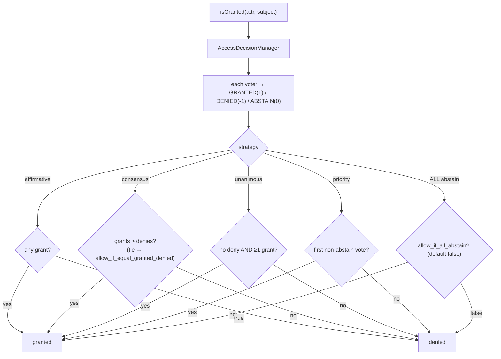

# Access Decision Strategies

!!! tip "In a nutshell"
    L'`AccessDecisionManager` réduit tous les votes des voters avec une
    **stratégie** : `affirmative` (par défaut — un seul accord gagne),
    `consensus` (majorité), `unanimous` (aucun refus toléré), `priority` (le
    premier vote non-abstention décide). Piège d'examen : quand **tous** les
    voters s'abstiennent, l'accès est **refusé** sauf si
    `allow_if_all_abstain: true`.

!!! example "Real-world analogy"
    Quatre façons de faire fonctionner le même jury : *affirmative* — un seul
    juré disant « innocent » suffit ; *consensus* — un vote à la majorité, avec
    une règle maison pour les égalités ; *unanimous* — un seul « coupable »
    coule le verdict, peu importe combien disent « innocent » ; *priority* —
    le juré le plus haut placé qui daigne lever la main tranche seul. Les
    jurés qui haussent les épaules (« pas mon affaire ») ne comptent jamais —
    sauf si *tout le monde* hausse les épaules, auquel cas la règle par défaut
    du tribunal s'applique.

!!! abstract "Learning objectives"
    À la fin de ce chapitre, vous saurez :

    - [ ] Nommer les quatre stratégies et leurs conditions exactes d'accord.
    - [ ] Configurer `security.access_decision_manager` (stratégie, flags, service).
    - [ ] Prédire les issues de combinaisons de votes délicates (abstentions, égalités).
    - [ ] Expliquer comment les valeurs `VoterInterface::ACCESS_*` alimentent la stratégie.
    - [ ] Brancher une implémentation personnalisée d'`AccessDecisionStrategyInterface`.

    **Syllabus:** `Security → Access Decision Strategies` ·
    **Level:** Expert ·
    **Est. time:** 20 min ·
    **Prerequisites:** [Voters](voters.md) · [Authorization](authorization.md)

---

## Theory

Chaque appel à `isGranted()` aboutit dans
l'`Symfony\Component\Security\Core\Authorization\AccessDecisionManager`, qui
collecte un vote par voter — `ACCESS_GRANTED` (1), `ACCESS_DENIED` (-1) ou
`ACCESS_ABSTAIN` (0), les constantes de `VoterInterface` — et les réduit avec
la **stratégie** configurée :

| Stratégie | Accorde quand… | Notes |
|---|---|---|
| `affirmative` | **au moins un** voter accorde | par défaut ; les refus sont ignorés dès qu'il y a un accord |
| `consensus` | les accords **dépassent** les refus | comportement d'égalité via `allow_if_equal_granted_denied` |
| `unanimous` | **aucun voter ne refuse** et au moins un accorde | un seul refus met son veto à tout |
| `priority` | le **premier** voter **non-abstentionniste** accorde | l'ordre des voters (priorité de service) décide |

```php
// VoterInterface constants collected by the AccessDecisionManager
VoterInterface::ACCESS_GRANTED; //  1
VoterInterface::ACCESS_ABSTAIN; //  0
VoterInterface::ACCESS_DENIED;  // -1

// every isGranted() ends in decide(), reduced by the configured strategy
$granted = $accessDecisionManager->decide($token, ['POST_EDIT'], $post);
```

Deux flags affinent les cas limites :

- **`allow_if_all_abstain`** (par défaut **`false`**) : l'issue lorsque *tous*
  les voters s'abstiennent — par défaut c'est un **refus**, pour toutes les
  stratégies.
- **`allow_if_equal_granted_denied`** (par défaut **`true`**) : départage des
  égalités, propre à consensus.

```yaml
security:
    access_decision_manager:
        strategy: consensus
        allow_if_all_abstain: false          # every voter abstains → deny (default)
        allow_if_equal_granted_denied: true  # consensus tie → grant (default)
```

Les abstentions sont neutres partout : elles ne comptent jamais comme des
refus. Sous `unanimous`, « A accorde, B s'abstient » **accorde** quand même —
le piège d'examen classique.

## Deep Dive — how it works internally

Depuis Symfony 5.4, les stratégies sont de vraies classes implémentant
`Symfony\Component\Security\Core\Authorization\Strategy\AccessDecisionStrategyInterface`
(`AffirmativeStrategy`, `ConsensusStrategy`, `UnanimousStrategy`,
`PriorityStrategy`). Le manager transmet en flux les résultats des voters à
`$strategy->decide($results)`, qui retourne le booléen final.

Détails comportementaux clés, tirés directement des implémentations :

- **affirmative** retourne `true` au premier accord ; si seuls des refus ont
  été vus, il retourne `false` ; si personne n'a voté, il se rabat sur
  `allowIfAllAbstain`.
- **consensus** compte les accords vs les refus ; la majorité stricte gagne ;
  des comptes non nuls égaux se rabattent sur `allowIfEqualGrantedDenied` ;
  zéro des deux côtés se rabat sur `allowIfAllAbstain`.
- **unanimous** retourne `false` dès le *premier* refus ; sinon `true` si au
  moins un accord a été vu ; l'abstention générale se rabat sur
  `allowIfAllAbstain`.
- **priority** retourne le premier vote non-abstention comme décision ;
  l'abstention générale se rabat sur `allowIfAllAbstain`.



!!! question "Predict first"
    Stratégie `unanimous`. Voter A : GRANTED, voter B : ABSTAIN, voter C :
    ABSTAIN. Puis, second cas : les trois en ABSTAIN. Quelles sont les deux
    issues avec les flags par défaut ?

??? note "Reveal"
    Cas 1 : **accordé** — unanimous interdit les *refus*, pas les
    abstentions, et un accord est présent. Cas 2 : **refusé** — quand tous
    les voters s'abstiennent, la décision se rabat sur
    `allow_if_all_abstain`, qui vaut `false` par défaut. Deux pièges en un :
    « unanimous » ne signifie pas « tout le monde doit accorder », et
    l'abstention générale est un refus par défaut sous **toutes** les
    stratégies.

!!! note "Source reference"
    `Symfony\Component\Security\Core\Authorization\AccessDecisionManager` —
    [symfony/symfony `8.0`](https://github.com/symfony/symfony/blob/8.0/src/Symfony/Component/Security/Core/Authorization/AccessDecisionManager.php)
    — et les stratégies dans
    [`Authorization/Strategy/`](https://github.com/symfony/symfony/blob/8.0/src/Symfony/Component/Security/Core/Authorization/Strategy/UnanimousStrategy.php).

### Choosing deliberately

- `affirmative` modélise des permissions **OR** (« toute raison d'autoriser
  suffit »).
- `unanimous` modélise des systèmes à **veto** — conformité/défense en
  profondeur, où tout refus isolé doit l'emporter.
- `consensus` est rare en pratique ; connaissez son flag d'égalité pour
  l'examen.
- `priority` ordonne les voters par priorité de service et laisse le premier
  qui a un avis court-circuiter (p. ex. un voter « utilisateur banni »
  enregistré au-dessus de tous les autres).

## Configuration & code

=== "YAML"

    ```yaml
    # config/packages/security.yaml
    security:
        access_decision_manager:
            strategy: unanimous            # affirmative (default) | consensus | priority
            allow_if_all_abstain: false    # default
            # consensus only:
            # allow_if_equal_granted_denied: true
    ```

    ```yaml
    # OR provide a custom strategy service instead of a named strategy
    security:
        access_decision_manager:
            strategy_service: App\Security\VersusStrategy
    ```

=== "PHP (custom strategy)"

    ```php
    <?php
    declare(strict_types=1);

    namespace App\Security;

    use Symfony\Component\Security\Core\Authorization\Strategy\AccessDecisionStrategyInterface;
    use Symfony\Component\Security\Core\Authorization\Voter\VoterInterface;

    /**
     * Grants only when grants strictly outnumber denies by 2 or more.
     */
    final class VersusStrategy implements AccessDecisionStrategyInterface
    {
        public function decide(\Traversable $results): bool
        {
            $score = 0;
            foreach ($results as $result) {
                $score += match ($result) {
                    VoterInterface::ACCESS_GRANTED => 1,
                    VoterInterface::ACCESS_DENIED => -1,
                    default => 0, // abstain
                };
            }

            return $score >= 2;
        }
    }
    ```

!!! info "Expert note"
    `strategy` et `strategy_service` sont mutuellement exclusifs ; il existe
    aussi une clé `service` pour remplacer le decision manager *tout entier*.
    Les stratégies personnalisées reçoivent le flux brut des entiers
    `VoterInterface::ACCESS_*` — abstentions comprises — et peuvent donc
    implémenter des quorums, des pondérations ou des systèmes de score.

## Best practices & anti-patterns

| ✅ Do | ❌ Avoid |
|---|---|
| Choisir la stratégie d'après le *modèle de sécurité* (OR vs veto) | Garder la valeur par défaut parce que c'est la valeur par défaut |
| S'appuyer sur la neutralité de l'abstention ; filtrer dans `supports()` | Des voters qui retournent DENY pour « pas mon domaine » |
| Tester explicitement les chemins « tous s'abstiennent » | Supposer que l'abstention générale accorde |
| Utiliser `priority` + priorité de service pour des vetos court-circuit | Des hypothèses d'ordre cachées sous `affirmative` |

## When (not) to use it / alternatives

Ne touchez à cette configuration que lorsque la sémantique OR par défaut
d'`affirmative` ne convient pas à votre domaine — p. ex. une règle de
conformité où tout refus doit mettre son veto (`unanimous`), ou un voter
« interrupteur d'urgence » global (`priority`). Ne simulez pas une stratégie
dans un méga-voter unique ; composez de petits voters et laissez la stratégie
faire l'arithmétique. Pour des règles qui n'impliquent jamais qu'un seul
voter, le choix de la stratégie est sans effet par construction.

!!! danger "Certification traps"
    - Stratégie par défaut : **affirmative** — un seul accord gagne, même
      contre dix refus.
    - `unanimous` + un accord + des abstentions = **accordé** ; l'abstention
      n'est jamais un refus.
    - **Tous s'abstiennent** = refusé sous toutes les stratégies, sauf si
      `allow_if_all_abstain: true` (par défaut `false`).
    - Le flag d'égalité de consensus `allow_if_equal_granted_denied` vaut
      **true** par défaut.
    - `priority` utilise le **premier** voter **non-abstentionniste** — c'est
      l'ordre d'enregistrement/de priorité qui compte, pas le décompte des
      votes.

!!! warning "Common mistakes"
    - Configurer `strategy` sous le firewall — cette clé vit à
      `security.access_decision_manager`, globalement.
    - Oublier que passer à `unanimous` transforme tout voter négligent qui
      retourne `false` pour des attributs sans rapport en veto à l'échelle du
      site.

## Exercises

1. **(Advanced)** Votes : GRANTED, DENIED, ABSTAIN. Donnez l'issue sous
   chacune des quatre stratégies (supposez que le voter qui accorde a la plus
   haute priorité, et les flags par défaut).
2. **(Expert)** Implémentez et câblez une stratégie personnalisée qui exige au
   moins deux accords et zéro refus (« règle des deux personnes »).

??? success "Solutions"

    **1.** affirmative : **accordé** (un accord existe). consensus : égalité
    1 contre 1 → `allow_if_equal_granted_denied` par défaut `true` →
    **accordé**. unanimous : **refusé** (un seul refus met son veto).
    priority : le premier vote non-abstention est l'accord → **accordé**.

    **2.** Implémentez `AccessDecisionStrategyInterface::decide()` : itérez
    les résultats, comptez les accords, `return false` immédiatement dès un
    `ACCESS_DENIED`, et enfin `return $grants >= 2`. Câblez-la avec
    `security.access_decision_manager.strategy_service: App\Security\TwoPersonStrategy`.

## Certification questions

??? question "Q1. Default strategy, and its rule?"
    - [x] A. `affirmative` — grants as soon as any voter grants ✅
    - [ ] B. `unanimous` — everyone must grant
    - [ ] C. `consensus` — majority of all voters
    - [ ] D. `priority` — highest priority voter always decides

    **Why:** Affirmative est la stratégie par défaut : un seul
    `ACCESS_GRANTED` gagne, quel que soit le nombre de refus.
    **Ref:** [Changing the access decision strategy](https://symfony.com/doc/current/security/voters.html#changing-the-access-decision-strategy).

??? question "Q2. Under `unanimous`, votes are GRANTED + ABSTAIN + ABSTAIN. Outcome?"
    - [x] A. Granted — abstain is not a deny ✅
    - [ ] B. Denied — not everyone granted
    - [ ] C. Denied — abstain counts as deny under unanimous
    - [ ] D. Depends on `allow_if_equal_granted_denied`

    **Why:** Unanimous exige seulement *zéro refus* plus au moins un accord ;
    les abstentions sont neutres. Le flag d'égalité appartient à consensus.
    **Ref:** [UnanimousStrategy](https://github.com/symfony/symfony/blob/8.0/src/Symfony/Component/Security/Core/Authorization/Strategy/UnanimousStrategy.php).

??? question "Q3. Every voter abstains and configuration is untouched. Outcome?"
    - [ ] A. Granted — nobody objected
    - [x] B. Denied — `allow_if_all_abstain` defaults to `false` ✅
    - [ ] C. Exception — no decision possible
    - [ ] D. Granted only under `affirmative`

    **Why:** Toutes les stratégies se rabattent sur `allow_if_all_abstain`
    quand aucun voter n'émet de vrai vote, et ce flag vaut `false` par défaut.
    **Ref:** [Changing the access decision strategy](https://symfony.com/doc/current/security/voters.html#changing-the-access-decision-strategy).

??? question "Q4. Where do you plug a custom decision algorithm?"
    - [ ] A. `security.firewalls.main.strategy`
    - [x] B. `security.access_decision_manager.strategy_service` (an `AccessDecisionStrategyInterface` service) ✅
    - [ ] C. Override `VoterInterface::vote()` return values
    - [ ] D. A compiler pass replacing every voter

    **Why:** `strategy_service` remplace l'objet stratégie ; `service`
    remplacerait le manager tout entier. Les deux vivent sous
    `security.access_decision_manager`, jamais sous un firewall.
    **Ref:** [Custom access decision strategy](https://symfony.com/doc/current/security/voters.html#custom-access-decision-strategy).

## Key takeaways

- Quatre stratégies : affirmative (par défaut, un seul accord gagne),
  consensus (majorité + flag d'égalité), unanimous (tout refus met son veto),
  priority (le premier vote non-abstention décide).
- L'abstention est neutre dans toutes les stratégies ; l'abstention générale
  refuse sauf si `allow_if_all_abstain: true`.
- Les égalités de consensus donnent **accordé** par défaut
  (`allow_if_equal_granted_denied: true`).
- Configuration globale à `security.access_decision_manager` ; logique
  personnalisée via `strategy_service` implémentant
  `AccessDecisionStrategyInterface`.
- Les votes sont `VoterInterface::ACCESS_GRANTED/ABSTAIN/DENIED` = 1 / 0 / -1.

## Last-minute revision

!!! tip "Cheat sheet"
    - affirmative : ∃ accord ⇒ ✔ · consensus : accords > refus (égalité ⇒
      flag, par défaut ✔)
    - unanimous : aucun refus ∧ ≥1 accord ⇒ ✔ · priority : le premier vote
      non-abstention décide
    - tous s'abstiennent ⇒ `allow_if_all_abstain` (par défaut ✘)
    - Config : `security.access_decision_manager.{strategy, strategy_service, service}`

## Connections

- **Depends on:** [Voters](voters.md) — la stratégie consomme leurs votes
  GRANTED/DENIED/ABSTAIN.
- **Reused in:** [Access Control Rules](access-control.md) — les décisions
  d'`access_control` passent par le même manager et la même stratégie.
- **Reused in:** [Role Hierarchy](role-hierarchy.md) — le vote du
  `RoleHierarchyVoter` n'est qu'une entrée parmi d'autres pour la stratégie.
- **Confused with:** [Authorization](authorization.md) — `isGranted()` est le
  point d'entrée ; la stratégie est la *règle de décompte* tout à la fin.

## Official References
- [Symfony docs — Changing the access decision strategy](https://symfony.com/doc/current/security/voters.html#changing-the-access-decision-strategy)
- [Symfony source — AccessDecisionManager](https://github.com/symfony/symfony/blob/8.0/src/Symfony/Component/Security/Core/Authorization/AccessDecisionManager.php)
- [Symfony source — AccessDecisionStrategyInterface](https://github.com/symfony/symfony/blob/8.0/src/Symfony/Component/Security/Core/Authorization/Strategy/AccessDecisionStrategyInterface.php)

## Video references

!!! tip "Watch & learn"
    Voici des chaînes vidéo officielles, mises à jour en continu — cherchez-y
    « Symfony security » pour consolider ce chapitre. Nous lions des chaînes
    stables plutôt que des vidéos individuelles afin que les références ne
    périment jamais.

    - [SymfonyCasts screencasts](https://symfonycasts.com/tracks/symfony) — tutoriels scénarisés à suivre en codant.
    - [Symfony official YouTube](https://www.youtube.com/@SymfonyOfficial) — conférences et keynotes de SymfonyCon.
    - [Official docs for this topic](https://symfony.com/doc/current/security/voters.html#changing-the-access-decision-strategy) — certaines pages de la doc Symfony intègrent un screencast.

## Confidence check

Je suis prêt quand je peux :

- [ ] expliquer **pourquoi** la règle de décompte est séparée des voters
  eux-mêmes
- [ ] configurer stratégie + flags (ou un `strategy_service`) dans Symfony 8
- [ ] déboguer un 403 surprise causé par le passage à `unanimous`
- [ ] repérer les pièges abstention-vs-refus et abstention générale dans une
  question
- [ ] expliquer les rouages internes : `decide()` sur un flux d'entiers
  `ACCESS_*`

---

<small>Related: [Voters](voters.md) · [Authorization](authorization.md) ·
[Access Control Rules](access-control.md)</small>
