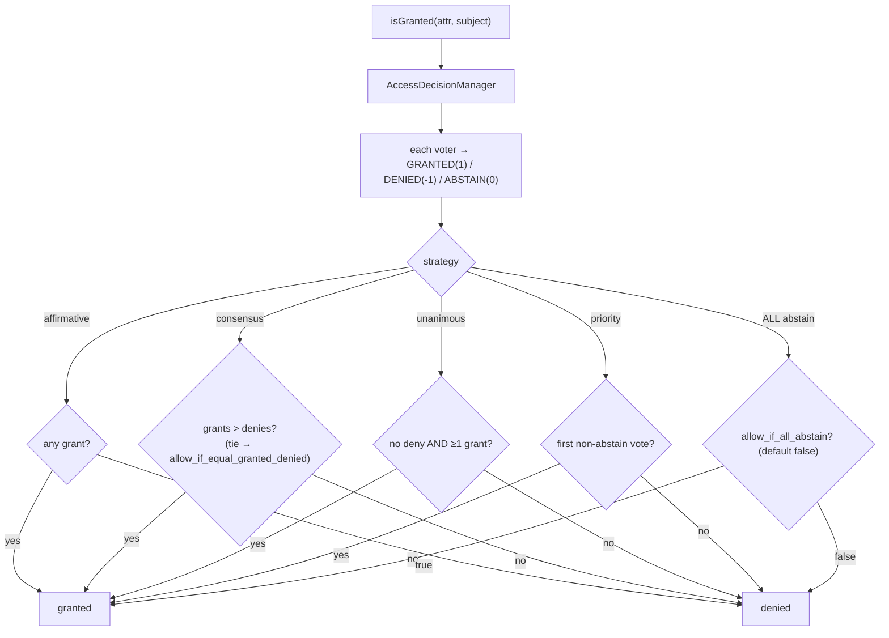

# Access Decision Strategies

!!! tip "In a nutshell"
    The `AccessDecisionManager` reduces all voter votes with a **strategy**:
    `affirmative` (default — one grant wins), `consensus` (majority),
    `unanimous` (no deny allowed), `priority` (first non-abstain decides).
    Exam hook: when **all** voters abstain, access is **denied** unless
    `allow_if_all_abstain: true`.

!!! example "Real-world analogy"
    Four ways to run the same jury: *affirmative* — one juror saying "innocent"
    is enough; *consensus* — a majority vote, with a house rule for ties;
    *unanimous* — a single "guilty" sinks the verdict no matter how many say
    "innocent"; *priority* — the most senior juror who bothers to raise a hand
    settles it alone. Jurors who shrug ("not my case") never count — unless
    *everyone* shrugs, in which case the courthouse default kicks in.

!!! abstract "Learning objectives"
    By the end of this chapter you can:

    - [ ] Name the four strategies and their exact grant conditions.
    - [ ] Configure `security.access_decision_manager` (strategy, flags, service).
    - [ ] Predict outcomes for tricky vote combinations (abstains, ties).
    - [ ] Explain how `VoterInterface::ACCESS_*` values feed the strategy.
    - [ ] Plug a custom `AccessDecisionStrategyInterface` implementation.

    **Syllabus:** `Security → Access Decision Strategies` ·
    **Level:** Expert ·
    **Est. time:** 20 min ·
    **Prerequisites:** [Voters](voters.md) · [Authorization](authorization.md)

---

## Theory

Every `isGranted()` call ends in the
`Symfony\Component\Security\Core\Authorization\AccessDecisionManager`, which
collects one vote per voter — `ACCESS_GRANTED` (1), `ACCESS_DENIED` (-1) or
`ACCESS_ABSTAIN` (0), the constants of `VoterInterface` — and reduces them
with the configured **strategy**:

| Strategy | Grants when… | Notes |
|---|---|---|
| `affirmative` | **at least one** voter grants | default; denies ignored if any grant |
| `consensus` | grants **outnumber** denies | tie behaviour via `allow_if_equal_granted_denied` |
| `unanimous` | **no voter denies** and at least one grants | one deny vetoes everything |
| `priority` | the **first non-abstaining** voter grants | voter order (service priority) decides |

```php
// VoterInterface constants collected by the AccessDecisionManager
VoterInterface::ACCESS_GRANTED; //  1
VoterInterface::ACCESS_ABSTAIN; //  0
VoterInterface::ACCESS_DENIED;  // -1

// every isGranted() ends in decide(), reduced by the configured strategy
$granted = $accessDecisionManager->decide($token, ['POST_EDIT'], $post);
```

Two flags refine the edge cases:

- **`allow_if_all_abstain`** (default **`false`**): the outcome when *every*
  voter abstains — by default that is a **deny**, for all strategies.
- **`allow_if_equal_granted_denied`** (default **`true`**): consensus-only tie
  breaker.

```yaml
security:
    access_decision_manager:
        strategy: consensus
        allow_if_all_abstain: false          # every voter abstains → deny (default)
        allow_if_equal_granted_denied: true  # consensus tie → grant (default)
```

Abstentions are neutral everywhere: they never count as denies. Under
`unanimous`, "A grants, B abstains" still **grants** — the classic exam trick.

## Deep Dive — how it works internally

Since Symfony 5.4 the strategies are real classes implementing
`Symfony\Component\Security\Core\Authorization\Strategy\AccessDecisionStrategyInterface`
(`AffirmativeStrategy`, `ConsensusStrategy`, `UnanimousStrategy`,
`PriorityStrategy`). The manager streams voter results into
`$strategy->decide($results)`, which returns the final boolean.

```php
use Symfony\Component\Security\Core\Authorization\Strategy\AffirmativeStrategy;
use Symfony\Component\Security\Core\Authorization\Strategy\ConsensusStrategy;
use Symfony\Component\Security\Core\Authorization\Strategy\PriorityStrategy;
use Symfony\Component\Security\Core\Authorization\Strategy\UnanimousStrategy;

// each implements AccessDecisionStrategyInterface::decide(\Traversable $results): bool
$strategy = new UnanimousStrategy();
$granted = $strategy->decide(new \ArrayIterator([1, 0, 0])); // GRANTED + 2 ABSTAIN → true
```

Key behavioural details, straight from the implementations:

- **affirmative** returns `true` on the first grant; if only denies were seen
  it returns `false`; if nobody voted, it falls back to `allowIfAllAbstain`.
- **consensus** tallies grants vs denies; strict majority wins; equal non-zero
  counts fall back to `allowIfEqualGrantedDenied`; zero of both falls back to
  `allowIfAllAbstain`.
- **unanimous** returns `false` on the *first* deny; otherwise `true` if at
  least one grant was seen; all-abstain falls back to `allowIfAllAbstain`.
- **priority** returns the first non-abstain vote as the decision;
  all-abstain falls back to `allowIfAllAbstain`.



!!! question "Predict first"
    Strategy `unanimous`. Voter A: GRANTED, voter B: ABSTAIN, voter C: ABSTAIN.
    Then, second case: all three ABSTAIN. What are the two outcomes with
    default flags?

??? note "Reveal"
    Case 1: **granted** — unanimous forbids *denies*, not abstentions, and one
    grant is present. Case 2: **denied** — with every voter abstaining, the
    decision falls back to `allow_if_all_abstain`, which defaults to `false`.
    Two traps in one: "unanimous" does not mean "everyone must grant", and
    all-abstain is a deny by default under **every** strategy.

!!! note "Source reference"
    `Symfony\Component\Security\Core\Authorization\AccessDecisionManager` —
    [symfony/symfony `8.0`](https://github.com/symfony/symfony/blob/8.0/src/Symfony/Component/Security/Core/Authorization/AccessDecisionManager.php)
    — and the strategies in
    [`Authorization/Strategy/`](https://github.com/symfony/symfony/blob/8.0/src/Symfony/Component/Security/Core/Authorization/Strategy/UnanimousStrategy.php).

### Choosing deliberately

- `affirmative` models **OR** permissions ("any reason to allow suffices").
- `unanimous` models **veto** systems — compliance/defence-in-depth, where any
  single deny must win.
- `consensus` is rare in practice; know its tie flag for the exam.
- `priority` orders voters by service priority and lets the first opinionated
  one short-circuit (e.g. a "banned user" voter registered above all others).

## Configuration & code

=== "YAML"

    ```yaml
    # config/packages/security.yaml
    security:
        access_decision_manager:
            strategy: unanimous            # affirmative (default) | consensus | priority
            allow_if_all_abstain: false    # default
            # consensus only:
            # allow_if_equal_granted_denied: true
    ```

    ```yaml
    # OR provide a custom strategy service instead of a named strategy
    security:
        access_decision_manager:
            strategy_service: App\Security\VersusStrategy
    ```

=== "PHP (custom strategy)"

    ```php
    <?php
    declare(strict_types=1);

    namespace App\Security;

    use Symfony\Component\Security\Core\Authorization\Strategy\AccessDecisionStrategyInterface;
    use Symfony\Component\Security\Core\Authorization\Voter\VoterInterface;

    /**
     * Grants only when grants strictly outnumber denies by 2 or more.
     */
    final class VersusStrategy implements AccessDecisionStrategyInterface
    {
        public function decide(\Traversable $results): bool
        {
            $score = 0;
            foreach ($results as $result) {
                $score += match ($result) {
                    VoterInterface::ACCESS_GRANTED => 1,
                    VoterInterface::ACCESS_DENIED => -1,
                    default => 0, // abstain
                };
            }

            return $score >= 2;
        }
    }
    ```

!!! info "Expert note"
    `strategy` and `strategy_service` are mutually exclusive; there is also a
    `service` key to replace the *whole* decision manager. Custom strategies
    receive the raw stream of `VoterInterface::ACCESS_*` integers — abstains
    included — so they can implement quorums, weights, or score systems.

## Best practices & anti-patterns

| ✅ Do | ❌ Avoid |
|---|---|
| Pick the strategy from the *security model* (OR vs veto) | Keeping the default because it is the default |
| Rely on abstain-neutrality; filter in `supports()` | Voters returning DENY for "not mine" |
| Test all-abstain paths explicitly | Assuming all-abstain grants |
| Use `priority` + service priority for short-circuit vetoes | Hidden ordering assumptions under `affirmative` |

## When (not) to use it / alternatives

Touch this config only when the default OR-semantics of `affirmative` are
wrong for your domain — e.g. a compliance rule that any deny must veto
(`unanimous`), or a global kill-switch voter (`priority`). Do not simulate a
strategy inside one mega-voter; compose small voters and let the strategy do
the arithmetic. For rules that only ever involve a single voter, the strategy
choice is irrelevant by construction.

!!! danger "Certification traps"
    - Default strategy: **affirmative** — one grant wins even against ten denies.
    - `unanimous` + one grant + abstains = **granted**; abstain is never a deny.
    - **All abstain** = denied under every strategy unless
      `allow_if_all_abstain: true` (default `false`).
    - Consensus tie flag `allow_if_equal_granted_denied` defaults to **true**.
    - `priority` uses the **first non-abstaining** voter — registration/priority
      order matters, not vote counts.

!!! warning "Common mistakes"
    - Configuring `strategy` under the firewall — it lives at
      `security.access_decision_manager`, globally.
    - Forgetting that switching to `unanimous` makes every sloppy voter that
      returns `false` for unrelated attributes a site-wide veto.

## Exercises

1. **(Advanced)** Votes: GRANTED, DENIED, ABSTAIN. Give the outcome under each
   of the four strategies (assume the granting voter has highest priority, and
   default flags).
2. **(Expert)** Implement and wire a custom strategy that requires at least
   two grants and zero denies ("two-person rule").

??? success "Solutions"

    **1.** affirmative: **granted** (a grant exists). consensus: 1 vs 1 tie →
    `allow_if_equal_granted_denied` default `true` → **granted**. unanimous:
    **denied** (one deny vetoes). priority: first non-abstain is the grant →
    **granted**.

    **2.** Implement `AccessDecisionStrategyInterface::decide()`: iterate the
    results, count grants, `return false` immediately on any
    `ACCESS_DENIED`, finally `return $grants >= 2`. Wire it with
    `security.access_decision_manager.strategy_service: App\Security\TwoPersonStrategy`.

## Certification questions

??? question "Q1. Default strategy, and its rule?"
    - [x] A. `affirmative` — grants as soon as any voter grants ✅
    - [ ] B. `unanimous` — everyone must grant
    - [ ] C. `consensus` — majority of all voters
    - [ ] D. `priority` — highest priority voter always decides

    **Why:** Affirmative is the default: a single `ACCESS_GRANTED` wins,
    regardless of denies.
    **Ref:** [Changing the access decision strategy](https://symfony.com/doc/current/security/voters.html#changing-the-access-decision-strategy).

??? question "Q2. Under `unanimous`, votes are GRANTED + ABSTAIN + ABSTAIN. Outcome?"
    - [x] A. Granted — abstain is not a deny ✅
    - [ ] B. Denied — not everyone granted
    - [ ] C. Denied — abstain counts as deny under unanimous
    - [ ] D. Depends on `allow_if_equal_granted_denied`

    **Why:** Unanimous only requires *zero denies* plus at least one grant;
    abstentions are neutral. The tie flag belongs to consensus.
    **Ref:** [UnanimousStrategy](https://github.com/symfony/symfony/blob/8.0/src/Symfony/Component/Security/Core/Authorization/Strategy/UnanimousStrategy.php).

??? question "Q3. Every voter abstains and configuration is untouched. Outcome?"
    - [ ] A. Granted — nobody objected
    - [x] B. Denied — `allow_if_all_abstain` defaults to `false` ✅
    - [ ] C. Exception — no decision possible
    - [ ] D. Granted only under `affirmative`

    **Why:** All strategies fall back to `allow_if_all_abstain` when no voter
    casts a real vote, and it defaults to `false`.
    **Ref:** [Changing the access decision strategy](https://symfony.com/doc/current/security/voters.html#changing-the-access-decision-strategy).

??? question "Q4. Where do you plug a custom decision algorithm?"
    - [ ] A. `security.firewalls.main.strategy`
    - [x] B. `security.access_decision_manager.strategy_service` (an `AccessDecisionStrategyInterface` service) ✅
    - [ ] C. Override `VoterInterface::vote()` return values
    - [ ] D. A compiler pass replacing every voter

    **Why:** `strategy_service` swaps the strategy object; `service` would
    replace the entire manager. Both live under
    `security.access_decision_manager`, never under a firewall.
    **Ref:** [Custom access decision strategy](https://symfony.com/doc/current/security/voters.html#custom-access-decision-strategy).

## Key takeaways

- Four strategies: affirmative (default, one grant wins), consensus
  (majority + tie flag), unanimous (any deny vetoes), priority (first
  non-abstain decides).
- Abstain is neutral in every strategy; all-abstain denies unless
  `allow_if_all_abstain: true`.
- Consensus ties default to **granted** (`allow_if_equal_granted_denied: true`).
- Configure globally at `security.access_decision_manager`; custom logic via
  `strategy_service` implementing `AccessDecisionStrategyInterface`.
- Votes are `VoterInterface::ACCESS_GRANTED/ABSTAIN/DENIED` = 1 / 0 / -1.

## Last-minute revision

!!! tip "Cheat sheet"
    - affirmative: ∃ grant ⇒ ✔ · consensus: grants > denies (tie ⇒ flag, default ✔)
    - unanimous: no deny ∧ ≥1 grant ⇒ ✔ · priority: first non-abstain decides
    - all abstain ⇒ `allow_if_all_abstain` (default ✘)
    - Config: `security.access_decision_manager.{strategy, strategy_service, service}`

## Connections

- **Depends on:** [Voters](voters.md) — the strategy consumes their
  GRANTED/DENIED/ABSTAIN votes.
- **Reused in:** [Access Control Rules](access-control.md) — `access_control`
  decisions run through the same manager and strategy.
- **Reused in:** [Role Hierarchy](role-hierarchy.md) — the
  `RoleHierarchyVoter`'s vote is just one input to the strategy.
- **Confused with:** [Authorization](authorization.md) — `isGranted()` is the
  entry point; the strategy is the *tally rule* at the very end.

## Official References
- [Symfony docs — Changing the access decision strategy](https://symfony.com/doc/current/security/voters.html#changing-the-access-decision-strategy)
- [Symfony source — AccessDecisionManager](https://github.com/symfony/symfony/blob/8.0/src/Symfony/Component/Security/Core/Authorization/AccessDecisionManager.php)
- [Symfony source — AccessDecisionStrategyInterface](https://github.com/symfony/symfony/blob/8.0/src/Symfony/Component/Security/Core/Authorization/Strategy/AccessDecisionStrategyInterface.php)

## Video references

!!! tip "Watch & learn"
    These are official, continuously-updated video channels — search them for
    "Symfony security" to reinforce this chapter. We link stable channels rather than
    individual videos so the references never rot.

    - [SymfonyCasts screencasts](https://symfonycasts.com/tracks/symfony) — scripted, code-along tutorials.
    - [Symfony official YouTube](https://www.youtube.com/@SymfonyOfficial) — SymfonyCon conference talks & keynotes.
    - [Official docs for this topic](https://symfony.com/doc/current/security/voters.html#changing-the-access-decision-strategy) — some Symfony doc pages embed a screencast.

## Confidence check

I'm ready when I can:

- [ ] explain **why** the tally rule is separate from the voters themselves
- [ ] configure strategy + flags (or a `strategy_service`) in Symfony 8
- [ ] debug a surprise 403 caused by switching to `unanimous`
- [ ] spot the abstain-vs-deny and all-abstain traps in a question
- [ ] explain internals: `decide()` over a stream of `ACCESS_*` integers

---

<small>Related: [Voters](voters.md) · [Authorization](authorization.md) ·
[Access Control Rules](access-control.md)</small>
