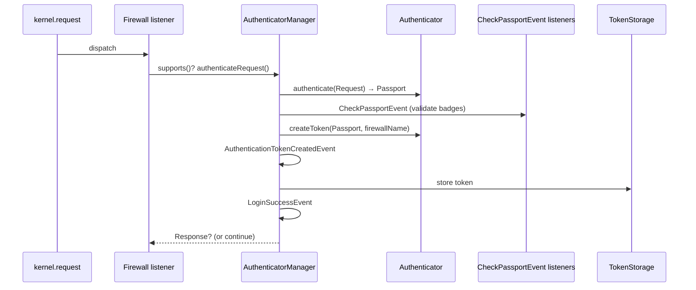

# Authentification

!!! tip "In a nutshell"
    L'authentification répond à la question *« qui effectue cette request ? »*.
    En Symfony 8, il n'existe qu'un seul système : un **authenticator**
    construit un **Passport** de badges, des listeners les valident sur
    `CheckPassportEvent`, puis un **token** est stocké. Piège d'examen : il n'y
    a plus de flag `enable_authenticator_manager` — c'est *ainsi* que la
    sécurité fonctionne, tout simplement.

!!! example "Real-world analogy"
    L'authentification, c'est montrer sa pièce d'identité au portail. Vous
    tendez un justificatif — le **Passport** de badges — le gardien le vérifie
    dans ses registres (les listeners de `CheckPassportEvent`), et s'il est
    valable vous recevez un bracelet (le **token**) qui prouve qui vous êtes
    pour le reste de votre visite.

!!! abstract "Learning objectives"
    À la fin de ce chapitre, vous saurez :

    - [ ] Retracer comment une request devient un `TokenInterface` authentifié.
    - [ ] Nommer les classes et les events du flux de l'authenticator manager.
    - [ ] Distinguer les firewalls **stateful** des firewalls **stateless** et les entry points.

    **Syllabus:** `Security → Authentication` ·
    **Level:** Expert ·
    **Est. time:** 35 min ·
    **Prerequisites:** [Event Dispatcher](../architecture/events.md) ·
    [HTTP Cookies & Sessions](../http/cookies.md)

---

## Theory

L'**authentification** répond à *« qui effectue cette request ? »*. En
Symfony 8, elle est gérée exclusivement par le **système basé sur les
authenticators** : le legacy Guard et l'ancien système de providers
d'authentification ont été supprimés, et il n'y a plus de flag
`enable_authenticator_manager` — c'est simplement ainsi que la sécurité
fonctionne.

Le pipeline comporte quatre pièces mobiles :

| Partie | Rôle |
|---|---|
| **Firewall** | Un listener `kernel.request` qui sélectionne le firewall actif |
| **Authenticator** | Transforme la request en **Passport** |
| **Passport + badges** | Transporte l'utilisateur et les credentials à vérifier |
| **Token** | Le résultat authentifié, stocké dans le token storage |

Un **token authentifié** (`Symfony\Component\Security\Core\Authentication\Token\TokenInterface`)
contient le `UserInterface`, le nom du firewall et les rôles. Une fois qu'il
est dans le `TokenStorageInterface`, l'utilisateur est « connecté » pour cette
request.

```php
// TokenStorageInterface holds the authenticated TokenInterface
$token = $tokenStorage->getToken();     // ?TokenInterface
$user  = $token?->getUser();            // ?UserInterface
$roles = $token?->getRoleNames() ?? []; // roles carried by the token, e.g. ['ROLE_USER']
```

!!! question "Predict first"
    Une request atteint un firewall `lazy`, mais le controller ne lit jamais
    l'utilisateur. L'authenticator s'exécute-t-il réellement ?

??? note "Reveal"
    Non. `lazy: true` diffère l'authentification jusqu'à ce que le token soit
    *lu* (`getUser()`/`is_granted()`). Si rien ne le lit,
    l'`AuthenticatorManager` ne s'exécute jamais et aucune session n'est
    chargée — c'est tout l'intérêt du mode lazy.

## Deep Dive — how it works internally

### From request to token

Le listener `Firewall` (`Symfony\Bundle\SecurityBundle\Debug\...` → en réalité
`Symfony\Component\Security\Http\Firewall`) s'exécute tôt sur
`kernel.request`. Il demande à la `FirewallMap` quel firewall correspond, puis
exécute les **authenticators** de ce firewall via
l'`AuthenticatorManagerInterface`
(`Symfony\Component\Security\Http\Authentication\AuthenticatorManager`).



Étape par étape :

1. **`supports()`** — chaque authenticator retourne `true`/`false`/`null`.
   `null` signifie « peut-être, exécutez-moi en mode lazy ». Si aucun ne
   supporte la request, celle-ci continue sans être authentifiée.
2. **`authenticate(Request)`** — l'authenticator construit un **Passport**
   (`Symfony\Component\Security\Http\Authenticator\Passport\Passport`) avec un
   `UserBadge` et, généralement, des credentials.
3. **`CheckPassportEvent`** — des listeners valident chaque badge :
   `UserProviderListener` résout l'utilisateur, `CheckCredentialsListener`
   vérifie `PasswordCredentials`/`CustomCredentials`, `CsrfProtectionListener`
   contrôle le `CsrfTokenBadge`, `UserCheckerListener` exécute le user checker,
   `PasswordMigratingListener` gère le `PasswordUpgradeBadge`.
4. **`createToken(Passport, $firewallName)`** — produit le `TokenInterface`
   (par exemple `UsernamePasswordToken` ou `PostAuthenticationToken`).
5. **`AuthenticationTokenCreatedEvent`** — dernière occasion de remplacer ou
   décorer le token.
6. Le token est stocké dans le `TokenStorageInterface`.
7. **`LoginSuccessEvent`** se déclenche ; `onAuthenticationSuccess()` peut
   retourner une `Response` de redirection. En cas d'erreur,
   `LoginFailureEvent` se déclenche et `onAuthenticationFailure()` peut
   retourner une `Response`.

```php
// 1. supports(): true / false / null ("maybe, authenticate lazily")
public function supports(Request $request): ?bool
{
    return $request->isMethod('POST') && $request->getPathInfo() === '/login';
}

// 2. authenticate(): build the Passport — badges are verified on CheckPassportEvent
public function authenticate(Request $request): Passport
{
    return new Passport(
        new UserBadge($request->request->getString('_username')),            // UserProviderListener
        new PasswordCredentials($request->request->getString('_password')),  // CheckCredentialsListener
        [new CsrfTokenBadge('authenticate', $request->request->getString('_csrf_token'))], // CsrfProtectionListener
    );
}

// 4. createToken(): produce the TokenInterface stored in the TokenStorageInterface
public function createToken(Passport $passport, string $firewallName): TokenInterface
{
    return new PostAuthenticationToken($passport->getUser(), $firewallName, $passport->getUser()->getRoles());
}
```

!!! note "Source reference"
    `Symfony\Component\Security\Http\Authentication\AuthenticatorManager::authenticate()`
    — [symfony/symfony `8.0`](https://github.com/symfony/symfony/blob/8.0/src/Symfony/Component/Security/Http/Authentication/AuthenticatorManager.php).

### Stateful vs stateless

- **Stateful** (le défaut pour les firewalls web) : après le login, le token
  est sérialisé dans la **session** par le `ContextListener`
  (`Symfony\Component\Security\Http\Firewall\ContextListener`). À la request
  suivante, le token est restauré et `refreshUser()` recharge l'utilisateur
  depuis son provider. C'est pourquoi le `UserInterface` doit se sérialiser
  proprement (voir [Users](users.md)).
- **Stateless** (`stateless: true`, typique des API) : **aucune session n'est
  écrite**, le token ne vit que le temps de la request courante, et chaque
  request doit se ré-authentifier (par exemple via un authenticator
  access-token). Le `ContextListener` n'est pas enregistré.

```yaml
security:
    firewalls:
        main:
            provider: app_users   # stateful: ContextListener stores the token in the
            form_login: ~         # session, then refreshUser() reloads the UserInterface
        api:
            pattern: ^/api
            stateless: true       # no ContextListener → no session token, re-auth each request
            access_token:
                token_handler: App\Security\AccessTokenHandler
```

### Entry points

Quand un utilisateur **non authentifié** atteint une ressource protégée,
l'`AuthenticationEntryPointInterface`
(`Symfony\Component\Security\Http\EntryPoint\AuthenticationEntryPointInterface`)
décide *comment démarrer* l'authentification — par exemple rediriger vers un
formulaire de login, ou retourner `401` avec un header `WWW-Authenticate`. Si
un firewall possède **plus d'un** authenticator qui est aussi un entry point,
vous **devez** en désigner un explicitement via `entry_point:` dans
`security.yaml`, sinon le container lève une exception.

```php
// AuthenticationEntryPointInterface decides how to START authentication;
// with >1 candidate, pick one in security.yaml: firewalls.api.entry_point: App\Security\ApiEntryPoint
final class ApiEntryPoint implements AuthenticationEntryPointInterface
{
    public function start(Request $request, ?AuthenticationException $authException = null): Response
    {
        // API style: 401 with a WWW-Authenticate challenge (a form would redirect instead)
        return new Response(null, 401, ['WWW-Authenticate' => 'Bearer']);
    }
}
```

### Null behavior

Avant qu'un authenticator ne s'exécute — et indéfiniment sur une request
réellement anonyme — il n'y a **aucun token** dans le
`TokenStorageInterface`, donc `Security::getUser()` retourne **`null`** (et
`getToken()` peut lui-même être `null` sur un firewall lazy dont le token n'a
jamais été lu). C'est voulu : « non connecté », c'est l'*absence* d'un
utilisateur, pas une exception.

Le bug classique consiste à supposer que `getUser()` renvoie toujours un
utilisateur :

```php
$user = $security->getUser();                     // ?UserInterface — may be null
$name = $user->getUserIdentifier();               // fatal on an anonymous request
$name = $user?->getUserIdentifier() ?? 'guest';   // nullsafe + fallback
```

Protégez-vous avec `?->`, `??`, ou un
`#[IsGranted('IS_AUTHENTICATED_FULLY')]` / `denyAccessUnlessGranted()` placé
en amont, afin que `$user` soit garanti non nul au-delà de ce point.

!!! note "Null in real life"
    `null`, ici, c'est le visiteur entré sans jamais s'arrêter à l'accueil —
    il n'y a aucun bracelet à lire, donc demander « comment s'appelle-t-il ? »
    ne donne rien.

!!! info "Expert note"
    `supports()` retournant `null` ne veut pas dire « non » — cela signifie
    « authentifiez-moi en mode lazy ». Les authenticators stateless (par
    exemple `access_token`) retournent `null` pour que le manager ne les
    invoque que lorsqu'un token est réellement nécessaire, évitant une
    vérification de credentials inutile sur chaque request anonyme.

??? example "Debugging story"
    **Symptôme :** après le passage d'un firewall d'API à `stateless: true`,
    les clients semblaient « déconnectés » à chaque request. **Diagnostic :**
    `php bin/console debug:firewall api` a confirmé qu'aucun `ContextListener`
    n'était enregistré — attendu en stateless. Le vrai bug : le code client
    s'appuyait sur le cookie de session qu'un firewall stateless ne pose
    jamais, si bien que chaque request arrivait sans credential.
    **Correctif :** envoyer le bearer token à *chaque* request et laisser
    l'`AccessTokenAuthenticator` ré-authentifier. **À retenir :** lisez
    « stateless » comme « doit porter son propre credential à chaque fois »,
    jamais comme « se souvient de moi ».

??? abstract "Source-code tour"
    - `Symfony\Component\Security\Http\Firewall` — le listener `kernel.request`
      qui sélectionne le firewall actif via la `FirewallMap`.
    - `Symfony\Component\Security\Http\Authentication\AuthenticatorManager` —
      exécute `supports()`/`authenticate()`, dispatche les events, stocke le
      token.
    - `Symfony\Component\Security\Http\Authenticator\Passport\Passport` — le
      conteneur de badges retourné par `authenticate()`.
    - `Symfony\Component\Security\Core\Authentication\Token\Storage\TokenStorage`
      — détient le `TokenInterface` authentifié pour la request.
    - Les listeners de `CheckPassportEvent` (`UserProviderListener`,
      `CheckCredentialsListener`, `CsrfProtectionListener`) résolvent les
      badges avant que `createToken()` ne s'exécute.

## Configuration & code

=== "YAML"

    ```yaml
    # config/packages/security.yaml
    security:
        firewalls:
            main:
                lazy: true            # authenticate only when the token is needed
                provider: app_users
                form_login:
                    login_path: app_login
                    check_path: app_login
                logout:
                    path: app_logout
            api:
                pattern: ^/api
                stateless: true       # no session; re-auth every request
                access_token:
                    token_handler: App\Security\AccessTokenHandler
    ```

=== "PHP Attributes"

    ```php
    <?php
    declare(strict_types=1);

    namespace App\Controller;

    use Symfony\Bundle\FrameworkBundle\Controller\AbstractController;
    use Symfony\Bundle\SecurityBundle\Security;
    use Symfony\Component\HttpFoundation\Response;
    use Symfony\Component\Routing\Attribute\Route;

    final class ProfileController extends AbstractController
    {
        #[Route('/profile', name: 'profile')]
        public function show(Security $security): Response
        {
            // The authenticated token/user, or null if anonymous.
            $user = $security->getUser();

            return $this->render('profile.html.twig', ['user' => $user]);
        }
    }
    ```

=== "Console"

    ```console
    $ php bin/console debug:firewall main
    $ php bin/console debug:config security
    ```

## Best practices & anti-patterns

| ✅ À faire | ❌ À éviter |
|---|---|
| Utiliser `lazy: true` sur les firewalls interactifs | Forcer une authentification eager à chaque request |
| `stateless: true` pour les API à token | Écrire des sessions pour des API stateless |
| Nommer `entry_point` quand il y en a plus d'un | Laisser l'entry point ambigu |
| Lire l'utilisateur via `Security::getUser()` | Fouiller dans le `TokenStorage` depuis les controllers |

## When (not) to use it / alternatives

Toute application protégée a besoin d'authentification. Sa *forme* varie : les
applications interactives utilisent `form_login` (stateful, adossé à la
session) ; les API machine-to-machine utilisent `access_token`/`json_login`
avec `stateless: true`. Pour un flux personnalisé, écrivez un
[authenticator personnalisé](authenticators.md).

!!! danger "Certification traps"
    - Il n'existe **pas de `enable_authenticator_manager`** en Symfony 8 —
      c'était la seule option en 7.x et il a désormais été entièrement
      supprimé.
    - `supports()` retournant **`null`** signifie « authentifier en mode
      lazy », pas « non ».
    - Les badges sont validés sur **`CheckPassportEvent`**, pas à l'intérieur
      d'`authenticate()` — cette méthode ne fait que *construire* le passport.
    - Les firewalls stateless **ne persistent pas** de token ; le
      `ContextListener` est absent, donc rien n'est restauré à la request
      suivante.

!!! warning "Common mistakes"
    - Vérifier le mot de passe manuellement dans `authenticate()` au lieu
      d'ajouter un badge `PasswordCredentials` et de laisser le listener s'en
      charger.
    - Deux authenticators entry point sur un même firewall sans clé
      `entry_point:` → erreur de compilation du container.

## Exercises

1. **(Advanced)** Listez, dans l'ordre, les events que
   l'`AuthenticatorManager` dispatche lors d'un login réussi.
2. **(Expert)** Expliquez pourquoi un firewall `stateless: true` ré-exécute
   l'authenticator à chaque request.

??? success "Solutions"

    **1.** `CheckPassportEvent` → `AuthenticationTokenCreatedEvent` →
    (`AuthenticationSuccessEvent`) → `LoginSuccessEvent`. En cas d'échec :
    `LoginFailureEvent`.

    **2.** Avec `stateless: true`, le `ContextListener` n'est pas enregistré,
    donc aucun token n'est stocké en session. Chaque request démarre avec un
    token storage vide, ce qui force l'authenticator à se ré-exécuter (par
    exemple en relisant le bearer token). C'est le comportement correct pour
    des API où chaque request transporte son propre credential.

## Certification questions

??? question "Q1. Where are passport badges validated?"
    - [ ] A. Inside the authenticator's `authenticate()` method
    - [x] B. By listeners on `CheckPassportEvent` ✅
    - [ ] C. In `createToken()`
    - [ ] D. In the `Firewall` listener

    **Why:** `authenticate()` ne fait que construire le Passport ; la
    résolution des badges et les vérifications de credentials ont lieu sur
    `CheckPassportEvent`.
    **Ref:** [Passport docs](https://symfony.com/doc/current/security/custom_authenticator.html).

??? question "Q2. What does a stateless firewall NOT do?"
    - [x] A. Persist the token in the session ✅
    - [ ] B. Build a Passport
    - [ ] C. Create a token
    - [ ] D. Dispatch `CheckPassportEvent`

    **Why:** Les firewalls stateless n'ont pas de `ContextListener`, donc rien
    n'est stocké ni restauré entre les requests.
    **Ref:** [Stateless firewalls](https://symfony.com/doc/current/security.html).

??? question "Q3. `supports()` returns `null`. What happens?"
    - [ ] A. The request is rejected
    - [ ] B. The authenticator never runs
    - [x] C. The authenticator runs lazily when a token is needed ✅
    - [ ] D. A 500 is thrown

    **Why:** `null` signale « incertain — appelez-moi en mode lazy », utilisé
    par de nombreux authenticators stateless.
    **Ref:** [AuthenticatorInterface](https://github.com/symfony/symfony/blob/8.0/src/Symfony/Component/Security/Http/Authenticator/AuthenticatorInterface.php).

## Key takeaways

- Symfony 8 possède un seul système d'authentification : authenticators +
  passports + badges + token.
- Flux : `supports` → `authenticate` (Passport) → `CheckPassportEvent` →
  `createToken` → `AuthenticationTokenCreatedEvent` → stockage →
  `LoginSuccessEvent`.
- Stateful = token adossé à la session, restauré via le `ContextListener` ;
  stateless = ré-authentification à chaque request.
- L'entry point décide comment *démarrer* l'authentification pour les
  utilisateurs anonymes.

## Last-minute revision

!!! tip "Cheat sheet"
    - Firewall = listener `kernel.request` → `AuthenticatorManager`.
    - Events : `CheckPassportEvent`, `AuthenticationTokenCreatedEvent`,
      `LoginSuccessEvent`, `LoginFailureEvent`.
    - `TokenInterface` dans le `TokenStorageInterface` = « connecté ».
    - `stateless: true` ⇒ pas de `ContextListener`, pas de token en session.

## Connections

- **Depends on:** [Event Dispatcher](../architecture/events.md) — le flux *est
  fait* d'events (`CheckPassportEvent`, `LoginSuccessEvent`) sur le dispatcher.
- **Depends on:** [HTTP Cookies & Sessions](../http/cookies.md) — les tokens
  stateful sont persistés en session entre les requests.
- **Reused in:** [Authenticators](authenticators.md) — le contrat
  Passport/badge que ce flux pilote.
- **Confused with:** [Authorization](authorization.md) — l'authentification,
  c'est *qui* ; l'autorisation, c'est *ce que vous avez le droit de faire*.

## Official References
- [Symfony docs — Security](https://symfony.com/doc/current/security.html)
- [Symfony docs — Custom authenticator](https://symfony.com/doc/current/security/custom_authenticator.html)
- [Symfony source — AuthenticatorManager](https://github.com/symfony/symfony/blob/8.0/src/Symfony/Component/Security/Http/Authentication/AuthenticatorManager.php)

## Video references

!!! tip "Watch & learn"
    Voici des chaînes vidéo officielles, mises à jour en continu — cherchez-y
    « Symfony security » pour consolider ce chapitre. Nous lions des chaînes
    stables plutôt que des vidéos individuelles afin que les références ne se
    périment jamais.

    - [SymfonyCasts screencasts](https://symfonycasts.com/tracks/symfony) — tutoriels scénarisés à suivre en codant.
    - [Symfony official YouTube](https://www.youtube.com/@SymfonyOfficial) — conférences et keynotes SymfonyCon.
    - [Official docs for this topic](https://symfony.com/doc/current/security/custom_authenticator.html) — certaines pages de la doc Symfony intègrent un screencast.

## Confidence check

Je suis prêt quand je peux :

- [ ] expliquer **pourquoi** le système d'authenticators existe et ce que prouve le token
- [ ] câbler un firewall `form_login` et un firewall `access_token` en Symfony 8
- [ ] déboguer une « déconnexion » inattendue sur un firewall `stateless: true`
- [ ] repérer que `supports()` retournant `null` signifie « lazy », pas « non »
- [ ] retracer en interne request → Passport → `CheckPassportEvent` → token

---

<small>Related: [Authenticators, Passports & Badges](authenticators.md) ·
[Firewalls](firewalls.md) · [Authorization](authorization.md) · [Users](users.md)</small>
