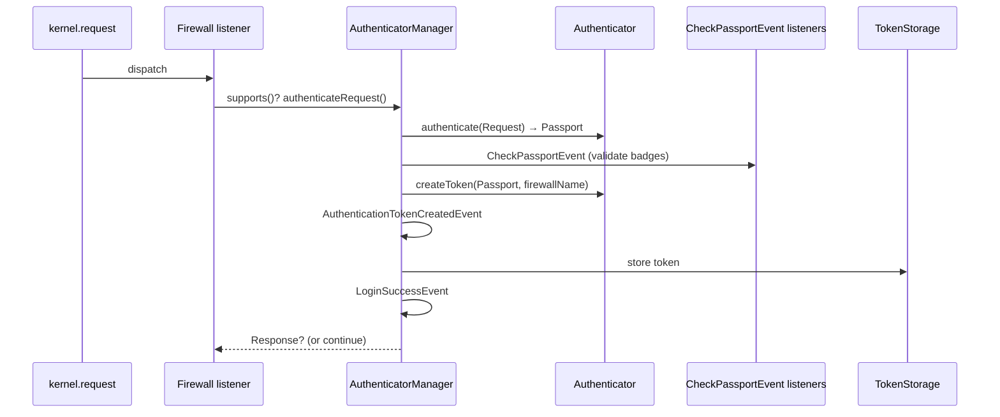

# Authentication

!!! tip "In a nutshell"
    Authentication answers *"who is making this request?"*. In Symfony 8 there is
    one system: an **authenticator** builds a **Passport** of badges, listeners
    validate them on `CheckPassportEvent`, then a **token** is stored.
    Exam hook: there is no `enable_authenticator_manager` flag anymore — it *is*
    how security works.

!!! example "Real-world analogy"
    Authentication is showing your ID at the gate. You hand over a credential —
    the **Passport** of badges — the guard checks it against the records
    (`CheckPassportEvent` listeners), and if it holds up you get a wristband (the
    **token**) that proves who you are for the rest of your visit.

!!! abstract "Learning objectives"
    By the end of this chapter you can:

    - [ ] Trace how a request becomes an authenticated `TokenInterface`.
    - [ ] Name the classes and events of the authenticator manager flow.
    - [ ] Distinguish **stateful** from **stateless** firewalls and entry points.

    **Syllabus:** `Security → Authentication` ·
    **Level:** Expert ·
    **Est. time:** 35 min ·
    **Prerequisites:** [Event Dispatcher](../architecture/events.md) ·
    [HTTP Cookies & Sessions](../http/cookies.md)

---

## Theory

**Authentication** answers *"who is making this request?"*. In Symfony 8 it is
handled exclusively by the **authenticator-based system**: the legacy Guard and
the old authentication-provider system have been removed, and there is no
`enable_authenticator_manager` flag anymore — it is simply how security works.

The pipeline has four moving parts:

| Part | Role |
|---|---|
| **Firewall** | A `kernel.request` listener that selects the active firewall |
| **Authenticator** | Turns the request into a **Passport** |
| **Passport + badges** | Carries the user and credentials to be verified |
| **Token** | The authenticated result, stored in the token storage |

An **authenticated token** (`Symfony\Component\Security\Core\Authentication\Token\TokenInterface`)
holds the `UserInterface`, the firewall name and the roles. Once it is in the
`TokenStorageInterface`, the user is "logged in" for that request.

```php
// TokenStorageInterface holds the authenticated TokenInterface
$token = $tokenStorage->getToken();     // ?TokenInterface
$user  = $token?->getUser();            // ?UserInterface
$roles = $token?->getRoleNames() ?? []; // roles carried by the token, e.g. ['ROLE_USER']
```

!!! question "Predict first"
    A request hits a `lazy` firewall but the controller never reads the user.
    Does the authenticator actually run?

??? note "Reveal"
    No. `lazy: true` defers authentication until the token is *read*
    (`getUser()`/`is_granted()`). If nothing reads it, the `AuthenticatorManager`
    never runs and no session is loaded — that is the whole point of laziness.

## Deep Dive — how it works internally

### From request to token

The `Firewall` listener (`Symfony\Bundle\SecurityBundle\Debug\...` → really
`Symfony\Component\Security\Http\Firewall`) runs early on `kernel.request`. It
asks the `FirewallMap` which firewall matches, then runs that firewall's
**authenticators** through the `AuthenticatorManagerInterface`
(`Symfony\Component\Security\Http\Authentication\AuthenticatorManager`).



Step by step:

1. **`supports()`** — each authenticator returns `true`/`false`/`null`.
   `null` means "maybe, run me lazily". If none support the request, the
   request continues unauthenticated.
2. **`authenticate(Request)`** — the authenticator builds a **Passport**
   (`Symfony\Component\Security\Http\Authenticator\Passport\Passport`) with a
   `UserBadge` and, usually, credentials.
3. **`CheckPassportEvent`** — listeners validate each badge:
   `UserProviderListener` resolves the user, `CheckCredentialsListener` verifies
   `PasswordCredentials`/`CustomCredentials`, `CsrfProtectionListener` checks the
   `CsrfTokenBadge`, `UserCheckerListener` runs the user checker,
   `PasswordMigratingListener` handles the `PasswordUpgradeBadge`.
4. **`createToken(Passport, $firewallName)`** — produces the `TokenInterface`
   (e.g. `UsernamePasswordToken` or `PostAuthenticationToken`).
5. **`AuthenticationTokenCreatedEvent`** — last chance to swap/decorate the token.
6. The token is stored in `TokenStorageInterface`.
7. **`LoginSuccessEvent`** fires; `onAuthenticationSuccess()` may return a
   redirect `Response`. On error, `LoginFailureEvent` fires and
   `onAuthenticationFailure()` may return a `Response`.

!!! note "Source reference"
    `Symfony\Component\Security\Http\Authentication\AuthenticatorManager::authenticate()`
    — [symfony/symfony `8.0`](https://github.com/symfony/symfony/blob/8.0/src/Symfony/Component/Security/Http/Authentication/AuthenticatorManager.php).

### Stateful vs stateless

- **Stateful** (the default for web firewalls): after login the token is
  serialized into the **session** by the `ContextListener`
  (`Symfony\Component\Security\Http\Firewall\ContextListener`). On the next
  request the token is restored and `refreshUser()` reloads the user from its
  provider. This is why `UserInterface` must serialize cleanly (see
  [Users](users.md)).
- **Stateless** (`stateless: true`, typical for APIs): **no session is written**,
  the token lives only for the current request, and every request must
  re-authenticate (e.g. via an access-token authenticator). `ContextListener`
  is not registered.

### Entry points

When an **unauthenticated** user hits a protected resource, the
`AuthenticationEntryPointInterface`
(`Symfony\Component\Security\Http\EntryPoint\AuthenticationEntryPointInterface`)
decides *how to start* authentication — e.g. redirect to a login form, or return
`401` with a `WWW-Authenticate` header. If a firewall has **more than one**
authenticator that is also an entry point, you **must** name one explicitly via
`entry_point:` in `security.yaml`, or the container throws.

### Null behavior

Before any authenticator runs — and forever on a truly anonymous request — there
is **no token** in the `TokenStorageInterface`, so `Security::getUser()` returns
**`null`** (and `getToken()` can itself be `null` on a lazy firewall whose token
was never read). This is by design: "not logged in" is the *absence* of a user,
not an exception.

The classic bug is assuming `getUser()` always hands back a user:

```php
$user = $security->getUser();                     // ?UserInterface — may be null
$name = $user->getUserIdentifier();               // fatal on an anonymous request
$name = $user?->getUserIdentifier() ?? 'guest';   // nullsafe + fallback
```

Guard with `?->`, `??`, or an earlier `#[IsGranted('IS_AUTHENTICATED_FULLY')]` /
`denyAccessUnlessGranted()` so `$user` is guaranteed non-null past that point.

!!! note "Null in real life"
    `null` here is the visitor who walked in without ever stopping at the desk —
    there is no wristband to read, so asking "what's their name?" gets you nothing.

!!! info "Expert note"
    `supports()` returning `null` is not "no" — it means "authenticate me
    lazily". Stateless authenticators (e.g. `access_token`) return `null` so the
    manager only invokes them when a token is actually needed, avoiding a wasted
    credential check on every anonymous request.

??? example "Debugging story"
    **Symptom:** after switching an API firewall to `stateless: true`, clients
    appeared "logged out" on every request. **Diagnosis:** `php bin/console
    debug:firewall api` confirmed no `ContextListener` was registered — expected
    for stateless. The real bug was client code relying on the session cookie that
    a stateless firewall never sets, so each request arrived with no credential.
    **Fix:** send the bearer token on *every* request and let the
    `AccessTokenAuthenticator` re-authenticate. **Avoid:** read "stateless" as
    "must carry its own credential each time", never "remembers me".

??? abstract "Source-code tour"
    - `Symfony\Component\Security\Http\Firewall` — the `kernel.request` listener
      that selects the active firewall via `FirewallMap`.
    - `Symfony\Component\Security\Http\Authentication\AuthenticatorManager` — runs
      `supports()`/`authenticate()`, dispatches the events, stores the token.
    - `Symfony\Component\Security\Http\Authenticator\Passport\Passport` — the badge
      container returned by `authenticate()`.
    - `Symfony\Component\Security\Core\Authentication\Token\Storage\TokenStorage`
      — holds the authenticated `TokenInterface` for the request.
    - `CheckPassportEvent` listeners (`UserProviderListener`,
      `CheckCredentialsListener`, `CsrfProtectionListener`) resolve the badges
      before `createToken()` runs.

## Configuration & code

=== "YAML"

    ```yaml
    # config/packages/security.yaml
    security:
        firewalls:
            main:
                lazy: true            # authenticate only when the token is needed
                provider: app_users
                form_login:
                    login_path: app_login
                    check_path: app_login
                logout:
                    path: app_logout
            api:
                pattern: ^/api
                stateless: true       # no session; re-auth every request
                access_token:
                    token_handler: App\Security\AccessTokenHandler
    ```

=== "PHP Attributes"

    ```php
    <?php
    declare(strict_types=1);

    namespace App\Controller;

    use Symfony\Bundle\FrameworkBundle\Controller\AbstractController;
    use Symfony\Bundle\SecurityBundle\Security;
    use Symfony\Component\HttpFoundation\Response;
    use Symfony\Component\Routing\Attribute\Route;

    final class ProfileController extends AbstractController
    {
        #[Route('/profile', name: 'profile')]
        public function show(Security $security): Response
        {
            // The authenticated token/user, or null if anonymous.
            $user = $security->getUser();

            return $this->render('profile.html.twig', ['user' => $user]);
        }
    }
    ```

=== "Console"

    ```console
    $ php bin/console debug:firewall main
    $ php bin/console debug:config security
    ```

## Best practices & anti-patterns

| ✅ Do | ❌ Avoid |
|---|---|
| Use `lazy: true` on interactive firewalls | Forcing eager auth on every request |
| `stateless: true` for token APIs | Writing sessions for stateless APIs |
| Name `entry_point` when >1 exists | Leaving the entry point ambiguous |
| Read the user via `Security::getUser()` | Reaching into `TokenStorage` in controllers |

## When (not) to use it / alternatives

Every protected app needs authentication. The *shape* varies: interactive apps
use `form_login` (stateful, session-backed); machine-to-machine APIs use
`access_token`/`json_login` with `stateless: true`. For a custom flow, write a
[custom authenticator](authenticators.md).

!!! danger "Certification traps"
    - There is **no `enable_authenticator_manager`** in Symfony 8 — it was the
      only option in 7.x and is now removed entirely.
    - `supports()` returning **`null`** means "authenticate lazily", not "no".
    - Badges are validated on **`CheckPassportEvent`**, not inside
      `authenticate()` — that method only *builds* the passport.
    - Stateless firewalls **do not** persist a token; the `ContextListener` is
      absent, so nothing is restored on the next request.

!!! warning "Common mistakes"
    - Verifying the password manually in `authenticate()` instead of adding a
      `PasswordCredentials` badge and letting the listener do it.
    - Two entry-point authenticators on one firewall with no `entry_point:` key
      → container compile error.

## Exercises

1. **(Advanced)** List, in order, the events the `AuthenticatorManager`
   dispatches during a successful login.
2. **(Expert)** Explain why a `stateless: true` firewall re-runs the
   authenticator on every request.

??? success "Solutions"

    **1.** `CheckPassportEvent` → `AuthenticationTokenCreatedEvent` →
    (`AuthenticationSuccessEvent`) → `LoginSuccessEvent`. On failure:
    `LoginFailureEvent`.

    **2.** With `stateless: true` the `ContextListener` is not registered, so no
    token is stored in the session. Each request starts with an empty token
    storage, forcing the authenticator to run again (e.g. re-reading the bearer
    token). This is correct for APIs where each request carries its own credential.

## Certification questions

??? question "Q1. Where are passport badges validated?"
    - [ ] A. Inside the authenticator's `authenticate()` method
    - [x] B. By listeners on `CheckPassportEvent` ✅
    - [ ] C. In `createToken()`
    - [ ] D. In the `Firewall` listener

    **Why:** `authenticate()` only builds the Passport; badge resolution and
    credential checks happen on `CheckPassportEvent`.
    **Ref:** [Passport docs](https://symfony.com/doc/current/security/custom_authenticator.html).

??? question "Q2. What does a stateless firewall NOT do?"
    - [x] A. Persist the token in the session ✅
    - [ ] B. Build a Passport
    - [ ] C. Create a token
    - [ ] D. Dispatch `CheckPassportEvent`

    **Why:** Stateless firewalls skip the `ContextListener`, so nothing is stored
    or restored between requests.
    **Ref:** [Stateless firewalls](https://symfony.com/doc/current/security.html).

??? question "Q3. `supports()` returns `null`. What happens?"
    - [ ] A. The request is rejected
    - [ ] B. The authenticator never runs
    - [x] C. The authenticator runs lazily when a token is needed ✅
    - [ ] D. A 500 is thrown

    **Why:** `null` signals "unsure — call me lazily", used by many stateless
    authenticators.
    **Ref:** [AuthenticatorInterface](https://github.com/symfony/symfony/blob/8.0/src/Symfony/Component/Security/Http/Authenticator/AuthenticatorInterface.php).

## Key takeaways

- Symfony 8 has one auth system: authenticators + passports + badges + token.
- Flow: `supports` → `authenticate` (Passport) → `CheckPassportEvent` →
  `createToken` → `AuthenticationTokenCreatedEvent` → store → `LoginSuccessEvent`.
- Stateful = session-backed token restored via `ContextListener`; stateless =
  re-auth per request.
- The entry point decides how to *start* auth for anonymous users.

## Last-minute revision

!!! tip "Cheat sheet"
    - Firewall = `kernel.request` listener → `AuthenticatorManager`.
    - Events: `CheckPassportEvent`, `AuthenticationTokenCreatedEvent`,
      `LoginSuccessEvent`, `LoginFailureEvent`.
    - `TokenInterface` in `TokenStorageInterface` = "logged in".
    - `stateless: true` ⇒ no `ContextListener`, no session token.

## Connections

- **Depends on:** [Event Dispatcher](../architecture/events.md) — the flow *is*
  events (`CheckPassportEvent`, `LoginSuccessEvent`) on the dispatcher.
- **Depends on:** [HTTP Cookies & Sessions](../http/cookies.md) — stateful tokens
  are persisted in the session between requests.
- **Reused in:** [Authenticators](authenticators.md) — the Passport/badge contract
  this flow drives.
- **Confused with:** [Authorization](authorization.md) — authentication is *who*;
  authorization is *what you may do*.

## Official References
- [Symfony docs — Security](https://symfony.com/doc/current/security.html)
- [Symfony docs — Custom authenticator](https://symfony.com/doc/current/security/custom_authenticator.html)
- [Symfony source — AuthenticatorManager](https://github.com/symfony/symfony/blob/8.0/src/Symfony/Component/Security/Http/Authentication/AuthenticatorManager.php)

## Video references

!!! tip "Watch & learn"
    These are official, continuously-updated video channels — search them for
    "Symfony security" to reinforce this chapter. We link stable channels rather than
    individual videos so the references never rot.

    - [SymfonyCasts screencasts](https://symfonycasts.com/tracks/symfony) — scripted, code-along tutorials.
    - [Symfony official YouTube](https://www.youtube.com/@SymfonyOfficial) — SymfonyCon conference talks & keynotes.
    - [Official docs for this topic](https://symfony.com/doc/current/security/custom_authenticator.html) — some Symfony doc pages embed a screencast.

## Confidence check

I'm ready when I can:

- [ ] explain **why** the authenticator system exists and what the token proves
- [ ] wire a `form_login` and an `access_token` firewall in Symfony 8
- [ ] debug an unexpected "logout" on a `stateless: true` firewall
- [ ] spot that `supports()` returning `null` means "lazy", not "no"
- [ ] trace request → Passport → `CheckPassportEvent` → token internally

---

<small>Related: [Authenticators, Passports & Badges](authenticators.md) ·
[Firewalls](firewalls.md) · [Authorization](authorization.md) · [Users](users.md)</small>
