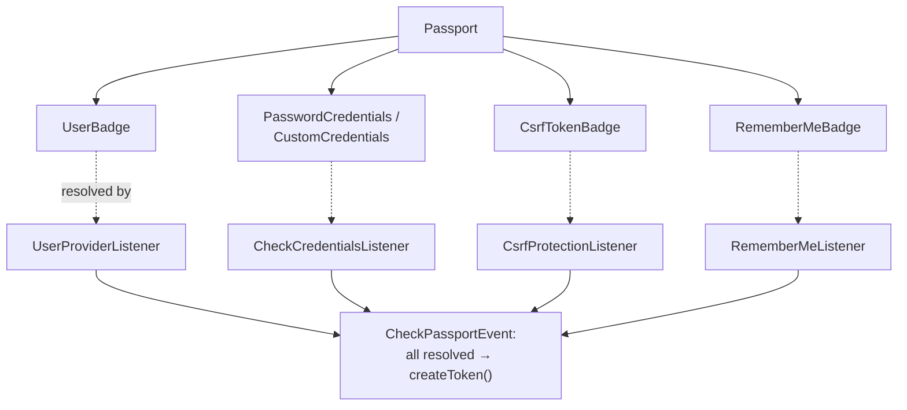
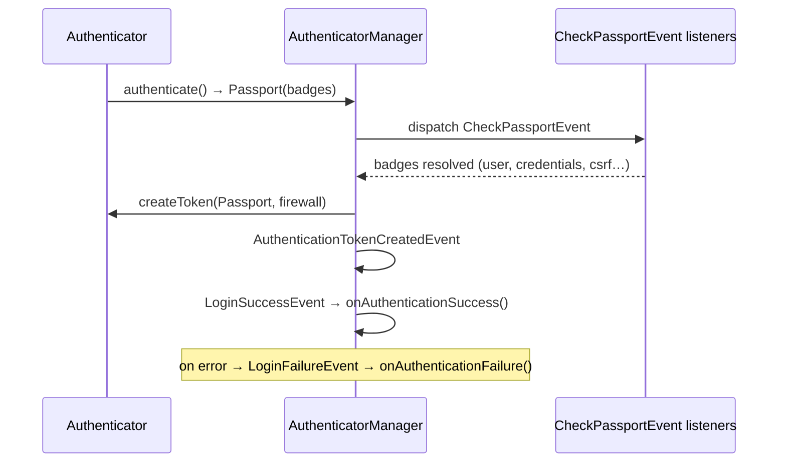

# Authenticators, Passports & Badges

!!! tip "In a nutshell"
    Un authenticator transforme une request en token en construisant un
    **Passport** de **badges** ; il ne vérifie jamais lui-même les credentials —
    cela se produit sur `CheckPassportEvent`.
    Point d'examen : les credentials (`PasswordCredentials`) vivent dans
    `Passport\Credentials`, tandis que `UserBadge`/`CsrfTokenBadge`/`RememberMeBadge`
    vivent dans `Passport\Badge`.

!!! example "Real-world analogy"
    Un authenticator est l'employé qui constitue votre dossier au guichet. Il
    rassemble vos documents dans une seule chemise — le **Passport** de
    **badges** (pièce d'identité, justificatif de domicile, signature) — mais ne
    vérifie rien lui-même. Un back-office (les listeners de
    `CheckPassportEvent`) contrôle chaque document avant la délivrance de votre
    laissez-passer.

!!! abstract "Learning objectives"
    À la fin de ce chapitre, vous saurez :

    - [ ] Écrire un authenticator personnalisé implémentant le contrat complet.
    - [ ] Construire un `Passport` avec les bons badges et credentials.
    - [ ] Choisir entre les authenticators form/JSON/access-token.

    **Syllabus:** `Security → Authenticators` ·
    **Level:** Expert ·
    **Est. time:** 40 min ·
    **Prerequisites:** [Authentication](authentication.md) · [Users](users.md) ·
    [Password Hashers](password-hashers.md)

---

## Theory

Un **authenticator** transforme une request en token authentifié. Dans
Symfony 8, chaque authenticator implémente
`Symfony\Component\Security\Http\Authenticator\AuthenticatorInterface` :

```php
public function supports(Request $request): ?bool;
public function authenticate(Request $request): Passport;
public function createToken(Passport $passport, string $firewallName): TokenInterface;
public function onAuthenticationSuccess(Request $r, TokenInterface $t, string $fw): ?Response;
public function onAuthenticationFailure(Request $r, AuthenticationException $e): ?Response;
```

`authenticate()` retourne un **Passport** — un conteneur de **badges**
décrivant qui est l'utilisateur et ce qui doit être vérifié. Il ne vérifie
**rien** lui-même ; la résolution des badges a lieu sur `CheckPassportEvent`.

```php
public function authenticate(Request $request): Passport
{
    // build only — badge verification happens later, on CheckPassportEvent
    return new Passport(
        new UserBadge($request->request->getString('email')),
        new PasswordCredentials($request->request->getString('password')),
    );
}
```

!!! question "Predict first"
    Votre authenticator construit un `Passport` avec un `UserBadge`, mais vous
    oubliez d'ajouter le `CsrfTokenBadge` sur un form login. Que se passe-t-il à
    la soumission ?

??? note "Reveal"
    Le login *réussit*, sans aucune protection CSRF. Les badges ne sont vérifiés
    que s'ils sont présents — il n'y a pas de CSRF implicite pour les
    authenticators personnalisés. L'absence du contrôle du
    `CsrfProtectionListener` signifie qu'un POST cross-site forgé pourrait
    connecter la victime. Ajoutez toujours le `CsrfTokenBadge` aux logins qui
    modifient l'état.

## Deep Dive — how it works internally

### Passport and badges

Un `Symfony\Component\Security\Http\Authenticator\Passport\Passport` regroupe :

- un **`UserBadge`** — l'identifiant + un user loader optionnel ;
- des **credentials** — généralement `PasswordCredentials` (le mot de passe en
  clair à vérifier) ou `CustomCredentials` (votre propre callback) ;
- des badges optionnels : `CsrfTokenBadge`, `RememberMeBadge`,
  `PasswordUpgradeBadge`, `PreAuthenticatedUserBadge`.

Utilisez `SelfValidatingPassport` lorsqu'il n'y a **aucun credential à
vérifier** (p. ex. un API token valide identifie déjà l'utilisateur) — il ne
requiert qu'un `UserBadge`.

```php
// full Passport: UserBadge + credentials + optional badges
new Passport(
    new UserBadge('alice@example.com'),
    new PasswordCredentials($plaintext),  // or: new CustomCredentials(fn ($cred, $user) => ..., $apiKey)
    [
        new CsrfTokenBadge('authenticate', $csrfToken),
        new RememberMeBadge(),
        new PasswordUpgradeBadge($plaintext),  // rehash on login
    ],
);

// SelfValidatingPassport: no credentials to check — a UserBadge is enough
new SelfValidatingPassport(new UserBadge('api-client'), [new PreAuthenticatedUserBadge()]);
```

| Badge (FQCN suffix) | Résolu par | Rôle |
|---|---|---|
| `Badge\UserBadge` | `UserProviderListener` / `CheckCredentialsListener` | Charger l'utilisateur |
| `Credentials\PasswordCredentials` | `CheckCredentialsListener` | Vérifier le mot de passe |
| `Credentials\CustomCredentials` | `CheckCredentialsListener` | Vérifier via un callback |
| `Badge\CsrfTokenBadge` | `CsrfProtectionListener` | Valider le token CSRF |
| `Badge\RememberMeBadge` | `RememberMeListener` | Activer le cookie remember-me |
| `Badge\PasswordUpgradeBadge` | `PasswordMigratingListener` | Re-hasher au login |

Un `Passport` est une **composition** de badges ; sur `CheckPassportEvent`, un
listener dédié résout chacun d'eux avant que le passport ne soit accepté :



!!! note "Source reference"
    `Symfony\Component\Security\Http\Authenticator\AbstractLoginFormAuthenticator`
    et `Passport` —
    [symfony/symfony `8.0`](https://github.com/symfony/symfony/blob/8.0/src/Symfony/Component/Security/Http/Authenticator/AbstractLoginFormAuthenticator.php).

### The event flow



Un badge **non résolu** est un bug : `Passport::checkIfCompletelyResolved()`
lève une exception si un badge n'a jamais été marqué comme résolu, ce qui vous
empêche d'oublier de valider un credential.

### Built-in authenticators

Vous les écrivez rarement de zéro — configurez-les dans `security.yaml` :

- **`form_login`** → `FormLoginAuthenticator` (session, CSRF, redirection).
  Étendez `AbstractLoginFormAuthenticator` pour un flux de formulaire
  personnalisé ; il implémente aussi l'entry point (redirection vers
  `getLoginUrl()`).
- **`json_login`** → `JsonLoginAuthenticator` (credentials dans un corps JSON).
- **`access_token`** → `AccessTokenAuthenticator` (bearer token + un
  `token_handler` retournant un `UserBadge` ; généralement un
  `SelfValidatingPassport`).
- **`http_basic`**, **`login_link`**, **`remember_me`** — configurés, pas codés.

```yaml
security:
    firewalls:
        main:
            form_login: ~      # FormLoginAuthenticator (session, CSRF, redirect to getLoginUrl())
            # json_login: ~    # JsonLoginAuthenticator (credentials in a JSON body)
            remember_me: { secret: '%kernel.secret%' }
        api:
            pattern: ^/api
            stateless: true
            access_token:      # AccessTokenAuthenticator → SelfValidatingPassport
                token_handler: App\Security\AccessTokenHandler  # returns a UserBadge
        docs:
            pattern: ^/docs
            http_basic: ~      # also available, config-only: login_link
```

### `AbstractAuthenticator` and `AbstractLoginFormAuthenticator`

`AbstractAuthenticator` ne fournit qu'un seul comportement par défaut :
`createToken()` retournant un `PostAuthenticationToken` (les sous-classes comme
`FormLoginAuthenticator` le redéfinissent pour retourner un
`UsernamePasswordToken`) ; il n'implémente **pas**
`onAuthenticationFailure()`. `AbstractLoginFormAuthenticator` ajoute
`supports()` (POST vers le check path), l'entry point (`start()`) via la
méthode abstraite `getLoginUrl()`, et un `onAuthenticationFailure()` par défaut
qui redirige vers la page de login — vous implémentez `authenticate()`,
`getLoginUrl()` et `onAuthenticationSuccess()`.

### Null behavior

Un `UserBadge` peut être construit **sans user loader** — juste avec
l'identifiant. Ce loader `null` est délibéré : il indique au
`UserProviderListener` de se rabattre sur le provider configuré du firewall. Si
vous passez *effectivement* un loader et qu'il retourne `null`, le badge reste
**non résolu** et `Passport::checkIfCompletelyResolved()` lève une exception —
un utilisateur introuvable se manifeste par une `AuthenticationException`,
jamais par un user `null` silencieux sur le token.

```php
new UserBadge($email);                                            // null loader → use the provider
new UserBadge($email, fn (string $id): ?UserInterface => $repo->find($id)); // may be null → error
```

Il n'existe donc pas de token portant un user `null` issu d'un passport
réussi : soit l'utilisateur est résolu, soit l'authentication échoue.

!!! note "Null in real life"
    Un badge avec un loader `null` est un formulaire de demande où ne figure que
    votre nom — l'employé vous cherche dans l'annuaire. Si la recherche ne
    trouve personne, la demande est rejetée, pas tamponnée en blanc.

!!! info "Expert note"
    `Passport::checkIfCompletelyResolved()` est votre filet de sécurité : chaque
    badge doit être marqué comme résolu par *un* listener de
    `CheckPassportEvent`, faute de quoi le passport est rejeté. C'est pourquoi
    ajouter un badge sans listener correspondant (p. ex. un badge personnalisé
    pour lequel vous n'avez jamais écrit de listener) fait échouer
    l'authentication — le silence n'est pas un succès.

??? example "Debugging story"
    **Symptôme :** un authenticator SSO maison « connectait » l'utilisateur,
    mais `getUser()` retournait le mauvais compte sous charge.
    **Diagnostic :** `authenticate()` appelait le fournisseur d'identité *et*
    résolvait le `UserBadge` avec une closure capturant une variable partagée
    liée à la request, si bien que des requests concurrentes mélangeaient les
    utilisateurs. **Correctif :** construire `new UserBadge($identifier)` avec
    un loader *pur* (sans état mutable capturé), en laissant
    `UserProviderListener` le résoudre sur `CheckPassportEvent`.
    **À éviter :** ne faites jamais de résolution d'identité avec de l'état
    partagé dans `authenticate()` — construisez un passport et laissez les
    listeners le résoudre.

??? abstract "Source-code tour"
    - `Symfony\Component\Security\Http\Authenticator\AuthenticatorInterface` — le
      contrat à cinq méthodes (`supports`/`authenticate`/`createToken`/success/failure).
    - `...\Authenticator\AbstractLoginFormAuthenticator` — ajoute `supports()`,
      l'entry point (`start()`) et une redirection d'échec par défaut.
    - `...\Authenticator\Passport\Passport` et `SelfValidatingPassport` — les
      conteneurs de badges ; le second ne porte qu'un `UserBadge`.
    - `...\Authenticator\Passport\Badge\UserBadge` +
      `...\EventListener\UserProviderListener` — comment l'identifiant devient un
      utilisateur.
    - `...\Authenticator\Passport\Credentials\PasswordCredentials` +
      `CheckCredentialsListener` — là où le mot de passe est réellement vérifié.

## Configuration & code

=== "PHP Attributes"

    ```php
    <?php
    declare(strict_types=1);

    namespace App\Security;

    use Symfony\Component\HttpFoundation\RedirectResponse;
    use Symfony\Component\HttpFoundation\Request;
    use Symfony\Component\HttpFoundation\Response;
    use Symfony\Component\Routing\Generator\UrlGeneratorInterface;
    use Symfony\Component\Security\Core\Authentication\Token\TokenInterface;
    use Symfony\Component\Security\Http\Authenticator\AbstractLoginFormAuthenticator;
    use Symfony\Component\Security\Http\Authenticator\Passport\Badge\CsrfTokenBadge;
    use Symfony\Component\Security\Http\Authenticator\Passport\Badge\RememberMeBadge;
    use Symfony\Component\Security\Http\Authenticator\Passport\Badge\UserBadge;
    use Symfony\Component\Security\Http\Authenticator\Passport\Credentials\PasswordCredentials;
    use Symfony\Component\Security\Http\Authenticator\Passport\Passport;

    final class LoginFormAuthenticator extends AbstractLoginFormAuthenticator
    {
        public function __construct(private readonly UrlGeneratorInterface $urls) {}

        public function authenticate(Request $request): Passport
        {
            $email = (string) $request->request->get('email', '');

            return new Passport(
                new UserBadge($email),                                   // load the user
                new PasswordCredentials((string) $request->request->get('password', '')),
                [
                    new CsrfTokenBadge('authenticate', (string) $request->request->get('_csrf_token')),
                    new RememberMeBadge(),
                ],
            );
        }

        protected function getLoginUrl(Request $request): string
        {
            return $this->urls->generate('app_login');
        }

        public function onAuthenticationSuccess(Request $r, TokenInterface $t, string $fw): ?Response
        {
            return new RedirectResponse($this->urls->generate('dashboard'));
        }
    }
    ```

=== "YAML"

    ```yaml
    # config/packages/security.yaml
    security:
        firewalls:
            main:
                lazy: true
                provider: app_users
                custom_authenticators:
                    - App\Security\LoginFormAuthenticator
                remember_me:
                    secret: '%kernel.secret%'
                    lifetime: 604800
            api:
                pattern: ^/api
                stateless: true
                access_token:
                    token_handler: App\Security\AccessTokenHandler
    ```

=== "Access token handler"

    ```php
    <?php
    declare(strict_types=1);

    namespace App\Security;

    use Symfony\Component\Security\Core\Exception\BadCredentialsException;
    use Symfony\Component\Security\Http\AccessToken\AccessTokenHandlerInterface;
    use Symfony\Component\Security\Http\Authenticator\Passport\Badge\UserBadge;

    final class AccessTokenHandler implements AccessTokenHandlerInterface
    {
        public function __construct(private readonly TokenRepository $tokens) {}

        public function getUserBadgeFrom(string $accessToken): UserBadge
        {
            $token = $this->tokens->findValid($accessToken)
                ?? throw new BadCredentialsException('Invalid token.');

            return new UserBadge($token->getUserIdentifier());
        }
    }
    ```

## Best practices & anti-patterns

| ✅ Do | ❌ Avoid |
|---|---|
| Ajouter `PasswordCredentials`, laisser le listener vérifier | Appeler `verify()` dans `authenticate()` |
| `SelfValidatingPassport` pour les APIs à token | Ajouter des `PasswordCredentials` vides |
| Étendre `AbstractLoginFormAuthenticator` | Réimplémenter le form login à la main |
| Ajouter le `CsrfTokenBadge` aux form logins | Omettre le CSRF sur les logins qui modifient l'état |

## When (not) to use it / alternatives

Préférez les `form_login`/`json_login`/`access_token` intégrés — n'écrivez un
authenticator personnalisé que pour un flux réellement spécifique (p. ex. un
handshake SSO maison). Pour les APIs stateless, `access_token` + un
`token_handler` couvre la plupart des besoins sans authenticator complet.

!!! danger "Certification traps"
    - `authenticate()` **construit** le Passport ; il ne vérifie jamais les
      credentials — c'est le rôle de `CheckPassportEvent`.
    - `PasswordCredentials` vit dans le namespace **`Credentials`** ;
      `CsrfTokenBadge`/`RememberMeBadge`/`UserBadge` vivent dans **`Badge`**.
    - Utilisez **`SelfValidatingPassport`** quand il n'y a pas de mot de passe à
      vérifier ; un `Passport` classique exige des credentials.
    - Un badge non résolu provoque un **échec** — le passport doit être
      entièrement résolu.
    - Deux authenticators avec entry point exigent un `entry_point:` explicite.

!!! warning "Common mistakes"
    - Retourner `true` depuis `supports()` pour toutes les requests, ce qui
      détourne des routes sans rapport.
    - Oublier le `CsrfTokenBadge` sur un form login, puis se demander pourquoi le
      CSRF n'est pas appliqué.

## Exercises

1. **(Advanced)** Construisez un `Passport` pour un formulaire de login avec
   CSRF et remember-me.
2. **(Expert)** Expliquez pourquoi un flux access-token utilise
   `SelfValidatingPassport`.

??? success "Solutions"

    **1.** Voir `LoginFormAuthenticator::authenticate()` ci-dessus — `UserBadge` +
    `PasswordCredentials` + `[CsrfTokenBadge, RememberMeBadge]`.

    **2.** Un bearer token valide prouve déjà l'identité ; il n'y a aucun mot de
    passe à vérifier. `SelfValidatingPassport` ne porte que le `UserBadge`, donc
    le `CheckCredentialsListener` n'a rien à contrôler et le passport se résout
    avec le seul chargement de l'utilisateur.

## Certification questions

??? question "Q1. What does `authenticate()` return?"
    - [ ] A. A `TokenInterface`
    - [x] B. A `Passport` ✅
    - [ ] C. A `Response`
    - [ ] D. A `UserInterface`

    **Why:** `authenticate()` construit un Passport ; le token est produit plus
    tard par `createToken()`.
    **Ref:** [Custom authenticator](https://symfony.com/doc/current/security/custom_authenticator.html).

??? question "Q2. Which passport suits a valid-API-token flow with no password?"
    - [ ] A. `Passport` with empty `PasswordCredentials`
    - [x] B. `SelfValidatingPassport` with a `UserBadge` ✅
    - [ ] C. `PreAuthenticatedToken`
    - [ ] D. `UsernamePasswordToken`

    **Why:** Aucun credential à vérifier ⇒ un passport auto-validant portant
    uniquement le user badge.
    **Ref:** [Passport](https://symfony.com/doc/current/security/custom_authenticator.html#the-passport).

??? question "Q3. In which namespace is `PasswordCredentials`?"
    - [ ] A. `…\Passport\Badge`
    - [x] B. `…\Passport\Credentials` ✅
    - [ ] C. `…\Token`
    - [ ] D. `…\EntryPoint`

    **Why:** Les credentials (`PasswordCredentials`, `CustomCredentials`) vivent
    sous `Passport\Credentials` ; les autres badges sous `Passport\Badge`.
    **Ref:** [Security source](https://github.com/symfony/symfony/tree/8.0/src/Symfony/Component/Security/Http/Authenticator/Passport).

## Key takeaways

- Contrat : `supports` / `authenticate` (Passport) / `createToken` /
  `onAuthenticationSuccess` / `onAuthenticationFailure`.
- Passport = `UserBadge` + credentials + badges optionnels ; validé sur
  `CheckPassportEvent`.
- `SelfValidatingPassport` pour les flux sans credentials (API tokens).
- Préférez les `form_login`/`json_login`/`access_token` intégrés ; étendez
  `AbstractLoginFormAuthenticator` pour les formulaires personnalisés.

## Last-minute revision

!!! tip "Cheat sheet"
    - Badges : `UserBadge`, `CsrfTokenBadge`, `RememberMeBadge`,
      `PasswordUpgradeBadge`, `PreAuthenticatedUserBadge` (dans `Badge`).
    - Credentials : `PasswordCredentials`, `CustomCredentials` (dans `Credentials`).
    - `authenticate()` construit ; `CheckPassportEvent` vérifie.
    - `access_token` exige un `token_handler` → `UserBadge`.

## Connections

- **Depends on:** [Authentication](authentication.md) — le flux de
  l'`AuthenticatorManager` qui invoque ce contrat.
- **Depends on:** [Event Dispatcher](../architecture/events.md) — les badges
  sont résolus par des listeners sur `CheckPassportEvent`.
- **Reused in:** [Password Hashers](password-hashers.md) — le badge
  `PasswordCredentials` est vérifié avec le hasher configuré.
- **Confused with:** [Providers](providers.md) — l'authenticator *construit* le
  passport ; le provider ne fait que *charger* l'utilisateur derrière le
  `UserBadge`.

## Official References
- [Symfony docs — Custom authenticator](https://symfony.com/doc/current/security/custom_authenticator.html)
- [Symfony docs — Access token authentication](https://symfony.com/doc/current/security/access_token.html)
- [Symfony source — Passport](https://github.com/symfony/symfony/tree/8.0/src/Symfony/Component/Security/Http/Authenticator/Passport)

## Video references

!!! tip "Watch & learn"
    Voici des chaînes vidéo officielles, mises à jour en continu — cherchez-y
    "Symfony security" pour consolider ce chapitre. Nous lions des chaînes
    stables plutôt que des vidéos individuelles afin que les références ne
    périment jamais.

    - [SymfonyCasts screencasts](https://symfonycasts.com/tracks/symfony) — des tutoriels scénarisés à suivre en codant.
    - [Symfony official YouTube](https://www.youtube.com/@SymfonyOfficial) — conférences et keynotes SymfonyCon.
    - [Official docs for this topic](https://symfony.com/doc/current/security/custom_authenticator.html) — certaines pages de la doc Symfony intègrent un screencast.

## Confidence check

Je suis prêt quand je peux :

- [ ] expliquer **pourquoi** `authenticate()` ne fait que construire un Passport
  et ne vérifie rien
- [ ] implémenter un authenticator personnalisé avec les bons badges dans
  Symfony 8
- [ ] déboguer un échec « unresolved badge » / CSRF manquant
- [ ] repérer quand `SelfValidatingPassport` est le bon choix face à un
  `Passport` classique
- [ ] nommer le listener qui résout chaque badge sur `CheckPassportEvent`

---

<small>Related: [Authentication](authentication.md) · [Users](users.md) ·
[Password Hashers](password-hashers.md) · [Firewalls](firewalls.md)</small>
