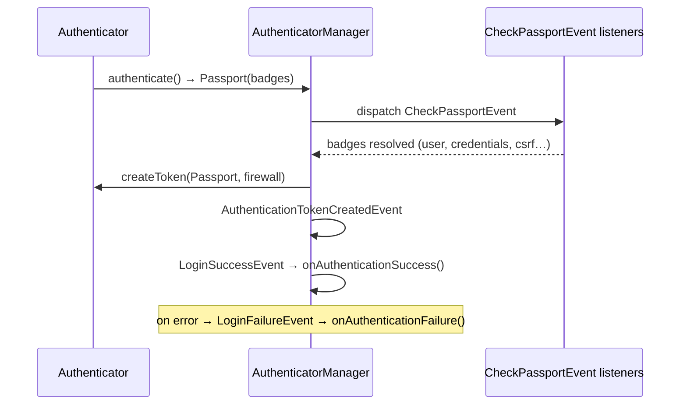

# Authenticators, Passports & Badges

!!! tip "In a nutshell"
    An authenticator turns a request into a token by building a **Passport** of
    **badges**; it never verifies credentials itself — that happens on
    `CheckPassportEvent`.
    Exam hook: credentials (`PasswordCredentials`) live in `Passport\Credentials`,
    while `UserBadge`/`CsrfTokenBadge`/`RememberMeBadge` live in `Passport\Badge`.

!!! abstract "Learning objectives"
    By the end of this chapter you can:

    - [ ] Write a custom authenticator implementing the full contract.
    - [ ] Build a `Passport` with the right badges and credentials.
    - [ ] Choose between form/JSON/access-token authenticators.

    **Syllabus:** `Security → Authenticators` ·
    **Level:** Expert ·
    **Est. time:** 40 min ·
    **Prerequisites:** [Authentication](authentication.md) · [Users](users.md) ·
    [Password Hashers](password-hashers.md)

---

## Theory

An **authenticator** turns a request into an authenticated token. In Symfony 8
every authenticator implements
`Symfony\Component\Security\Http\Authenticator\AuthenticatorInterface`:

```php
public function supports(Request $request): ?bool;
public function authenticate(Request $request): Passport;
public function createToken(Passport $passport, string $firewallName): TokenInterface;
public function onAuthenticationSuccess(Request $r, TokenInterface $t, string $fw): ?Response;
public function onAuthenticationFailure(Request $r, AuthenticationException $e): ?Response;
```

`authenticate()` returns a **Passport** — a container of **badges** describing
who the user is and what must be verified. It does **not** verify anything
itself; badge resolution happens on `CheckPassportEvent`.

## Deep Dive — how it works internally

### Passport and badges

A `Symfony\Component\Security\Http\Authenticator\Passport\Passport` bundles:

- a **`UserBadge`** — the identifier + an optional user loader;
- **credentials** — usually `PasswordCredentials` (plaintext to verify) or
  `CustomCredentials` (your own callback);
- optional badges: `CsrfTokenBadge`, `RememberMeBadge`, `PasswordUpgradeBadge`,
  `PreAuthenticatedUserBadge`.

Use `SelfValidatingPassport` when there are **no credentials to check** (e.g. a
valid API token already identifies the user) — it needs only a `UserBadge`.

| Badge (FQCN suffix) | Resolved by | Purpose |
|---|---|---|
| `Badge\UserBadge` | `UserProviderListener` / `CheckCredentialsListener` | Load the user |
| `Credentials\PasswordCredentials` | `CheckCredentialsListener` | Verify password |
| `Credentials\CustomCredentials` | `CheckCredentialsListener` | Verify via callback |
| `Badge\CsrfTokenBadge` | `CsrfProtectionListener` | Validate CSRF token |
| `Badge\RememberMeBadge` | `RememberMeListener` | Enable remember-me cookie |
| `Badge\PasswordUpgradeBadge` | `PasswordMigratingListener` | Rehash on login |

!!! note "Source reference"
    `Symfony\Component\Security\Http\Authenticator\AbstractLoginFormAuthenticator`
    and `Passport` —
    [symfony/symfony `8.0`](https://github.com/symfony/symfony/blob/8.0/src/Symfony/Component/Security/Http/Authenticator/AbstractLoginFormAuthenticator.php).

### The event flow



An **unresolved** badge is a bug: `Passport::checkIfCompletelyResolved()` throws
if any badge was never marked resolved, ensuring you cannot forget to validate a
credential.

### Built-in authenticators

You rarely write these from scratch — configure them in `security.yaml`:

- **`form_login`** → `FormLoginAuthenticator` (session, CSRF, redirect).
  Subclass `AbstractLoginFormAuthenticator` for a custom form flow; it also
  implements the entry point (redirect to `getLoginUrl()`).
- **`json_login`** → `JsonLoginAuthenticator` (credentials in a JSON body).
- **`access_token`** → `AccessTokenAuthenticator` (bearer token + a
  `token_handler` returning a `UserBadge`; typically a `SelfValidatingPassport`).
- **`http_basic`**, **`login_link`**, **`remember_me`** — configured, not coded.

### `AbstractAuthenticator` and `AbstractLoginFormAuthenticator`

`AbstractAuthenticator` provides a single default: `createToken()` returning a
`PostAuthenticationToken` (subclasses such as `FormLoginAuthenticator` override
it to return a `UsernamePasswordToken`); it does **not** implement
`onAuthenticationFailure()`. `AbstractLoginFormAuthenticator` adds `supports()`
(POST to the check path), the entry point (`start()`) via the abstract
`getLoginUrl()`, and a default `onAuthenticationFailure()` that redirects back to
the login page — you implement `authenticate()`, `getLoginUrl()` and
`onAuthenticationSuccess()`.

## Configuration & code

=== "PHP Attributes"

    ```php
    <?php
    declare(strict_types=1);

    namespace App\Security;

    use Symfony\Component\HttpFoundation\RedirectResponse;
    use Symfony\Component\HttpFoundation\Request;
    use Symfony\Component\HttpFoundation\Response;
    use Symfony\Component\Routing\Generator\UrlGeneratorInterface;
    use Symfony\Component\Security\Core\Authentication\Token\TokenInterface;
    use Symfony\Component\Security\Http\Authenticator\AbstractLoginFormAuthenticator;
    use Symfony\Component\Security\Http\Authenticator\Passport\Badge\CsrfTokenBadge;
    use Symfony\Component\Security\Http\Authenticator\Passport\Badge\RememberMeBadge;
    use Symfony\Component\Security\Http\Authenticator\Passport\Badge\UserBadge;
    use Symfony\Component\Security\Http\Authenticator\Passport\Credentials\PasswordCredentials;
    use Symfony\Component\Security\Http\Authenticator\Passport\Passport;

    final class LoginFormAuthenticator extends AbstractLoginFormAuthenticator
    {
        public function __construct(private readonly UrlGeneratorInterface $urls) {}

        public function authenticate(Request $request): Passport
        {
            $email = (string) $request->request->get('email', '');

            return new Passport(
                new UserBadge($email),                                   // load the user
                new PasswordCredentials((string) $request->request->get('password', '')),
                [
                    new CsrfTokenBadge('authenticate', (string) $request->request->get('_csrf_token')),
                    new RememberMeBadge(),
                ],
            );
        }

        protected function getLoginUrl(Request $request): string
        {
            return $this->urls->generate('app_login');
        }

        public function onAuthenticationSuccess(Request $r, TokenInterface $t, string $fw): ?Response
        {
            return new RedirectResponse($this->urls->generate('dashboard'));
        }
    }
    ```

=== "YAML"

    ```yaml
    # config/packages/security.yaml
    security:
        firewalls:
            main:
                lazy: true
                provider: app_users
                custom_authenticators:
                    - App\Security\LoginFormAuthenticator
                remember_me:
                    secret: '%kernel.secret%'
                    lifetime: 604800
            api:
                pattern: ^/api
                stateless: true
                access_token:
                    token_handler: App\Security\AccessTokenHandler
    ```

=== "Access token handler"

    ```php
    <?php
    declare(strict_types=1);

    namespace App\Security;

    use Symfony\Component\Security\Core\Exception\BadCredentialsException;
    use Symfony\Component\Security\Http\AccessToken\AccessTokenHandlerInterface;
    use Symfony\Component\Security\Http\Authenticator\Passport\Badge\UserBadge;

    final class AccessTokenHandler implements AccessTokenHandlerInterface
    {
        public function __construct(private readonly TokenRepository $tokens) {}

        public function getUserBadgeFrom(string $accessToken): UserBadge
        {
            $token = $this->tokens->findValid($accessToken)
                ?? throw new BadCredentialsException('Invalid token.');

            return new UserBadge($token->getUserIdentifier());
        }
    }
    ```

## Best practices & anti-patterns

| ✅ Do | ❌ Avoid |
|---|---|
| Add `PasswordCredentials`, let the listener verify | Calling `verify()` in `authenticate()` |
| `SelfValidatingPassport` for token APIs | Adding empty `PasswordCredentials` |
| Subclass `AbstractLoginFormAuthenticator` | Reimplementing form login by hand |
| Add `CsrfTokenBadge` to form logins | Skipping CSRF on state-changing logins |

## When (not) to use it / alternatives

Prefer built-in `form_login`/`json_login`/`access_token` — write a custom
authenticator only for a genuinely custom flow (e.g. a bespoke SSO handshake).
For stateless APIs, `access_token` + a `token_handler` covers most needs without
a full authenticator.

!!! danger "Certification traps"
    - `authenticate()` **builds** the Passport; it never verifies credentials —
      that is `CheckPassportEvent`.
    - `PasswordCredentials` lives in the **`Credentials`** namespace;
      `CsrfTokenBadge`/`RememberMeBadge`/`UserBadge` live in **`Badge`**.
    - Use **`SelfValidatingPassport`** when there is no password to check;
      a plain `Passport` requires credentials.
    - An unresolved badge causes a **failure** — the passport must be fully
      resolved.
    - Two entry-point authenticators need an explicit `entry_point:`.

!!! warning "Common mistakes"
    - Returning `true` from `supports()` for every request, hijacking unrelated
      routes.
    - Forgetting the `CsrfTokenBadge` on a form login, then wondering why CSRF is
      not enforced.

## Exercises

1. **(Advanced)** Build a `Passport` for a login form with CSRF and remember-me.
2. **(Expert)** Explain why an access-token flow uses `SelfValidatingPassport`.

??? success "Solutions"

    **1.** See `LoginFormAuthenticator::authenticate()` above — `UserBadge` +
    `PasswordCredentials` + `[CsrfTokenBadge, RememberMeBadge]`.

    **2.** A valid bearer token already proves identity; there is no password to
    verify. `SelfValidatingPassport` carries only the `UserBadge`, so the
    `CheckCredentialsListener` has nothing to check and the passport resolves
    with just user loading.

## Certification questions

??? question "Q1. What does `authenticate()` return?"
    - [ ] A. A `TokenInterface`
    - [x] B. A `Passport` ✅
    - [ ] C. A `Response`
    - [ ] D. A `UserInterface`

    **Why:** `authenticate()` builds a Passport; the token is produced later by
    `createToken()`.
    **Ref:** [Custom authenticator](https://symfony.com/doc/current/security/custom_authenticator.html).

??? question "Q2. Which passport suits a valid-API-token flow with no password?"
    - [ ] A. `Passport` with empty `PasswordCredentials`
    - [x] B. `SelfValidatingPassport` with a `UserBadge` ✅
    - [ ] C. `PreAuthenticatedToken`
    - [ ] D. `UsernamePasswordToken`

    **Why:** No credential to verify ⇒ self-validating passport carrying only the
    user badge.
    **Ref:** [Passport](https://symfony.com/doc/current/security/custom_authenticator.html#the-passport).

??? question "Q3. In which namespace is `PasswordCredentials`?"
    - [ ] A. `…\Passport\Badge`
    - [x] B. `…\Passport\Credentials` ✅
    - [ ] C. `…\Token`
    - [ ] D. `…\EntryPoint`

    **Why:** Credentials (`PasswordCredentials`, `CustomCredentials`) live under
    `Passport\Credentials`; other badges under `Passport\Badge`.
    **Ref:** [Security source](https://github.com/symfony/symfony/tree/8.0/src/Symfony/Component/Security/Http/Authenticator/Passport).

## Key takeaways

- Contract: `supports` / `authenticate` (Passport) / `createToken` /
  `onAuthenticationSuccess` / `onAuthenticationFailure`.
- Passport = `UserBadge` + credentials + optional badges; validated on `CheckPassportEvent`.
- `SelfValidatingPassport` for credential-less flows (API tokens).
- Prefer built-in `form_login`/`json_login`/`access_token`; subclass
  `AbstractLoginFormAuthenticator` for custom forms.

## Last-minute revision

!!! tip "Cheat sheet"
    - Badges: `UserBadge`, `CsrfTokenBadge`, `RememberMeBadge`,
      `PasswordUpgradeBadge`, `PreAuthenticatedUserBadge` (in `Badge`).
    - Credentials: `PasswordCredentials`, `CustomCredentials` (in `Credentials`).
    - `authenticate()` builds; `CheckPassportEvent` verifies.
    - `access_token` needs a `token_handler` → `UserBadge`.

## Official References
- [Symfony docs — Custom authenticator](https://symfony.com/doc/current/security/custom_authenticator.html)
- [Symfony docs — Access token authentication](https://symfony.com/doc/current/security/access_token.html)
- [Symfony source — Passport](https://github.com/symfony/symfony/tree/8.0/src/Symfony/Component/Security/Http/Authenticator/Passport)

---

<small>Related: [Authentication](authentication.md) · [Users](users.md) ·
[Password Hashers](password-hashers.md) · [Firewalls](firewalls.md)</small>
</content>
