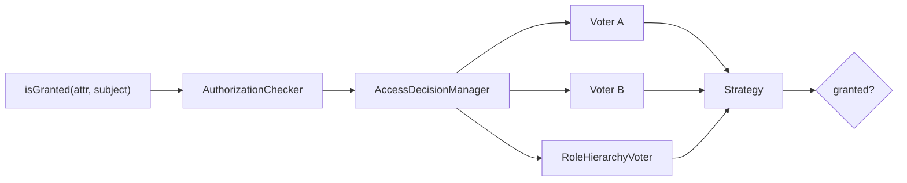

# Authorization

!!! tip "In a nutshell"
    L'authorization répond à *« ce token a-t-il le droit de faire X ? »*. Chaque
    vérification — `#[IsGranted]`, `denyAccessUnlessGranted()`, `is_granted()` en
    Twig, `access_control` — passe par `isGranted()` → `AccessDecisionManager` →
    voters.
    Piège d'examen : seul le chemin `isGranted()` peut transmettre un **subject** ;
    `access_control` est uniquement basé sur l'URL.

!!! example "Real-world analogy"
    L'authorization, ce sont les portes que votre badge ouvre. Le portail sait
    déjà *qui* vous êtes (le token) ; maintenant, chaque porte verrouillée
    demande « ce badge a-t-il le droit de passer ? ». `isGranted()`, c'est vous
    qui présentez le badge au lecteur — les **voters** derrière décident si le
    voyant passe au vert.

!!! abstract "Learning objectives"
    À la fin de ce chapitre, vous saurez :

    - [ ] Expliquer comment `isGranted()` atteint l'`AccessDecisionManager` et les voters.
    - [ ] Imposer l'accès avec `denyAccessUnlessGranted()` et `#[IsGranted]`.
    - [ ] Distinguer les vérifications de roles des vérifications attribut/voter.

    **Syllabus:** `Security → Authorization` ·
    **Level:** Expert ·
    **Est. time:** 30 min ·
    **Prerequisites:** [Authentication](authentication.md) · [Roles](roles.md)

---

## Theory

L'**authorization** répond à *« ce token a-t-il le droit de faire X ? »*. Elle
s'exécute **après** l'authentication : étant donné un `TokenInterface`
authentifié, l'application demande « **le token a-t-il l'attribut A
(optionnellement sur le subject S) ?** ».

Un **attribut** est n'importe quelle chaîne soumise au vote : un role
(`ROLE_ADMIN`), un attribut spécial (`IS_AUTHENTICATED_FULLY`, `PUBLIC_ACCESS`),
ou une permission métier (`EDIT`, `POST_VIEW`) résolue par un [voter](voters.md)
personnalisé.

Le point d'entrée unique est `AuthorizationCheckerInterface::isGranted($attribute,
$subject = null)`. Tout — `#[IsGranted]`, `denyAccessUnlessGranted()`,
`is_granted()` en Twig, `access_control` — passe par lui.

```php
// Single entry point — every check funnels through isGranted():
$authChecker->isGranted('ROLE_ADMIN');          // role attribute
$authChecker->isGranted('EDIT', $post);         // custom attribute + subject

// Same funnel from a controller:
#[IsGranted('POST_VIEW', subject: 'post')]      // declarative attribute
$this->denyAccessUnlessGranted('EDIT', $post);  // imperative, throws on failure

// Twig:  ... 
// security.yaml: access_control rules run the same voters (URL-based only)
```

!!! question "Predict first"
    Vous appelez `isGranted('ROLE_ADMIN')` sur un visiteur non connecté. Cela
    lance-t-il une exception, ou retourne-t-il une valeur ?

??? note "Reveal"
    Cela retourne `false` — aucune exception. Sans token, l'`AuthorizationChecker`
    substitue un `NullToken` et exécute quand même les voters ;
    l'`AuthenticatedVoter` refuse le role. `null` ne mord qu'*à l'intérieur* d'un
    voter, où `$token->getUser()` peut être `null`.

## Deep Dive — how it works internally

### The decision path



1. L'`AuthorizationCheckerInterface`
   (`Symfony\Component\Security\Core\Authorization\AuthorizationChecker`)
   récupère le token courant depuis la `TokenStorageInterface`.
2. Elle appelle
   `AccessDecisionManagerInterface::decide(TokenInterface $token, array $attributes, mixed $subject = null)`.
3. L'`AccessDecisionManager` parcourt chaque **voter** enregistré
   (`VoterInterface`), en collectant `ACCESS_GRANTED` (1), `ACCESS_DENIED` (-1)
   ou `ACCESS_ABSTAIN` (0).
4. Une **stratégie** (affirmative par défaut) transforme les votes en un
   `true`/`false` final. Voir [Voters & Voting Strategies](voters.md).

Les voters intégrés incluent `RoleVoter` et `RoleHierarchyVoter` (roles),
`AuthenticatedVoter` (les attributs `IS_AUTHENTICATED_*`) et
`ExpressionVoter` (expressions `allow_if`).

```yaml
# Which built-in voter handles which attribute:
access_control:
    - { path: ^/admin,   roles: ROLE_ADMIN }              # RoleVoter / RoleHierarchyVoter
    - { path: ^/profile, roles: IS_AUTHENTICATED_FULLY }  # AuthenticatedVoter
    # allow_if expressions are evaluated by ExpressionVoter:
    - { path: ^/reports, allow_if: "is_granted('ROLE_AUDITOR') and request.isSecure()" }
```

!!! note "Source reference"
    `Symfony\Component\Security\Core\Authorization\AccessDecisionManager::decide()`
    — [symfony/symfony `8.0`](https://github.com/symfony/symfony/blob/8.0/src/Symfony/Component/Security/Core/Authorization/AccessDecisionManager.php).

### Three ways to enforce

| Mécanisme | Où | Remarque |
|---|---|---|
| `#[IsGranted]` | Controller/méthode | Lance `AccessDeniedException` (→ 403) |
| `denyAccessUnlessGranted()` | Dans un controller | Même exception, impérative |
| `access_control` | `security.yaml` | Règles par motif d'URL, la première correspondance gagne |

`#[IsGranted]` est `Symfony\Component\Security\Http\Attribute\IsGranted`. Sur une
request anonyme vers une ressource protégée, l'`AccessDeniedException` lancée est
interceptée et transformée en **entry point** (redirection vers le login) si le
user n'est pas authentifié, ou en **403** s'il l'est mais n'a pas l'attribut.

```php
use Symfony\Component\Security\Http\Attribute\IsGranted;

#[IsGranted('ROLE_ADMIN')]   // throws AccessDeniedException when denied
public function dashboard(): Response
{
    // anonymous user -> AccessDeniedException -> entry point (login redirect)
    // authenticated user without ROLE_ADMIN -> 403 response
    return $this->render('admin/dashboard.html.twig');
}
```

### Roles vs attributes

- Les **roles** sont la couche grossière : des chaînes `ROLE_*` portées par le
  token, développées par la [hiérarchie de roles](roles.md), soumises au vote du
  `RoleHierarchyVoter`.
- Les **attributs + voters** sont la couche fine : des règles métier comme
  « ce user peut-il éditer *ce* post ? » qui nécessitent le **subject**. Les
  roles ne peuvent pas exprimer des règles par objet ; les voters, si.

### Null behavior

Le token peut être **absent**. Sur une request anonyme,
l'`AuthorizationChecker` lit un token `null` depuis le stockage ; plutôt que de
planter, il substitue un
**`NullToken`** (`Symfony\Component\Security\Core\Authentication\Token\NullToken`)
et vote comme d'habitude. Ainsi, `isGranted('ROLE_ADMIN')` sur un user non
connecté est un `false` propre, pas une erreur : l'`AuthenticatedVoter` refuse
les attributs `IS_AUTHENTICATED_*` pour un `NullToken`, tandis que
`PUBLIC_ACCESS` accorde toujours l'accès.

```php
// Anonymous request: storage holds null, the checker substitutes a NullToken
$authChecker->isGranted('ROLE_ADMIN');             // false — clean denial, no error
$authChecker->isGranted('IS_AUTHENTICATED_FULLY'); // false — AuthenticatedVoter denies
$authChecker->isGranted('PUBLIC_ACCESS');          // true — always granted
```

Là où `null` mord vraiment, c'est *à l'intérieur* d'un voter :
`$token->getUser()` est `null` pour un token non authentifié, donc protégez-vous
avec une vérification `instanceof` avant de toucher aux données du user (voir
[Voters](voters.md)).

!!! note "Null in real life"
    `null` ici, c'est présenter au lecteur de porte... aucun badge : le lecteur
    exécute quand même sa vérification et refuse simplement — il ne tombe pas en
    panne.

## Configuration & code

=== "PHP Attributes"

    ```php
    <?php
    declare(strict_types=1);

    namespace App\Controller;

    use App\Entity\Post;
    use Symfony\Bundle\FrameworkBundle\Controller\AbstractController;
    use Symfony\Component\HttpFoundation\Response;
    use Symfony\Component\Routing\Attribute\Route;
    use Symfony\Component\Security\Http\Attribute\IsGranted;

    #[IsGranted('ROLE_USER')]                       // class-wide guard
    final class PostController extends AbstractController
    {
        #[Route('/posts/{id}/edit', name: 'post_edit')]
        #[IsGranted('EDIT', subject: 'post')]       // voter decides on $post
        public function edit(Post $post): Response
        {
            // Imperative alternative to the attribute:
            $this->denyAccessUnlessGranted('EDIT', $post);

            return $this->render('post/edit.html.twig', ['post' => $post]);
        }
    }
    ```

=== "Twig"

    ```twig
    {# templates/post/show.html.twig #}
    
        <a href="{{ path('post_edit', {id: post.id}) }}">Edit</a>
    

    
        <a href="{{ path('admin_dashboard') }}">Admin</a>
    
    ```

=== "YAML"

    ```yaml
    # config/packages/security.yaml
    security:
        access_control:
            - { path: ^/admin, roles: ROLE_ADMIN }
            - { path: ^/profile, roles: IS_AUTHENTICATED_FULLY }
    ```

## Best practices & anti-patterns

| ✅ Do | ❌ Avoid |
|---|---|
| Utiliser des voters pour les règles par objet | Encoder la logique objet dans les noms de roles |
| `#[IsGranted]` pour protéger les controllers | Des vérifications manuelles `if ($user->isAdmin())` |
| Vérifier `is_granted()` dans les templates | Se contenter de masquer (imposez aussi côté serveur) |
| Garder des attributs sémantiques (`EDIT`) | Laisser fuiter les détails de stockage dans les attributs |

## When (not) to use it / alternatives

Utilisez les roles pour les capacités larges et `access_control` pour les règles
sur l'espace d'URL ; recourez aux [voters](voters.md) dès que la décision dépend
du **subject** ou de l'état à l'exécution. Pour des gardes déclaratives sur les
controllers, préférez `#[IsGranted]` ; utilisez `denyAccessUnlessGranted()`
quand la décision est calculée en cours d'action.

!!! danger "Certification traps"
    - `isGranted('EDIT', $post)` transmet le **subject** aux voters ;
      `access_control` **ne peut pas** transmettre de subject (il est uniquement
      basé sur l'URL).
    - Une `AccessDeniedException` pour un user **non authentifié** déclenche
      l'**entry point** (login), pas un 403 brut.
    - `#[IsGranted]` vit dans
      `Symfony\Component\Security\Http\Attribute\IsGranted` — pas dans les
      namespaces DI ou Routing.
    - `is_granted()` dans un template n'est qu'une commodité ; il ne remplace
      **pas** l'application côté serveur.

!!! warning "Common mistakes"
    - Supposer qu'`access_control` peut vérifier des permissions sur un objet —
      il ne le peut pas.
    - Oublier qu'`isGranted()` avec un token non authentifié exécute quand même
      les voters (p. ex. `PUBLIC_ACCESS` accorde ; `AuthenticatedVoter` refuse).

## Exercises

1. **(Advanced)** Protégez une action de controller pour que seuls les
   détenteurs de `ROLE_EDITOR` puissent l'atteindre, en utilisant un attribut.
2. **(Expert)** Expliquez pourquoi la permission d'édition par post doit être un
   attribut de voter, et non un role.

??? success "Solutions"

    **1.** Ajoutez `#[IsGranted('ROLE_EDITOR')]` au-dessus de la méthode (ou de
    la classe).

    **2.** Les roles sont des chaînes statiques sur le token, sans notion de
    subject. « Peut éditer *ce* post » dépend de l'instance `$post` (p. ex. la
    propriété), donc ce doit être un attribut comme `EDIT` résolu par un voter
    qui reçoit `$post` comme subject via `isGranted('EDIT', $post)`.

## Certification questions

??? question "Q1. Which check can pass a subject to voters?"
    - [x] A. `isGranted('EDIT', $post)` ✅
    - [ ] B. An `access_control` rule
    - [ ] C. `role_hierarchy`
    - [ ] D. The firewall `pattern`

    **Why:** Seul le chemin `isGranted()`/`#[IsGranted]`/`denyAccessUnlessGranted()`
    porte un subject ; `access_control` est basé sur l'URL.
    **Ref:** [Voters](https://symfony.com/doc/8.0/security/voters.html).

??? question "Q2. `#[IsGranted]` fails for an anonymous user. What happens?"
    - [ ] A. Immediate 403 always
    - [x] B. The entry point starts authentication (e.g. login redirect) ✅
    - [ ] C. 404
    - [ ] D. The request continues

    **Why:** Une `AccessDeniedException` non authentifiée est convertie en
    réponse d'entry point ; une exception authentifiée produit un 403.
    **Ref:** [Access control](https://symfony.com/doc/8.0/security.html#access-control).

??? question "Q3. Which interface does `isGranted()` ultimately delegate to?"
    - [ ] A. `AuthenticatorInterface`
    - [ ] B. `UserProviderInterface`
    - [x] C. `AccessDecisionManagerInterface` ✅
    - [ ] D. `TokenStorageInterface`

    **Why:** L'`AuthorizationChecker` lit le token puis appelle
    `AccessDecisionManager::decide()`.
    **Ref:** [AccessDecisionManager](https://github.com/symfony/symfony/blob/8.0/src/Symfony/Component/Security/Core/Authorization/AccessDecisionManager.php).

## Key takeaways

- Authorization = « ce token a-t-il l'attribut A sur le subject S ? ».
- Chemin : `isGranted()` → `AuthorizationChecker` → `AccessDecisionManager` → voters.
- Imposez l'accès via `#[IsGranted]`, `denyAccessUnlessGranted()` ou `access_control`.
- Seul le chemin impératif/attribut porte un subject ; utilisez des voters pour
  les règles par objet.

## Last-minute revision

!!! tip "Cheat sheet"
    - `#[IsGranted('ROLE_X')]` / `#[IsGranted('PERM', subject: 'x')]`.
    - `denyAccessUnlessGranted($attr, $subject)` → `AccessDeniedException` → 403.
    - Twig : `is_granted(attr, subject)`.
    - Votes des voters : GRANTED 1 / ABSTAIN 0 / DENIED -1.

## Connections

- **Dépend de :** [Authentication](authentication.md) — l'authorization a besoin
  du token produit par l'authentication.
- **Réutilisé dans :** [Voters](voters.md) — chaque `isGranted()` se termine par
  une décision de voter.
- **Réutilisé dans :** [Controllers](../controllers/index.md) — `#[IsGranted]` et
  `denyAccessUnlessGranted()` protègent les actions de controller.
- **À ne pas confondre avec :** [Access Control Rules](access-control.md) — seul
  le chemin `isGranted()` peut transmettre un subject ; `access_control` est
  uniquement basé sur l'URL.

## Official References
- [Symfony docs — Authorization](https://symfony.com/doc/8.0/security.html#access-control-authorization)
- [Symfony docs — Voters](https://symfony.com/doc/8.0/security/voters.html)
- [Symfony source — AuthorizationChecker](https://github.com/symfony/symfony/blob/8.0/src/Symfony/Component/Security/Core/Authorization/AuthorizationChecker.php)

## Video references

!!! tip "Watch & learn"
    Voici des chaînes vidéo officielles, mises à jour en continu — cherchez-y
    "Symfony security" pour consolider ce chapitre. Nous lions des chaînes stables
    plutôt que des vidéos individuelles pour que les références ne périment jamais.

    - [SymfonyCasts screencasts](https://symfonycasts.com/tracks/symfony) — tutoriels scénarisés à suivre en codant.
    - [Symfony official YouTube](https://www.youtube.com/@SymfonyOfficial) — conférences et keynotes SymfonyCon.
    - [Official docs for this topic](https://symfony.com/doc/8.0/security/voters.html) — certaines pages de la doc Symfony intègrent un screencast.

## Confidence check

Je suis prêt quand je peux :

- [ ] expliquer **pourquoi** l'authorization s'exécute après l'authentication
- [ ] imposer l'accès avec `#[IsGranted]` et `denyAccessUnlessGranted()`
- [ ] déboguer pourquoi `isGranted()` retourne `false` pour un user anonyme
- [ ] repérer quand une vérification a besoin d'un subject (voter) plutôt que d'un role
- [ ] tracer `isGranted()` → `AccessDecisionManager` → voters en interne

---

<small>Related: [Voters & Voting Strategies](voters.md) · [Roles](roles.md) ·
[Access Control Rules](access-control.md) · [Authentication](authentication.md)</small>
