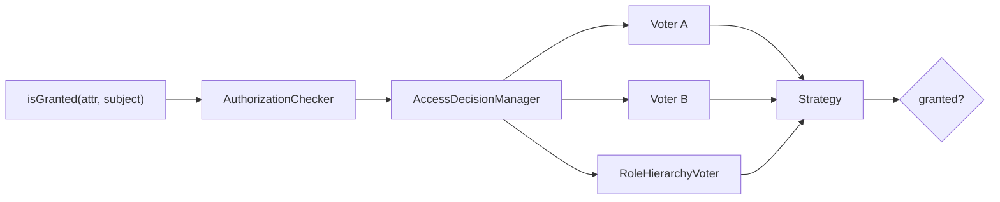

# Authorization

!!! abstract "Learning objectives"
    By the end of this chapter you can:

    - [ ] Explain how `isGranted()` reaches the `AccessDecisionManager` and voters.
    - [ ] Enforce access with `denyAccessUnlessGranted()` and `#[IsGranted]`.
    - [ ] Distinguish role checks from attribute/voter checks.

    **Syllabus:** `Security → Authorization` ·
    **Level:** Expert ·
    **Est. time:** 30 min ·
    **Prerequisites:** [Authentication](authentication.md) · [Roles](roles.md)

---

## Theory

**Authorization** answers *"is this token allowed to do X?"*. It runs **after**
authentication: given an authenticated `TokenInterface`, the app asks
"**is the token granted attribute A (optionally on subject S)?**".

An **attribute** is any string you vote on: a role (`ROLE_ADMIN`), a special
attribute (`IS_AUTHENTICATED_FULLY`, `PUBLIC_ACCESS`), or a domain permission
(`EDIT`, `POST_VIEW`) resolved by a custom [voter](voters.md).

The single entry point is `AuthorizationCheckerInterface::isGranted($attribute,
$subject = null)`. Everything — `#[IsGranted]`, `denyAccessUnlessGranted()`,
Twig's `is_granted()`, `access_control` — funnels through it.

## Deep Dive — how it works internally

### The decision path



1. `AuthorizationCheckerInterface`
   (`Symfony\Component\Security\Core\Authorization\AuthorizationChecker`)
   pulls the current token from `TokenStorageInterface`.
2. It calls
   `AccessDecisionManagerInterface::decide(TokenInterface $token, array $attributes, mixed $subject = null)`.
3. The `AccessDecisionManager` iterates every registered **voter**
   (`VoterInterface`), collecting `ACCESS_GRANTED` (1), `ACCESS_DENIED` (-1) or
   `ACCESS_ABSTAIN` (0).
4. A **strategy** (affirmative by default) turns the votes into a final
   `true`/`false`. See [Voters & Voting Strategies](voters.md).

Built-in voters include `RoleVoter` and `RoleHierarchyVoter` (roles),
`AuthenticatedVoter` (the `IS_AUTHENTICATED_*` attributes) and
`ExpressionVoter` (`allow_if` expressions).

!!! note "Source reference"
    `Symfony\Component\Security\Core\Authorization\AccessDecisionManager::decide()`
    — [symfony/symfony `8.0`](https://github.com/symfony/symfony/blob/8.0/src/Symfony/Component/Security/Core/Authorization/AccessDecisionManager.php).

### Three ways to enforce

| Mechanism | Where | Note |
|---|---|---|
| `#[IsGranted]` | Controller/method | Throws `AccessDeniedException` (→ 403) |
| `denyAccessUnlessGranted()` | Inside a controller | Same exception, imperative |
| `access_control` | `security.yaml` | URL-pattern rules, first match wins |

`#[IsGranted]` is `Symfony\Component\Security\Http\Attribute\IsGranted`. On an
anonymous request to a protected resource, the thrown `AccessDeniedException`
is caught and turned into the **entry point** (login redirect) if the user is
not authenticated, or a **403** if they are but lack the attribute.

### Roles vs attributes

- **Roles** are the coarse layer: `ROLE_*` strings carried on the token,
  expanded by the [role hierarchy](roles.md), voted on by `RoleHierarchyVoter`.
- **Attributes + voters** are the fine-grained layer: business rules like
  "can this user edit *this* post?" that need the **subject**. Roles cannot
  express per-object rules; voters can.

## Configuration & code

=== "PHP Attributes"

    ```php
    <?php
    declare(strict_types=1);

    namespace App\Controller;

    use App\Entity\Post;
    use Symfony\Bundle\FrameworkBundle\Controller\AbstractController;
    use Symfony\Component\HttpFoundation\Response;
    use Symfony\Component\Routing\Attribute\Route;
    use Symfony\Component\Security\Http\Attribute\IsGranted;

    #[IsGranted('ROLE_USER')]                       // class-wide guard
    final class PostController extends AbstractController
    {
        #[Route('/posts/{id}/edit', name: 'post_edit')]
        #[IsGranted('EDIT', subject: 'post')]       // voter decides on $post
        public function edit(Post $post): Response
        {
            // Imperative alternative to the attribute:
            $this->denyAccessUnlessGranted('EDIT', $post);

            return $this->render('post/edit.html.twig', ['post' => $post]);
        }
    }
    ```

=== "Twig"

    ```twig
    {# templates/post/show.html.twig #}
    
        <a href="{{ path('post_edit', {id: post.id}) }}">Edit</a>
    

    
        <a href="{{ path('admin_dashboard') }}">Admin</a>
    
    ```

=== "YAML"

    ```yaml
    # config/packages/security.yaml
    security:
        access_control:
            - { path: ^/admin, roles: ROLE_ADMIN }
            - { path: ^/profile, roles: IS_AUTHENTICATED_FULLY }
    ```

## Best practices & anti-patterns

| ✅ Do | ❌ Avoid |
|---|---|
| Use voters for per-object rules | Encoding object logic in role names |
| `#[IsGranted]` for controller guards | Manual `if ($user->isAdmin())` checks |
| Check `is_granted()` in templates | Hiding-only (also enforce server-side) |
| Keep attributes semantic (`EDIT`) | Leaking storage details into attributes |

## When (not) to use it / alternatives

Use roles for broad capabilities and `access_control` for URL-space rules; reach
for [voters](voters.md) whenever the decision depends on the **subject** or
runtime state. For declarative controller guards prefer `#[IsGranted]`; use
`denyAccessUnlessGranted()` when the decision is computed mid-action.

!!! danger "Certification traps"
    - `isGranted('EDIT', $post)` passes the **subject** to voters; `access_control`
      **cannot** pass a subject (it is URL-based only).
    - An `AccessDeniedException` for an **unauthenticated** user triggers the
      **entry point** (login), not a raw 403.
    - `#[IsGranted]` lives in
      `Symfony\Component\Security\Http\Attribute\IsGranted` — not in the DI or
      Routing namespaces.
    - Template `is_granted()` is convenience only; it does **not** replace
      server-side enforcement.

!!! warning "Common mistakes"
    - Assuming `access_control` can check object permissions — it cannot.
    - Forgetting that `isGranted()` with an unauthenticated token still runs
      voters (e.g. `PUBLIC_ACCESS` grants; `AuthenticatedVoter` denies).

## Exercises

1. **(Advanced)** Guard a controller action so only holders of `ROLE_EDITOR`
   can reach it, using an attribute.
2. **(Expert)** Explain why per-post edit permission must be a voter attribute,
   not a role.

??? success "Solutions"

    **1.** Add `#[IsGranted('ROLE_EDITOR')]` above the method (or the class).

    **2.** Roles are static strings on the token with no notion of a subject.
    "Can edit *this* post" depends on the `$post` instance (e.g. ownership), so it
    must be an attribute like `EDIT` resolved by a voter that receives `$post` as
    the subject via `isGranted('EDIT', $post)`.

## Certification questions

??? question "Q1. Which check can pass a subject to voters?"
    - [x] A. `isGranted('EDIT', $post)` ✅
    - [ ] B. An `access_control` rule
    - [ ] C. `role_hierarchy`
    - [ ] D. The firewall `pattern`

    **Why:** Only the `isGranted()`/`#[IsGranted]`/`denyAccessUnlessGranted()`
    path carries a subject; `access_control` is URL-based.
    **Ref:** [Voters](https://symfony.com/doc/current/security/voters.html).

??? question "Q2. `#[IsGranted]` fails for an anonymous user. What happens?"
    - [ ] A. Immediate 403 always
    - [x] B. The entry point starts authentication (e.g. login redirect) ✅
    - [ ] C. 404
    - [ ] D. The request continues

    **Why:** An unauthenticated `AccessDeniedException` is converted to an entry
    point response; an authenticated one yields 403.
    **Ref:** [Access control](https://symfony.com/doc/current/security.html#access-control).

??? question "Q3. Which interface does `isGranted()` ultimately delegate to?"
    - [ ] A. `AuthenticatorInterface`
    - [ ] B. `UserProviderInterface`
    - [x] C. `AccessDecisionManagerInterface` ✅
    - [ ] D. `TokenStorageInterface`

    **Why:** The `AuthorizationChecker` reads the token then calls
    `AccessDecisionManager::decide()`.
    **Ref:** [AccessDecisionManager](https://github.com/symfony/symfony/blob/8.0/src/Symfony/Component/Security/Core/Authorization/AccessDecisionManager.php).

## Key takeaways

- Authorization = "is this token granted attribute A on subject S?".
- Path: `isGranted()` → `AuthorizationChecker` → `AccessDecisionManager` → voters.
- Enforce via `#[IsGranted]`, `denyAccessUnlessGranted()`, or `access_control`.
- Only the imperative/attribute path carries a subject; use voters for per-object rules.

## Last-minute revision

!!! tip "Cheat sheet"
    - `#[IsGranted('ROLE_X')]` / `#[IsGranted('PERM', subject: 'x')]`.
    - `denyAccessUnlessGranted($attr, $subject)` → `AccessDeniedException` → 403.
    - Twig: `is_granted(attr, subject)`.
    - Voter votes: GRANTED 1 / ABSTAIN 0 / DENIED -1.

## References

- [Symfony docs — Authorization](https://symfony.com/doc/current/security.html#access-control-authorization)
- [Symfony docs — Voters](https://symfony.com/doc/current/security/voters.html)
- [Symfony source — AuthorizationChecker](https://github.com/symfony/symfony/blob/8.0/src/Symfony/Component/Security/Core/Authorization/AuthorizationChecker.php)

---

<small>Related: [Voters & Voting Strategies](voters.md) · [Roles](roles.md) ·
[Access Control Rules](access-control.md) · [Authentication](authentication.md)</small>
</content>
